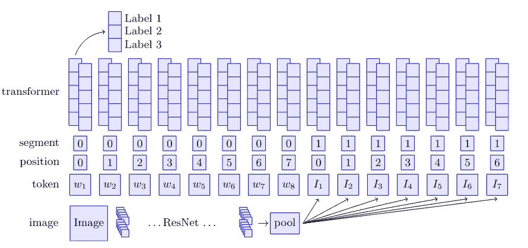
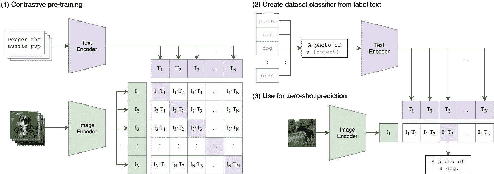
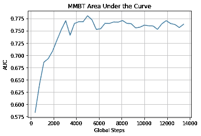

# 如何在仇恨模因比赛中使用 MMBT 和剪辑获得高分

> 原文：<https://towardsdatascience.com/how-to-get-high-score-using-mmbt-and-clip-in-hateful-memes-competition-90bfa65cb117?source=collection_archive---------20----------------------->

## 使用剪辑作为一个多模态双变压器的特征编码器，使 MMBT 真正与拥抱脸变压器工作，以获得惊人的高精度

图片由 [Pixabay](https://pixabay.com/) 上的 [Manuchi](https://pixabay.com/ru/illustrations/%d0%bf%d0%be%d0%bb%d0%b8-%d0%bd%d0%b8%d0%b7%d0%ba%d0%b8%d0%b9-%d0%b6%d0%b8%d0%b2%d0%be%d1%82%d0%bd%d0%be%d0%b5-%d0%b2%d0%b5%d0%ba%d1%82%d0%be%d1%80-3295856/) 拍摄

来自脸书的[仇恨迷因竞赛](https://www.drivendata.org/competitions/64/hateful-memes/)的附加阶段几个月前就结束了。我的团队很幸运地参加了这次比赛，甚至取得了相当不错的成绩(我们获得了第十名)。我们是怎么做的，用了什么方法——我会在这篇文章里告诉你。

# 问题描述

乍一看，比赛中必须解决的问题非常简单——使用文本和图像数据来确定一个模因是否可恶。事实上，由于我们讲话中固有的许多模糊性，以及讽刺和讽刺的存在，问题变得复杂了，因为神经网络的定义有问题。你可以在相应的[论文](https://arxiv.org/pdf/2005.04790v2.pdf)中读到更多关于竞争和它所带来的任务的信息。

图片来自 [Unsplash](https://unsplash.com)

# 数据概述

比赛期间，提供了一个可下载的 zip 文件。现在比赛数据可以在这个[链接](https://hatefulmemeschallenge.com/)找到。

zip 文件包括一个包含图像的文件夹和几个包含图像注释的 json 文件。

**img/** 文件夹包含挑战数据集的所有图像，包括训练、开发和测试分割。这些图像被命名为< id >。png，其中< id >是一个唯一的 5 位数。

**train.jsonl，dev_seen.jsonl，dev_unseen.jsonl** — json 文件，其中每一行都有一个关于图像的数据的键值对的字典。该词典包括

*   **id**img 目录和。jsonl 文件，例如，“id”:13894。
*   **img** 实际的 meme 文件名，例如“img”:img/13894 . png，注意文件名包含上面描述的 img 目录，文件名词干是 id。
*   **文本**嵌入在 meme 图像中的原始文本串，例如，img/13894.png 具有“文本”:“给你的宠物戴上蝴蝶结”
*   **标注**其中 1 - >“可恨”和 0 - >“非可恨”

例如:

{"id":23058，" img":"img/23058.png "，" label":0，" text ":"不要害怕再爱一次每个人都不像你的前任" }

**test_seen.jsnol** 包括所提到的按键，除了**标签**。

# 绩效指标

使用 [**AUC ROC**](https://medium.com/greyatom/lets-learn-about-auc-roc-curve-4a94b4d88152) 或受试者工作特征曲线下的面积来确定模型性能和排行榜排名。该指标用于衡量二元分类器在不同决策阈值下区分不同类别的能力。

另一个衡量标准是预测的准确性，由正确预测与预测总数的比率给出。

# 我们的方法

有许多处理多模态数据的模型和框架，其中最突出的是来自脸书的 MMF。 [MMF](https://mmf.sh/) 为访问许多强大的多模态模型提供了一个简单的接口。但是，作为《拥抱脸变形金刚》的超级粉丝，我们决定不走捷径。我们决定找出[变形金刚](https://github.com/huggingface/transformers)中有哪些多模态模型，以及如何最大限度地利用它们。原来这种型号目前在《变形金刚》里只有一款——[**【多模态双变压器(MMBT)**](https://huggingface.co/transformers/summary.html#multimodal-models) 。让这个模型工作起来并不容易，但是这让这个任务变得更加有趣。

MMBT 建筑，来自[监督的多模式双转换器，用于对图像和文本纸张进行分类](https://arxiv.org/abs/1909.02950)

MMBT 融合来自文本和图像编码器的信息。 [BERT](https://huggingface.co/transformers/model_doc/bert.html) 用作文本编码器， [ResNet](https://pytorch.org/hub/pytorch_vision_resnet/) 用作图像编码器。我们利用 MMBT 架构的灵活性，用[剪辑](https://github.com/openai/CLIP)替换 ResNet 进行图像编码。 **CLIP** 预训练图像编码器和文本编码器，以预测数据集中哪些图像与哪些文本配对。我们的假设是 CLIP 的特性更加通用，更适合多模态领域。

摘要剪辑模型的方法，来自[从自然语言监督论文](https://arxiv.org/abs/2103.00020)中学习可转移的视觉模型

对于文本编码，我们使用了[Bert-base-un cased-hat explain](https://huggingface.co/Hate-speech-CNERG/bert-base-uncased-hatexplain)模型，该模型在 Huggingface Hub 中可用。该模型是为英语中的 hatespeech 检测而创建的，因此在我们的情况下，它的特征比最初在 MMBT 使用的 [bert-base-uncased](https://huggingface.co/bert-base-uncased) 要好。

最终的 MMBT 模型在训练数据集上进行了微调，并在 dev_seen 数据集上进行了验证。

我们还使用受控的 [GPT-2](https://huggingface.co/transformers/model_doc/gpt2.html) 和[简易数据扩充](https://github.com/dsfsi/textaugment#eda-easy-data-augmentation-techniques-for-boosting-performance-on-text-classification-tasks)方法扩充了训练数据集中的文本。这使我们的模型的准确性增加了几个百分点。增强超出了本文的范围，如果您对本文和我们的方法感兴趣，我可能会单独写一篇。

# 履行

在文章的这一部分会有很多代码，但是为了更好的理解，我会尝试详细解释所有重要的部分。

首先，让我们导入所需的库。我们需要

*   变压器版本> =4.8.2
*   Pytorch 版本 1.8.1
*   火炬视觉 0.9.1
*   sci kit-学习 0.23.2
*   枕头> =8.2.0
*   tqdm >= 4.60.0
*   matplotlib >= 3.3.4
*   数字> =1.19.5
*   [夹子](https://github.com/openai/CLIP)(可以从仓库安装)。

CLIP 现在[可以直接在 Huggingface Transformers 中](https://huggingface.co/transformers/model_doc/clip.html)访问，但在实现我们的方法时，它还不存在。为了充分利用我们的模型，我们还使用了 [MADGRAD](https://github.com/facebookresearch/madgrad) 优化器。

用可用的设备创建一个变量，它将完成所有需要的计算。我们将需要一个 GPU，所以我们的设备是 CUDA。

加载剪辑模型和所需的预处理。初始化需要的变量。

创建一个以特殊方式为剪辑编码器准备图像的函数。该功能将图像分割成三个图块(根据图像的长宽比，按高度或宽度)。最后，我们将在编码后得到四个矢量(每个图块一个矢量，填充为正方形的整个图像一个矢量)。使用这种方法，我们将从图像中获得更多的信息，因为我们将创建嵌入，不仅描述图像的整体，还描述图像的各个部分

定义一个函数，它将从剪辑中获取图像特征。

创建将加载文本和预处理图像的 JsonlDataset 类。创建 **collate_fn** ，以 pytorch 模型所需的格式对数据集中的数据进行分组。

定义 **load_examples** 函数，将 json 数据集中描述的数据加载到 json dataset 对象中。创建函数来加载和保存模型权重。

创建了所需的函数和类，因此我们可以加载我们的模型。

加载训练和评估数据集，并为这些数据集创建数据加载器。

定义模型训练参数、优化器和损失。

定义评估函数，该函数将获取评估数据加载器并计算预测 AUC、 [F1 得分](https://scikit-learn.org/stable/modules/generated/sklearn.metrics.f1_score.html)和准确性。

最后，我们可以训练我们的模型。我们在 **best_valid_auc** 变量中指定了所需的最小 auc 值，因此，如果模型在验证数据上获得了比指定值更高的 AUC，我们将保存该模型。

训练完成后，我们可以看到结果:

图像由 Rostyslav Neskorozhenyi 使用 [Matplotib](https://matplotlib.org/) 创建

# 为提交做预测

现在我们可以对测试数据进行预测。首先，我们将通过模拟训练阶段来创建数据加载和处理所需的类和函数。

最后，我们做一个预测，并以指定的格式保存它。

就是这样。如果比赛重新开始，这个预测文件可以立即发送到那里。

# 结论

在这篇文章中，我试图详细描述我们在脸书的仇恨迷因竞赛中使用的方法的概念和实现。比赛给我们设置的任务变得非常有趣，我们在开发解决这些任务的方法时获得了很多乐趣。我希望你也喜欢阅读这篇文章。

我还想提一下，为了获得最大 AUC，我们结合了用不同损失参数和不同增强选项训练的该模型的几个变体的预测。但是这是另一篇完全不同的文章的主题。

文章中描述的所有代码都可以通过这个[链接](https://github.com/slanj/ml-notebooks/blob/main/multimodal-article.ipynb)作为 jupyter 笔记本获得。