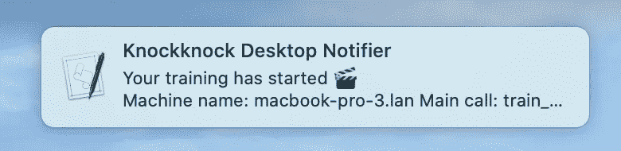
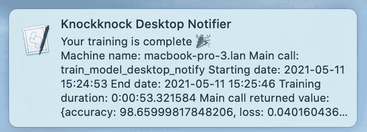
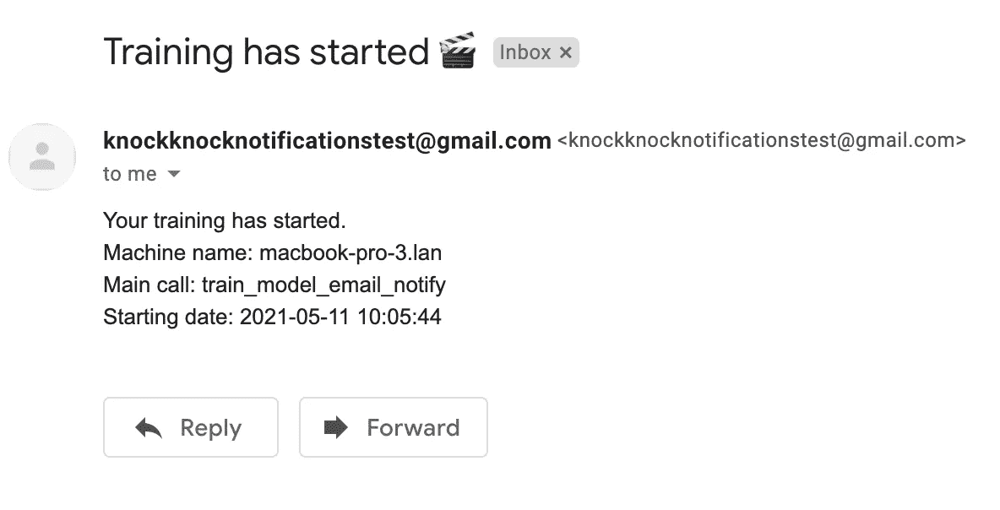
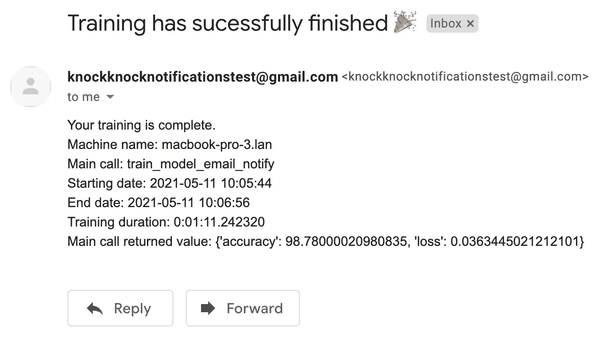
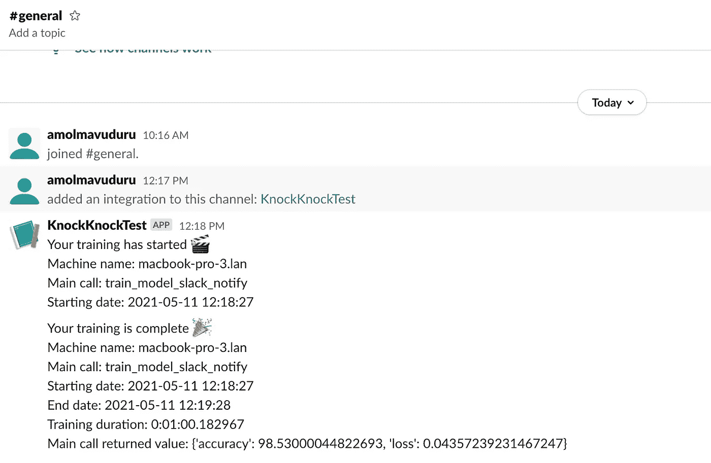

# 如何在您的模型完成 knockknock 训练时得到通知？

> 原文：<https://towardsdatascience.com/how-to-get-notified-when-your-model-is-done-training-with-knockknock-483a0475f82c?source=collection_archive---------31----------------------->

## 使用这个 Python 库来发送模型训练更新。


萨拉·库菲在 [Unsplash](https://unsplash.com/s/photos/iphone-mail?utm_source=unsplash&utm_medium=referral&utm_content=creditCopyText) 上拍摄的照片

想象一下这个场景——你正在进行一个深度学习项目，刚刚在 GPU 上开始了一项耗时的培训工作。根据你的估计，完成这项工作大约需要 15 个小时。显然，你不想看你的火车模型那么久。但是当你离开电脑或者在做不同的工作时，你仍然想知道它什么时候结束训练。

最近，HuggingFace 发布了一个名为 knockknock 的 Python 库，允许开发人员设置并在他们的模型完成训练时接收通知。**在本文中，我将用几行代码演示如何使用 knockknock 在各种平台上接收模型训练更新！**

# 安装敲门

您可以使用下面的命令通过 Pip 轻松安装 knockknock。

```
pip install knockknock
```

请记住，这个库只针对 Python 3.6 和更高版本进行了测试。如果你有一个早期版本的 Python，如果你想使用这个库，我建议你升级到 Python 3.6 或更高版本。

# 训练一个简单的神经网络

为了演示这个库，我将定义一个函数，在经典的 MNIST 手写数字数据集上训练一个简单的 CNN。要找到本教程的完整代码，请查看这个 [GitHub 库](https://github.com/AmolMavuduru/KnockKnockExamples)。

## 导入库

为了开始，我们需要从 Keras 导入一些模块。

```
from keras.utils.np_utils import to_categorical
from keras.models import Sequential
from keras.layers import Conv2D, MaxPooling2D, Flatten, Dense, Dropout, Activation
from keras.datasets import mnist
```

## 加载数据

为了简化本教程，我使用 Keras 加载了 MNIST 数据集。我在下面的代码中执行了以下标准预处理步骤:

1.  为 28 x 28 像素的训练和测试图像增加了一个额外的维度。
2.  将训练和测试数据缩放了 255。
3.  将数字目标转换为分类的一次性向量。

```
(X_train, y_train), (X_test, y_test) = mnist.load_data()
X_train = X_train.reshape(X_train.shape[0], 28, 28,1) # adds extra dimension
X_test = X_test.reshape(X_test.shape[0], 28, 28, 1) # adds extra dimension
input_shape = (28, 28, 1)X_train = X_train.astype('float32')
X_test = X_test.astype('float32')
X_train /= 255
X_test /= 255y_train = to_categorical(y_train)
y_test = to_categorical(y_test)
```

## 训练模型

下面的函数创建一个简单的 CNN，在训练数据集上对其进行训练，并返回准确性和损失值，以展示模型在测试数据集上的性能。

用于在输入数据集上训练和测试简单 CNN 的函数。

我不会在上面的代码中详细介绍神经网络的架构，因为本教程的重点是发送模型训练通知。为此，我特意使用了一个简单的神经网络。

# 获取桌面通知

现在我们有了一个训练神经网络的函数，我们可以创建另一个训练模型的函数，并在函数开始和结束执行时创建桌面通知。

```
from knockknock import desktop_sender[@desktop_sender](http://twitter.com/desktop_sender)(title="Knockknock Desktop Notifier")
def train_model_desktop_notify(X_train, y_train, X_test, y_test):

    return train_model(X_train, 
                       y_train, 
                       X_test, 
                       y_test)train_model_desktop_notify(X_train, y_train, X_test, y_test)
```

在我的 Mac 上，运行上面的代码会在训练过程开始时产生一个弹出通知。



培训作业开始时的桌面通知。

一旦作业完成运行，它将生成另一个桌面通知，并显示函数的结果，如下所示。



培训工作完成时的桌面通知。

# 获取电子邮件通知

我们还可以用 knockknock 设置电子邮件通知。为此，您需要设置一个单独的 Gmail 帐户来发送电子邮件通知。您还需要在安全设置中[允许不太安全的应用程序访问您的 Gmail 帐户](https://devanswers.co/allow-less-secure-apps-access-gmail-account/)。

```
from knockknock import email_sender[@email_sender](http://twitter.com/email_sender)(recipient_emails=["[amolmavuduru@gmail.com](mailto:amolmavuduru@gmail.com)"], 
              sender_email="[knockknocknotificationstest@gmail.com](mailto:knockknocknotificationstest@gmail.com)")
def train_model_email_notify(X_train, y_train, X_test, y_test):

    return train_model(X_train, 
                       y_train, 
                       X_test, 
                       y_test)train_model_email_notify(X_train, y_train, X_test, y_test)
```

运行代码会在 Gmail 中生成以下电子邮件通知。



Knockknock 中的训练开始通知。

当该功能完成运行时，我们会收到另一封通知电子邮件，如下所示。



Knockknock 中的训练完成通知。

# 获取时差通知

最后，如果您是正在进行机器学习项目的 Slack 团队的一员，您还可以在模型运行结束时在通道中设置 Slack 通知。为此，您需要创建一个 Slack 工作区，向其中添加一个 Slack 应用程序，并获得一个 Slack webhook URL，您可以将它提供给 **slack_sender** 函数装饰器。访问 [Slack API 页面](https://api.slack.com/)，然后按照本教程[中的步骤 1-3](https://api.slack.com/messaging/webhooks#create_a_webhook)创建一个 webhook。

下面的代码演示了如何在给定一个 webhook URL 和一个特定的发布渠道的情况下创建一个 Slack 通知。请注意，出于安全原因，我将我的 webhook URL 存储在一个环境变量中。

```
from knockknock import slack_sender
import oswebhook_url = os.environ['KNOCKKNOCK_WEBHOOK']
[@slack_sender](http://twitter.com/slack_sender)(webhook_url=webhook_url, channel="#general")
def train_model_slack_notify(X_train, y_train, X_test, y_test):

    return train_model(X_train, 
                       y_train, 
                       X_test, 
                       y_test)train_model_slack_notify(X_train, y_train, X_test, y_test)
```

运行上面的代码会产生以下时差通知。



训练模型时产生的时差通知。

如果您的数据科学团队有一个宽松的工作空间，并希望监控您的模型培训工作，这是一个很好的功能。

# 更多通知选项

使用 knockknock，我们还可以在以下平台上发送通知:

*   电报
*   微软团队
*   正文消息
*   不调和
*   [数]矩阵
*   亚马逊钟声
*   瞎扯
*   RocketChat
*   微信工作

有关如何在这些平台上发送通知的详细文档，请务必查看 GitHub 上的[项目资源库。](https://github.com/huggingface/knockknock)

# 摘要

Knockknock 是一个有用的工具，它可以让您通过通知来跟踪您的模型训练作业。您可以使用它在各种各样的平台上发送通知，它对于跟踪数据科学团队的实验非常有用。

像往常一样，你可以在 GitHub 上找到本文中的所有代码。

# 加入我的邮件列表

你想在数据科学和机器学习方面变得更好吗？您想了解数据科学和机器学习社区的最新图书馆、开发和研究吗？

加入我的[邮件列表](https://mailchi.mp/e8dd82679724/amols-data-science-blog)，获取我的数据科学内容的更新。当你[注册](https://mailchi.mp/e8dd82679724/amols-data-science-blog)时，你还会得到我免费的**解决机器学习问题的逐步指南**！

# 来源

1.  抱紧脸， [knockknock Github 库](https://github.com/huggingface/knockknock)，(2020)。