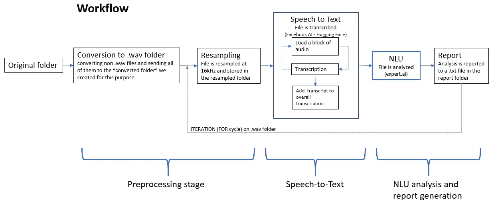

# 如何使用语音识别和 NLP 从音频文件中获取报告

> 原文：<https://towardsdatascience.com/how-to-get-reports-from-audio-files-using-speech-recognition-and-nlp-b49c20a24488?source=collection_archive---------15----------------------->

## 用拥抱脸将语音转化为知识/脸书 AI 和 expert.ai

沃洛季米尔·赫里先科在 [Unsplash](https://unsplash.com?utm_source=medium&utm_medium=referral) 上的照片

这些年来，我保存了大量的音频/视频文件，告诉自己我很快就会听它们。这个文件夹现在已经变成了一大堆乱七八糟的音频，我甚至经常不记得每个特定文件是关于什么的。这就是为什么我想创建一个程序来分析音频文件，并产生一份关于其内容的报告。我需要一个简单的点击就能显示主题*、*主要词汇、主要句子等的东西。为了实现这一点，我结合 expert.ai 的 NL API 使用了脸书 AI/拥抱脸 Wav2Vec 2.0 模型。我在这里 上传了代码[，希望对别人也有帮助。](https://tinyurl.com/3xsw5p7u)

# 模型

该解决方案分为三个主要步骤:

预处理阶段(扩展处理和重采样)

语音到文本转换

文本分析和报告生成

第一步，我检查了许多选项。有些非常实用(不需要订阅，易于实现)，但质量并不令人印象深刻。然后我找到了脸书 AI [Wav2Vec 2.0](https://tinyurl.com/5y4kf34w) ，这是一个可以在 HuggingFace 上使用的语音到文本模型，它被证明是可靠的，并提供了良好的结果。多亏了这一点，我能够避免云订阅(这需要信用卡和其他请求，使分享我的工作变得比它需要的更复杂)。即使没有任何进一步的微调，我使用的预训练模型([**wav2 vec 2-base-960h**](https://tinyurl.com/2t72a5nb))也运行良好。如果你想做更多的微调，请看这里的**。**

**关于 NLP/NLU(自然语言处理和理解)部分，我用的是 expert.ai:容易实现，选择范围很广；只需快速 [**注册**](https://tinyurl.com/uz8sd4e9) 即可。这是必要的，因为您的电子邮件注册和密码将是用于调用 expert.ai 云服务的系统变量。Wav2Vec 和 expert.ai NL API 都是免费使用的——有一些容量限制。**

# **规范**

**据我所知，所有的语音到文本模块只对采样率为 16 千赫的音频进行采样。除此之外，这些模块的计算量非常大(这通常是选择云服务的主要原因)，而且我第一次尝试处理 2 分钟音频样本时，我的笔记本电脑跟不上。这让我又增加了一步:“语音到文本的组块”。想法是，因为我不能给模型提供整个文件，我处理了多个(较小的)音频块*，然后将它们的转录内容合并回一个文本文件中。按照这种方法，并不是不可能删掉几个字(在我的测试中，这对质量没有可测量的影响)，但是好处是我可以在普通的笔记本电脑上使用语音到文本模块，而且效果很好！最后但同样重要的是，这一模式只接受。wav 文件。所以我在脚本中添加了一个转换片段，如果音频文件有不同的格式/扩展名，就可以使用它。为了使这个转换工作，您必须下载 ffmpeg.exe([在这里](https://www.ffmpeg.org/))并将文件存储在运行脚本的同一文件夹中。***

***就 expert.ai NL API 而言，一个请求中所能分析的文本大小是有限制的(10，000 字节，大约 10-12 分钟的语音，取决于说话者说话的速度)。人工智能专家 NLU 分析的输出有相当大的范围:从 NER 到词性标注，从分类到情感分析，PII、Writeprint 和 [**要多得多**](https://tinyurl.com/y5pcwa3c) 。然而，由于我们发送到云服务的文本是完全小写的，没有任何标点符号(我们的语音到文本步骤的结果)，一些分析可能不会显示这种 NLU 技术的全部潜力。出于这个原因，我只在服务中查询主题、主要引理(这个列表显示了相关名词，以它们的基本形式)和主要短语(也称相关句子)；这些在我的测试中效果很好。我相信，一旦语音到文本技术得到改进，引入了大写和标点符号，这个专家人工智能步骤将会提供更多。***

# ***工作流程***

***下图显示了项目的工作流程。***

******

***工作流程***

***这个过程从我们的原始文件夹开始，所有音频文件都存储在该文件夹中，带有它们的原始扩展名。程序将这些文件发送到“已转换”文件夹，将非。wav 文件(如有)。然后它开始迭代所有转换的文件。这些信号在 16 千赫下重新采样，并保存在“重新采样”文件夹中。***

***之后，它们被发送到语音到文本模块。在这里，librosa.stream 函数将音频分割成 30 秒的块(该参数是可定制的),并将这些块一个接一个地发送给 generate _ 抄本函数，该函数返回抄本(更多细节将在以下章节中介绍)。***

***一个块接一个块，所有的音频都被转录和连接。每隔两个块，我决定插入一个*回车符* (expert.ai 将此解释为一个句子的结尾)，以避免以一个巨大的单行作为最终的脚本结束——这将使随后的文本分析变得近乎荒谬。在工作流程的这一点上，我们有了一个有意义的文本文档(尽管都是小写字母，并且使用了最少的/模拟的标点符号)，所以现在是 NLU 时间。该转录由 expert.ai 的 NL API 服务进行分析，其输出然后被处理成报告(以。“audio_report”文件夹中的 txt 文件)。最后，我们有一个文本文件，显示音频文件呈现的主要主题，以及相关的名词和语句。有趣的是，我发现有多少我不再关心的播客，而其他的仍然激起我的兴趣，可以优先考虑。***

***简而言之，首先转换所有文件(如有必要)，然后一次转换一个文件，完成重采样、转录、NLU 分析和报告生成的整个过程。***

***让我们仔细看看代码。***

# ***搭建舞台***

***脚本做的第一件事是导入所有必要的库和模型，并设置变量。***

***[**拥抱脸**](https://tinyurl.com/29ayyxyd) 上有的是 Wav2Vec 型号。我选择“base-960h”是因为它是质量和重量结构之间的一个很好的妥协。在“path_base”中写入音频文件的路径。将变量 *sr* 保持在 16000(这是采样率)；您也可以选择不同的块长度，这取决于您的 CPU 和 RAM 能力:我将其设置为 30(单位为秒)。将您的 [**expert.ai 开发者门户**](https://tinyurl.com/uz8sd4e9) 邮箱和密码插入到各自的变量中。然后为转换、重采样和最终报告写下您喜欢的文件夹名称。该程序将为您创建这些路径(mkdir)。如果需要，您可以增加 extension_to_convert 列表，添加更多的扩展名。***

# ***预处理***

***我开始预处理音频。目的是得到一个仅由填充的文件夹。wav 文件。***

***预处理函数遍历存储音频文件的原始文件夹。如果文件有一个“.wav”扩展名，然后将文件发送到“path_converted_audio”文件夹，否则将此类文件转换为“.wav "分机优先。两件事:1)为了使这个转换工作，你必须将 ffmpeg.exe 安装在你的运行脚本的同一个文件夹中；2)如果你的文件有一个不在“extension_to_convert”列表中的扩展名，那么它将不会被转换，程序进入下一个迭代(它会给你一个文件没有被转换的警告)。***

***随着预处理函数中的 FOR 循环接近尾声，我将“path_converted_audio”填充为 all。wav "文件。我现在准备开始生成文本报告的过程。它由三个函数组成:重采样、asr _ 转录(及其嵌套的生成 _ 转录函数)和文本 _ 分析。***

# ***重采样***

***重采样功能，顾名思义，对音频进行重采样。它将文件和采样率作为参数。出于我的目的，我以 16kHz 对其进行重采样，但如果您想将其用于接受或需要不同采样率的其他模型，只需更改变量部分中的“sr”变量(或直接将其传递给函数)，您将获得所需的采样率转换。这里，函数(librosa.load)加载文件，对其进行重采样，并获取长度信息(librosa.get_duration)。最后，它将重新采样的文件存储在 resample_path 文件夹中。该函数返回重采样路径和长度。***

# ***语音转文本***

***现在，我可以将重新采样的音频传递给 asr_transcript 函数。***

***asr_transcript 函数有五个参数:*处理器*和*模型*已经在脚本的开始部分导入， *block_length* 已经在 variables 部分设置(我赋值为 30，这意味着 30 秒)，而 *resampled_path* 和 *length* 是从前一个函数(resampled)返回的。在函数开始时，我立即计算音频由多少部分组成，然后将“抄本”实例化为一个空字符串。然后，我对文件应用 librosa.stream 函数，该函数返回(在固定长度的缓冲区中)一个生成器，我对其进行迭代以生成音频块。***

***我将每个块发送到 generate_transcription 函数，这是一个适当的语音到文本模块，它将*语音*(这是我正在迭代的单个音频块)*处理器*和*模型*作为参数，并返回转录。在这些行中，程序将输入转换为 pytorch 张量，检索 logits(模型生成的预测向量)，获取 argmax(返回最大值索引的函数)，然后对其进行解码。最后的转录都是大写字母。在缺少大小写的情况下，如果所有内容都是小写的，像 expert.ai 这样的 NLP 服务可以更好地处理这种歧义，因此我应用了大小写转换。***

***因此，当我调用 asr _ transcript 函数时，它获取音频，对其进行迭代，每次向 generate_transcription 函数提供一个音频块，generate _ transcription 函数反过来转录它，然后将这个转录附加到前一个转录(每两个块创建一个新行)。***

***在这一点上，我已经得到了我们的原始音频文件的转录。是时候分析一下了。***

# ***文本分析***

***信息发现时间。现在我有了一个脚本，我可以查询 expert.ai NL API 服务并生成最终报告。***

***Text_analysis 接受五个参数:*抄本*(从 asr _ transcript 函数返回)、*语言*和*音频 _ 报告*(已经在变量部分设置好)、*文件*(它是我正在迭代的组中的单个文件)和*长度*(从重采样函数返回)。我实例化了 ExpertAiClient()，简单地称它为“Client ”,然后发送我的请求。这非常简单，只需要一行代码。我指定方法(在我的例子中是“specific_resource_analysis”)，然后我将“抄本”作为文本，“语言”作为语言，“相关者”作为资源传递。这个调用是针对我的情况的，但稍加修改，你可以查询其他类型的分析，如情绪特征、分类、NER、词性标注、笔迹、PII 和更多的分析。一旦我得到了响应，我就遍历它，提取主要的词条、主要的短语和主要的主题，将这些响应添加到报告中，该报告写在一个存储在 audio_report 文件夹中的. txt 文件中。***

***我们已经完成了从音频文件获取报告的所有必要步骤。最后，让我们来看看按正确顺序执行所有其他函数的主函数。***

# ***语音-数据转换***

***Speech2Data 是驱动整个工作流执行的函数。换句话说，这是我们调用的从音频文件中获取报告的一个函数。***

***该函数触发预处理函数，该函数创建一个包含所有已转换文件的文件夹，以备分析，然后遍历每个文件。它对文件进行重新采样，然后转录，分析文本并生成报告。最后一行代码删除了现在无用的 path_converted_audio 文件夹。***

# ***结束语***

***我喜欢写这段代码。多亏了开源软件、脸书人工智能、HuggingFace 和 expert.ai，我已经能用我的家用电脑从音频文件中获取报告了。我看到的潜在应用列表是无穷无尽的。***

***链接:***

***[**GitHub 代码回购**](https://tinyurl.com/3xsw5p7u)***

***[**Expert.ai 开发者门户**](https://tinyurl.com/uz8sd4e9)***

***[**Expert.ai 文档**](https://tinyurl.com/y5pcwa3c)***

***[**Github wav2 vec**](https://tinyurl.com/5y4kf34w)***

***[**抱紧脸型**](https://tinyurl.com/2t72a5nb)***