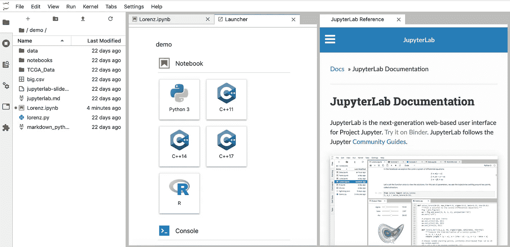
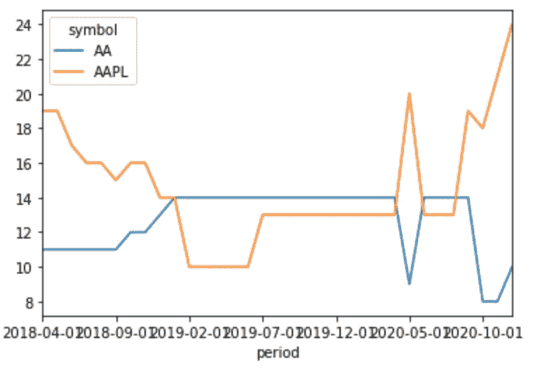

# 如何在几分钟内开始数据分析

> 原文：<https://towardsdatascience.com/how-to-get-started-with-data-analytics-just-in-a-few-minutes-2a06fe5164d4?source=collection_archive---------37----------------------->

## 使用 Python 和 Jupyter 笔记本进行数据分析的快速入门—只需要一个浏览器


丹尼尔·麦金尼斯在 [Unsplash](https://unsplash.com/s/photos/start?utm_source=unsplash&utm_medium=referral&utm_content=creditCopyText) 上的照片

如果你想学习 Python 并且对数据分析或科学感兴趣，你可以从这里开始。你所需要的只是一个浏览器和几分钟。

## Jupyter 笔记本

可以通过浏览器在线试用 Jupyter 笔记本。只需访问网站并开始点击[尝试 JupyterLab](https://jupyter.org/try) 。



通过 JupyterLab 的 Jupyter 笔记本

对于这个简短的演示，在线版本将提供您需要的一切。稍后，您可能会下载 JypterLab 或通过 Anaconda 发行版安装它。Anaconda 是 Python 的预打包发行版，其中包含许多 Python 模块和包。对于更大的项目，我真的建议在你的笔记本电脑上安装一个稳定的环境，或者通过云来创建、保存和与你的同事分享笔记本。

## **巨蟒在飞**

Python 被用于许多应用，如网站或游戏开发。此外，它也非常受数据科学和分析任务的欢迎。这是吉多·范·罗森发明的。关于 Python 的一些事实是:

*   与 Java 和 C++不同，Python 不使用大括号来分隔代码。
*   一个函数可以以元组的形式返回多个值。
*   Python 支持在一条语句中进行多种赋值。
*   你可以在他们的[官网](https://wiki.python.org/moin/BeginnersGuide)找到更多信息。

对于数据分析任务，您可以使用 pandas，它是 Python 编程语言的一个程序库，提供了管理和分析数据的工具。

## 你的第一个项目

您的第一个项目将是从一个 API 获取数据。在这里，我经常使用这些库:

*   请求— *允许您极其轻松地发送 HTTP/1.1 请求*
*   json — *json 库可以从字符串或文件中解析 JSON*
*   *熊猫——轻松处理数据*

**第一步:导入库并获取数据**

```
import requests 
import json 
import time stocks=['AA','AAPL'] 
api_data = dict() 
for i in stocks: 
    rr = requests.get('[https://finnhub.io/api/v1/stock/recommendation?symbol='+i+'&token=bv8v7fn48v6ord6gkqt0'](https://finnhub.io/api/v1/stock/recommendation?symbol='+i+'&token=bv8v7fn48v6ord6gkqt0')) 
    data = json.loads(rr.text) 
    api_data.update({i: data}) 
    time.sleep(2.5)
```

**第二步:将数据加载到熊猫数据框中**

从 API 请求 JSON 格式的数据(如上表所示)后，数据被加载到 pandas 数据框中:

第三步:可视化数据

从这里，您可以轻松地处理数据，并在许多可视化库的帮助下将其可视化— [阅读本文](/top-6-python-libraries-for-visualization-which-one-to-use-fe43381cd658)中的更多信息。

```
df = df.pivot(index=’period’, columns=’symbol’, values=’buy’)
df.plot()
```

瞧，我们有了数据的可视化:



## 结论

学习 Python 和开始数据分析项目并不需要太多——只需一个浏览器就可以完成。Python、Jupyter Notebook 和各种各样的库是很好的工具集。要深入了解，您可以使用下面的链接。为了更好的理解，你当然可以做一个付费的在线课程，但是我认为从一些编码开始是进入分析世界的最好方式。[这里有一个免费学习的好平台。](https://www.learnpython.org/)

[GIF by GIPHY](https://giphy.com/gifs/story-writing-stages-mmtLWZVKLOqOs/links)

## 资料来源和进一步阅读

<https://jupyter.org/try>    <https://pandas.pydata.org/>  </top-6-python-libraries-for-visualization-which-one-to-use-fe43381cd658>  <https://www.learnpython.org/> 