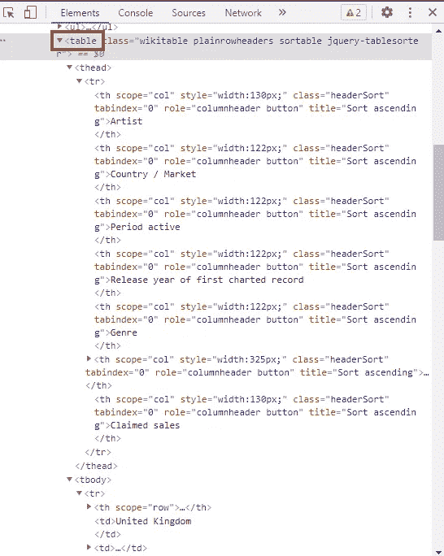
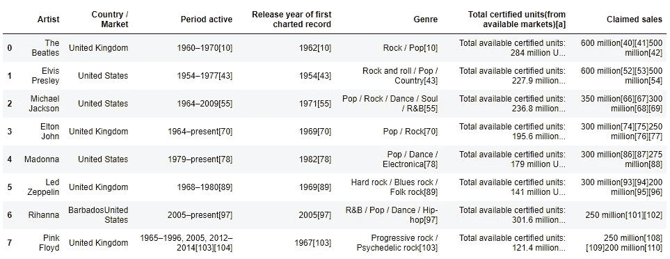

# 如何将网站上的表格转换成熊猫数据框架

> 原文：<https://towardsdatascience.com/how-to-get-tables-from-websites-into-pandas-dataframes-e82bd8a0ac59?source=collection_archive---------27----------------------->

## 从网上获取数据的简单方法


照片由[迈克·范·登博斯](https://unsplash.com/@mike_van_den_bos?utm_source=medium&utm_medium=referral)在 [Unsplash](https://unsplash.com?utm_source=medium&utm_medium=referral) 上拍摄

# 渴望网站上的表格

假设你正在阅读一个维基百科页面，页面上有一个很大的数据表。灵感来了，这正是你可以用在 Python 项目中的东西。但是如何把它放到一个熊猫的数据框架中，以便你能操作它呢？谢天谢地，你可以用 Pandas `read_html()`功能直接从网上导入表格！

**以本文为例让我们使用** [**维基百科页面的【畅销音乐艺术家排行榜】**](https://en.wikipedia.org/wiki/List_of_best-selling_music_artists) **。本页包含了一些很好的表格，可能会用于项目分析。**

# 网站上的表格元素

Pandas 中的`read_html()`函数通过在网站的 html 中查找表格元素来工作。让我们通过查看 Wikipedia 页面上第一个表的代码来看看这意味着什么。如果我们右键单击第一个表格的第一个单元格，并单击“Inspect”选项，该站点的代码将在一个框中弹出。在这段代码中，我们将看到这个表被编码为一个`<table>`元素。



查看表格的代码(图片由作者创建)

查看表格的扩展代码，您可以看到各种其他元素，如表格标题(`<thead>`)编码为一行，每个标题(`<th>`)都有相应的格式。然后您可以看到表体开始(`<tbody>`)，在这里输入每一行(`<tr>`)，并为表的每个单元格添加各种数据(`<td>`)。Pandas 使用 html 代码的这些元素来计算数据应该如何放入数据帧中。

我鼓励您在查看自己感兴趣的站点时，使用灰色箭头进一步扩展代码。更熟悉 html 以了解熊猫如何解析 html 并将其转换成数据帧是很有用的。

# 将数据带入熊猫体内

现在我们对它的工作原理有了一点了解，让我们实际使用`read_html()`函数。这非常简单，因为 URL 只是作为字符串传递给函数。

```
import pandas as pdurl = '[https://en.wikipedia.org/wiki/List_of_best-selling_music_artists](https://en.wikipedia.org/wiki/List_of_best-selling_music_artists)'pd.read_html(url)
```

在我们的例子中，返回的是一个数据帧列表。它返回一个列表，因为这个 Wikipedia 页面上有几个表格元素。通过索引结果，我们可以检查列表中的每个数据帧。第一个 dataframe 是页面上的第一个表格，用于销售了 2.5 亿张或更多唱片的艺术家。我们可以将它赋给一个变量，然后像处理其他数据帧一样处理它。下面是代码的样子:

```
url = '[https://en.wikipedia.org/wiki/List_of_best-selling_music_artists](https://en.wikipedia.org/wiki/List_of_best-selling_music_artists)'250_plus = pd.read_html(url)[0]
```

这是生成的数据帧的样子:



结果数据帧(由作者创建的图像)

在我们的例子中，Pandas 甚至能够使用上面的 html 代码的表格标题元素来解析列标题。如果我们想把文件保存到我们的电脑上，我们可以使用代码`250_plus.to_csv(‘250_plus.csv’)`，瞧！现在，我们已经从网站上获得了一个保存了表格数据的 csv 文件。

# 收尾工作


[JESHOOTS.COM](https://unsplash.com/@jeshoots?utm_source=medium&utm_medium=referral)在 [Unsplash](https://unsplash.com?utm_source=medium&utm_medium=referral) 上拍照

预计这种方法需要一定程度的清洁。例如，在我们的例子中，将所有的表合并成一个表是有意义的。这意味着我们需要浏览从网站创建的数据帧列表，为我们想要的每个数据帧创建一个单独的变量，并手动组合它们。

很多时候，您可能还会发现数据解析不那么清晰，并且存在头、空值等问题。如果使用`read_html()`功能证明任务很困难或不可能，那么你可以使用 web scraper 来代替。通过查看 html 元素，您通常可以预测数据传输的好坏。但是在必须建立网页抓取功能之前，看看`read_html()`功能是否有效总是值得一试的。

使用该功能时，不要忘记查看 [Pandas 文档](https://pandas.pydata.org/pandas-docs/stable/reference/api/pandas.read_html.html)以获得更多参数或帮助！