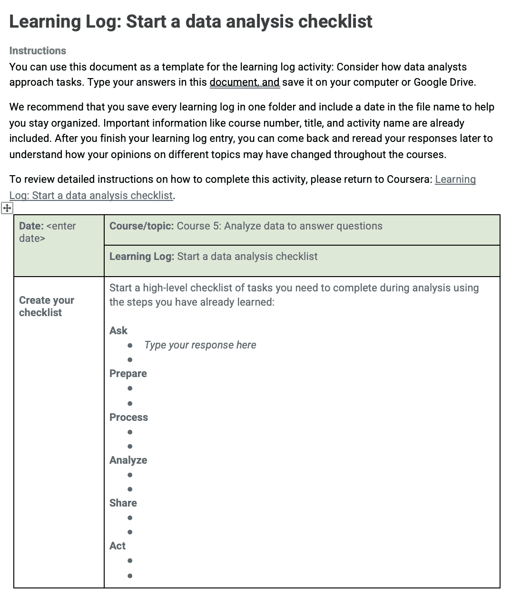

# 如何充分利用谷歌分析专家证书

> 原文：<https://towardsdatascience.com/how-to-get-the-most-from-google-analytics-professional-certificate-875b295d9595?source=collection_archive---------8----------------------->

## 我对谷歌数据分析专家证书的看法和评论

利亚姆·张在 [Unsplash](https://unsplash.com/s/photos/online-certificate?utm_source=unsplash&utm_medium=referral&utm_content=creditCopyText) 上的照片

谷歌推出了一项新的教育和职业培训计划，名为“谷歌职业证书”。该公司认为，人们不需要大学文凭来获得就业技能。整个想法听起来很吸引人，但这个计划真的如宣传的那样吗？是也不是。现在就业市场竞争非常激烈。大多数入门级的数据分析师工作需要学士学位和几年的工作经验。此外，许多拥有高等学位的求职者也在参加在线课程，以推进他们的职业生涯，拓宽他们的技能组合。因此，即使谷歌将 6 个月的职业证书视为等同于 4 年的学位，仅凭这一证书可能很难获得数据分析师的职位。然而，我确实认为学生可以从这个项目中学到很多东西。在这篇文章中，我将分享我对每门课程的想法，以帮助您在学习这些课程时更有效地学习。

# 这真的值得吗？

这真的取决于你的期望。首先你需要意识到的是，有些人完成这个程序需要的时间更少，有些人需要更长的时间。谷歌数据分析专家证书是通过 Coursera 获得的，Coursera 每月收取 39 美元的订阅费。因此，假设您在 6 个月内完成该计划，预计费用为 234 美元。与获得学位或参加训练营相比，价格还不算太低。然而，因为这是一个自定进度的项目，所以确保你有时间和意愿坚持下去是很重要的。

如果你以前没有数据分析经验，希望得到雇主的更多关注，或者试图确定数据分析领域是否适合你，那么这个证书是值得的。如果你已经有了分析学的背景，即使你获得了证书也没关系，但是你仍然可以通过这个项目提高一些技能。

# 课程设置和重要注意事项

这个项目有八门课程*。*

## 1.基础:数据，数据，无处不在:

在本课程中，您将了解数据分析师的日常工作、成为一名成功的数据分析师所需的技能以及数据分析师的职业道路。它很好地解释了什么是数据分析，但如果你已经知道了，我建议加快视频的速度。

## 2.提出问题以做出数据驱动的决策

我个人对选修这门课感到非常兴奋。作为一名数据分析师/科学家，我注意到数据科学最难的部分之一是提出正确的问题。作为一名数据分析师，最重要的是将数据转化为见解的能力，这种见解可以帮助解决利益相关者的问题。本课程涵盖了有效的提问技巧，可以帮助学生与利益相关者进行更清晰的沟通。

## 3.为勘探准备数据

数据以各种形式出现。了解不同类型的数据以及如何提取、加载和转换数据非常重要。本课程从涵盖数据类型和数据结构的定义开始；然后提供了如何使用 SQL 处理数据的案例。它还涵盖了数据伦理和隐私的基础知识。您还可以选择学习如何与其他数据专业人员交流。其实人脉在任何领域都是很重要的。这是找到第一份工作的关键。你可以在这里阅读更多关于我获得第一份数据科学工作的建议。

## 4.将数据从脏数据处理为干净数据

数据清理是在分析数据之前修复/删除重复、缺失值或格式不正确的数据的过程。大多数数据分析师/科学家花费大部分时间(~80%！)清理数据。在这一节中，您将了解脏数据的含义，当没有足够的数据时该怎么办，以及如何使用 SQL 清理数据。最后，本课程的可选主题是在简历中添加数据。您将了解有关如何创建数据驱动型简历和数据分析师招聘流程的更多信息。

大多数数据分析师/科学家每天都与 SQL 打交道，掌握 SQL 技能是必要的。如果您不了解 SQL，本课程将是一个很好的起点。请记住，在面试时，仅仅对 SQL 有基本的了解是不够的。SQL 很容易学，但是特别是当你紧张的时候会很棘手。如果你有兴趣知道什么样的 SQL 概念可能会被问到，看看我之前的[帖子](/10-questions-you-must-know-to-ace-any-sql-interviews-2faa0a424f07)。:D

## 5.分析数据回答问题

本课程包括使用电子表格和 SQL 进行数据处理、数据聚合和数据透视表。Excel 或 Google Sheets 等电子表格软件是小公司广泛使用的数据分析工具。大多数数据分析师使用 Jupyter Notebook、SQL 和 R 进行数据分析。有鉴于此，我建议专注于学习 SQL。本课程涵盖了许多重要的 SQL 语法，如连接和子查询。它还包括许多可供您深入研究的资源，所以不要忘记查看那些推荐的资源。我喜欢这门课的另一点是学习日志电子表格。我发现这个清单格式非常有用。一个最常见的数据分析师面试问题是“告诉我一个你做过的数据分析项目。”——咄！说点我不知道的。

良好的..这不是关于你的项目听起来有多花哨，而是关于项目的影响。回答这个问题的格式确实很重要，下面是格式！回答这个问题时，首先谈谈业务问题或分析的目标，然后谈谈你如何准备、处理和分析数据，最后谈谈你产生了什么影响(也就是这种分析如何影响利益相关者的业务决策。)

Google Analytics Coursera 课程 5 第 4 周——学习日志:完成数据分析清单。(作者截图)

## 6.通过可视化艺术共享数据

数据故事是将数据点转化为可操作的见解和信息的最佳方式。在本课程中，您将学习设计有效数据可视化的基础知识，以及构建 Tableau 仪表板的基础知识。我强烈建议构建几个 Tableau 仪表板，并在 Tableau 服务器上发布它们。如果你不知道从哪里开始，你可以看看我的 Tableau 作品集[这里](https://public.tableau.com/app/profile/kessie.zhang)。

在学习了创建数据可视化之后，您还将学习如何展示您的发现，包括框架和展示技巧。由于数据专家的工作很大一部分是帮助他人理解分析，以及他们如何利用分析结果来制定业务战略和发展业务，因此了解制作优秀演示文稿的技巧有助于更有效地将您的信息传达给受众。

## 7.用 R 编程进行数据分析

人们经常想知道他们应该首先学习哪种编程语言。R 和 Python 之间的数据科学争论由来已久。毫不奇怪，这是我之前的一次采访。我认为如果你想做更多的统计分析，R 是一个很好的起点，它有很多 Python 没有的很棒的统计包。如果你想做更多的机器学习、深度学习、模型部署，Python 更可取。我认为学习两种语言都有好处，尤其是如果你想在咨询公司工作，因为你永远不知道你的客户更喜欢哪种编程语言。

我喜欢这门课的原因是它涵盖了不同编程语言之间的差异，并且如果你感兴趣的话，它还为你提供了学习这些语言的资源。然而，我认为它们涵盖的基础知识不足以进行更复杂的数据分析。我建议在顶点项目中充分利用你在本课程中学到的知识。

## 8.谷歌数据分析顶点:完成案例研究

不要跳过这个顶点项目！做顶点工程将允许你把你在整个课程中学到的所有新知识结合起来，并把它应用到实际中去。

# 最后的想法

谷歌数据分析专业证书是为那些没有经验或经验有限的数据分析。如果你是数据分析的新手，想知道作为一名数据分析师是什么样的，获得这个证书可能会帮助你增加获得数据分析工作的机会。但是，如果你已经有丰富的数据分析经验，我觉得不值得拿这个证书。有些内容非常有趣，我确实看到了选修这门课的价值。如果你不想为证书付费，但仍然想更新一些数据分析方面的知识，我建议你参加这个课程。请记住，证书不能帮助我们找到工作。招聘经理和招聘人员喜欢看申请人的简历，然后决定是否让你的申请进入下一轮。

我希望这篇文章能帮助你确定在学习这门课程时应该关注的最重要的事情。如果你觉得这很有帮助，请关注我，看看我的其他博客。敬请关注更多内容！❤

</how-to-communicate-more-effectively-as-a-data-scientist-de7dfc361b4f>  </10-tips-to-land-your-first-data-science-job-as-a-new-grad-87ecc06c17f7>  </how-to-prepare-for-business-case-interview-as-an-analyst-6e9d68ce2fd8>  </10-questions-you-must-know-to-ace-any-sql-interviews-2faa0a424f07> 