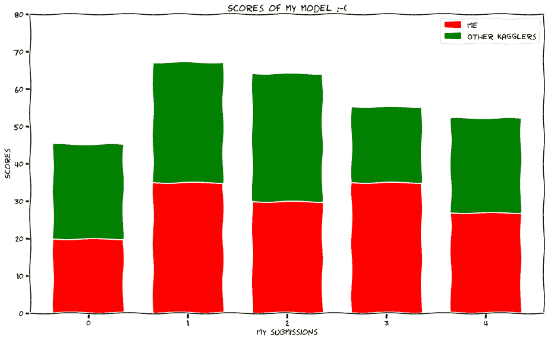
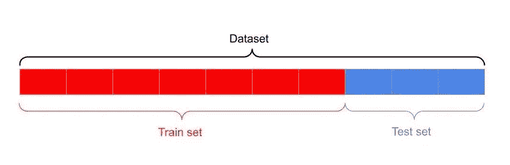
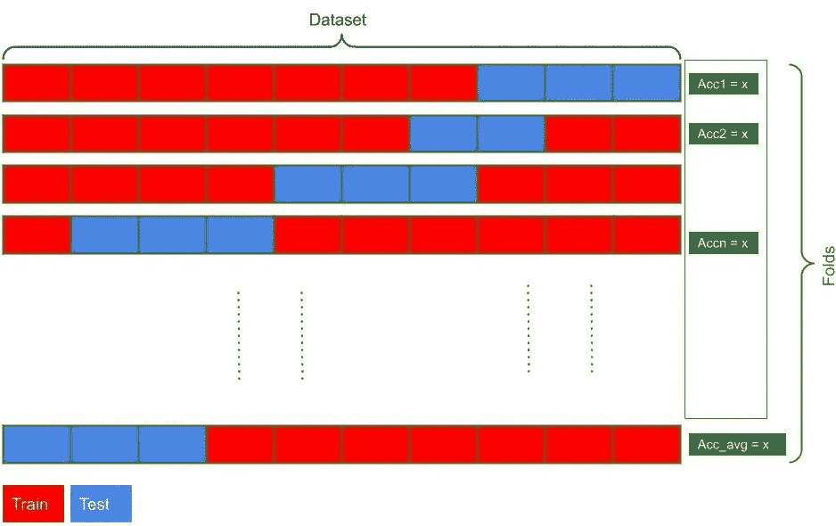
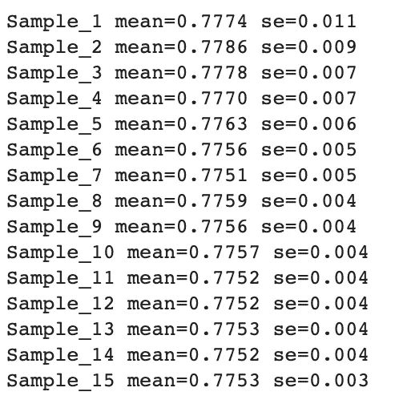
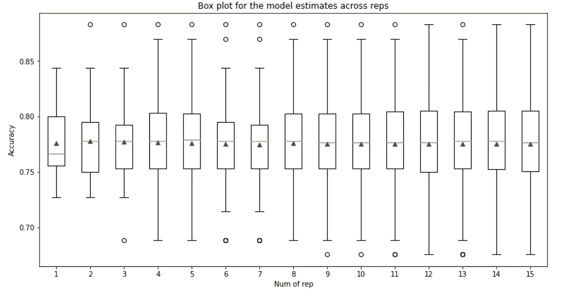
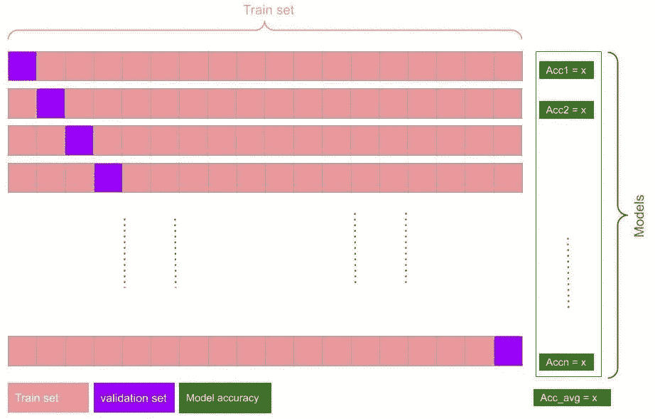

# 如何充分利用机器学习模型

> 原文：<https://towardsdatascience.com/how-to-get-the-most-of-the-machine-learning-models-f973b25ee482?source=collection_archive---------16----------------------->

## 我从 Kaggle 身上学到的提高最终模型性能的经验。每种评估策略的优缺点以及何时使用都包括在内。



与其他卡格勒相比，我的表现🤔—作者图片

# 介绍

向别人学习，从他们停下来的地方开始，这是一种优秀的品质。还有，我承认任何问题的解决方案都是好好理解，然后判断不同的解决方案，直到得到一个稳定的最终方案。

自从两年前在 Kaggle 上开设账户以来，我的数据科学和机器学习技能取得了显著进步。这样的进步来自于竞争或者阅读其他卡格勒的笔记。然而，每当我提交了一份意见书，我从来没有得到公共董事会。我开始质疑自己。这是为什么呢？我想做更多的调查，并了解其他 kagglers 如何获得更高的分数——他们认为在不过度拟合的情况下提高模型准确性的程序。

我从阅读其他竞争对手的笔记本开始，以了解他们解决问题的方式。然后，在开发最终模型时，我在不同的阶段推断了许多这些见解。最有帮助的策略之一是评估每个训练测试分割策略。本文将讨论分割数据集和评估模型性能的常用策略。

# 先决条件

## 本文假设您熟悉以下内容。

1.  用 python3 编写一个基本循环。
2.  如果你想跟进，可以访问 google colab
3.  统计术语的基本知识
4.  sklearn，pandas，matlibplot 库的基础知识
5.  拥有 Kaggle 帐户-使用 API 下载数据集
6.  不同机器学习算法如何工作的基本知识。
7.  一杯咖啡😎开始吧！

> 与本文[相关的笔记本在 Github](https://github.com/salma71/blog_post/blob/master/Evaluate_ML_algos_performance.ipynb) 上，如果你想继续的话。此外，我还使用了 kaggle 上著名的[皮马印第安人糖尿病数据集](https://www.kaggle.com/uciml/pima-indians-diabetes-database/data)。我已经包含了从 Kaggle API 获取数据集到 colab [这里](https://github.com/salma71/blog_post/blob/master/Evaluate_ML_algos_performance.ipynb)的完整脚本。

# 什么是模型评估？

模型评估是一组程序，允许您选择最可能稳定的模型。这是模型开发过程的重要部分。它揭示了模型的行为及其预测能力，表明了对未知数据的偏差和方差之间的平衡。首先，将给定的数据集分成训练集和测试集。模型将学习使用训练集进行预测；相比之下，我们将利用测试集来评估模型的性能。

# 用于拆分的方法

考虑到属性可能具有的特殊特征，有不同的策略来拆分数据并确保做到公平。例如，如果原始数据在要素之间存在不平衡，则预测可能会有偏差，因此对于每种情况，可能会推荐一种特定的方法。

本文涉及的主要方法如下:

1.  列车测试分离
2.  交叉验证
3.  留下一个交叉验证，LOOCV

# 列车测试分离



使用 sklearn 的常规训练测试分割——图片由作者提供

这是一种以特定百分比将数据集分成两半的方法。这既简单又快捷。当比较不同的算法来决定你可能考虑哪一个时，它可能是合适的。

**sklearn 中的 train_test_split 方法。model_selection** 模块被广泛用于分割原始数据集。常见的分割比例是 80/20 或 70/30。

> 您可以按照上述相同的拆分比例将训练集拆分为训练集和验证集— [Stackoverflow 讨论](https://stackoverflow.com/questions/13610074/is-there-a-rule-of-thumb-for-how-to-divide-a-dataset-into-training-and-validatio)
> 
> 我在这里使用了[分层](https://scikit-learn.org/stable/modules/generated/sklearn.model_selection.train_test_split.html)，因为原始数据集在目标类中有一个不平衡——500/268。

```
# set the seed to keep code reducibility
seed = 7# Apply the splitting
x_train, x_test, y_train, y_test = train_test_split(
              X, y, 
              test_size = 0.33,     
              stratify = y, #to keep class balance during splitting
              random_state = seed 
)
model = LogisticRegression(max_iter=1000)
model.fit(x_train, y_train)
result = model.score(x_test, y_test)
print(f'accuracy is: **{**result*100.0**:** 0.3f**}**')
```

> **得到的精度为:76.378**

## 优点:

*   易于实施
*   快速执行，更少的计算时间

## 缺点:

*   如果分割不是随机的，则精确度不准确
*   如果原始数据集的数据点有限，这可能是拟合不足的原因。

# k 倍交叉验证



k 倍分裂程序—作者图片

为了提高模型的准确性，避免常规拆分数据的弊端，我们需要在拆分过程中加入更多的泛化功能。在这个策略中，我们随机多次重复 train _ test _ split**。对于每次拆分或折叠，都会计算精确度，然后算法会汇总每次拆分计算出的精确度，并对其进行平均。这样，所有数据集点都参与了模型精度的测量，这样更好。**

**对于这个例子，我们将使用 sklearn 库中的[RepeatedStratifiedKFold()](https://scikit-learn.org/stable/modules/generated/sklearn.model_selection.RepeatedStratifiedKFold.html?highlight=repeatedstratifiedkfold)来评估模型，因为它在每次迭代中使用不同的随机方案重复分层折叠 n 次。**

```
from sklearn.model_selection import RepeatedStratifiedKFold
from scipy.stats import sem
import numpy as np
import matplotlib.pyplot as pltcv_repeated = RepeatedStratifiedKFold(
    n_splits = 10,
    n_repeats = 16,
    random_state = seed
)scores_r = cross_val_score(
     model,
     X, y,
     scoring = 'accuracy',
     cv = cv_repeated,
     n_jobs = -1
)print('Accuracy: %.3f (%.3f)' % (scores_r.mean(), scores_r.std())))
```

> ****得到的精度为:0.775 (0.042)****

## **访问每个褶皱的模型精度**

**为了更好地做出判断，对估计值的分布进行更多的调查是一个好主意。**

```
**# evaluate a model with a given number of repeats**
def asses_model(X, y, repeats):
 **# define the cv folds** 
  cv = RepeatedStratifiedKFold(
             n_splits=10, 
             n_repeats=repeats,  
             random_state = seed)
 **# create the model**  model = LogisticRegression(max_iter=1000)
 **# evaluate model**  scores = cross_val_score(
             model, 
             X, y, 
             scoring = 'accuracy', 
             cv = cv, 
             n_jobs=-1)
  return scores
```

**然后我们将使用`scipy`库中的`sem()`方法来计算每个样本的标准误差。**

```
repeats = range(1, 16)
res = list()
for rep in repeats:
  scores = asses_model(X, y, rep)
  print('Sample_%d mean=%.4f se=%.3f' % (rep, np.mean(scores), sem(scores)))
  res.append(scores)
```

****

**为了更好地理解结果，让我们用箱线图来直观显示样本精度**

****

**跨拆分的准确性—图片由作者提供**

**橙色线表示精度分布的中值，而绿色三角形表示算术平均值。**

**如上图所示，模型精度稳定在 6 和 7 左右，这是要利用的折叠数( **0.775 (0.042)精度**)。**

## **优点:**

*   **更高的精度**
*   **更好地处理阶级不平衡。**
*   **欠拟合的可能性更小**

## **缺点:**

*   **更容易过度拟合，所以我们需要监控折叠的精确度。**
*   **更高的计算能力和更多的执行时间。**

# **留一交叉验证**

****

**遗漏一个交叉验证—图片由作者提供**

**在这种策略中，该算法为每个训练折叠选取一个数据点，并在建模训练时将其排除。验证集因此用于计算模型的准确性；然后对每个训练文件夹重复此过程。平均每个折叠精度后，计算出最终精度。**

> ****在这个策略中，我们为数据中的 n 个观察值创建 n-1 个模型。****

```
from sklearn.model_selection import LeaveOneOut
loocv = LeaveOneOut()
model = LogisticRegression(max_iter=1000)
res = cross_val_score(model, X, y, cv = loocv)
print('Accuracy: %.3f (%.3f)' % (np.mean(res), np.std(res)))
```

> ****得到的精度为:0.776 (0.417)****

## **优点:**

*   **在数据集有限的情况下非常有效，因为我们希望在拟合模型时使用尽可能多的训练数据。**
*   **对于单个新数据点，它具有可能的最佳误差估计。**

## **缺点:**

*   **计算开销很大。**
*   **如果数据集很大。**
*   **如果测试许多不同的参数集。**

**测试是否使用 LOOCV 的最佳方法是运行 k 值较大的 KFold-CV—**考虑 25 或 50** ，并估计训练模型需要多长时间。**

# **要点和结束语**

**我们探索了最常用的策略来有效地训练机器学习中的模型。每种方法都有其优点和缺点；然而，当我们选择一个的时候，有一些提示可以考虑。**

1.  **k 倍交叉验证是比较不同算法性能的经验法则，大多数 k 倍是 3、5 和 10。**
2.  **从常规的训练测试分割开始，以获得特定算法的估计性能的基本事实。**
3.  **留下一个交叉验证-LOOCV 是一种确定性估计，其中没有对训练数据集进行采样。另一方面，其他策略遵循随机估计。**
4.  **当你需要准确估计性能时，LOOCV 可能是合适的。**

# **感谢阅读！**

**最后，我希望这能对评估机器学习模型的常用方法给出全面的指导。如果你有任何问题，请在评论区列出来；我很乐意帮忙。联系我最好的方式是在 [**中**](https://medium.com/@salmaeng71)[**LinkedIn**](https://www.linkedin.com/in/salma-elshahawy/)**或 **Github** **。**快乐学习！****