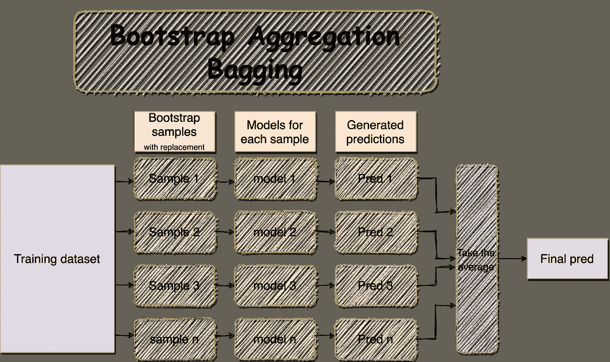
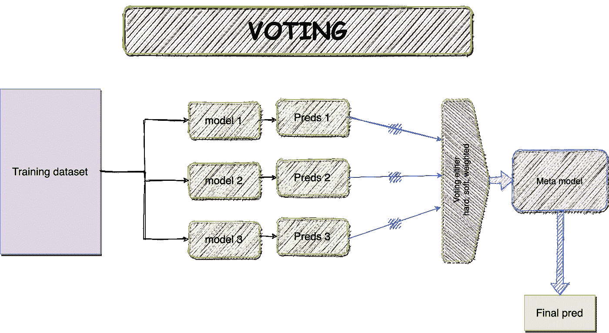
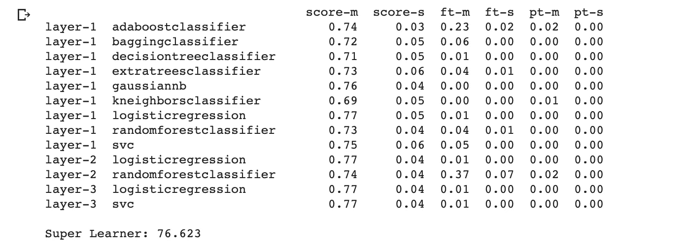

# 如何获得最大限度的 ML 合奏

> 原文：<https://towardsdatascience.com/how-to-get-the-most-of-the-ml-ensembles-ef576c7e6e66?source=collection_archive---------17----------------------->

## Kaggle 的经验:比较集成算法在模型准确性、鲁棒性和泛化能力方面的差异。包含实现！


集合方法——作者图片

# 介绍

我们[之前讨论过](/how-to-get-the-most-of-the-machine-learning-models-f973b25ee482)一些利用机器学习(ML)模型预测能力的常用方法。这些方法主要用于通过将数据分成特定的方案来提高模型的概化能力。


构建不带系综的典型 ML 模型的典型步骤—图片由作者提供

然而，有更先进的方法来提高模型的性能，如集成算法。在这篇文章中，我们将讨论和比较多种集成算法的性能。所以，让我们开始吧！

> 集成方法旨在组合多个基本估计量的预测，而不是单个估计量的预测，从而利用模型的通用性和稳健性。

> 更新 02/13/2021:在 sklearn.ensemble 模块中包含 StackingClassifier()类链接。

# 先决条件

1.  我将使用 UCIML 公共存储库中的玩具数据集，该库托管在 Kaggle 上的[；它有九列，包括目标变量。如果你想继续关注的话,](https://www.kaggle.com/uciml/pima-indians-diabetes-database)[笔记本在 GitHub](https://github.com/salma71/blog_post/blob/master/Evaluate_ML_models_with_ensamble.ipynb) 上。
2.  在笔记本上工作时，我利用了 **Kaggle API** 来获取数据集。如果你在 Kaggle 上没有账户，只需在本地机器上下载数据集，跳过笔记本中的这一部分。你可以在 [StackOverflow 上关注这篇文章，获得一步一步的指导。](https://stackoverflow.com/questions/49310470/using-kaggle-datasets-in-google-colab)

> **我在 google colab 中包含了获取和下载数据的脚本，只需确保在运行之前生成自己的令牌。**

3.在建立模型之前，我对数据集做了一些基本的预处理——比如输入缺失的数据，以避免错误。

4.我创建了两个独立的笔记本，[一个用来比较前三个合奏](https://github.com/salma71/blog_post/blob/master/Evaluate_ML_models_with_ensamble.ipynb)。第二个包括从零开始的堆叠系综的[实现](https://github.com/salma71/blog_post/blob/master/try_stacking_algorithm.ipynb)和使用 [MLens 库](http://ml-ensemble.com/)。

# 合奏方法


集合方法——作者图片

集成是建立各种模型，然后混合它们以产生改进的预测的过程。与单个模型相比，集成能够实现更精确的预测。在大联盟比赛中，利用合奏通常会给获胜队带来优势。可以找[众筹](https://www.kaggle.com/c/crowdflower-search-relevance)赢家[面试——团队四重奏](https://medium.com/kaggle-blog/crowdflower-winners-interview-3rd-place-team-quartet-cead438f8918)，用合奏赢得比赛。

# 1.打包—引导汇总:

**B**ootstrap**agg**regat**ing**倾向于从不同的子样本中构建多个模型(使用相同类型的算法),并替换训练数据集。

> Bagging 就是将几个好的模型进行集成，减少模型方差。



BaggingThank 直觉并行处理—图片由作者提供

Bagging 有以下三种类型:

## 1.2 包装决策树

Bagging 在产生**高方差预测**的算法中表现最佳。在下面的例子中，我们将在 sklearn 库中开发结合了 DecisionTreeClassifier()的 BaggingClassifier()。

> 请注意，由于随机学习的性质，结果可能会有所不同！

> 装袋生产模型并平行分割样品。

```
**from** sklearn.ensemble **import** BaggingClassifiertree = DecisionTreeClassifier()
bagging_clf = BaggingClassifier(base_estimator=tree, n_estimators=1500, random_state=42)
bagging_clf.fit(X_train, y_train)

evaluate(bagging_clf, X_train, X_test, y_train, y_test)**TRAINIG RESULTS:** 
===============================
CONFUSION MATRIX:
[[350   0]
 [  0 187]]
ACCURACY SCORE:
1.0000
CLASSIFICATION REPORT:
               0      1  accuracy  macro avg  weighted avg
precision    1.0    1.0       1.0        1.0           1.0
recall       1.0    1.0       1.0        1.0           1.0
f1-score     1.0    1.0       1.0        1.0           1.0
support    350.0  187.0       1.0      537.0         537.0
**TESTING RESULTS:** 
===============================
CONFUSION MATRIX:
[[126  24]
 [ 38  43]]
ACCURACY SCORE:
**0.7316**
CLASSIFICATION REPORT:
                    0          1  accuracy   macro avg  weighted avg
precision    0.768293   0.641791  0.731602    0.705042      0.723935
recall       0.840000   0.530864  0.731602    0.685432      0.731602
**f1-score**     **0.802548**   **0.581081**  0.731602    0.691814      0.724891
support    150.000000  81.000000  0.731602  231.000000    231.000000
```

## 1.2 随机森林(RF)

随机森林(RF)是一种元估计器，它在多个子样本上拟合不同的决策树分类器，并估计平均精度。

> 子样本大小为**常量**，但如果 **bootstrap=True(默认)**，则样本被抽取**并替换**。

现在，让我们试一试随机森林(RF)模型。RF 的工作方式类似于袋装决策树类；但是，它降低了单个分类器之间的相关性。 **RF 仅考虑每次分割的随机特征子集**，而不是遵循**贪婪方法来挑选最佳分割点**。

```
**from** sklearn.ensemble **import** RandomForestClassifier

rf_clf = RandomForestClassifier(random_state=42, n_estimators=1000)
rf_clf.fit(X_train, y_train)
evaluate(rf_clf, X_train, X_test, y_train, y_test)**TRAINIG RESULTS:** 
===============================
CONFUSION MATRIX:
[[350   0]
 [  0 187]]
ACCURACY SCORE:
1.0000
CLASSIFICATION REPORT:
               0      1  accuracy  macro avg  weighted avg
precision    1.0    1.0       1.0        1.0           1.0
recall       1.0    1.0       1.0        1.0           1.0
f1-score     1.0    1.0       1.0        1.0           1.0
support    350.0  187.0       1.0      537.0         537.0
**TESTING RESULTS:** 
===============================
CONFUSION MATRIX:
[[127  23]
 [ 38  43]]
ACCURACY SCORE:
**0.7359**
CLASSIFICATION REPORT:
                    0          1  accuracy   macro avg  weighted avg
precision    0.769697   0.651515  0.735931    0.710606      0.728257
recall       0.846667   0.530864  0.735931    0.688765      0.735931
**f1-score     0.806349**   **0.585034**  0.735931    0.695692      0.728745
support    150.000000  81.000000  0.735931  231.000000    231.000000
```

## 1.3 额外树木— ET

额外树(ET)是套袋的一种改进。ExtraTreesClassifier()是来自 sklearn 库的一个类，它创建一个元估计器来拟合各种子样本的几个随机决策树(也称为 ET)。然后，ET 计算子样本间的平均预测值。这允许提高模型的精度和对过拟合的控制。

```
**from** **sklearn.ensemble** **import** ExtraTreesClassifier

ex_tree_clf = ExtraTreesClassifier(n_estimators=1000, max_features=7, random_state=42)
ex_tree_clf.fit(X_train, y_train)
evaluate(ex_tree_clf, X_train, X_test, y_train, y_test)**TRAINIG RESULTS:** ===============================
CONFUSION MATRIX:
[[350   0]
 [  0 187]]
ACCURACY SCORE:
1.0000
CLASSIFICATION REPORT:
               0      1  accuracy  macro avg  weighted avg
precision    1.0    1.0       1.0        1.0           1.0
recall       1.0    1.0       1.0        1.0           1.0
f1-score     1.0    1.0       1.0        1.0           1.0
support    350.0  187.0       1.0      537.0         537.0
**TESTING RESULTS:** 
===============================
CONFUSION MATRIX:
[[124  26]
 [ 32  49]]
ACCURACY SCORE:
**0.7489**
CLASSIFICATION REPORT:
                    0          1  accuracy   macro avg  weighted avg
precision    0.794872   0.653333  0.748918    0.724103      0.745241
recall       0.826667   0.604938  0.748918    0.715802      0.748918
**f1-score     0.810458   0.628205**  0.748918    0.719331      0.746551
support    150.000000  81.000000  0.748918  231.000000    231.000000
```

# 2.助推

Boosting 是构建多个模型的另一种技术(也来自同一类型)；然而， ***每个模型学习在模型序列中修正前一个模型的预测误差*** 。Boosting 主要用于平衡 ***监督机器学习模型*** 中的**偏差**和**方差**。Boosting 是一种将弱学习者转化为强学习者的算法。

> Boosting 设法从弱估计量开始依次建立基础估计量，然后降低组合估计量的偏差。


作者在序列图像中增强集成

## 2.1 AdaBoost (AD)

AdaBoost (AD)通过对特征进行分类来对数据集实例进行加权。这使得算法能够在构建后续模型时考虑这些特征。

```
**from** **sklearn.ensemble** **import** AdaBoostClassifier

ada_boost_clf = AdaBoostClassifier(n_estimators=30)
ada_boost_clf.fit(X_train, y_train)
evaluate(ada_boost_clf, X_train, X_test, y_train, y_test)**TRAINIG RESULTS:** ===============================
CONFUSION MATRIX:
[[314  36]
 [ 49 138]]
ACCURACY SCORE:
0.8417
CLASSIFICATION REPORT:
                    0           1  accuracy   macro avg  weighted avg
precision    0.865014    0.793103  0.841713    0.829059  0.839972
recall       0.897143    0.737968  0.841713    0.817555  0.841713
f1-score     0.880785    0.764543  0.841713    0.822664  0.840306
support    350.000000  187.000000  0.841713  537.000000  537.000000
**TESTING RESULTS:** 
===============================
CONFUSION MATRIX:
[[129  21]
 [ 36  45]]
ACCURACY SCORE:
**0.7532**
CLASSIFICATION REPORT:
                    0          1  accuracy   macro avg  weighted avg
precision    0.781818   0.681818  0.753247    0.731818      0.746753
recall       0.860000   0.555556  0.753247    0.707778      0.753247
**f1-score     0.819048   0.612245**  0.753247    0.715646      0.746532
support    150.000000  81.000000  0.753247  231.000000    231.000000
```

## 2.2 随机梯度推进(SGB)

随机梯度推进(SGB)是一种先进的集成算法。在每次迭代中，SGB 从训练集中随机抽取一个子样本(**无替换**)。然后利用子样本来拟合基本模型(学习者),直到误差变得稳定。

```
**from** **sklearn.ensemble** **import** GradientBoostingClassifier

grad_boost_clf = GradientBoostingClassifier(n_estimators=100, random_state=42)
grad_boost_clf.fit(X_train, y_train)
evaluate(grad_boost_clf, X_train, X_test, y_train, y_test)**TRAINIG RESULTS**: 
===============================
CONFUSION MATRIX:
[[339  11]
 [ 26 161]]
ACCURACY SCORE:
0.9311
CLASSIFICATION REPORT:
                    0           1  accuracy   macro avg  weighted avg
precision    0.928767    0.936047  0.931099    0.932407  0.931302
recall       0.968571    0.860963  0.931099    0.914767  0.931099
f1-score     0.948252    0.896936  0.931099    0.922594  0.930382
support    350.000000  187.000000  0.931099  537.000000  537.000000
**TESTING RESULTS:** 
===============================
CONFUSION MATRIX:
[[126  24]
 [ 37  44]]
ACCURACY SCORE:
**0.7359**
CLASSIFICATION REPORT:
                    0          1  accuracy   macro avg  weighted avg
precision    0.773006   0.647059  0.735931    0.710032      0.728843
recall       0.840000   0.543210  0.735931    0.691605      0.735931
**f1-score     0.805112   0.590604**  0.735931    0.697858      0.729895
support    150.000000  81.000000  0.735931  231.000000    231.000000
```

# 3.投票

投票是一组同样表现良好的模型来平衡它们的弱点。投票使用三种投票程序，硬、软和加权。

1.  **硬投票** —大部分类标签预测。
2.  **软投票** —预测概率之和的 [argmax](https://en.wikipedia.org/wiki/Arg_max) 。
3.  **加权投票** —预测概率加权和的 [argmax](https://en.wikipedia.org/wiki/Arg_max) 。



投票组合—图片由作者提供

投票简单易行。首先，它从数据集创建了两个独立的模型(可能更多，这取决于用例)。然后使用投票分类器来包装模型，并在引入新数据时平均子模型的预测。

```
**from** sklearn.ensemble **import** VotingClassifier
**from** sklearn.linear_model **import** LogisticRegression
**from** sklearn.svm **import** SVC

estimators = []
log_reg = LogisticRegression(solver='liblinear')
estimators.append(('Logistic', log_reg))

tree = DecisionTreeClassifier()
estimators.append(('Tree', tree))

svm_clf = SVC(gamma='scale')
estimators.append(('SVM', svm_clf))

voting = VotingClassifier(estimators=estimators)
voting.fit(X_train, y_train)

evaluate(voting, X_train, X_test, y_train, y_test)**TRAINIG RESULTS:** 
===============================
CONFUSION MATRIX:
[[328  22]
 [ 75 112]]
ACCURACY SCORE:
0.8194
CLASSIFICATION REPORT:
                    0           1  accuracy   macro avg  weighted avg
precision    0.813896    0.835821  0.819367    0.824858  0.821531
recall       0.937143    0.598930  0.819367    0.768037  0.819367
f1-score     0.871182    0.697819  0.819367    0.784501  0.810812
support    350.000000  187.000000  0.819367  537.000000  537.000000
**TESTING RESULTS:** 
===============================
CONFUSION MATRIX:
[[135  15]
 [ 40  41]]
ACCURACY SCORE:
**0.7619**
CLASSIFICATION REPORT:
                    0          1  accuracy   macro avg  weighted avg
precision    0.771429   0.732143  0.761905    0.751786      0.757653
recall       0.900000   0.506173  0.761905    0.703086      0.761905
**f1-score     0.830769   0.598540**  0.761905    0.714655      0.749338
support    150.000000  81.000000  0.761905  231.000000    231.000000
```

# 4.堆垛


堆叠—作者图片

堆叠与投票合奏的工作原理相同。然而，**堆叠可以控制** **顺序调整子模型预测的能力** -作为元模型的输入，以提高性能。换句话说，叠加从每个模型的算法生成预测；随后，元模型使用这些预测作为输入(权重)来创建最终输出。

堆叠的优势在于，它可以结合不同的强大学习器，做出比任何独立模型都精确和稳健的预测。

sklearn 库在 ensemble 模块下有 StackingClassifier()，你[可以在这里](https://scikit-learn.org/stable/modules/generated/sklearn.ensemble.StackingClassifier.html)找到链接。然而，我将使用 [ML-Ensemble 库](http://ml-ensemble.com/)实现堆栈集成。

> **为了在叠加和之前的集合之间进行公平的比较，我使用 10 倍重新计算了之前的精度。**

```
**from** mlens.ensemble **import** SuperLearner***# create a list of base-models***
**def** get_models():
	models = list()
	models.append(LogisticRegression(solver='liblinear'))
	models.append(DecisionTreeClassifier())
	models.append(SVC(gamma='scale', probability=**True**))
	models.append(GaussianNB())
	models.append(KNeighborsClassifier())
	models.append(AdaBoostClassifier())
	models.append(BaggingClassifier(n_estimators=10))
	models.append(RandomForestClassifier(n_estimators=10))
	models.append(ExtraTreesClassifier(n_estimators=10))
	**return** models**def** get_super_learner(X):
  ensemble = SuperLearner(scorer=accuracy_score, 
                          folds = 10, 
                          random_state=41)
  model = get_models()
  ensemble.add(model)
**# add some layers to the ensemble structure** ensemble.add([LogisticRegression(), RandomForestClassifier()])
  ensemble.add([LogisticRegression(), SVC()])
**# add meta model**
  ensemble.add_meta(SVC())
  **return** ensemble***# create the super learner***
ensemble = get_super_learner(X_train)
***# fit the super learner***
ensemble.fit(X_train, y_train)
***# summarize base learners***
print(ensemble.data)
***# make predictions on hold out set***
yhat = ensemble.predict(X_test)
print('Super Learner: **%.3f**' % (accuracy_score(y_test, yhat) * 100))
```



使用超级学习者类进行堆叠—图片由作者提供

```
ACCURACY SCORE ON TRAIN: 83.24022346368714   
ACCURACY SCORE ON TEST: 76.62337662337663
```

# 比较性能

```
**import** plotly.graph_objects **as** gofig = go.Figure()
fig.add_trace(go.Bar(
              x = test['Algo'],
              y = test['Train'],
              text = test['Train'],
              textposition='auto',
              name = 'Accuracy on Train set',
              marker_color = 'indianred'))fig.add_trace(go.Bar(
              x = test['Algo'],
              y = test['Test'],
              text = test['Test'],
              textposition='auto',
              name = 'Accuracy on Test set',
              marker_color = 'lightsalmon'))fig.update_traces(texttemplate='%{text:.2f}')
fig.update_layout(title_text='Comprehensive comparasion between ensembles on Train and Test set')
fig.show()
```


集成性能比较条形图——训练集与测试集在准确性指标上的比较——图片由作者提供

如图所示，堆叠集成在测试集上表现很好，最高分类准确率为 76.623%。太好了！

# 4.结论和要点

我们已经探索了几种类型的集成，并学会了以正确的方式实现它们，以扩展模型的预测能力。我们还总结了一些需要考虑的要点:

1.  叠加法在准确性、鲁棒性方面有所提高，并得到了更好的推广。
2.  在这种情况下，当我们想要建立同样表现良好的模型来平衡它们的弱点时，我们可以使用投票。
3.  助推是一个伟大的合奏；它只是将多个弱学习者组合起来，得到一个强学习者。
4.  当您希望通过组合不同的好模型来生成一个方差较小的模型时，您可以考虑 Bagging 减少过度拟合。
5.  选择合适的组合取决于业务问题和你想要的结果。

最后，我希望这给出了一个关于实现合奏的全面指南，并从中获得最大收益。如果你遇到任何问题，请在评论区列出来；我很乐意帮忙。鼓励我的最好方式是在 [**Medium**](https://medium.com/@salmaeng71) ，[**LinkedIn**](https://www.linkedin.com/in/salma-elshahawy/)**，**或 [**Github**](https://github.com/salma71) **上关注我。快乐学习！**