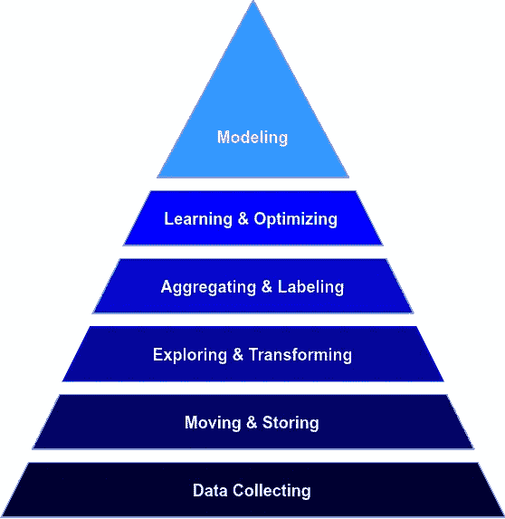
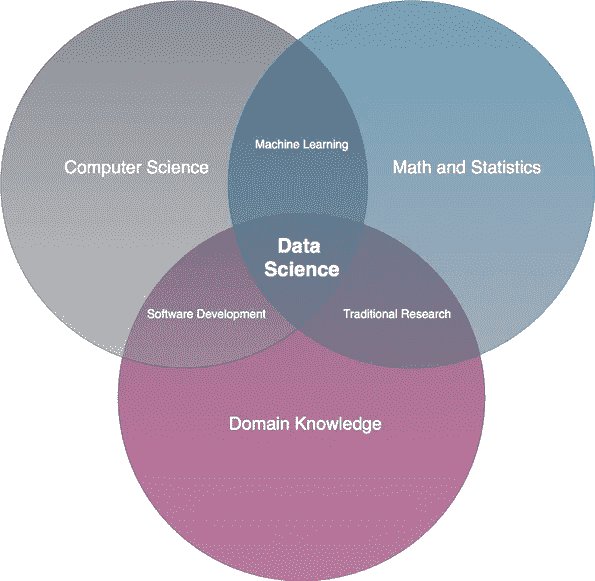

# 如何让您的公司为数据科学做好准备

> 原文：<https://towardsdatascience.com/how-to-get-your-company-ready-for-data-science-6bbd94139926?source=collection_archive---------26----------------------->

## [办公时间](https://towardsdatascience.com/tagged/office-hours)

## 如何在您的公司中利用数据科学

由[弗兰基·查马基](https://unsplash.com/@franki)在 [Unsplash](http://www.unsplash.com) 上拍摄的照片

如今，许多公司都在试图成为数据驱动的，甚至是人工智能驱动的。数据科学、机器学习和人工智能(AI)是关于公司数字化转型的几个最主要的术语。有人可能认为这些技术可以解决任何商业问题。在企业内部，数据科学家通常被视为“数字奇才”，他们能够将数据顺利转化为可操作的见解和运行良好的推荐系统。当谈到数据科学项目的需求和可预期的结果时，期望和现实之间存在差距，尤其是非技术人员。是的，这些技术非常强大，是的，数据科学家可以为企业带来巨大的好处，但这两者都只有在特定的条件下才有可能。

在这篇博文中，我将调查这些条件，并展示在企业中成功运行数据科学项目所需的关键促成因素。

# **IT 基础设施**

数据科学并不能为所有类型的业务问题提供答案，在应用数据科学之前，必须有坚实的基础。如果设置不当，企业内部的 IT 基础设施可能会成为数据科学项目的绊脚石。下图描述了数据科学基于需求的层次结构:

数据科学需求层次(图片由作者提供)

数据收集是金字塔最原始的需求，由软件工程师建立。当然，实际收集的数据取决于公司的流程和产品。例如，在面向用户的产品中，我们会收集关于用户如何与我们的产品交互的所有信息。在这种情况下，我们将通过生成用户数据的应用程序直接检索数据。数据源也可以是安装在机器、建筑物、车辆、设备上的传感器，或者是我们想从中获取数据的任何地方。

下一阶段需要解决**移动&存储**收集的数据。这意味着公司内部的数据工程师必须确保数据能够可靠地在系统中流动。在实践中，实现端到端的数据连续性是一个主要问题，如果从一开始就没有正确设置，就很难实现。由于大多数数据科学项目都包括某种类型的模型拟合，因此我们应该已经在这个阶段考虑了这种互连的架构，以确保训练数据集可以随着新数据的收集而不断更新。

一家公司有不同的数据存储选项:

**内部数据存储**

*   由组织自己拥有和管理的服务器
*   最大程度地控制网络和数据
*   需要构建和维护 IT 基础架构
*   硬件:硬盘(价格合理，性能良好)，固态硬盘(最高性能，最高成本)

**托管数据存储:**

*   异地保存的数据存储(在数据中心或云提供商处)
*   云通常比本地托管选项更便宜
*   可扩展，能够适应业务需求
*   敏感数据的存储需要关注，数据控制是一个问题，需要具体问题具体解决
*   AWS、GCP 或 Azure 等云提供商在其生态系统中提供了大量技术，可以将原始数据转化为有意义的见解、产品或服务

**混合数据存储:**

*   对非敏感数据使用外部提供程序
*   本地存储敏感数据

此外，公司将需要决定如何实际管理他们的数据。整合不同来源数据的传统解决方案是**数据仓库**。数据仓库的架构非常好，可以创建一个清晰、一致和高性能的模型，业务用户可以轻松地使用它来获得洞察力和做出决策。随着数据成为价值最高的资产，像数据科学家这样的新角色开始出现，从数据中寻求价值。这个新角色要求**数据探索和转换**具有敏捷和特别的性质，这推动了**数据湖**的创建。数据的**探索&转换**是数据科学家为了更好地理解数据而要做的第一步。它包括争论数据，为数据科学过程的下一步做准备。数据湖变得越来越受欢迎，因为它们可以处理来自多个来源的大量数据，利用 Spark 等新技术，实现预测分析、推荐系统、图表分析等新型数据分析。

要考虑的关键方面是，数据科学家可以一致地链接数据，而无需付出很大努力。这要求所有相关数据集都存储在一个地方，或者可以通过适当的应用编程接口(API)进行链接。如果组织中的系统之间没有定义适当的 API，这将降低数据科学项目的速度，并阻止数据科学家高效工作。这是因为数据科学家将大部分时间投入到架构讨论中，寻找实现(半)自动化数据管道的工作区，而不是应用核心数据科学技术。

上层阶段**聚合&标记**、**学习&优化、**和**建模**代表了数据科学的核心部分。它们包括定义指标、为机器学习模型构建特征、应用统计技术、开始用干净的输入数据训练算法、评估结果，以及(希望)部署模型或将分析结果传达给利益相关者等活动。

# 数据文化

拥有强大数据文化的公司始终依靠数据来做出决策。数据驱动文化的概念将数据视为洞察组织每个部门的主要资源。目的是让员工能够主动查询和使用数据。这需要访问数据、数据治理、关于如何分析数据的方法知识，以及前面提到的适当的基础设施。

数据是数据科学的原材料。如果没有数据，就无法应用数据科学技术。当我们想要利用数据科学时，我们需要主要关注两件事:数据量和数据质量。

**数据量**

进行实质性分析所需的数据量取决于问题、选择的技术和项目的整体设置。对于高级机器学习技术，我们通常需要大量数据来拟合模型。机器学习模型是用特征来训练的。如果要素数量增加，精确概化所需的数据量将呈指数增长。为了理解这一点，我们需要对维度及其与算法的关系有一个概念。

在下图中，每个方框代表一个数据点。假设我们在一维特征空间中训练算法，因此仅考虑特征 X 用于训练。让我们假设五个数据点对于我们的用例是足够的。现在，如果我们添加特性 Y，我们将需要 25 个盒子来保持我们需要的相同的“数据密度”,因为覆盖是进行学习所必需的。如果我们添加另一个功能，我们将需要 125 个盒子用于训练等等。这就是所谓的*维度诅咒*。

维度的诅咒(作者图片)

这就是为什么我断言你永远没有足够的数据，因为更多的数据产生更好的结果的可能性非常高。更多的数据简化了噪声的处理，为我们的结果提供了更高的可信度。

**数据质量**

结果的有效性更多地取决于数据的质量而不是数量。**垃圾输入/垃圾输出:**更多的垃圾只是返回对错误事物的更好的估计。这就是为什么数据科学家总是需要非常了解底层数据。如果他们没有(因为他们是组织中的新人或者在不同的项目之间切换)，那么他们将需要与对这些数据有深刻理解的专家密切合作。

脏的、低质量数据的原因是多方面的:

*   用户输入错误
*   遗留系统
*   数据迁移
*   编码标准应用不当/程序员错误
*   不断发展的应用

我们可以从以下几个方面来衡量数据质量:

*   **有效性**:符合一个模式
*   **精度**:符合黄金标准数据
*   **完整性**:数据集包含所有记录
*   **一致性**:数据集与其他数据集(来自其他来源)一致
*   **一致性**:数值使用相同的测量单位

# 熟练员工

数据驱动型组织需要高技能员工。数据科学领域是动态的，发展非常迅速，而作为事实上的标准的技术，例如用于大规模数据处理的 Spark，十年前甚至还不存在。数据科学需要结合计算机科学、数学、统计学和领域知识。

数据科学，一个跨学科领域(图片由作者提供)

数据科学从业者通常需要以非技术的方式在演示文稿中传达他们的核心信息和发现，以便更广泛的受众能够理解它们。相应地，公司可能也想寻找具有强大沟通技能的数据科学家。

上述技能的结合是罕见的，公司很难吸引和留住这些人才。显然，第一个挑战是支付数据科学家，因为他们在各行各业都有巨大的需求。根据就业网站*实际上*的数据，在美国，数据科学家的平均年薪为**120，334 美元**。在欧洲，平均工资较低，视国家而定。据 *Glassdoor* 报道，德国一名数据科学家的平均工资为€每年 6 万。在英国，平均工资是 53628 英镑，在法国，€是 45198 英镑。在欧洲，瑞士的薪资最高，超过€的 88400 欧元。

然而，要想让数据科学家留在你的组织中，除了高薪还有更多的事情要做。数据科学家离职是因为现实往往与他们的预期不同。他们寻找有意义和有挑战性的项目来利用他们的技能。很多时候，数据科学家成为任何与数据相关的事情的关键人物，并不断被打断他们实际的数据科学工作。这导致员工感到沮丧，因为编写琐碎的 SQL 查询通常不是数据科学家认为的理想工作。与此同时，许多数据科学家属于 Y 一代，他们正在积极寻找自己角色的意义。他们的工作需要符合他们的个人价值观，千禧一代比以往任何一代人都需要管理者更频繁的反馈和沟通。

此外，数据科学家需要与志同道合的人不断交流，讨论新技术、特定项目、实现他们的模型的挑战等等。如果他们孤立地工作，他们将成为孤独的战士。此外，在许多非科技公司，这类职位没有合适的职业发展路径。其他配置文件确实有这些清晰的路径。例如，在项目管理领域，你可能从 PMO 开始，然后得到你自己的第一个项目，直到你成为高级项目经理。在大多数情况下，数据科学家并不存在明确的道路，这种缺乏发展可能性的情况会导致沮丧和离开的意愿。

# 企业战略

除非你在硅谷地区的科技公司工作，否则人工智能和数据科学很有可能不是你公司战略的组成部分。这对一些公司来说可能绝对没问题，因为并不是每个公司都有望成为科技行业的领导者。然而，如果您的公司正在进行数字化转型，目标是成为数据驱动的组织，那么这些主题及其促成因素对未来至关重要。问题是，在演示文稿上写下这些流行语并假装利用所有新技术很容易，但深入理解这对组织来说实际上意味着什么，并确定人工智能如何帮助加快流程并实施这些技术以减少耗时、重复的任务是一个更大的挑战。

> 93%具有两位数有机增长的高增长公司计划在未来一到三年内将人工智能实施到他们的业务中，但 94%的企业难以理解如何在其组织中实施人工智能。资料来源:Udacity

在许多公司，业务领导通常不是极客或数据科学家，因此与他们的“数字”员工没有共同语言。然而，企业战略是由企业领导定义的，并通过不同的层级进行级联。这些策略对整个组织及其员工的日常工作有着巨大的影响。但是，在不理解其基本概念的情况下，商业领袖应该如何为一家现代化、数字化、人工智能公司设定路线？简单的回答是:他们不能。但是每个人都可以提高技能，而且有很多这样做的机会。

例如， *Udacity* 为人工智能、云计算和数据科学领域的商业领袖提供**纳米学位**。在这些课程中，企业领导学习这些技术的基础、实际应用，并遍历一系列业务案例研究，以找到特定业务场景的最佳解决方案。这些程序是为没有任何编程经验的人设计的，他们需要做出战略决策并评估提议。

提升管理技能的另一种方式是**反向指导**。通常情况下，导师应该比他的学员更资深、更有经验。在逆向指导中，初级员工与更资深、更有经验的员工甚至经理建立“职业友谊”。反向指导认识到双方都存在技能差距，每个人都可以从对方的优势中学习。年轻员工可以将新技能和想法传授给年长员工，并从其学员成为榜样或职业教练中受益。

# 关键要点

转变公司以利用新技术是一项具有挑战性的任务，只有满足一些关键条件才能奏效。让我总结一下为现代数据驱动型组织奠定基础的最重要的几个方面:

*   **IT 基础设施:**数据科学家需要一个专业的工作环境来利用新技术。正确的数据收集、存储和数据探索工具是实现数据科学的最基本需求。
*   **数据文化:**员工和决策者关注现有数据传达的信息，而不是依靠他们的直觉。数据被视为关键资产。
*   **熟练员工:**数据科学家是声誉良好的员工，公司需要支付合理的薪水，并为他们提供有意义的项目。
*   **企业战略:**企业领导人需要理解这些新技术的核心概念，以便将它们纳入企业商业模式的战略定位。

 [## 分析时代和数据质量的重要性

### 分析的使用不再局限于财大气粗的大公司。它现在很普遍，59%的…

www.forbes.com](https://www.forbes.com/sites/forbesagencycouncil/2019/10/01/the-age-of-analytics-and-the-importance-of-data-quality/#2e39afc5c3c4)  [## 数据湖和数据仓库的 5 个主要区别

### 数据湖不是数据仓库的直接替代品，它们是服务于不同领域的补充技术

www.matillion.com](https://www.matillion.com/resources/blog/5-key-differences-between-a-data-lake-vs-data-warehouse/)  [## 小型企业合作系统的数据存储选项

### 哪种存储解决方案最适合您的组织？IT 经理和业务领导团队面临着一个…

coopsys.com](https://coopsys.com/data-storage-options-for-your-small-business/)  [## 构建您的大数据基础架构:每个企业都需要考虑的 4 个关键组件

### 大数据可以为各种规模的企业带来巨大的好处。然而，与任何商业项目一样，适当的准备…

www.forbes.com](https://www.forbes.com/sites/bernardmarr/2016/06/15/building-your-big-data-infrastructure-4-key-components-every-business-needs-to-consider/#a04611e577e7)  [## 优化机器学习和数据科学| Intouch 解决方案的六个必做步骤

### 亚伯拉罕·马斯洛的人类需求层次——以金字塔的形式描绘——最早是在 1943 年提出的，并给出了…

www.intouchsol.com](https://www.intouchsol.com/blog/six-must-steps-optimal-machine-learning-data-science/)  [## 公司对自动化技术采取零敲碎打的方法

### 人工智能、机器人和其他下一代自动化技术的发展正在推动一些…

www.wsj.com](https://www.wsj.com/articles/companies-take-a-piecemeal-approach-to-automation-tech-11554396270)  [## 商业中的人工智能成为现实

### 关于作者:Sam Ransbotham 是卡罗尔学校信息系统系的副教授…

sloanreview.mit.edu](https://sloanreview.mit.edu/projects/artificial-intelligence-in-business-gets-real/)