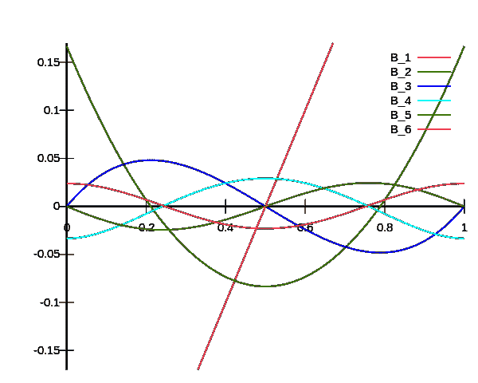
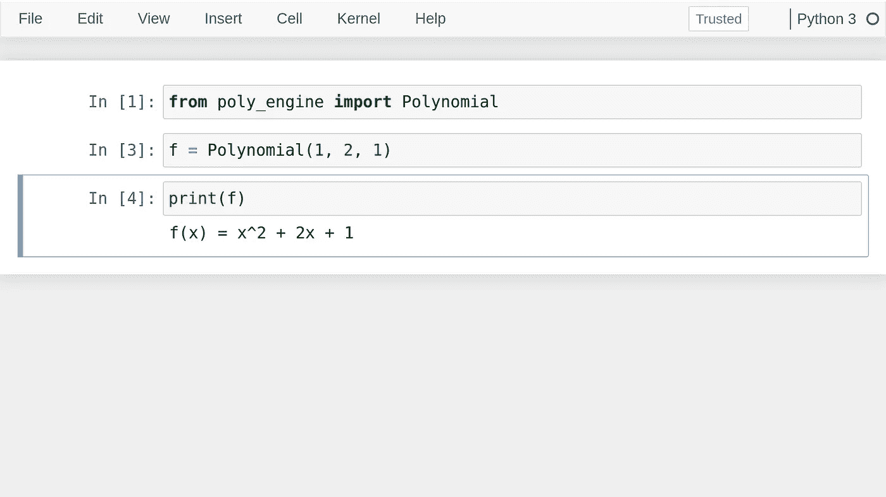
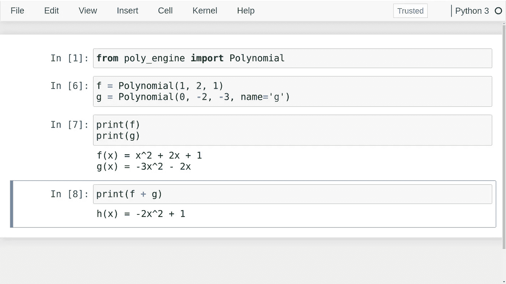
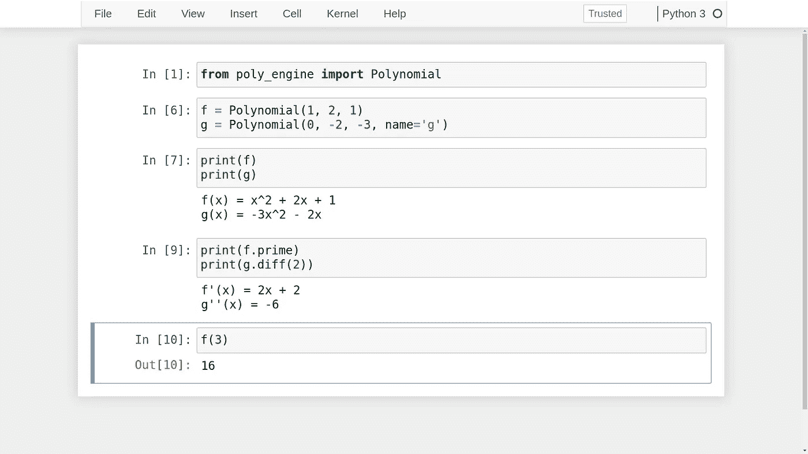
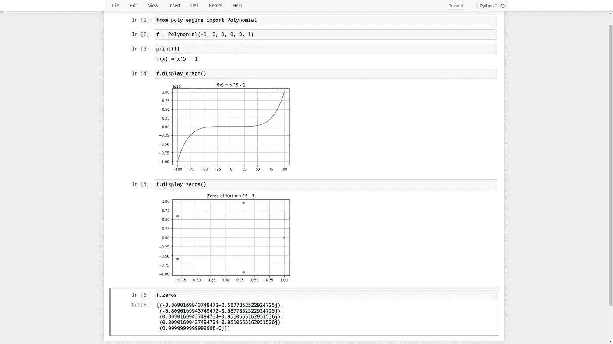

# 如何给你的 Python 代码带来魔力

> 原文：<https://towardsdatascience.com/how-to-give-your-python-code-a-magic-touch-c778eeb9ac57?source=collection_archive---------4----------------------->

## 构建一个强大的多项式引擎，方便学习和研究

图片来自[维基共享资源](https://commons.wikimedia.org/wiki/File:Bernoulli_polynomials_no_title.svg)

在本文中，我将向您展示如何用 Python 构建一个学习多项式的工具。

此外，这个工具使用起来应该很直观，感觉就像 Python 自带的内置类型。

我们将使用所谓的*邓德方法*一起做这件事。

# 目录

[Intro](#eddb)
[魔法方法](#40c3)
∘[_ _ str _ _](#c75e)
∘[_ _ len _ _](#9142)
∘[_ _ getitem _ _](#b43b)
∘[_ _ eq _ _，__add__，__sub__，__mul__，__floordiv__](#8643)
[多项式作为函数](#e881)
[零和图【图](#9554)

# 介绍

几年前，我发现了一种有趣的多项式。

我想研究它们的特性，但没有工具来适当地探索它们。有了技术武装，我将通过构建这样一个工具来进行战斗。

在我们构建它之前，让我们快速回顾一下 Python 的 double-under 或*“dunder”*方法。

# 神奇的方法

邓德方法，有时被称为*魔法方法*，是以两个下划线开始和结束的类的方法。

这些方法模拟了 Python 的内置功能，比如使用关键字 **len** 、 **+** 、 **with** 等。

为了更好地理解这一点，让我们构建一个表示多项式并支持 Python 语法的类。

描述一个多项式所需的最少信息量是多少？是系数的问题，不是吗？

让我们尝试以下方法:

我们肯定需要系数，其余的只是为了展示。系数只是作为以常数项开始的类构造函数的参数给出。我们将为多项式赋予默认名称 *f* ，当然我们可以在实例化对象时更改它。

## __str__

说到“显示”，让我们确保用户在打印多项式时看到有用的东西。我们将在上面添加一个名为 __str__ 的 dunder 方法。

来自 *__str__* 方法的输出就是你打印出你的对象时所看到的。如果你的类中没有这个方法，那么你只能打印出你的类名，这可能没什么用。

不要太担心方法的内容，一会儿你就会看到它做了什么。

现在，我们能够打印出我们期望看到的多项式。当然，您可以根据自己的需要进行更改，请注意，我们也有一个 *__repr__* dunder，它属于同一个系列，但更适合开发人员而不是用户。

作者图片

这很好，但是我们还没有真正对多项式做任何事情。为了给这个类增加一些功能，让我们编写代码来实现多项式的加、减、乘、除以及其他有趣的运算和功能。

## __len__

我们想这样做的方法是使用 dunder 方法来获得工具的直观性。具体来说， *__len__* 方法将让我们使用内置的 **len** 函数来显示多项式的某种长度。在这种情况下，我选择使用术语的数量作为度量。

## __getitem__

当你分割一个列表或者获取第 n 个元素时，你使用 list[n]语法。我们可以对多项式做同样的事情。在这种情况下，我决定我们应该得到第 n 个系数。

## _ _ eq _ _ ,_ _ add _ _ ,_ _ sub _ _ ,_ _ mul _ _ _，以及 __floordiv__

以上方法分别对应**=**， **+** ， **-** ， ***** ， **//** ，唯一需要说明的方法可能是 *__floordiv__* 方法，我决定实现这个方法是因为可能要做多项式除法。

我只返回商，而不是余数，如果它应该是非零的。我们也可以选择使用 *__truediv__* dunder 方法，但是我认为在这种情况下划分楼层更有意义。

为了更好地理解这一点，您应该亲自试验一下代码。现在，让我们将上述方法添加到我们的类中:

# 多项式作为函数

我们现在有很多选择。

注意，现在 Python 理解了如何通过使用符号 **+** 来添加多项式，例如，这给了它在编写代码时更自然的感觉。毕竟，我们现在能够像写数学一样写它。

让我们添加一些功能来实现差异化。

我们将实现一个 *prime* property 方法和一个更通用的 n 次微分方法，称为 *diff* 。我们相应地更改名称，以帮助用户跟踪不同的对象。

因为 prime 也返回一个多项式对象，我们的其他方法也处理导数，使我们能够很好地打印出来，并继续处理它。

我们还将添加一个名为 *negating_shift* 的方法。

我们需要这种方法的原因与我在本文开头提到的研究有关。该方法将采用多项式 *f(x)* 以及实数α，并返回相应的多项式 f(α - x)。

现在，如果一个多项式不能被调用，它会是什么呢？

我们需要使它成为一个*函数对象*，它应该能够像我们使用任何其他函数一样计算实数和复数。

让我们将所有这些也添加到模块中。

到目前为止的完整代码:

现在我们可以用一个简单的方法来区分 *n* 次。还要注意，现在我们可以像调用多项式所代表的函数一样调用它们了！

这要感谢 *__call__* dunder 方法。

# 零和图

我们肯定希望能够找到根，我们也希望能够显示多项式的图形，现在我们有了根，我们也可以找到函数的局部最小值和最大值。

能够显示根在复平面中的位置也是有用的。

因此，我们也可以为此添加方法:

请注意，我们可以更改作为参数的轴的大小。这在某些时候可能会很方便。

现在我们可以得到根或零，也可以得到漂亮的显示和图形。我们在下面看到，单位的 *5* 根在复平面上构成一个五角星。

显示屏上的点是多项式的复数零点。

到目前为止，我们已经有了很多不错的 Pythonic 功能。我将在未来添加更多的像判别式，因式分解等。在此期间，是时候学习我最初想学习的多项式类了。

这将是一篇单独的文章，因为这篇文章会变得太长。

您可以在这里获得完整的代码:

<https://github.com/KRBM/PolynomialEngine/>  

如果您有任何问题、意见或顾虑，请联系 LinkedIn:

<https://www.linkedin.com/in/kasper-m%C3%BCller-96ba95169/> 