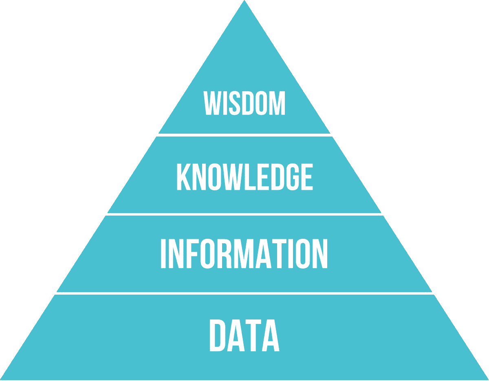
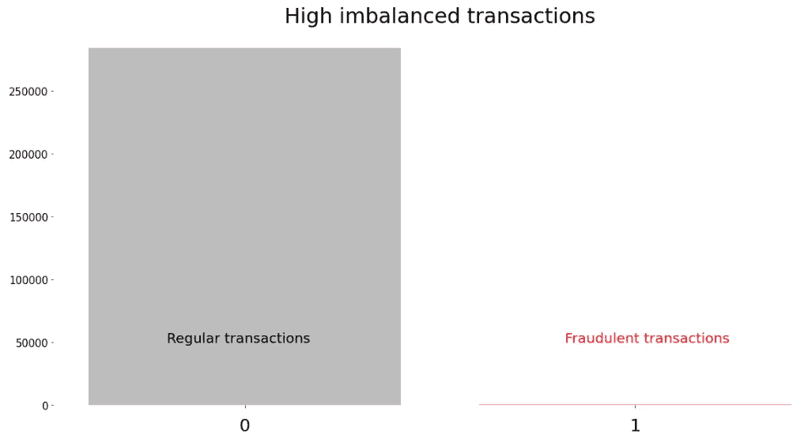
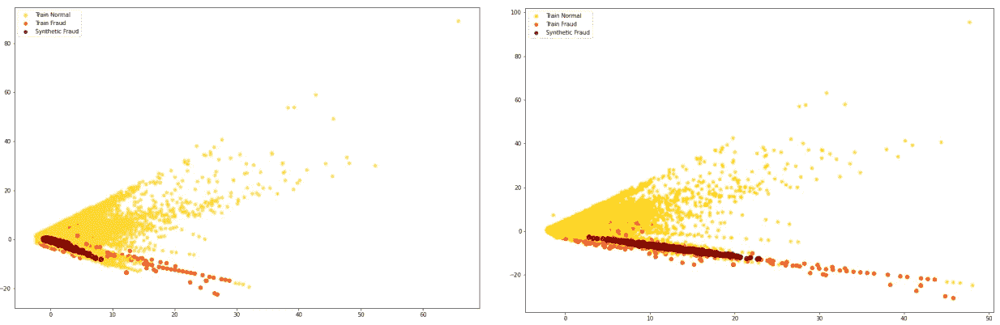

# 如何像专业人士一样从原始数据走向生产

> 原文：<https://towardsdatascience.com/how-to-go-from-raw-data-to-production-like-a-pro-1f79394c4ddd?source=collection_archive---------21----------------------->

## 关于使用合成数据提高数据质量和使用 MLOps 交付模型的探索

机器学习和人工智能这两个概念在过去十年中绝对改变了我们的思维方式，在未来几年中可能会发生更大的变化。但是，我们也知道谈论机器学习时的陈词滥调— *“垃圾进，垃圾出”*。这是不可否认的事实，人工智能解决方案的关键因素是在正确的时间用正确的数据持续改进。

*听起来很容易，对吧？*但是，如果我告诉您，在正确的时间获取正确的数据并使之成为现实仍然存在许多挑战，那会怎么样？尤其是将数据驱动的应用程序投入生产时。

本文解释了如何通过利用 [YData 的合成数据开源工具包](https://github.com/ydataai/ydata-synthetic)来提高数据质量，并确保使用 UbiOps 平台快速轻松地部署[，ubi ops 平台是数据科学代码的服务和交付环境。](https://ubiops.com/)

# 什么是合成数据？

让我们从基础开始，[数据质量](/the-cost-of-poor-data-quality-cd308722951f)可以定义为数据如何准确、完整、一致、可靠，最重要的是，数据是否是最新的。数据是基础，正如下图中的好的和旧的 DIKW 金字塔所描述的那样，在基于机器学习的项目中尤其有效-如果我们没有好的数据，那么我们就不可能有好的信息。

总之，对于数据科学项目来说，及时了解数据的质量可以“决定成败”。

数据金字塔或大多数人所知的 DIKW。[来源](https://www.researchgate.net/figure/The-data-information-knowledge-wisdom-DIKW-hierarchy-as-a-pyramid-to-manage-knowledge_fig6_332400827)

在 YData，数据科学团队非常重视数据质量。非常严肃地说，YData 围绕这个概念建立了一个完整的平台。它从访问数据到探索和处理，是综合数据生成的核心特征之一。

**合成数据**可以成为帮助组织提高数据质量的强大盟友。*但是如何？*

从它的名字，我们很容易理解它指的不是从现实世界收集的数据，而是由计算机生成的数据。数据合成新技术的最大好处是，生成的数据保持了真实世界的属性。[可以使用各种不同的方法生成合成数据](https://medium.com/ydata-ai/synthetic-data-1cd0ba907609)，然而，当谈到高质量的合成数据时，我们寻找的是*生成的数据*，它保留了真实数据的实用性、保真度和可靠性，同时保持了隐私合规性。这就是新的方法论所提供的，如[变分自动编码器](https://arxiv.org/abs/2012.03715)或[生成对抗网络。](https://arxiv.org/abs/1406.2661)

**为什么要为改进的模型训练合成数据？**

来自真实世界事件的数据具有广泛的应用，可帮助数据科学团队改进其现有数据集，减少相关和敏感数据的访问时间，并无缝缓解隐含的偏见问题:

1.  **原型开发:**收集和建模大量的真实数据是一个复杂而乏味的过程。生成合成数据使数据更快可用。除此之外，它可以帮助更快地迭代 ML 计划的数据收集开发。
2.  **边缘情况模拟:**通常可以看到，收集的数据并不包含对模型性能产生负面影响的所有可能场景。在这种情况下，我们可以通过人工生成来包含那些罕见的场景。
3.  **数据集扩充，偏差&公平性:**并非所有时候我们都有所需的数据量，或者在其他情况下，我们可能会处理某些类别中的代表性不足问题。自动化决策会使这些问题变得更糟，但合成数据是缓解这些问题的一个很好的选择。
4.  **数据隐私:**合成数据是确保数据隐私的绝佳方式，同时能够共享微数据，允许组织共享敏感和个人(合成)数据，而无需担心隐私法规。

# 什么是机器学习操作？

机器学习操作(MLOps)的核心是一套流程和最佳实践，为运行和管理与机器学习相关的一切提供可靠的基础设施。这就产生了一个可预测的、稳定的、安全的环境。如果没有 MLOps，许多机器学习算法仍然会在一些数据科学家的笔记本电脑上运行。这不是运行关键业务算法的好方法。

好吧，假设您对(本地)模型性能感到满意，并且您想继续让您的模型在您公司的基础设施(由 IT 部门维护)上运行。然而，在将模型代码和数据完全部署到生产环境中之前，它们通常会在数据科学团队和 IT 团队之间进行不同的交接。这不仅耗时，而且令人沮丧，并会导致时间和预算耗尽或安全性受损等风险。这就是为什么理想情况下，数据科学家不仅参与构建数据集和模型训练，还参与模型服务和托管。当然，它必须对流程的安全性和健壮性感到满意。这样就很容易进行迭代，可以快速传递变更，最终的应用程序可以在预期的时间内交付预期的价值。

UbiOps 为您处理许多 MLOps 任务，以便您可以专注于创建有价值的算法，同时仍然在专业环境中使用它们。并且不需要任何 IT 专业知识。

MLOps 的一些示例包括:

1.  **可扩展服务:**算法应该是可扩展的。对你的算法的需求通常不是恒定的。有了可伸缩性，您总是拥有适量的资源。降低成本并保持速度。
2.  **标准化和可移植性:**在任何专业环境中，拥有可重复和可预期的结果都是关键。在 MLOps 中，这可以归结为拥有标准格式的模型，可以在任何地方运行，最重要的是在任何地方都可以运行。
3.  **版本控制:**可靠性与理解和跟踪项目中的变更有很大关系。例如，这有助于在出现问题时快速恢复到旧版本。不仅仅是在源代码层面上，比如 GIT，而且在服务层面上，如果一个新版本出现了意想不到的问题，不同的版本已经准备就绪。

如果你想了解更多关于 MLOps 的信息，你可以看看 MLOps 的 10 条戒律

# 把所有的放在一起:从原始数据到生产

在现实世界中，遇到非常不平衡的数据集是很常见的。这种类型的行为常见于不同的行业，从金融服务到电信或公用事业，以及许多使用案例，如欺诈检测或预测性维护。通过这种类型的行为来增强数据集的大小和质量的有效方法是通过数据扩充。

想象一下，作为一名数据科学家，您开发了一种检测信用卡欺诈的算法，但由于可用的数据集不平衡，您对结果不满意。最重要的是，您的所有代码都在笔记本电脑上运行，这不适合生产。

高度不平衡的数据。数据来源:[来自 Kaggle 的信用卡诈骗](https://www.kaggle.com/mlg-ulb/creditcardfraud)

使用诸如合成数据生成器这样的工具，可以让你快速地从代表性不足的班级中学习和复制模式。 [YData 的开源存储库](https://github.com/ydataai/ydata-synthetic)允许您探索和试验不同的合成数据生成方法。使用 ydata-synthetic 库，只需几行代码就可以轻松生成合成数据。

使用 ydata-synthetic 库时，您可以通过几行代码轻松生成合成数据:

用 WGAN-GP 生成合成数据

通过将新的合成欺诈与真实数据相结合，您可以轻松提高分类器的质量和准确性。在本例中，我们使用带有梯度惩罚的简单 WGAN 获得了良好的结果，但有许多参数需要调整，还有其他问题需要担心，例如数据维度、生产数据集的规模以及其他问题。这就是 YData 平台所提供的，一种大规模利用最新深度生成数据综合并针对不同用途进行优化的方式。

不同的参数选择会有不同的结果。[来源](https://github.com/ydataai/academy/blob/master/integrations/ubiops/YData_to_UbiOps_FraudDetection.ipynb)

但是数据科学的生命周期并没有随着模型训练和测试而结束。在获得符合业务预期的结果之后，我们需要将模型交付到稳定的生产服务环境中，并开始为最终用户交付真正的价值。

如何在不掌握容器、Kubernetes、API 开发等概念的情况下做到这一点？对于我们这些数据科学家来说，令人高兴的是，随着 MLOps 工具的兴起，如 [UbiOps](https://ubiops.com/) ，数据科学家现在不仅控制着模型开发的整个过程，还控制着交付和维护。

您可以轻松地重现和测试这个欺诈用例——y data 和 UbiOps 一起创建了一个笔记本，并在 [GitHub](https://github.com/ydataai/academy/tree/master/integrations/ubiops) 上提供。在这本笔记本中，您将学习如何 1)创建合成数据并从中受益，以减轻与不平衡数据集相关的问题，并进行培训，以及 2)向生产服务环境提供更好的模型。

# 结论

ML 解决方案的生命周期非常复杂且难以确保，这不仅是因为数据科学家和工程师的短缺，还因为(通常)现有的技术债务。数据质量对模型结果的影响是众所周知的，而实现最佳和最优训练数据集的挑战已经相当大。这使得预处理步骤成为确保可靠性和标准化的最重要步骤之一。

然而，只有当模型投入生产时，数据和模型才会对业务产生预期的影响。MLOps 是确保将模型及时、健壮且可扩展地交付到生产中的关键答案。

YData 和 UbiOps 无缝集成，使数据科学团队能够轻松改进现有数据，并在安全稳定的生产环境中交付模型。

关于 ML 数据质量的更多信息，请查看 YData 的博客。加入[合成数据社区](https://syntheticdata.community)获取数据合成更新，查看[关于时序数据合成数据的最新帖子](/synthetic-time-series-data-a-gan-approach-869a984f2239)。

有关 MLOps 和模型服务的更多信息，请查看 [UbiOps 网站](https://ubiops.com/)以及更多技术使用案例，请参见[食谱](https://ubiops.com/docs/ubiops_cookbook/)(或查看 [Github](https://github.com/UbiOps/cookbook) )。加入我们的[社区休闲频道](http://UbiOps is a feature rich deployment and serving layer for your data science code, models and scripts. It enables you to run your code live behind a secure serving endpoint in only a few clicks. For more information on UbiOps see our website and for more technical use cases see the cookbook (or on Github). Join our community Slack channel here.)。