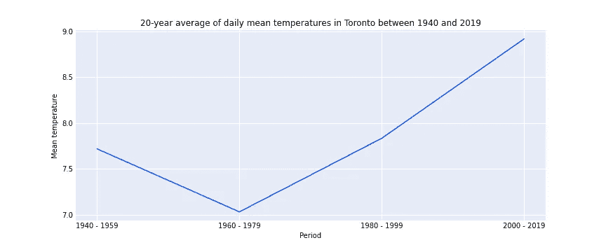

# 如何按期间对年度数据进行分组

> 原文：<https://towardsdatascience.com/how-to-group-yearly-data-by-periods-5199a1dba5db?source=collection_archive---------13----------------------->

## 我将向您展示如何用 Pandas 将每年的数据分成给定长度的时间段，以及如何用 Matplotlib 绘制它们


凯莉·贝丝·威廉姆斯在 [Unsplash](https://unsplash.com/s/photos/baskets?utm_source=unsplash&utm_medium=referral&utm_content=creditCopyText) 拍摄的照片

去年春天，在我参加的一个课程中，一个客户让我将一些年度历史数据可视化为线图。由于每年可用的数据非常少，客户希望将这些年分成几个时间段。此外，如果年度范围不能与所选的期间长度平均分割，则最后一个期间应该更短。

## 让我向您介绍一下我的解决方案

首先，我们需要一些数据，我们可以根据年份列将这些数据分成不同的时间段。今天我选择用加拿大的气候历史数据来展示，这些数据可以从 [Kaggle](https://www.kaggle.com/aturner374/eighty-years-of-canadian-climate-data#) 获得知识共享许可。

使用的数据集中的前 10 行。该数据集包含从 1940 年初到 2019 年底加拿大八个测量点的日平均温度和降水量。

我们将使用熊猫，NumPy 和 Plotly

```
import pandas as pd
import numpy as np
import matplotlib.pyplot as plt
```

让我们从将数据读入数据帧开始。然后，让我们缩小数据范围，只包括“本地日期”和“平均温度多伦多”两列。

```
df = pd.read_csv('Canadian_climate_history.csv')
df = df[['LOCAL_DATE', 'MEAN_TEMPERATURE_TORONTO']]
```

要创建 year 列，让我们首先将“LOCAL_DATE”列更改为 datetime，它的初始类型是 object。从日期时间类型列中，我们可以提取年份信息，如下所示。

```
df['LOCAL_DATE'] = pd.to_datetime(df['LOCAL_DATE'])
df['YEAR'] = df['LOCAL_DATE'].dt.year
```

结果列的类型是 integer，就像我在春天得到的数据一样。

```
0        1940
1        1940
2        1940
3        1940
4        1940
         ... 
29216    2019
29217    2019
29218    2019
29219    2019
29220    2020
Name: YEAR, Length: 29221, dtype: int64
```

为了得到结果，我们将调查 1940-2019 年的范围和 20 年的周期长度。对于全年范围，我们会得到一个很好的平均分割，但由于数据中只有一个 2020 年的测量值，这没有意义。

```
period_length = 20start_year = 1940
end_year = 2019df = df[(df['YEAR'] >= 1940) & (df['YEAR'] <= 2019)]
```

为了检查分割是否均匀，以及为了确定最后一个周期的长度，我们将取模。

```
year_range = end_year - start_yearmodulo = year_range % period_length# For 1940–2019 the modulo is 19
```

接下来，让我们找出最后一期的起止年份。增加一个也是为了包括去年。否则，2019 年将被遗漏，因为它将是下一个时期(如果有的话)的开始年。

```
if modulo == 0:
    final_start = end_year - period_length
else:
    final_start = end_year - modulofinal_end = end_year + 1
```

然后，我继续使用 NumPy 创建一个列表，列出该年范围内所有较早开始的年份。

```
starts = np.arange(start_year, final_start, period_length).tolist()
```

然后，让我们创建元组列表，其中每个元组类似于(period_start，period_end)。从这些元组中，我们最终可以创建熊猫[interval index](https://pandas.pydata.org/pandas-docs/stable/reference/api/pandas.IntervalIndex.html)的库。

```
tuples = [(start, start+period_length) for start in starts]
# We'll add the last period calculated earlier
tuples.append(tuple([final_start, final_end]))bins = pd.IntervalIndex.from_tuples(tuples, closed='left')
```

然后，通过将它们转换为字符串，这些 bin 可以很好地转换为标签。例如，当周期长度为 20 时，“1940，1960”将是第一个标签。在这里，我们可以看到 bin 是如何显示周期在左边关闭，在右边打开的。为了清楚起见，我同意客户将它们描述为“1940-1959”。我创建了一个字典，便于在数据框中替换。

```
original_labels = list(bins.astype(str))new_labels = ['{} - {}'.format(b.strip('[)').split(', ')[0], int(b.strip('[)').split(', ')[1])-1) for b in original_labels]label_dict = dict(zip(original_labels, new_labels)) # The label dict when year range is 1940-2019{'[1940, 1960)': '1940 - 1959',
 '[1960, 1980)': '1960 - 1979',
 '[1980, 2000)': '1980 - 1999',
 '[2000, 2020)': '2000 - 2019'}
```

然后，使用 Pandas [cut()](https://pandas.pydata.org/pandas-docs/stable/reference/api/pandas.cut.html) ，我们可以轻松地将 year 列的内容放入这些 bin 中，并创建一个新列“PERIOD”。最后，在 label_dict 的帮助下，bin 标签被替换。

```
# Assign each row to a period
df['PERIOD'] = pd.cut(df['YEAR'], bins=bins, include_lowest=True, precision=0)
df['PERIOD'] = df['PERIOD'].astype("str")
df = df.replace(label_dict)
```

最后，我们按照 PERIOD 列对数据进行分组。我去掉了年份一栏，只是为了让 df 更整洁。

```
df = df.groupby('PERIOD').mean().reset_index().drop('YEAR', axis=1)
```

最终数据帧

现在我们可以用 Matplotlib 可视化它

```
# Styling of the figure
fig = plt.figure()
fig.set_figwidth(12)
fig.set_figheight(5)
fig.patch.set_facecolor('white')plt.plot(df['PERIOD'], df['MEAN_TEMPERATURE_TORONTO'], color='#004cff')plt.title(f"20-year average of daily mean temperatures in Toronto between {start_year} and {end_year}")
plt.xlabel("Period") 
plt.ylabel("Mean temperature") # Styling of the plot
plt.grid(color = 'white', linewidth = 1)
plt.locator_params(axis='y', nbins=6)# Styling of the axes
ax = plt.gca()
ax.set_facecolor('#e6ecf7')
ax.spines['top'].set_visible(False)
ax.spines['right'].set_visible(False)
ax.spines['bottom'].set_visible(False)
ax.spines['left'].set_visible(False)
ax.tick_params(axis=u'both', which=u'both',length=0)plt.show()
```



## 结论

当每年只有少量可用的数据点，或者当数据点的数量在各年之间变化很大时，为每年的数据创建周期是有益的。为了清楚起见，我鼓励用确切的年份(例如“1940-1959”)来标记周期，而不是用数学区间来表示限制是封闭的还是开放的(例如“[1940-1960)”)。

感谢您的阅读！如果你学到了新的东西或者喜欢这篇文章，[在 Medium](https://medium.com/@miiaramo/follow) 上跟随我。我目前正在撰写关于 NLP 和数据工程的未来文章。你也可以在 [LinkedIn](https://www.linkedin.com/in/miiaramo/) 上找到我。

你对完成这项任务有其他想法吗？如果你能在评论中告诉我，那就太好了😊