# 如何使用无服务器摄取管理器和 Node.js 处理 BigQuery 中的数据加载

> 原文：<https://towardsdatascience.com/how-to-handle-data-loading-in-bigquery-with-serverless-ingest-manager-and-node-js-4f99fba92436?source=collection_archive---------24----------------------->

## [实践教程](https://towardsdatascience.com/tagged/hands-on-tutorials)

## 文件格式、yaml 管道定义、转换和事件触发器，为您提供简单可靠的数据接收管理器

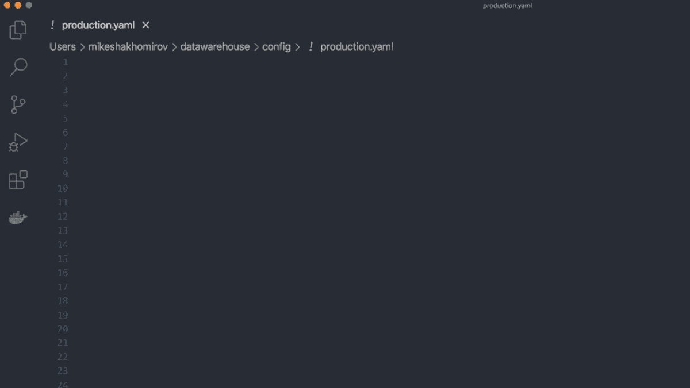

样本管道定义。作者图片[💡迈克·沙克霍米罗夫](https://medium.com/u/e06a48b3dd48?source=post_page-----4f99fba92436--------------------------------)

> -“现在，您只需使用一个' **$ npm run test'** '命令，就可以从云存储中加载与您的管道定义匹配的所有文件，或者在那里创建文件时调用数据加载。

[代码为](https://github.com/mshakhomirov/BigQuery-ingest-manager)的 Github 库

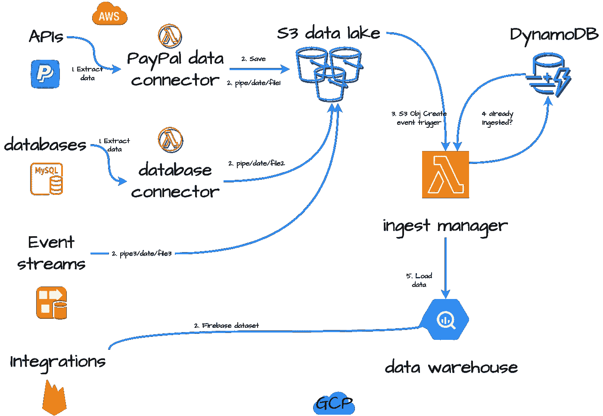

作者图片[💡迈克·沙克霍米罗夫](https://medium.com/u/e06a48b3dd48?source=post_page-----4f99fba92436--------------------------------)

**您将了解如何:**

1.  将数据自动加载到您的数据仓库中，并使用*无服务器* (AWS Lambda)构建一个 ***数据加载服务***
2.  添加各种文件格式支持和加载不同的文件，即 JSON，CSV，AVRO，拼花。
3.  添加 DynamoDB 表来存储摄取日志，并检查文件是否已经被摄取
4.  添加数据转换功能，例如，万一您想要屏蔽一些敏感数据或动态更改格式。
5.  一次加载多个文件
6.  使用**基础设施作为代码**部署您的数据加载服务，即 **AWS Cloudformation**
7.  如何将压缩文件加载到 BigQuery
8.  如何监控数据加载错误

## 关于这个想法

## 构建数据仓库:加载数据

通常，您会希望将您的数据仓库解决方案(BigQuery、Snowflake 或任何其他解决方案)放在图表的**中心**。

*   **轻松连接**任何外部数据源，即设置一个管道从某个任意 API 获取数据，即像我之前写的关于[PayPal](/extract-data-from-paypal-api-c25c76748746)【15】并保存到云中。
*   **加载**数据到 **BigQuery**
*   **转换**数据，并使用 Git、CI/CD 创建文档化的数据管道。例如，用**数据表单**或 **dbt** 。
*   **使用**云形成**或**地形** ( **基础设施作为代码**)简化和自动化部署**
*   **用 **Google Data Studio** 创建 BI 报告**(例如，收入对账等。)或任何其他商业智能解决方案。查看下图，了解其他选项。

作者图片[💡迈克·沙克霍米罗夫](https://medium.com/u/e06a48b3dd48?source=post_page-----4f99fba92436--------------------------------)

# 现代数据堆栈工具(当然不是完整的列表):

*   摄入:五川，缝合
*   仓储:雪花，大查询，红移
*   转换:dbt、数据表单、API。
*   BI: Looker，Mode，Periscope，Chartio，Metabase，Redash

作者图片[💡迈克·沙克霍米罗夫](https://medium.com/u/e06a48b3dd48?source=post_page-----4f99fba92436--------------------------------)

谈到**数据提取和接收**您可能希望使用付费和托管工具，如 **Fivetran** 或 **Stitch** 从任意数据源(即支付商户提供商、汇率、地理编码数据库等)提取数据。)但是如果你遵循这个指南，你将完全有能力自己做这件事。

# 方案

假设你是一名数据工程师，你正在做一个项目，将不同的数据源连接到你的数据仓库中。您的公司是一家手机游戏开发工作室，在 IOS 和 ANDROID 两个平台上销售各种产品。

**你的筹码**

> *你的开发栈是混合的，包括****AWS****和****GCP****。*
> 
> 你的团队经常使用 Node.js。数据科学团队使用 Python，但服务器和客户端数据管道是使用 Node 创建的。
> 
> *您的数据堆栈是现代的、事件驱动的和数据密集型的。*
> 
> *数据仓库解决方案必须具有足够的成本效益和灵活性，以便您可以添加任何所需的数据源。它必须能够轻松扩展，以满足您不断增长的数据。*

**任务**

所有数据来自各种数据表面的文件，即数据库、kinesis 消防水带流和各种通知服务。它以不同的格式(CSV、JSON、PARQUET 等)存储到您的云数据湖中。).

作为一名**数据工程师**，你的任务是将**数据加载**过程自动化到你的 **BigQuery** 数据仓库中。你有许多任意的数据源和管道将文件送入你的 AWS S3 数据湖。

*现在你需要*

> *……“一个可靠的*服务*来管理文件格式，决定上传到哪个表并监控整个过程。”*

*你决定使用****AWS Lambda****函数和****node . js****来完成这个任务。*

# 你的微服务应用逻辑:

1.  您的数据连接器从一些数据源提取数据(可以是任意的，如 PayPal)
2.  文件正在被保存到 S3 T21 的数据库中。
3.  当新文件进入您的 *S3 数据桶*时，将触发数据接收。
4.  该服务将处理这些文件，并为 *BigQuery* 做好准备，以便将其插入到表中。该服务将决定插入哪个表。
5.  该服务将检查文件是否已经被摄取，以防止重复。您将使用 *AWS DynamDB* 来保存数据加载记录。
6.  捕捉数据摄取错误，并在需要时保存文件以供进一步调查。
7.  现在，您可以在数据仓库中转换数据。
8.  通过通知监控您的数据加载过程。如果有任何错误，您将收到一封电子邮件。

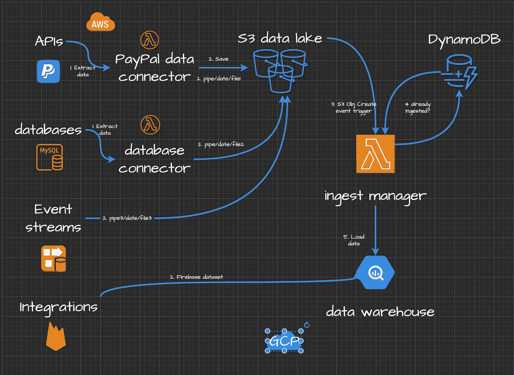

作者图片[💡迈克·沙克霍米罗夫](https://medium.com/u/e06a48b3dd48?source=post_page-----4f99fba92436--------------------------------)

# 先决条件、库和设置

**工具**

*   已安装 Node.js 和节点包管理器
*   对云计算(Amazon Web Services 帐户)、AWS CLI 和 AWS SDK 有基本的了解
*   Google BigQuery 和一个服务帐户来验证您的服务。
*   Shell(命令行界面)命令和脚本(高级)。

**技法**

*   对 REST APIs 的理解。
*   良好的节点知识。JS(中级)。您将创建一个 Lambda 函数。
*   **你必须了解节点。JS 基本概念，即异步函数、节点包和代码如何工作。**
*   **基本调试(控制台，打印报表)**
*   **循环:即用于**
*   **分支:if，if/else，开关**
*   Shell 命令和脚本，就像您希望从命令行使用 AWS CLI 部署 Lambda 并能够在本地测试它一样。

# 我们开始吧

# 第一步。如何使用无服务器(AWS Lambda)构建数据加载服务，并自动将数据加载到数据仓库中

# 为您的数据湖创建新的 S3 存储桶

用您的 bucket 名称替换`your-bigquery-project-name.test.aws`,并从命令行运行，例如，如果您使用 AWS CLI:

`aws s3 mb s3://bq-shakhomirov.bigquery.aws`

您将看到如下内容:

`$ make_bucket: bq-shakhomirov.bigquery.aws`确认存储桶已创建。[阅读 AWS S3 文档](https://docs.aws.amazon.com/cli/latest/userguide/cli-services-s3-commands.html#using-s3-commands-managing-buckets-creating)

将数据集从上传到您新创建的 S3 存储桶:

`$ aws s3 cp ./data/payment_transaction s3://bq-shakhomirov.bigquery.aws/payment_transaction`

`$ aws s3 cp ./data/paypal_transaction s3://bq-shakhomirov.bigquery.aws/paypal_transaction`

# 创建一个空的 AWS Lambda 函数(Node.js)。

您可以使用 *AWS web 控制台*或 *AWS CLI* 来完成。这取决于您，并在本地初始化您的`Node.js`应用程序。您的微服务文件夹结构必须如下所示:

其中`bq-shakhomirov-service-account-credentials.json`是您的 BigQuery 服务帐户凭证。

# 授予您的服务从数据湖桶中读取数据的权限

您可能希望从您的 **S3 数据桶**中读取您的数据集文件，然后将该数据加载到您的 **BigQuery** 数据仓库中。因此，您需要通过向 Lambda 函数的角色添加一个策略，将 Lambda 函数的 S3 访问权限授予您的 bucket，如下所示:

你可以在 AWS 文档[中找到更多关于如何创建**角色**的信息。后面我会举例说明如何用](https://aws.amazon.com/blogs/security/how-to-create-an-aws-iam-policy-to-grant-aws-lambda-access-to-an-amazon-dynamodb-table/)[**AWS cloud formation**](https://aws.amazon.com/cloudformation/)栈来做。

# 安装所需的依赖项

安装所需的`node`模块和库，如`./package.json`所示。您将需要:

*   “AWS-SDK”:“2 . 804 . 0”用于访问带有数据的 S3 桶
*   " run-local-lambda": "1.1.1 "来测试 nad 并在本地运行您的 Lamdba
*   “@google-cloud/bigquery”:摄取数据的“⁵.7.0”
*   “时刻”:" . 24.0 "处理日期并创建相关的`file names` / `BigQuery jobIds`

确保您可以在本地运行它。这个想法是通过从命令行运行`npm run local`命令来模拟一个事件( *S3 对象创建事件*)。安装“run-local-lambda”:“1 . 1 . 1”来测试并在本地运行您的 Lamdba。

你的`./package.json`一定是这样的:

在命令行中运行`npm i`，它将安装依赖项。

# app.js

在您的`./app.js`中添加***async process event()***函数来处理事件。

您的`./app.js`看起来会像:

哪里`./config.json`是你的服务**配置文件**。

> *我更喜欢用****YAML****来代替，不过是口味问题。最终你会找到使用* `*npm config*` *和* ***yaml 的解决方案。*** *对你的***来说似乎是正确的事情。**

*你的`./config.json`的例子可以有**现场**和**登台**环境设置，看起来像这样:*

> **使用配置文件定义逻辑、表名以及如何为这些表选择相关文件。**

***使用上面的这个配置文件，您的数据加载服务将尝试将** `name` **键与相关文件名** `fileKey` **匹配。如果它在 S3 事件中找到匹配，那么它将开始加载数据。***

# *BigQuery 凭据文件*

*`./bq-shakhomirov-b86071c11c27.json`是 **BigQuery** 凭证文件的一个例子。你将需要这个 ***服务帐户凭证*** 文件来通过谷歌认证你的微服务，这样它实际上可以做一些事情。点击阅读更多关于[服务账户认证的信息。只需从你的*谷歌云平台*账号下载，添加到你的应用文件夹。](https://cloud.google.com/docs/authentication/production)*

*看起来应该是这样的:*

# *如何检查 BigQuery 中是否存在表*

*您可能希望在加载数据之前执行此操作。将这个函数添加到您的`./app.js`文件的`processEvent()`中。如果表不存在，它将使用配置文件中的模式并创建一个。*

*这个函数将在名为`source`的数据集中创建一个带有配置文件模式的表。它也应该来自`./config.json`，但这只是一个例子。*

# *如何将 JSON 文件流式加载到 BigQuery 中*

*这将是一个 ***逐行*** 的插入操作。*

*当一行不符合模式时，只有该特定行会被插入，而不是 BigQuery 中的 ***批量插入*** (一行模式验证失败—所有文件上传失败)。*

*您可能想要添加一个新功能:*

*这只是一个例子，其中已经声明了 JSON 数据(不需要从本地文件或者从 ***云存储*** )并且已经创建了表。`simple_transaction`是一个简单的表，只有 3 列:`transaction_id`、`user_id`和`dt`，在`./config.json`模式中为名为`simple_transaction`的表定义。试试看，它会将数据逐行插入 BigQuery 表中。*

*您可以稍微调整此函数，例如从**本地文件**中读取数据，它将处理新的行分隔文件`./data/simple_transaction`并创建一个[加载作业操作](https://cloud.google.com/bigquery/docs/reference/rest/v2/Job#JobConfigurationLoad)来代替我们之前使用的[写流](https://googleapis.dev/nodejs/bigquery/latest/Table.html#createWriteStream)。*

# *如何从 AWS S3 加载 JSON 新行分隔数据*

*如果你的数据是新行分隔的 JSON(big query 加载 JSON 数据的自然方式),那么你需要一个像下面这样的函数。该功能将执行以下操作:*

1.  *从 **AWS S3** 创建一个读取流并读取文件*
2.  *使用 [*JSONStream*](https://github.com/dominictarr/JSONStream) 模块解析 JSON 文件中的数据*
3.  *在 BigQuery 中创建一个 ***批处理*** 加载作业。*

*把这个加到你的`./app.js`里，试试`npm run test`。将`./test/data.json`修改为`object.key = 'simple_transaction`:*

*您的“simple_transaction”文件内容应该如下所示:*

> **那么* ***BigQuery 流插入*** *和* ***批量*** *插入操作有什么区别呢？**

*它仍然是一个作业(不是像我们上面做的那样***big query streaming***insert ),但是在架构方面它是非常高效的内存，并且 ***是空闲的*** 。您只需要不超过每天每个表的批处理作业配额。我之前在这里写过如何在 BigQuery 中监控**批量加载作业操作:***

* [## 使用 Data Studio 监控您的 BigQuery 成本并报告使用情况

### 简单有效的仪表板。具有实际的报告名称、用户和标签。包括方便的模板。

towardsdatascience.com](/monitoring-your-bigquery-costs-and-reports-usage-with-data-studio-b77819ffd9fa) 

> 很好，但可能会产生更高的费用。

我建议尽可能使用`batch` insert。每个表每天有 2000 个插入的配额，但是您可以一次插入整个文件。 ***流媒体插入*** 没那么便宜，每 GB 0.05 美元，1TB 50 美元。

> 流式插入是导入数据的推荐方式，因为它是可伸缩的。

然而，如果数据湖中的文件相对较小(这通常发生在使用数据流时，即 Kinesis 或 Kafka ),这不会产生很大的影响。在这里阅读更多关于[大查询配额和限制的信息](https://cloud.google.com/bigquery/quotas)

# 如何用 Node.js 和 AWS Lambda 微服务将 CSV 数据加载到 BigQuery 表中

您可能希望添加一个函数，该函数从 S3 对象读取数据，并将其作为 **CSV** 上传到 BigQuery 表中:

这是一个从 S3 读取一个 **CSV** 文件的例子，理想情况下，你会希望在 *Node.js 流*模式下这样做以节省你的内存，而不是将整个文件读入内存。它创建一个 ***可读流*** 然后流入 ***流可写*** 到 BigQuery。

# 局部解决

这是这个项目的`app.js`。这是一个简化的应用程序。复制此文件并使用它来开发您的解决方案。

您必须创建自己的 BigQuery 服务帐户凭证，例如，像我一样下载`./bq-shakhomirov-b86071c11c27.json`并创建自己的`./config.json`来定义表模式和应用程序环境。

**该*应用*执行以下操作:**

1.  当您运行`$npm run test`时，它将使用来自`./test/data.json`的有效载荷来描述 S3 文件的位置(查看`./package.json`中的脚本)
2.  然后，它将从`./config.json`获取设置，即凭证位置等。并使用 **BigQuery API** 进行认证
3.  它将遍历`./config.json`中描述的表格，试图在有效载荷中找到一个匹配。**本例中的有效载荷**模拟 **S3 对象创建的** [事件](https://stackoverflow.com/questions/7985599/notification-of-new-s3-objects)。
4.  如果找到匹配，服务将尝试从 S3 获取该文件，并将其中的数据加载到相关的 **BigQuery** 表中。
5.  它将检查表格是否存在，如果不存在，它将使用`./config.json`的模式创建一个新的表格

# 添加 DynamoDB 来保存数据摄取记录

如果您需要处理加载作业的复制尝试，那么您可能会想要创建一个新表，并保留摄取文件的记录。那么您可以考虑将这个片段添加到您的应用程序中，在`./app.js`:

如果你添加类似于`await logSuccessfulEvent(sourceBucket, fileKey, now.format('YYYY-MM-DDTHH:mm:ss'));`的东西，它将开始记录成功摄取的文件，但是你需要首先创建一个表:进入 AWS [控制台](https://us-east-2.console.aws.amazon.com/dynamodb/home?region=us-east-2#gettingStarted:):

*   为成功获取的文件创建一个名为`ingestManager`的表。
*   向您的 Lambda 添加访问 Dynamo 表的权限。

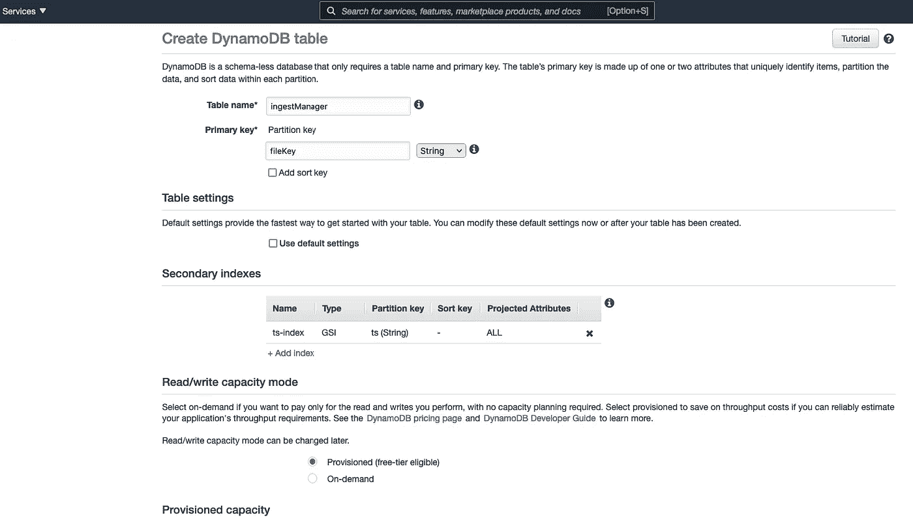

作者图片[💡迈克·沙克霍米罗夫](https://medium.com/u/e06a48b3dd48?source=post_page-----4f99fba92436--------------------------------)

*   将处理`successfull`事件的`logSuccessfulEvent`函数添加到`./app.js`文件:

因此，您应该会看到创建了一个新的摄取记录:

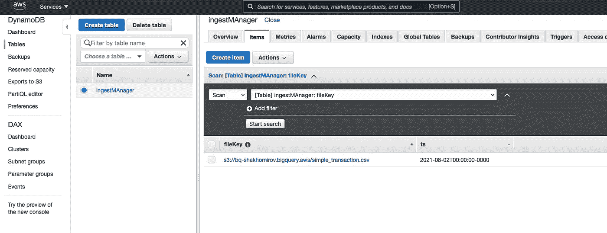

作者图片[💡迈克·沙克霍米罗夫](https://medium.com/u/e06a48b3dd48?source=post_page-----4f99fba92436--------------------------------)

现在，您可能想要添加一个新函数。姑且称之为`checkAlreadyIngested()`。

> *此函数将检查您的数据加载管道是否有任何复制企图，并防止这些复制企图。*

确保用`try, catch`块包裹即可。

# 如何监控 BigQuery 数据加载服务中的错误和复制尝试

…或者任何其他数据仓库。

您可能想在每次出现错误时收到通知。

*   使用简单通知服务(SNS)创建一个 **AlarmNotificationTopic** ，以便在出现任何摄取错误时通过电子邮件接收通知。
*   当您创建 Lambda 并附加策略时，它一定已经创建了一个 **LogGroupName** : `/aws/lambda/ingestManager`或类似的东西。使用它创建 **ERRORMetricFilter** ，其中*错误计数> 0* 。例如，我的日志组如下所示:

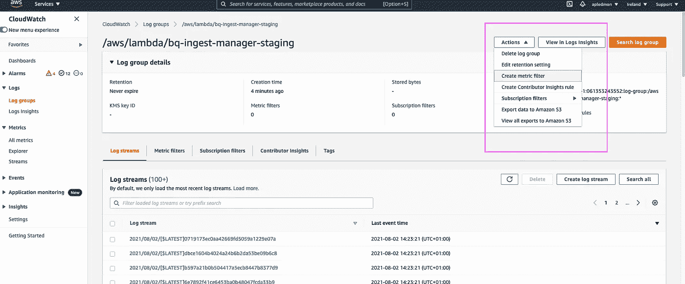

作者图片

*   使用以下模式创建一个 ERROR metric filter:filter pattern:' ERROR '调用它`ingestManagerStagingMetricFilter`

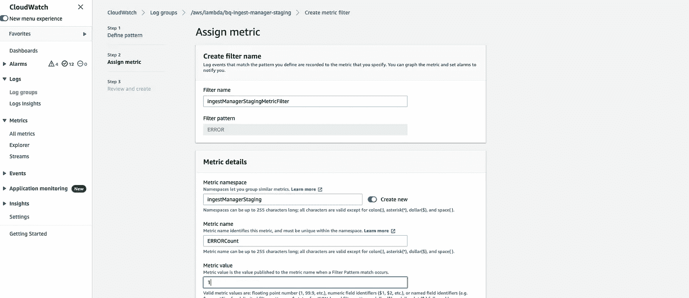

作者图片[💡迈克·沙克霍米罗夫](https://medium.com/u/e06a48b3dd48?source=post_page-----4f99fba92436--------------------------------)

*   现在去`SNS`创建你的提醒主题:

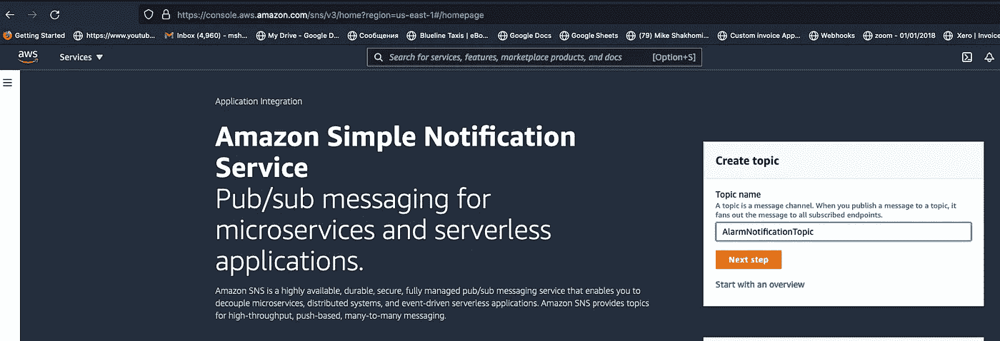

作者图片[💡迈克·沙克霍米罗夫](https://medium.com/u/e06a48b3dd48?source=post_page-----4f99fba92436--------------------------------)

*   单击创建订阅并输入您的电子邮件:

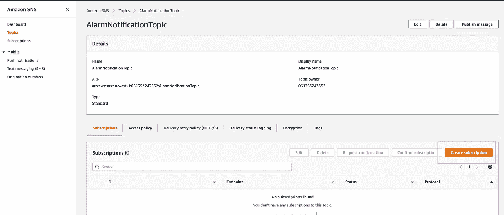

作者图片[💡迈克·沙克霍米罗夫](https://medium.com/u/e06a48b3dd48?source=post_page-----4f99fba92436--------------------------------)

*   最后创建[**ERROR metric alarm**](https://docs.aws.amazon.com/AWSCloudFormation/latest/UserGuide/aws-properties-cw-alarm.html)动作，当数字误差连续 5 分钟大于 5 时触发报警。它应该发送通知到您的社交网站的主题。

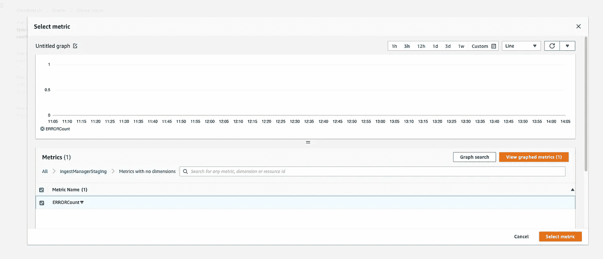

作者图片[💡迈克·沙克霍米罗夫](https://medium.com/u/e06a48b3dd48?source=post_page-----4f99fba92436--------------------------------)

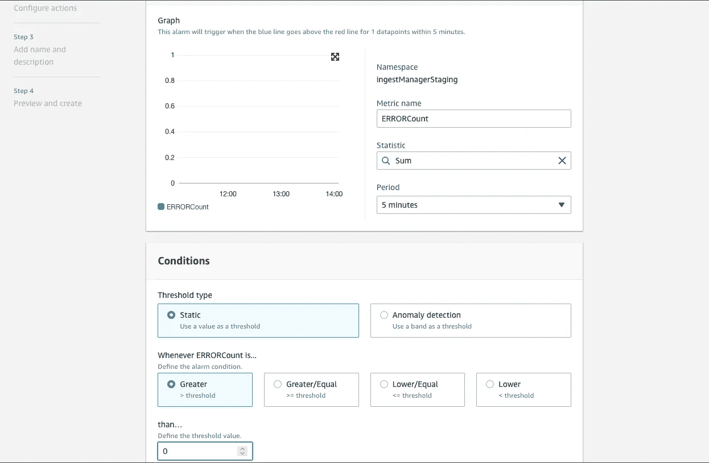

作者图片[💡迈克·沙克霍米罗夫](https://medium.com/u/e06a48b3dd48?source=post_page-----4f99fba92436--------------------------------)

*   选择遇到警报时发送通知的位置:

作者图片[💡迈克·沙克霍米罗夫](https://medium.com/u/e06a48b3dd48?source=post_page-----4f99fba92436--------------------------------)

*   在摄取管理器出错的情况下，期望的输出是一个通知:

作者图片[💡迈克·沙克霍米罗夫](https://medium.com/u/e06a48b3dd48?source=post_page-----4f99fba92436--------------------------------)

> *理想情况下，你会希望使用类似于****AWS cloud formation****的东西来管理你的* **基础设施，代码为** *。*

示例堆栈文件可以在本教程的 [Github 库](https://github.com/mshakhomirov/BigQuery-ingest-manager)中找到。

# 如何转换原始数据湖文件中的数据并为 BigQuery 做准备

自然地， **BigQuery** 可以使用 [**新行分隔的 JSON**](http://ndjson.org/) 或者其他已经正确形成的格式。因此，如果你正在加载`ndJSON`，那么它应该在那之前被新行分隔:

现在假设您有另一个服务从 ***MySQL 数据库*** 中提取数据，它的输出看起来像一个 JSON 对象数组:`[{...},{...},{...}]`。这些单独的 JSON 对象也可以深度嵌套。您可能希望将它转换成`nldj` : `'{...}'\n'{...}'\n'{...}'\n`，这样 BigQuery 就可以将它装载到表中。

或者想象你正在使用标准的**消防软管**输出，其中数据被写成一串`JSON`对象`{...}{...}{...}`。没有逗号。您可能需要为从***OBJECT _ STRING***到 ***SRC*** variant 格式的 **BigQuery** (转换为`nldj`)准备数据，即`{...}{...}{...}` > > > `'{...}'\n'{...}'\n'{...}'\n`。

看到里面的使徒了吗？这将把它定义为类型`STRING`，并且您需要创建一个只有一列的表:`name: "src", type: "STRING"`。

这可能是一个具有挑战性的任务，但我写了一些方便的助手函数。你以后会找到它们的。

> *因此，只需在您的* `*config*` *中添加文件格式规范，就可以定义处理逻辑并正确地将所有文件加载到****big query****中。*

例如，您可能希望在`yaml`配置中定义您的表，如下所示:

第一个名为`paypal_transaction`的`pipe`有一个单独 JSON 对象的数组(深度嵌套),您可能希望将每个单独的嵌套对象作为一个 JSON 记录插入，这样您就可以稍后在您的**数据仓库**中用`JSON_PARSE`函数**解析**它。

第二个管道`GeoIP2-Country-Blocks-IPv4`需要从 CSV 中解析出来，并插入到 **BigQuery** 表中，相关的模式有六列。这里您可能希望显式声明一个 **CSV 分隔符**来帮助 BigQuery 加载数据。

第三个表示一些配置不佳的 Kinesis 流输出，需要作为 JSON 插入，但必须首先为 BigQuery 做好准备(转换为 NLDJ 格式)。

第四个也需要作为 **NLDJ** 加载，但是它被压缩了，所以你想先解压缩它。

# 如何将压缩文件加载到 BigQuery

如果你的文件是压缩的，那么你会想先用`zlib`库解压它。您可能想要添加一个功能`loadGzJsonFileFromS3()`。因此，在本例中，我们首先**解压缩**文件，然后*将该流通过管道*传输到 **JSONparse** ，后者将提取我们需要的 JSON，并且*将*通过管道 **createWriteStream** 传输到 BigQuery。

> 用这种方法你可以非常有效地加载大文件。

在这个代码为的 [Github 库中有更多的例子，包括这些加载函数的分支。例如，一个名为`checkSourceFileFormatAndIngest()`的函数定义了如何转换数据格式的逻辑，然后将数据加载到 **BigQuery** 中。](https://github.com/mshakhomirov/BigQuery-ingest-manager)

> 在上面的例子中，我还使用了定制的 BigQuery jobIds。这是在 BigQuery 中防止重复的另一种方法。

> *在这种情况下你不需要****DynamoDB****但是我仍然使用并插入额外的度量，即插入 *的* **行数和一个*** **表名** *来生成统计数据。*

# 如何使用 AWS Cloudformation 部署服务

我不想用 **AWS 控制台**创建所有那些资源。 **AWS Cloudformation** 是一种简单的方法，只需点击一下鼠标，即可自动部署和配置所有资源。

> *除其他优势外，您会发现创建生产和试运行环境以及整理(删除)所有资源非常简单。*

> 这个教程实际上是免费的，那些工具不会花费你任何东西。

用代码在 [Github 库中检查。](https://github.com/mshakhomirov/BigQuery-ingest-manager)

在`./stack/cf-config.yaml`中，你会发现 **AWS Cloudformation** 模板描述了本教程可能需要的所有资源。包括例如 **AWS Lambda 角色**:

要在您的 **AWS 帐户**中部署服务，请转到`./stack`并在命令行中运行这两个命令:

那个`lambdas.bq-shakhomirov.aws`是你的服务工件的 S3 桶，你的 lambda 代码将保存在那里。换成你的。

# 如何一次将所有文件加载到 BigQuery 表中

当您需要在选定的时间范围内(即特定日期)将所有文件从数据湖中一次性`load / reload`到您的数据仓库中时，这种多文件上传功能可能会很有用。

> 如果需要，该服务必须能够扫描您的数据湖，并挑选符合您需要的描述和时间分区的文件。

假设您的数据湖有来自不同来源的文件保存在 **AWS S3** 中，具有 ***关键字*** 前缀，其中包含**大查询** `table name`和`date`分区，即:

所以在这里，您会希望您的服务扫描数据湖桶，并只选择与这三个`pipes` : `paypal_transaction`、`simple_transaction`和`some-other-transaction`相关的文件，并带有日期前缀`2021/10/04`。

然后，您会希望**摄取管理器**生成一个最终的`payload`，其中包含找到的所有文件密钥，并将它们加载到 BigQuery 中。

> `./test/data.json`的最终`payload`应该在数据湖中找到所有文件:

> 在你的本地文件夹中有了这个 `*payload*` *你就可以在你的命令行中运行* `*$ npm run test*` *(如果你的有效负载在* `*./test/data.json*` *)你的微服务会把这些文件一个一个的加载到****big query****中。*

我在我的`./package.json`中添加了脚本来运行这些命令。

1.  例如，如果我在命令行中运行`$ npm run test-service`，那么`./loadTestIngestManager.js`中的应用程序将使用`test/integration/loadTestPipelines.json`中的**管道定义**扫描数据湖，并生成一个包含所有找到的文件的输出。它会将其保存到`test/integration/loadTestPayload.json`。
2.  然后，如果我运行`$ npm run test-load` `./app.js`，摄取管理器将使用文件的有效负载，并将它们发送到 **BigQuery** 。

> 使用这些脚本，您可以轻松地为加载到 BigQuery 中的文件和格式编写集成测试。

您可能注意到上面的`payload.json`与`original S3 Obj created`事件负载略有不同:

那只是因为在我的环境中，我有另一个由`S3 Obj created`事件触发的`orchestrator`服务，它将为`ingest-manager`创建有效负载。该服务可以执行您需要的任何其他功能，并且它会在需要时`invoke` **摄取管理器**。

随意调整**摄取管理器**的有效载荷。您可能希望在`processEvent()`函数中为`event`处理添加`S3`键。

# 结论

您刚刚学习了如何为用 Node 编写的 BigQuery 创建一个简单可靠的摄取管理器。带有一些 ***牛逼功能*** 的 JS:

*   无服务器设计和 *AWS Lambda 功能*。
*   非常**性价比**。针对**批量加载作业**进行了优化，这意味着您无需为数据加载付费。基本上它是免费的，但检查 BigQuery 负载作业限制。
*   可以使用*流式*插入(BigQuery 流式加载)。
*   为 **AWS** 量身定制但可以轻松迁移到 ***GCP，Azure*** 。
*   ***用 AWS Cloudformation 构建的代码为*** 的基础设施。在任何其他 AWS 帐户中一键部署。
*   使用 AWS Dynamo 进行有效的负载作业监控和文件重复处理。
*   自定义 BigQuery 作业 id。如果你不想使用 Dynamo，另一个防止复制的方法是。
*   支持单元和集成测试。

许多人认为 Python 是完成这项任务的最佳选择，但是我不同意。所有的选择都是好的，只要他们能完成工作。以前我写过如何用 Python 写代码，Python 是我最喜欢的编程语言之一。我的大部分生产管道都是用 **Python** 或 **Java** 编写的。

> 我的观点是你不应该限制自己。

本教程不是关于编程语言或它们的具体应用。我确实认为数据只适用于 Python/Java 这种陈词滥调。当我看到不使用 SQL(或者不知道如何使用)的数据科学家时，我也很沮丧。

这个项目是关于**数据工程**、现代数据堆栈、跳出框框思考、自我学习、定制、语言不可知**以及能够用非常规方法达到预期结果。**

## 资源

[1]:[https://docs . AWS . Amazon . com/CLI/latest/user guide/CLI-services-S3-commands . html # using-S3-commands-managing-buckets-creating](https://docs.aws.amazon.com/cli/latest/userguide/cli-services-s3-commands.html#using-s3-commands-managing-buckets-creating)

[2]:https://cloud.google.com/docs/authentication/production

[3]:[https://github.com/dominictarr/JSONStream](https://github.com/dominictarr/JSONStream)

[4]:[https://cloud . Google . com/big query/docs/reference/rest/v2/Job # JobConfigurationLoad](https://cloud.google.com/bigquery/docs/reference/rest/v2/Job#JobConfigurationLoad)

[5]:[https://Google APIs . dev/nodejs/big query/latest/table . html # create write stream](https://googleapis.dev/nodejs/bigquery/latest/Table.html#createWriteStream)

[6]:[https://aws.amazon.com/dynamodb](https://aws.amazon.com/dynamodb)

[7]:[https://docs . AWS . Amazon . com/AWS cloudformation/latest/user guide/AWS-properties-CW-alarm . html](https://docs.aws.amazon.com/AWSCloudFormation/latest/UserGuide/aws-properties-cw-alarm.html)

[8]:[https://AWS . Amazon . com/blogs/security/how-to-create-an-AWS-iam-policy-to-grant-AWS-lambda-access-to-an-Amazon-dynamo db-table/](https://aws.amazon.com/blogs/security/how-to-create-an-aws-iam-policy-to-grant-aws-lambda-access-to-an-amazon-dynamodb-table/)

【9】:【https://aws.amazon.com/cloudformation/ 

【10】:[http://ndjson.org/](http://ndjson.org/)

【11】:[https://cloud.google.com/bigquery/quotas](https://cloud.google.com/bigquery/quotas)

[12]:[https://stack overflow . com/questions/7985599/notification-of-new-S3-objects](https://stackoverflow.com/questions/7985599/notification-of-new-s3-objects)

[13]:[https://medium . com/swlh/loading-data-into-big query-from-cloud-storage-complete-guide-e 212 F5 C2 db 6](https://medium.com/swlh/loading-data-into-bigquery-from-cloud-storage-complete-guide-e212f5c2db6)

[14]:[https://towards data science . com/monitoring-your-big query-costs-and-reports-usage-with-data-studio-b 77819 ffd 9 fa](/monitoring-your-bigquery-costs-and-reports-usage-with-data-studio-b77819ffd9fa)

[15]:[https://towardsdatascience . com/extract-data-from-paypal-API-c25c 76748746？gi=e76b91a696e](/extract-data-from-paypal-api-c25c76748746?gi=e76b91a696e)* 

**原载于 https://mydataschool.com***。***