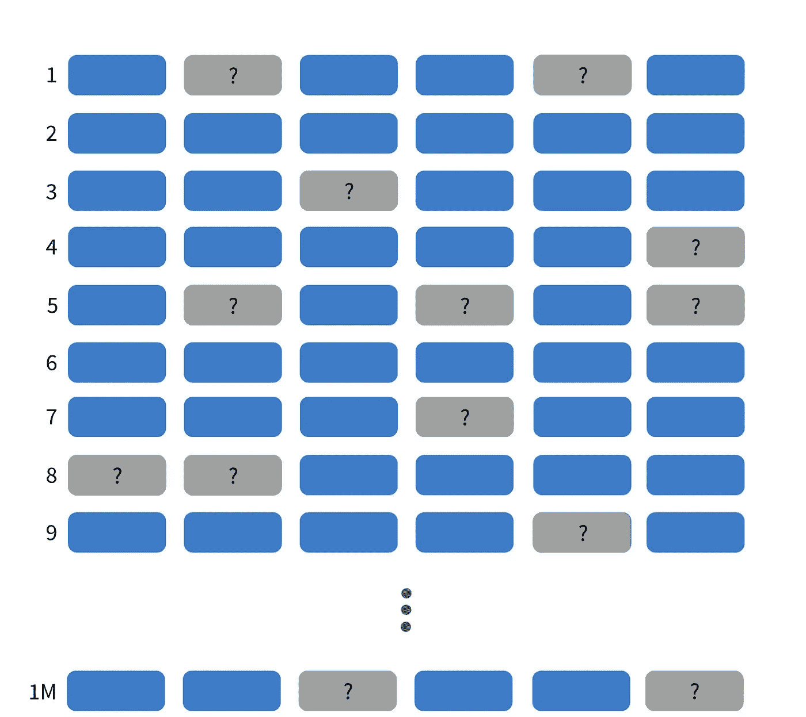
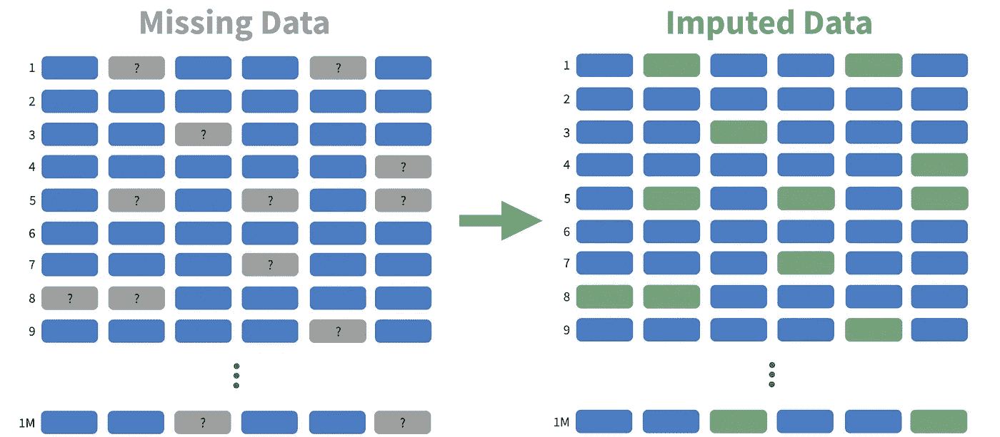
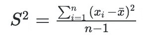
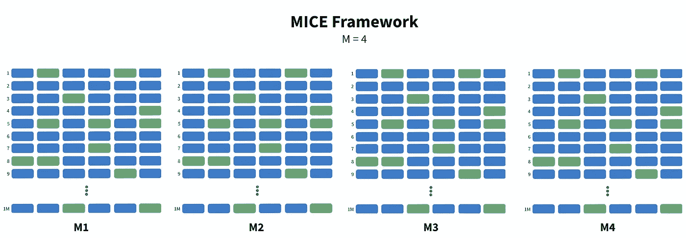
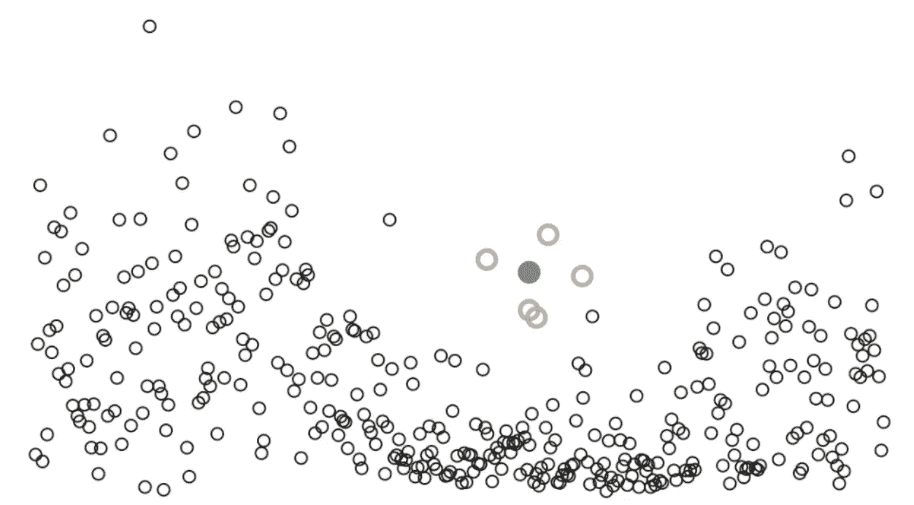

# 如何处理丢失的数据

> 原文：<https://towardsdatascience.com/how-to-handle-missing-data-b557c9e82fa0?source=collection_archive---------16----------------------->

## 使用 XGBoost 的最快多重插补方法

丢失数据太糟糕了。它阻止了某些模型的使用，并且经常需要工程师进行复杂的判断。然而，在 2021 年，奥克兰大学的研究人员开发了一种解决方案…

图 1:大型数据集的缺失数据。图片作者。

他们的方法利用世界闻名的 XGBoost 算法来估算缺失数据。依靠一个针对速度优化的模型，我们可以看到相对于传统插补方法 10-100 倍的性能提升。XGBoost 还几乎不需要超参数调整，这大大减少了工程师的工作量。XGBoost 还能够维护数据中观察到的复杂关系，比如交互和非线性关系。

因此，如果数据集超过 3000 行，您可以考虑使用 XGBoost 来估算缺失数据。下面是该方法的工作原理…

# 技术 TLDR

1.  **使用 XGBoost 进行多重插补。**它是在 MICE 框架中实现的——我们不使用线性/逻辑回归，而是使用 XGBoost。
2.  **使用预测均值匹配(PMM)来改善我们的方差估计。** PMM 是必需的，因为 XGBoost 低估了估算数据的方差，导致置信区间的覆盖范围很小。

# 好的，这很好，但是这个方法实际上是如何工作的呢？

我们稍微慢一点，理解一下为什么这个方法这么有效。

## 我们的目标

首先，从我们的目标开始。许多真实世界的数据集都有缺失数据，这会给建模和分析带来问题。为了让我们的生活更轻松，我们将尝试用现实的预测来填补那些缺失的价值。

图 2:大型数据集缺失数据插补可视化。图片作者。

填充缺失数据的一种常用方法是简单地输入平均值、中值或众数。然而，正如你所料，我们获得的信号很少，而且这些估计的方差往往太低。

## 方差的重要性

但是我们为什么要在乎呢？嗯，方差是所有统计显著性和置信区间计算的基础。

基于中心极限定理，我们知道许多样本的平均值将类似于正态分布。如果我们观察一个样本，它的平均值远离这个理论分布(总体)的中心，我们可以认为这是极不可能的，因此具有统计学意义。并且，我们**不会**称之为统计显著的范围被称为我们的置信区间。

图 3:样本方差公式。图片作者。

为了估计这一理论总体的分布，我们使用数据的标准差，即数据方差的平方根，如图 3 所示。因此，方差是所有基于信心的计算的基础。

## 估算数据的方差

当输入数据时，我们希望使用观察到的数据来估计未观察到的数据。如果我们有一个完美的代表性样本，我们可以完美地估算缺失数据。然而，样本从来都不是完美的，经常会丢失关于丢失数据的关键信息。

由于这个事实，大多数数据插补方法低估了缺失数据的方差。

现在，以正确的方式系统地引入方差真的很难。一种简单的方法是简单地给每个估算值添加一些随机噪声。这肯定会使我们的数据更加多样化，并可能增加方差。但是，这种均匀分布的噪声可能并不代表我们的总体。

这就是*mixb*的用武之地…

# 该方法

奥克兰大学的研究人员提出的方法使用流行的建模技术 *XGBoost* 和预测均值匹配(PMM)来估算数据。让我们依次看一看每一个。

## 1—MICE 框架中的 XGBoost

XGBoost 是一种非常流行的基于树的算法，因为它速度快，通用性强，并且具有开箱即用的准确性。评论中有一个惊人的解释，但对于这篇文章，你可以把 XGBoost 想象成一个黑盒，它接收预测值并输出我们缺失数据的估计值。

另一方面，我们将讨论 MICE 框架。MICE 代表通过链式方程的多重插补。没有听起来那么糟糕。

图 4:具有 4 个插补集的 MICE 框架。图片作者。

MICE 的工作方式是创建数据的 M 份副本。然后，它依次遍历第一个复制的数据集中的列(图 4 中的 M1 ),并使用线性模型来预测缺失的值。预测值是该行中的所有其他变量。然后 MICE 对其余的 *M* 数据集重复这个过程，产生 M 个完整的数据集。

从那里，我们取所有 *M* 数据集的每个指数值的平均值，这些平均值成为我们的最终估算数据集。

现在，如果你仔细观察，你会发现所有的数据集都是一样的。因此，为了给外观自然的变化，我们只是添加一些随机噪声到每个预测。

很直接，对吧？

现在，线性回归有其局限性——它不允许非线性关系，并且需要人工干预来处理交互。XGBoost 在非线性关系和交互方面都很棒，所以我们只是使用 XGBoost 而不是线性回归来预测我们的缺失数据。

## 2 —预测均值匹配处理低方差

现在，XGBoost 受限于我们给它的数据，所以它经常低估我们预测的方差。为了增加方差，我们实施了一种称为预测均值匹配(PMM)的方法。

图 5:二维预测平均匹配。图片作者。

PMM 随机选择五个最接近我们预测的观察数据点之一。因此，在上面的图 5 中，绿点是我们的预测值，它周围突出显示的圆圈是我们的预测将成为的候选值。

通过用观察到的数据点替换预测，我们确保引入的方差与我们总体中的方差具有相同的结构。

我们对所有预测值重复这一过程，直到我们用预测值附近的观察数据点替换了所有空的数据点。

## 摘要

现在，你知道了。快速总结一下…

*   XGBoost 是一种高性能算法，可以对数据中的复杂关系进行建模。
*   *mixgb* 包利用 XGBoost 来估算缺失数据。
*   为了确保我们可以计算准确的置信区间，我们使用预测均值匹配来增加估算数据的方差。

# 实施说明

*   在更小的数据集上，XGBoost 在计算速度上更胜一筹。主要的竞争来自于[随机森林实现](https://www.rdocumentation.org/packages/missRanger/versions/2.1.1/topics/missRanger)，但是 XGBoost 在大于 3000 X 20 的数据集上表现更好。
*   对 PMM 来说，有几种不同的方法，但没有一种方法局限于 5 人的捐献者人数。其他常见的值有 2、3 和 10。
*   目前，我还不知道有哪个 python 包支持这种方法。
*   在论文中，我们开始看到 mixgb 在 3915 x 20 数据集上在计算速度方面优于所有其他方法。对于所有较大的数据集，XGBoost 是明显的赢家。

*感谢阅读！我会再写 39 篇文章，把学术研究带到 DS 行业。查看我的评论，链接到这篇文章的主要来源以及 R 包。*