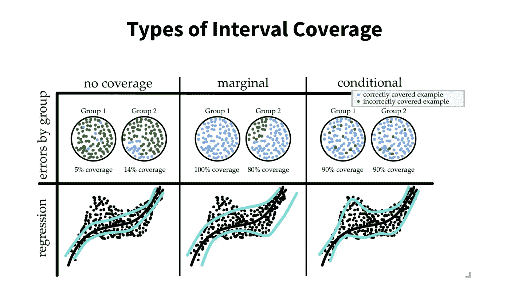
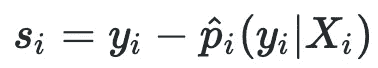
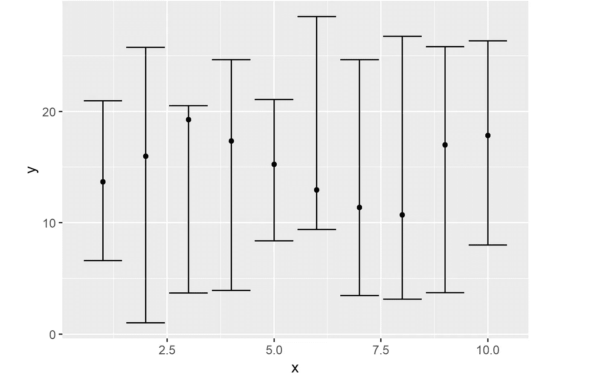
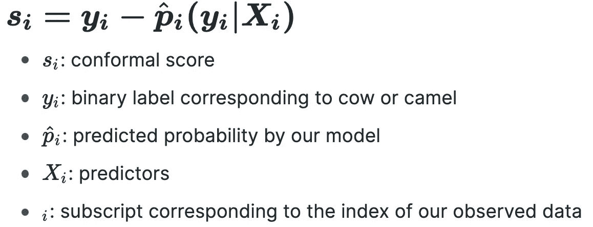
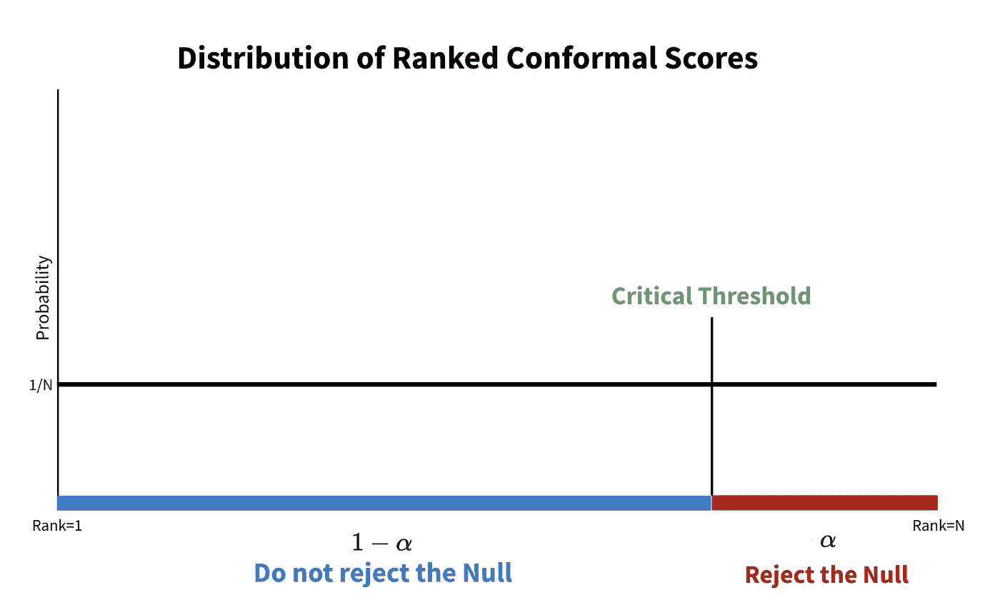
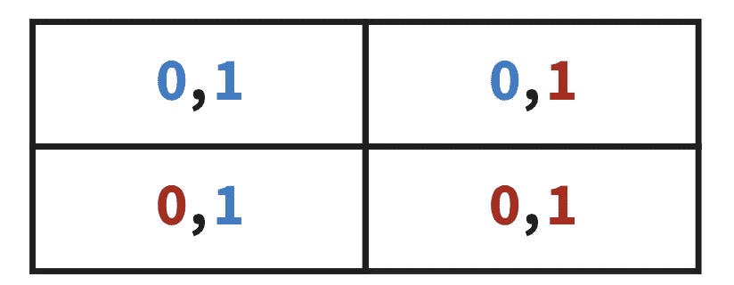

# 如何处理预测中的不确定性

> 原文：<https://towardsdatascience.com/how-to-handle-uncertainty-in-forecasts-86817f21bb54?source=collection_archive---------14----------------------->

## [实践教程](https://towardsdatascience.com/tagged/hands-on-tutorials)

## 对保形预测的深入研究。

每当我们做预测时，我们的估计都有不确定性。例如，让我们考虑一个柠檬水摊位，该摊位希望预测需求。如果预测非常准确，就可以采取行动，他们可以优化他们的柠檬购买策略。另一方面，如果预测有很大范围的可能值，那就没用了。

图 1:不同水平的预测区间覆盖的例子— [src](https://arxiv.org/pdf/2107.07511.pdf) 。顶行显示分类，底行显示回归预测任务。“有条件的”覆盖是最稳健的。图片作者。

在[2017 年的一篇论文](https://www.stat.cmu.edu/~ryantibs/papers/conformal.pdf)中，卡耐基梅隆大学的研究人员解决了这个问题。他们证明了在最小假设的情况下，保形预测保证了正确的覆盖率。这个证据适用于小规模的数据集。不确定性很重要的主题，如自动驾驶汽车的物体检测，确实可以从这种方法中受益。然而，尽管保形预测已被证明是有效的，但它仍是一种相当不成熟的方法，还没有被 DS 工业广泛采用。

下面，我们将概述它是如何工作的，并提供一些实现说明...

# 技术 TLDR

保形预测保证了仅使用可交换性假设的预测的α水平覆盖，不需要 IID 数据。这是通过使用样本外*校准集*创建共形分数分布来实现的。请注意，这些保形分数本质上是基于条件概率的残差，见图 2。

图 2:共形分数的公式。图片作者。

从有序共形分数的分布中，我们找到什么分位数对应于我们的置信水平( *α* )。然后，我们使用该分位数来确定保证 *1-α* 覆盖的预测区间，而不考虑 IID 数据或正确的模型。

# 但是，保形预测实际上是如何工作的呢？

好吧，那是很多。让我们慢下来，真正明白发生了什么。

## 预测区间的背景

首先，我们来讨论一下预测区间及其问题。

简而言之，[预测区间](https://www.statisticshowto.com/prediction-interval/)是预测值的置信区间，即我们预计未来预测的大部分将落在该范围内。

图 3:假数据 95%预测区间的例子— [src](https://statisticsglobe.com/draw-plot-with-confidence-intervals-in-r) 。图片作者。

在图 3 中，我们可以看到一些假数据的预测区间的例子。每个数据点上方和下方的水平线对应于 95%的预测区间范围— **我们未来预测的 95%将落在该范围内。**

不幸的是，预测间隔通常需要几个假设。一些例子包括独立同分布(IID)数据以及正确指定的模型。如果您真的关心准确的预测区间覆盖率，这些假设可能会有问题。

那么保形预测带来了什么呢？

## 保形预测缺乏假设

保形预测只需要一个叫做[互换性](https://stats.stackexchange.com/questions/3520/can-someone-explain-the-concept-of-exchangeability)的假设。**可交换性是指数据的任何排序都同样可能发生。**

对于熟悉 IID 假设的人来说，这是“ID”部分——可交换数据相对于预测值是同分布的。

**由于只需要一个假设，保形预测可以说是开发预测区间的最具统计稳健性的方法。**

# 该方法是如何工作的？

让我们从一个二元分类的例子开始。从这里开始，我们将把概念扩展到多类分类以及预测连续变量。

图 4:我们的二元分类目标是确定一幅图像显示的是一头牛还是一头骆驼。图片作者。

如图 4 所示，我们希望确定一幅图像显示的是骆驼还是奶牛。如果我们认为图像显示的是一头牛，我们将预测 y=1，如果我们认为图像显示的是一头骆驼，我们将预测 y=0。

## 步骤 1-创建一个共形分数分布

在我们的第一步中，我们开发了训练/测试分割，并使用训练数据拟合分类模型。假设我们使用逻辑回归。拟合模型后，我们使用测试集(称为*校准集*)开发因变量(奶牛对骆驼)的概率预测。

**在这一阶段，我们有了校准集中每个观察值的预测概率向量。**

从那里，我们使用每个预测的概率计算共形分数。图 5 中定义了保形分数的公式。

图 5:包含每个变量定义的共形分数公式。图片作者。

**共形分数可以认为是非共形分数。**它们取值在-1 和 1 之间，越接近任一极端，就越偏离观察到的标签。请注意，我们经常使用绝对值，因为我们只关心不符合的程度，而不是方向。

**在获得我们校准集中所有标签的共形分数后，我们将共形分数的绝对值从低到高排序。**

## 步骤 2-创建预测间隔

有了保形分数的分布，我们可以将这个概念与预测区间联系起来。

如前所述，预测间隔要求工程师指定一个假阳性率( *α* )，通常为 0.05 或 0.01。为了找到我们的预测区间的上限和下限，我们找到对应于 *α的分布中的分位数。*

图 6:通过预测二元类的概率找到的分级共形分数的示例分布。图片作者。

在图 6 中， *α-* 水平分位数由标有绿色“临界阈值”的垂直线表示。x 轴对应于一组有序的共形分数。假设他们有 500 人。蓝色和红色的交叉点，即“临界阈值”，是百分位数 *1-α* 。因此，如果 *α* 为 0.1，那么统计显著性的截止值将是第 90 百分位的一致性分数，例如第 450 一致性分数。

**蓝色的适形分数没有统计学意义。它们在我们的预测区间内。非常大的共形分数(红色)表示与真实标签的高度偏离。这些适形评分具有统计学意义，因此超出了我们的预测区间。**

还要注意，我们推导出每个标签的分位数截止值。

## 步骤 3-估计每个标签的概率

从这里开始，对于每一次观察，我们确定成为牛、骆驼、两者或都不是的概率。这是怎么做到的？

嗯，对于每个观察，我们计算每个标签的共形分数，例如骆驼和母牛。从那里，我们确定每个适形分数是否超过其相应的临界阈值。**如果超过阈值，我们认为它在统计上是显著的，因此是错误的。如果不是，我们认为这是真的。**

图 7:分类矩阵。蓝色和红色的值分别对应于非 stat-sig 和 stat-sig 预测。作者图片

我们的二元分类问题有四种可能的结果，如图 7 所示。红色表示预测在统计上有意义，蓝色表示没有意义。这里，**统计显著性意味着预测是假的，缺乏统计显著性意味着预测是真的。**

让我们依次看看每个单元格…

*   **左上角**:两个标签都*不*具有统计显著性的预测。在这里，模型预言**这两个阶级都是真正的阶级。**
*   **右下**:两个标签都具有统计显著性的预测。在这里，模型预测**这两个类都不是真正的类。**
*   **右上**:所有 camel 标签(0)都*不*具有统计显著性的预测。在这里，模型预测 **camel 才是真正的类。**
*   **左下**:所有奶牛标签(1)都*不*具有统计显著性的预测。在这里，模型预测**牛才是真正的类。**

这一步可能有点违反直觉。一个模型怎么能预测一个以上的类甚至根本没有类呢？

让我们采取一种直观的方法。简单的二进制分类模型找出哪个类的概率最高，并将其确定为预测。但是有了保形预测，我们可以让模型说两者都不是或者都不是真正的标签。实际上，模型可以说“我不知道”

因为我们不强迫模型做出预测，所以我们在预测集中得到了更可靠的预测。

并且，**我们的 *1-α* 预测集只有一个预测，即右上角和左下角的单元格。**

# 扩展到更复杂的标签

既然我们已经理解了保形预测对于二元分类是如何工作的，那么这个概念就可以很容易地扩展到多级分类。在第 3 步中，我们发现被标记为 *1，0，两者皆是，*或*都不是*的概率，我们只是对三个级别而不是两个级别进行相同的操作。

从概念上讲，这是一个简单的下一步，但计算上的复杂性呈指数增长，因此对具有许多级别的标签进行保形预测并不总是一个好主意。

对于连续变量，有几种方法，但最简单的是预测分位数而不是平均值。如前所述，我们可以将共形分数视为残差:真实的 *y* 减去预测的 *y* 。然而，与分类变量不同，我们没有固定数量的标签可供尝试。

因此，对于连续标签，我们尝试预测有限数量的不同分位数，并查看它们在哪里变得具有统计显著性。对于处于统计显著性边缘的值，我们认为它们是 *α-* 水平预测区间。请注意，[分位数损失](https://www.evergreeninnovations.co/blog-quantile-loss-function-for-machine-learning/)可以添加到几乎任何建模损失函数中，这就是为什么它被称为“最简单的”

如果你想了解更多，这里有[一个非常好的资源](https://arxiv.org/pdf/2107.07511.pdf)，可以在连续变量上使用保形预测。

现在你知道了！全盛时期的共形预测。

# 摘要和实施说明

为了深入理解这些概念，让我们总结一下。

保形预测是开发预测区间的最少假设的方法。因此，这是最普遍的防御方法。它还适用于小样本数据集，可以产生更精确的预测区间/集合。

该方法利用共形分数的分布来开发标记的任何组合为真的概率的排列。如果预测的概率足够低，即保形分数足够大，我们认为它在我们的预测区间之外。然后，这些排列用于开发连续变量的预测区间或分类变量的预测集。

这种方法仍然没有得到太多的关注，但它对预测建模有着巨大的潜力。

*感谢阅读！我会再写 36 篇文章，把学术研究带到 DS 行业。查看我的评论，链接到这篇文章的主要来源和一些有用的资源。*