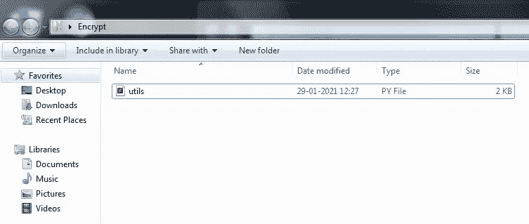
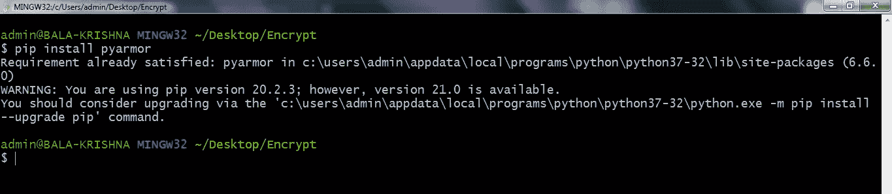
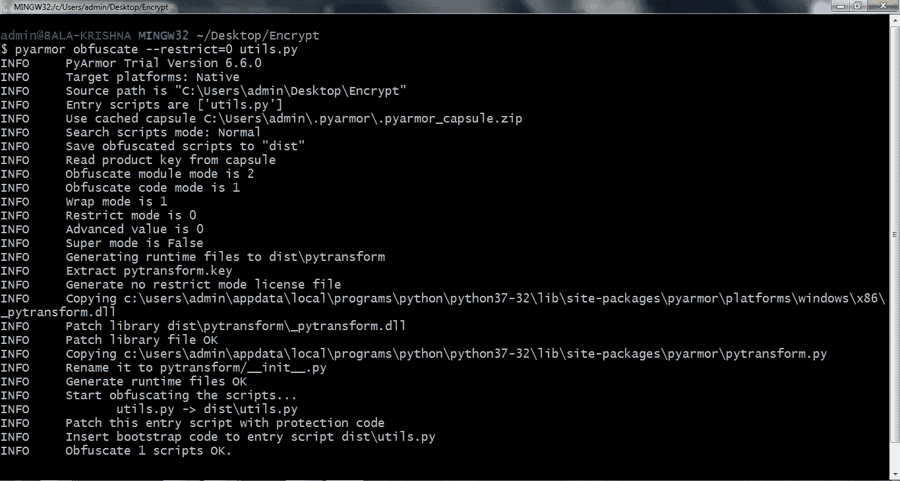
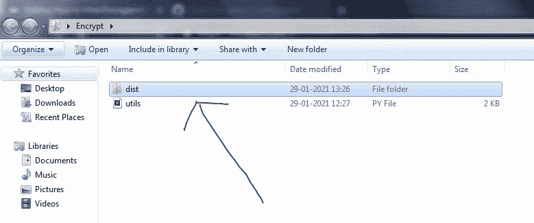
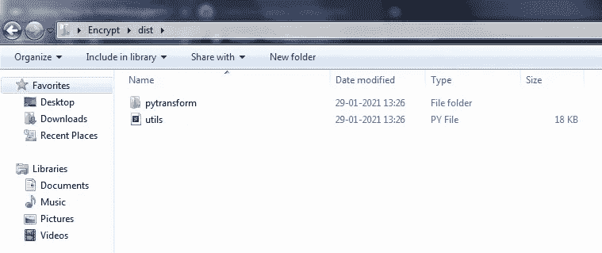
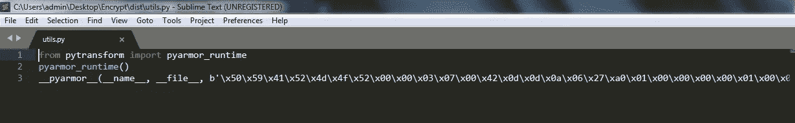
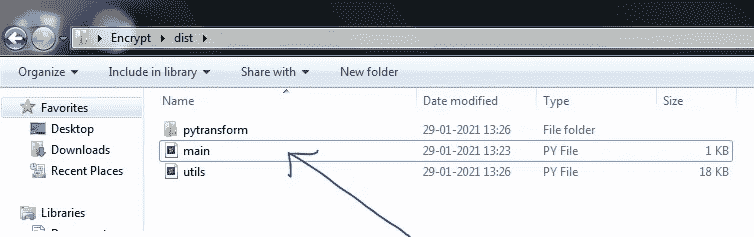
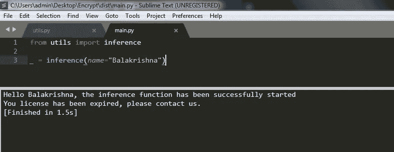

# 如何隐藏/加密/混淆任何 Python 程序

> 原文：<https://towardsdatascience.com/how-to-hide-encrypt-obfuscate-any-python-program-51beea81571f?source=collection_archive---------3----------------------->


约翰·萨尔维诺在 [Unsplash](https://unsplash.com?utm_source=medium&utm_medium=referral) 上拍摄的照片

出于混淆的目的，我们将使用一个名为 pyarmor 的 python 包。

我们有时可能会面临这样的情况，由于显而易见的原因，我们需要直接向客户提供代码，但是这样做，我们将失去对代码的控制。在这种情况下，我们可能会加密代码来保护它，保留控制权，并添加一些回退条件来控制我们的依赖性，就像我们提供的代码只能在一定时间内使用一样。

为了解决上述问题，我将演示一个具有上述功能的简单函数。我们将使用名为“pyarmor”的 python 库。

# 目录:

1.  [创建一个简单的函数](#eb97)
2.  [使用 pyarmor 对其进行加密](#1c50)
3.  [导入我们的函数/推理](#03eb)

# 1.创建简单的函数

对于我们的实现，我将使用带有推理函数定义的 utils.py，稍后将对它进行加密。

推理函数非常简单，不需要任何解释。

将它保存在一个文件夹中。



# 2.用 pyarmor 加密它

现在，我们将通过运行以下两个命令来加密它。

```
pip3 install pyarmor # pip/pip3# Syntax : pyarmor obfuscate --restrict=0 <filename>pyarmor obfuscate --restrict=0 utils.py
```



1.安装软件包



2.加密 utils.py 函数

现在，如果您看到包含实际 utils.py 文件的文件夹，将会创建一个名为 dist 的新的子文件夹。



在左边的 utils.py(原始文件)和右边的 dist 文件夹中，我们有(加密的)utils.py 文件

让我们看看里面的东西。



dist 子文件夹中的加密 utils.py 文件

# 3.导入我们的函数/推理

完成后，到现在为止，让我们尝试将这个加密的 utils.py 导入到一个名为 main.py 的新 python 文件中，这个文件是在 dist 文件夹中创建的。

pyarmor 负责在运行时解密 utils.py 所需的密钥，这些密钥存在于 pytransform 文件夹中，因此我们的代码在别人看来完全不可读。

但是如果您希望修改原始的 utils.py 代码，那么您必须从第 1 步开始，并遵循相同的步骤来完成。



main.py 文件中内容，

```
# Import the inference function definition inside the utils.py filefrom utils import inference_ = inference(name="Balakrishna")
```

在运行上面的代码行时，我们得到了基于 utils.py 文件配置的输出。



最终输出。

# 结论:

这仅仅是开始。如果你想真正保护和销售你的代码，考虑添加一个嵌入虚拟日期的实际许可证。超过该日期后，它将不再运行该程序，并抛出一个许可证到期错误。幸运的是 pyarmor 也有。我在下面的参考资料中添加了与许可相关的文档。您甚至可以设置一个条款，在许可过期后自动发送电子邮件，并且您可以使用 python 中的 SMTP 服务与您的客户端取得联系。

如果你有很多。py 文件导入或作为依赖项，必须使用—递归命令行而不是— restrict 命令，代码才能工作。

此外，这种实现可以在 Windows 和基于 Ubuntu 的操作系统中完成。

# 参考资料:

完整的代码实现可从以下网址获得:

**@*GitHub***

[](https://github.com/bala-codes/Code-Encryption-Obfuscation---Python) [## bala 代码/代码加密混淆 Python

### 此时您不能执行该操作。您已使用另一个标签页或窗口登录。您已在另一个选项卡中注销，或者…

github.com](https://github.com/bala-codes/Code-Encryption-Obfuscation---Python) 

## 皮铠甲:

1.  【https://pypi.org/project/pyarmor/ 
2.  [https://github.com/dashingsoft/pyarmor](https://github.com/dashingsoft/pyarmor)
3.  [https://pyarmor.readthedocs.io/en/latest/](https://pyarmor.readthedocs.io/en/latest/)
4.  [https://py armor . readthe docs . io/en/latest/usage . html # generating-license-for-obfuscated-scripts](https://pyarmor.readthedocs.io/en/latest/usage.html#generating-license-for-obfuscated-scripts)
5.  [https://docs.python.org/3/library/smtplib.html](https://docs.python.org/3/library/smtplib.html)