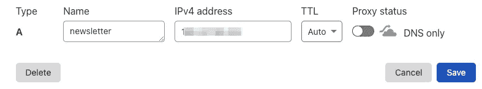
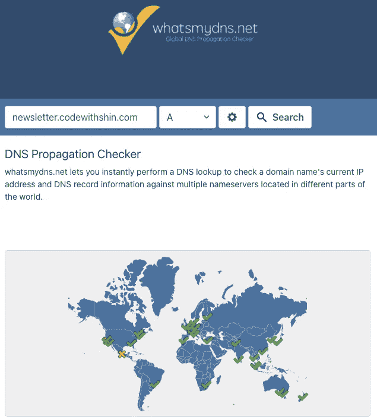

# 如何用 Apache 虚拟主机托管多个网站

> 原文：<https://towardsdatascience.com/how-to-host-multiple-website-with-apache-virtual-hosts-4423bd0aefbf?source=collection_archive---------0----------------------->

## 使用 Ubuntu 20.04 托管网站，包括子域


照片由[克里斯蒂娜@ wocintechchat.com](https://unsplash.com/@wocintechchat?utm_source=medium&utm_medium=referral)在 [Unsplash](https://unsplash.com?utm_source=medium&utm_medium=referral) 上拍摄

# 介绍

Apache 的虚拟主机可以在一台服务器上运行多个网站。在这篇文章中，你将学习如何托管多个网站，包括子域。

我的 Ubuntu 20.04 服务器在`/etc/apache2/sites-available`目录下有一些文件。我们将在该目录中创建更多文件，以创建多个虚拟主机。

```
$ ls /etc/apache2/sites-available
000-default.conf       000-default-le-ssl.conf  default-ssl.conf
000-default.conf.dpkg-dist
```

# 创建新的虚拟主机

让我们为`example.com`创建一个虚拟主机。(你需要把 example.com 改成你的域名。我们把文件存放在`/var/www/example.com/public_html`目录下。如果你想使用 Git 部署你的网站，请参考本文“ [**如何创建一个 Git Hook 推送到你的服务器和 Github Repo**](/how-to-create-a-git-hook-to-push-to-your-server-and-github-repo-fe51f59122dd) ”。

## 步骤 1 —创建一个配置文件

复制`000-default.com.conf`在`/etc/apache2/sites-available`新建一个文件:

```
$ cd /etc/apache2/sites-available
$ sudo cp 000-default.com.conf example.com.conf
```

## 步骤 2-修改新的配置文件

在`example.com.conf`中:

第 2 行:为 ServerAdmin 添加您的电子邮件。第 4 行:将 www 添加到 ServerAlias 的域名中。
第 5 行& 6:添加 DocumentRoot 的文件目录。

## 步骤 3 —启用虚拟主机

`a2ensite`启用`apache2`配置中的指定站点。它在`/etc/apache2/sites-enabled`中创建一个符号链接(不支持站点)。

```
$ sudo a2ensite example.com.conf
```

上面的命令将在`/etc/apache2/sites-enabled`目录中创建一个符号链接`example.com.conf`。

## 步骤 4—启用 SSL

```
$ sudo certbot --apache -d example.com -d www.example.com
```

这将在`/etc/apache2/sites-available`中查找相同的文件名。如果找不到，它会要求您选择 conf 文件。

这将创建`example.com-le-ssh.conf`。

## 步骤 5—重新启动 apache

```
$ sudo systemctl restart apache2
```

如果您的 DNS 配置正确，您应该能够看到您的域。

# 子域

我们将为一个子域创建一个虚拟主机。该过程与上一节相同。

我们将 web 文件存储在`/var/www/newsletter.example.com/public_html`中。

我们复制`000-default.com.conf`来创建一个新文件`newsletter.example.com.conf`。

```
$ sudo cp 000-default.com.conf newsletter.example.com.conf
```

编辑`newsletter.example.com.conf`:

与前一个示例的不同之处在于向 ServerName、ServerAlias、DocumentRoot 和 Directory 添加了一个子域。

## 启用虚拟主机和 SSL

让我们为这个子域启用虚拟主机和 SSL。

```
sudo a2ensite newsletter.example.com.conf
sudo certbot --apache -d newsletter.example.com -d www.newsletter.example.com
```

## 向 DNS 服务添加记录

如果您使用的是 namecheap.com，请转到域列表>高级 DNS 并添加新记录。

可能需要 24-48 小时。



## 重新启动 apache

```
$ sudo systemctl restart apache2
```

## 确认您的 DNS

使用[https://www.whatsmydns.net/](https://www.whatsmydns.net/)检查您的 DNS。如果您配置正确，它会显示您的 IP 地址。



# `etc/apache2/sites-available`

现在您在`sites-available`目录中有了以下文件。

```
ls /etc/apache2/sites-available/
000-default.conf              000-default.conf.dpkg-dist
default-ssl.conf              000-default-le-ssl.conf 
example.com.conf              example.com-le-ssl.conf 
newsletter.example.com.conf   newsletter.example.com-le-ssl.conf
```

`xxxx-le-ssl.conf`文件用于您的 SSL。

# 如何删除虚拟主机

使用`a2dissite`命令禁用现有的虚拟主机。

```
$ sudo a2dissite 000-default.conf
$ sudo a2dissite 000-default-le-ssl.conf
```

在这里，您正在禁用`000-default.conf`及其 SSL 虚拟主机。

# 结论

现在您知道了如何在您的服务器上创建虚拟主机。这允许你在一台服务器上托管尽可能多的网站。

**通过** [**成为**](https://blog.codewithshin.com/membership) **会员，获得媒体上所有故事的访问权限。**


[请订阅。](https://blog.codewithshin.com/subscribe)

# 参考

*   [如何在 Ubuntu 18.04 上设置 Apache 虚拟主机](https://www.digitalocean.com/community/tutorials/how-to-set-up-apache-virtual-hosts-on-ubuntu-18-04)
*   [Apache 配置错误 AH00558:无法可靠地确定服务器的完全限定域名](https://www.digitalocean.com/community/tutorials/apache-configuration-error-ah00558-could-not-reliably-determine-the-server-s-fully-qualified-domain-name)