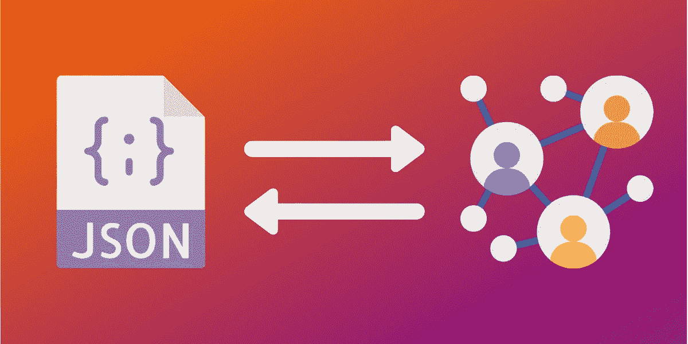

# 如何用 Memgraph MAGE，Python 和 Cypher 实现自定义 JSON 实用程序

> 原文：<https://towardsdatascience.com/how-to-implement-custom-json-utility-procedures-with-memgraph-mage-and-python-7e66bbb8b8e3?source=collection_archive---------33----------------------->

## 通过使用 Memgraph MAGE 和 Python 实现几个简单的定制过程来加载和导出 JSON 格式的数据，了解如何扩展 Cypher 查询语言。



作者图片

# 介绍

您经常会发现自己无法提出适合手头问题的完美查询。每种查询语言都有其缺点，Cypher 也不例外。但是谢天谢地，你总是可以选择编写自己的**定制程序**。

Memgraph 引入了**查询模块**的概念，这些模块是定制密码程序的集合。您可以使用 Python 或 C API 来实现它们。

在本教程中，您将经历实现几个简单实用程序的过程，以 JSON 格式加载和导出数据。

## 介绍记忆图图像

**MAGE** 代表 **Memgraph 高级图形扩展**。这是一个由 Memgraph 发起的开源项目，鼓励开发人员分享创新和有用的查询模块，以便整个社区都能从中受益。

你可以在这个链接上找到**法师**储存库[。](https://github.com/memgraph/mage)

# 先决条件

要完成本教程，您需要:

*   一个 [**Memgraph DB**](https://docs.memgraph.com/memgraph/getting-started/installation) 的安装:一个为处理企业级实时用例而构建的内存图形数据库。按照[快速启动](https://docs.memgraph.com/memgraph/quick-start#docker-installation)页面上的 **Docker 安装**说明开始。
*   一个 [**Memgraph Lab**](https://memgraph.com/download#Lab-download) 的安装:一个集成开发环境，用于导入数据、开发、调试和分析数据库查询以及可视化查询结果。

# 从 JSON 文件导入数据

Memgraph 没有提供开箱即用的 JSON 处理选项。那么，如果你在即将到来的项目中需要这个特性，你有什么选择呢？

实际上，有两种方法可以导入这些数据:

1.  独立于 Memgraph，
2.  在 Memgraph 中使用查询模块。

第一个选项非常简单。您只需解析所需的 JSON 文档，并创建适当的查询来填充数据库。这样，Memgraph 对 JSON 文件一无所知，您必须完全自己处理它，并且只使用从 JSON 文件中提取的数据运行完成的查询。

第二个选项**更加优雅，这也是你将在本教程的剩余部分学到的。**

# 编写自定义密码程序

重要的事情先来。要开始开发新的查询模块，您需要熟悉开发过程。如果你在 Docker 之外的任何东西上运行 Memgraph，那么继续下一段，否则，跳到[使用 Docker](https://memgraph.com/blog/how-to-implement-custom-json-utility-procedures-with-memgraph-mage-and-python#Developing-Custom-Query-Modules-using-Docker) 开发定制查询模块一节。

启动时，Memgraph 将尝试从默认(`/usr/lib/memgraph/query_modules`)目录中找到的所有`*.so`和`*.py`文件中加载查询模块。如果您想更改 Memgraph 搜索查询模块的目录，只需更改主配置文件(`/etc/memgraph/memgraph.conf`)中的`--query-modules-directory`标志或将其作为命令行参数提供(例如，当使用 Docker 时)，例如:

```
docker run -p 7687:7687 --query-modules-directory /usr/lib/memgraph/new_query_modules memgraph
```

如果要添加新的查询模块，需要放在这个目录下。它将在 Memgraph 启动时自动加载，但您也可以通过执行以下查询在数据库运行时重新加载它:

```
CALL mg.load("QUERY_MODULE_NAME")
```

# 使用 Docker 开发自定义查询模块

使用 Docker 时，您不能直接访问默认的查询模块目录，因为它在 Docker 容器中。创建一个卷并挂载它以访问`/usr/lib/memgraph/query_modules`目录。这可以通过创建一个空目录`modules`并执行以下命令来完成:

```
docker volume create --driver local --opt type=none  --opt device=~modules --opt o=bind modules
```

现在，您可以启动 Memgraph 并挂载创建的卷: `了

```
docker run -it --rm -v modules:/usr/lib/memgraph/query_modules -p 7687:7687 memgraph
```

目录`/usr/lib/memgraph/query_modules`中的所有内容在你挂载的`modules`卷中都是可见/可编辑的，反之亦然。

# 用 Python 实现 JSON 实用查询模块

您将把查询模块命名为`json_util.py`，因为它将包含处理 JSON 文件所需的实用函数。现在，让我们实现以下三个过程:

1.  从本地文件加载 JSON
2.  从远程地址加载 JSON
3.  将节点导出为 JSON 文档

# 1.从本地文件加载 JSON

在您的`json_util.py`模块中添加以下代码:

```
import json
import mgp
import urllib.request @mgp.read_proc
def load_from_path(ctx: mgp.ProcCtx,
                   json_path: str) -> mgp.Record(objects=mgp.List[object]): with open(json_path) as json_file:
        objects = json.load(json_file) if type(objects) is dict:
            objects = [objects] return mgp.Record(objects=objects)
```

至此，您已经实现了第一个步骤。`@mgp.read_proc`装饰器将函数注册为当前模块的只读过程。`if`语句确保过程返回一个`list`，即使它只是一个元素。这对以后处理数据很有用。

你如何测试这个程序？让我们在`/usr/lib/memgraph/query_modules`目录下创建一个文件，并将其命名为`data.txt`。将以下内容放入其中:

```
[{"name":"Leslie"}, {"name":"Ron"}, {"name":"Donna"}]
```

如果还没有启动 **Memgraph Lab** 并运行以下查询:

```
CALL json_util.load_from_path("/usr/lib/memgraph/query_modules/data.txt") 
YIELD * 
RETURN *
```

# 2.从远程地址加载 JSON

虽然从本地文件加载数据很有帮助，尤其是在开发新过程时，但是更需要一个通过 URL 从远程位置加载数据的过程。幸运的是，您只需对`load_from_path()`功能稍加调整即可实现这一功能。让我们将这个新过程命名为`load_from_url`:

```
@mgp.read_proc
def load_from_url(ctx: mgp.ProcCtx,
                  json_path: str) -> mgp.Record(objects=mgp.List[object]): with urllib.request.urlopen(json_path) as url:
        objects = json.loads(url.read().decode()) if type(objects) is dict:
            objects = [objects] return mgp.Record(objects=objects)
```

您可以通过运行以下查询来测试它:

```
CALL json_util.load_from_url('ADDRESS') 
YIELD objects 
UNWIND objects AS o 
RETURN o.name
```

# 3.将节点导出为 JSON 文档

这个过程将接收一个节点列表，并将它们以 JSON 格式保存到一个本地文件中。

```
@mgp.read_proc
def export_nodes(ctx: mgp.ProcCtx,
                 nodes: mgp.List[mgp.Vertex],
                 file_path: str
                 ) -> mgp.Record(success=bool):

    json_nodes_list = []
    for node in nodes:
        json_node = {}
        json_node['labels'] = [] for label in node.labels:
            json_node['labels'].append(label.name) json_node['properties'] = dict(node.properties.items())
        json_nodes_list.append(json_node)

    with open(file_name, 'w') as fp:
        json.dump(json_nodes_list, fp)

    return mgp.Record(success=True)
```

您可以通过运行以下命令来测试该过程:

```
MATCH (n) 
WITH COLLECT(n) AS listn
CALL json_util.export_nodes(listn,"/usr/lib/memgraph/query_modules/data.json")
YIELD success RETURN success
```

文件`data.json`应该在`/usr/lib/memgraph/query_modules`目录中。

# 结论

在本教程中，您了解了如何通过编写自己的过程来轻松地向 Cypher 查询语言添加额外的功能。虽然从 JSON 文档导入数据更多地被认为是一个实用程序，但查询模块可以成为编写定制图算法或实现图论领域中各种构造的强大工具。

如果您正在开发自己的查询模块，并希望分享它，请查看[投稿指南](https://github.com/memgraph/mage/blob/main/CONTRIBUTING.md)。我们非常乐意提供反馈，并将模块添加到[法师库](https://github.com/memgraph/mage)。

关于如何创建自己的自定义密码程序的更深入的解释，请看我们的[文档](https://docs.memgraph.com/memgraph/how-to-guides-overview/implement-query-modules)。如果你想要更多探索定制查询模块的分步教程，请务必阅读我们的[如何用 NetworkX 和 Memgraph 编写定制密码过程](https://memgraph.com/blog/how-to-write-custom-cypher-procedures-with-networkx-and-memgraph)教程。