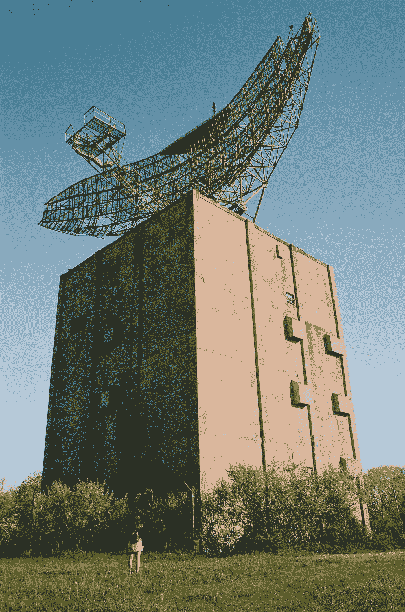
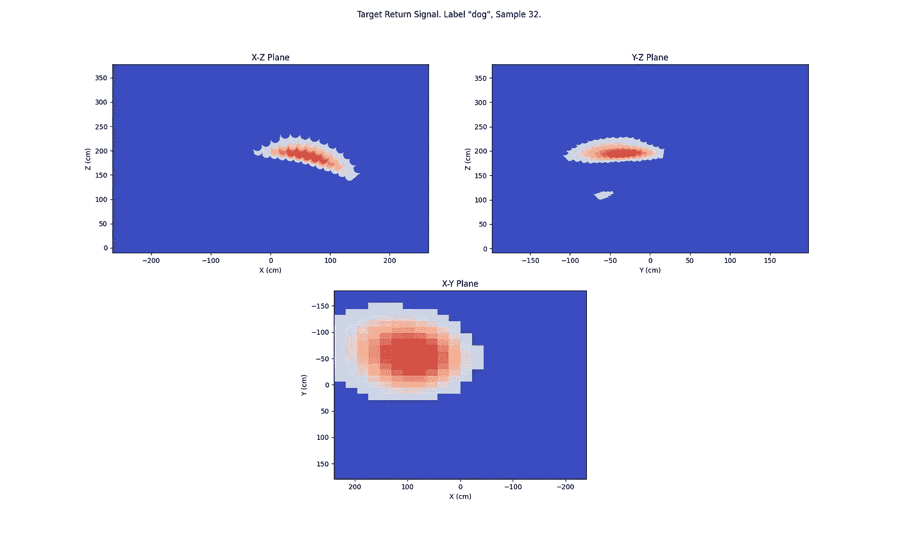
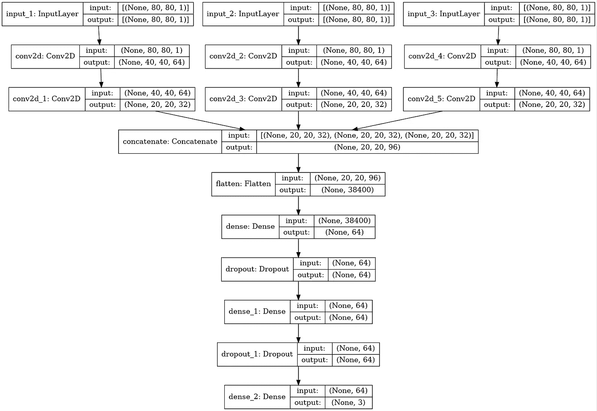
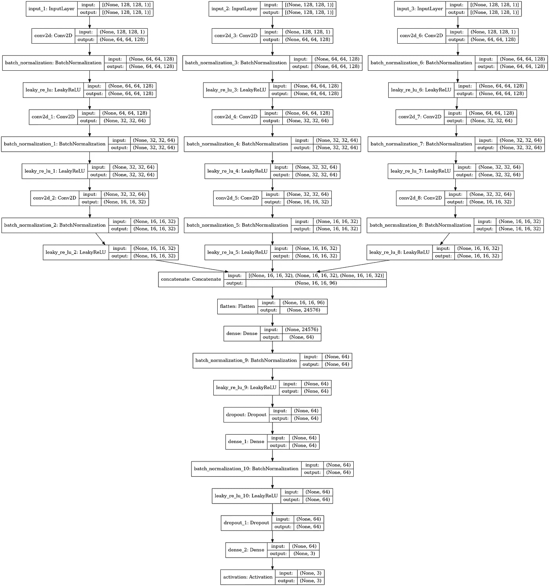
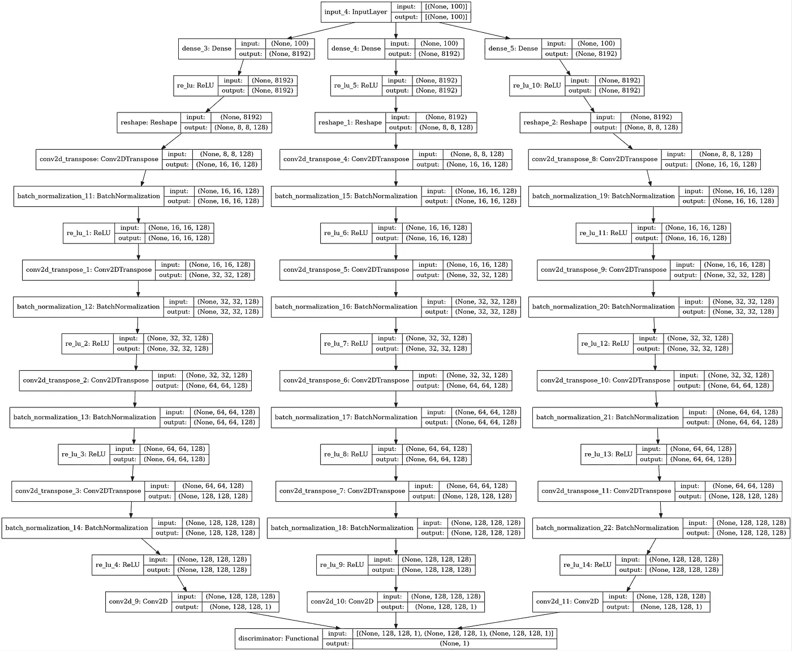
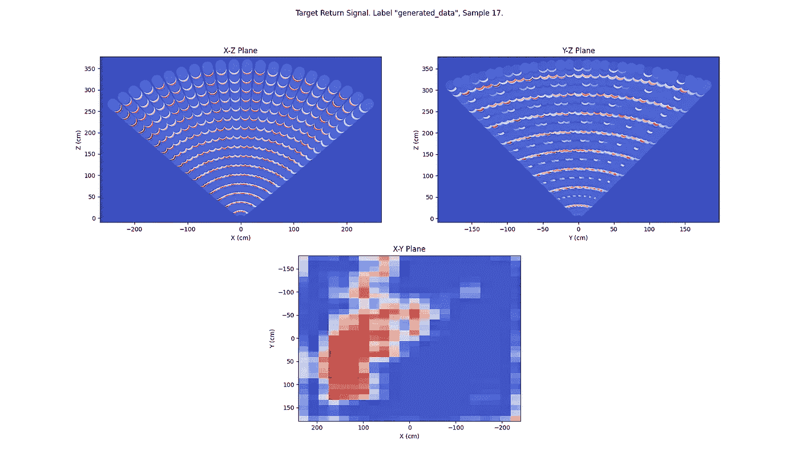

# 如何实现雷达图像分类的深度神经网络

> 原文：<https://towardsdatascience.com/how-to-implement-deep-neural-networks-for-radar-image-classification-acb1bfcd7f3?source=collection_archive---------14----------------------->

## 利用为计算机视觉开发的网络架构和技术

由[普雷斯科特·霍恩](https://unsplash.com/@prescott3?utm_source=medium&utm_medium=referral)在 [Unsplash](https://unsplash.com?utm_source=medium&utm_medium=referral) 上拍摄

# 介绍

对家庭环境中的人和物进行基于雷达的识别和定位相对于计算机视觉具有一定的优势，包括增加用户隐私、低功耗、零光操作和更灵活的传感器放置。

可以使用支持向量机和逻辑回归等浅层机器学习技术对来自雷达的图像进行分类，在我之前的工作中，[教雷达了解家](/teaching-radar-to-understand-the-home-ee78e7e4a0be)和[使用随机梯度下降训练线性分类器](/using-stochastic-gradient-descent-to-train-linear-classifiers-c80f6aeaff76)我分享了如何应用其中的一些方法。

在本文中，您将学习如何开发深度神经网络(DNN)并训练它们对雷达图像中的对象进行分类。此外，您将学习如何使用半监督生成对抗网络(SGAN) [1]，它只需要少量的标记数据来训练 DNN 分类器。这在处理雷达数据集时很重要，因为缺乏大型训练集，与基于相机的图像(例如，I [mageNet](https://www.image-net.org/) )相比，这有助于使计算机视觉无处不在。

从架构和训练方法的角度来看，最初为视觉图像分类开发的 DNNs(或更具体地说，卷积神经网络)和 SGANs 都可以用于雷达应用。

# 数据集

为了帮助您理解本文中使用的技术和代码，本节提供了一个简短的数据集浏览。作为 [radar-ml](https://github.com/goruck/radar-ml) 项目的一部分，数据集是从雷达样本中收集的，并在这里找到了。该项目采用自主监督学习，其中标准的基于摄像机的对象检测技术用于自动标记人和对象的雷达扫描。

数据集是以下形式的 Python `dict`:

`{‘samples’: samples, ‘labels’: labels}`

`samples`是 N 个雷达投影中的一个`list``numpy.array`元组样本的形式:

`[(xz_0, yz_0, xy_0), (xz_1, yz_1, xy_1),…,(xz_N, yz_N, xy_N)]`

其中雷达投影是投影到 x、y 和 z 轴的三维空间中扫描目标物体的最大返回信号强度。这些 2-D 表示通常是稀疏的，因为投影占据了扫描体积的一小部分。采样、存储和利用二维投影比直接使用三维源数据更有效。

`labels`是 N 个 `numpy.array`类标签中的一个`list`，对应表格中的每个雷达投影样本；

`[class_label_0, class_label_1,…,class_label_N]`

下面的热图显示了典型单个样本的预测。红色表示返回信号最强的地方。

狗(我的宠物波利)数据集样本的可视化

这些数据是在我家的不同位置捕获的，旨在最大化检测到的对象(目前只有人、狗和猫)、距离和雷达传感器的角度的变化。

数据集仅包含几千个样本(具有已知的标记误差)，并且在过度拟合之前只能用于训练少量时期的深度神经网络。标记误差将影响从该数据集训练的雷达分类器的准确性。虽然未来的努力将试图微调目标探测器以减少误差，但使用 SGAN 可以避免或最大限度地减少标记未来雷达观测的需要。在保持可接受的准确性的同时，减少训练分类器的标记数据点的数量，是在这个项目中探索使用 SGANs 的主要动机。

# 模型架构

如上所述，数据集包含三维雷达图像的二维表示的集合，幸运的是，计算机视觉领域的先前工作证明了在这种二维表示上设计和训练神经网络的可能性，这种二维表示匹配甚至优于在原始三维数据集上训练的网络，参见[2]和[3]。这项先前的工作启发了下面网络的发展。

所有模型和相关培训都是使用 Keras API 实现的，Keras API 是 TensorFlow 的高级 API，是 [radar-ml](https://github.com/goruck/radar-ml) 项目的一部分。

## 深度神经网络(DNN)分类器

尽管人类无法识别，二维雷达图像投影的集合包含映射回被扫描物体的特征。三个 2-D 投影中的每一个都通过独立的 2-D 卷积层，这些卷积层学习这些特征并连续对图像进行下采样。来自这些层的输出被连接，然后被展平以形成单个特征向量，该特征向量被用作深度连接的密集层的输入，紧接着是分类层。下图中的这个架构。您可能会注意到，这种架构的一个分支类似于计算机视觉中使用的卷积神经网络(CNN)。

DNN 分类器的体系结构

该模型由 [radar-ml](https://github.com/goruck/radar-ml) 资源库中的文件 [dnn.py](https://github.com/goruck/radar-ml/blob/master/dnn.py) 中的 Python 模块实现。您可以在下面看到定义和编译该模型的代码片段。

创建 DNN 分类器的 Python 代码片段

## 半监督生成对抗网络

与建立地面事实相比，收集雷达图像用于模型训练相对简单，地面事实需要人在回路中、自主监督学习或半监督学习等技术，半监督学习在训练期间将少量标记数据与大量未标记数据相结合。使用半监督学习的动机是最小化与人类标记雷达扫描或使用复杂(可能容易出错)的自主监督学习相关的工作。

生成对抗网络(GAN)是一种使用未标记数据集来训练图像生成器模型和图像鉴别器模型的架构。在某些情况下，您可以使用鉴别器模型来开发分类器模型。GANs 已用于雷达信号生成[4]，并在计算机视觉应用中得到广泛使用[5]。

半监督 GAN (SGAN)模型是 GAN 架构的扩展，它采用监督鉴别器、非监督鉴别器和生成器模型的共同训练。在这个项目中，监督鉴别器被用作归纳为新数据集的分类模型和生成雷达投影的真实示例的生成器模型(仅用作有效性检查)。

监督鉴频器架构如下图所示，您可能会注意到它类似于附近所示的 DNN 架构，但有一些例外，包括使用 LeakyReLU(泄漏整流线性单元)而不是 ReLU，这是 GAN 培训的最佳实践[7]。该模型包括批量标准化层，以帮助训练收敛，这通常是训练 GANs 的一个问题[6]。无监督鉴别器共享除最终输出图层之外的大多数图层，因此具有非常相似的架构。监督鉴别器的输出是一个具有 softmax 激活的密集层，它形成一个 3 级分类器，而无监督模型在 softmax 激活之前获取监督模型的输出，然后计算指数输出的归一化和[6]。

监督鉴别器的体系结构

监督和非监督鉴别器模型都是由位于 [radar-ml](https://github.com/goruck/radar-ml) 存储库中的 [sgan.py](https://github.com/goruck/radar-ml/blob/master/sgan.py) 文件中的 Python 模块实现的。定义和编译下面模型的代码片段。

创建监督和非监督鉴别器的 Python 代码片段

生成器模型从潜在空间中获取一个向量(从标准正态分布中提取的噪声向量),并使用具有 ReLU 激活的转置卷积层的三个分支来连续上采样潜在空间向量，以形成三个雷达图像投影中的每一个。生成器被堆叠在鉴别器模型的顶部，并且在后者的权重被冻结的情况下被训练。下图描述了这种组合架构。请注意使用批量标准化图层来帮助模型训练收敛。

GAN 架构

生成器和 GAN 由 [radar-ml](https://github.com/goruck/radar-ml) 资源库中的文件 [sgan.py](https://github.com/goruck/radar-ml/blob/master/sgan.py) 中的 Python 模块实现。下面是定义和编译模型的代码片段。

创建生成器和 GAN 的 Python 代码片段

# 模型训练和结果

## DNN

DNN 通过`tf.keras.Model`类`fit`方法训练，并由 [radar-ml](https://github.com/goruck/radar-ml) 资源库中 [dnn.py](https://github.com/goruck/radar-ml/blob/master/dnn.py) 文件中的 Python 模块实现。下面是训练函数的代码片段，没有显示预处理和过滤数据所需的步骤。

DNN 训练函数的 Python 代码片段

典型训练的结果如下。模型和数据集的当前状态能够获得 80%到 80%的验证集精度。需要做更多的工作来达到或超过 SVM 和逻辑回归模型在之前的工作中获得的 90%的精度[8][9]。这将是今后努力的重点。

DNN 培训结果

## 斯甘

> 生成对抗网络(GANs)很难训练。这是因为该架构包括一个生成器和一个鉴别器模型，它们在零和游戏中竞争。这意味着一个模型的改进是以另一个模型的性能下降为代价的。结果是一个非常不稳定的训练过程，经常会导致失败，例如，生成器总是生成相同的图像或生成无意义的图像。因此，在配置和训练您的 GAN 模型时，可以使用许多启发式方法或最佳实践(称为 GAN hacks)。这些试探法是从业者多年来在一系列问题上测试和评估成百上千个配置操作组合来之不易的。
> 
> “用 Python 生成对抗性网络”，Jason Brownlee，2021。

您可以找到许多优秀的论文和文章，帮助您了解如何应用最佳实践来培训 GANs。特别是， [Jason Brownlee](https://www.linkedin.com/in/jasonbrownlee/?originalSubdomain=au) 发表了许多务实的文章和论文，可以证明节省时间[7]。这些工作中的一部分被用于确定在雷达 SGAN 模型和数据集上工作得相当好的训练方法。如果你认真理解应用机器学习的 ***和*** ，可以考虑阅读他的在线文章和购买他的电子书。

训练循环由 [radar-ml](https://github.com/goruck/radar-ml) 存储库中的文件 [sgan.py](https://github.com/goruck/radar-ml/blob/master/sgan.py) 中的 Python 模块实现。下面是训练循环的一个片段，没有显示预处理和过滤数据集所需的步骤以及几个帮助函数。该代码基于参考文献[7]。注意，鉴别器模型用 1.5 批样本更新，但是生成器模型每次迭代用一批样本更新。

SGAN 训练循环的 Python 代码片段

由于 GANs 的随机性，你会发现每次跑步的训练结果都不一样，所以最好将几次跑步的结果平均起来。对于无监督的鉴别器和生成器，良好的训练会话将具有中等(~ 0.5)和相对稳定的损失，而有监督的鉴别器将在训练集上收敛到非常低的损失(< 0.1) with high accuracy (> 95%)。验证集的准确性结果往往在低到高的 70%之间，每类仅使用 50 个监督样本时，损失在 1.2 左右徘徊。这是一个令人鼓舞的结果，但显然需要更多的建模工作和数据收集，以获得与该数据集上采用的其他机器学习方法相当的验证准确性，通常为约 90% [8][9]。这将是这个项目今后工作的重点。典型的培训结果如下所示。

SGAN 培训结果

您还应该查看生成器生成的图像，以确定它们是否有意义。在这种情况下，由于图像是 3d 物体的雷达扫描的 2d 投影，并且不能被人类识别，因此需要将生成的图像与来自原始数据集的示例进行比较，如上图所示。下图是一组生成的二维扫描。其中一个投影(X-Y 平面)中的相似性是明显的，但在其他投影中不明显，至少对于这次训练运行是如此。这可以解释低准确性，并且找到使其他生成的投影在视觉上类似于训练集的方法留给了未来的练习。

生成的数据集样本的可视化

# 结论

您可以利用 CNN、SGAN 的模型架构以及为基于摄像机的计算机视觉开发的相关培训技术来开发神经网络，从而对雷达图像进行分类。考虑到雷达数据集的缺乏，您通常需要收集雷达数据集，这些数据集可能是资源密集型的，并且对于地面实况新雷达观测来说容易出错。您可以使用自我监督技术来利用未标记的数据，每个类只使用几十个或更少的标记样本和一个 SGAN。通过这种方式，您可以使用大量未标记的数据开发雷达图像分类器。

以前的工作使用浅层机器学习模型，并在数据集上实现了比当前使用这里描述的网络和技术获得的更高的准确性。未来的努力是计划弥补这一差距，并增加数据集的大小，以在过度拟合之前获得更好的验证集准确性。

# 参考

1.  [生成对抗网络半监督学习](https://arxiv.org/pdf/1606.01583.pdf%5D)，2016。
2.  [用于三维形状识别的多视角卷积神经网络](https://arxiv.org/abs/1505.00880)，2015。
3.  [卷积神经网络多视角分类](https://journals.plos.org/plosone/article?id=10.1371/journal.pone.0245230)，2021。
4.  [雷达信号生成对抗网络
    代](https://arxiv.org/abs/2008.03346)，2019。
5.  [深度卷积生成对抗网络的无监督表示学习](https://arxiv.org/abs/1511.06434)，2016。
6.  [训练 GANs 的改进技术](https://arxiv.org/abs/1606.03498)，2016。
7.  [用 Python 生成对抗性网络](https://machinelearningmastery.com/generative_adversarial_networks/)，2021。
8.  [教雷达了解家](/teaching-radar-to-understand-the-home-ee78e7e4a0be)，2020。
9.  [利用随机梯度下降训练线性分类器](/using-stochastic-gradient-descent-to-train-linear-classifiers-c80f6aeaff76)，2020。