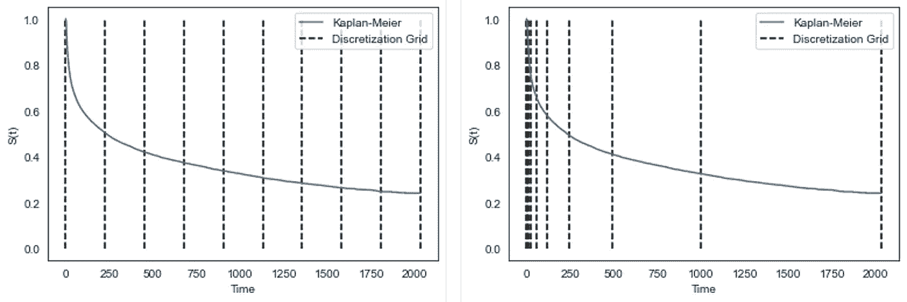
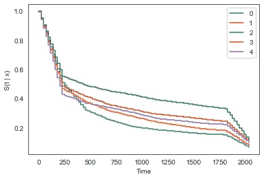
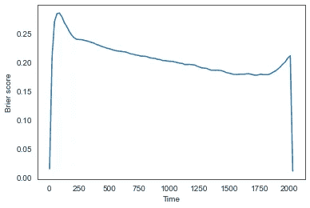
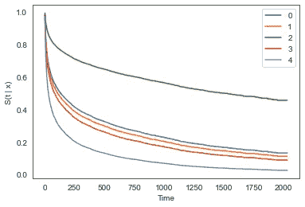
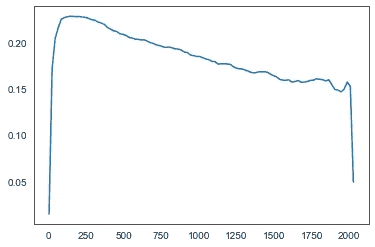

# 如何实现深度神经网络进行时间-事件分析

> 原文：<https://towardsdatascience.com/how-to-implement-deep-neural-networks-for-time-to-event-analyses-9aa0aeac4717?source=collection_archive---------7----------------------->

## 比较 DeepHit 和 DeepSurv 模型

莫里茨·金德勒在 [Unsplash](https://unsplash.com/?utm_source=unsplash&utm_medium=referral&utm_content=creditCopyText) 上拍摄的照片

在我的上一篇[帖子](/how-to-implement-random-forest-svm-and-gradient-boosted-models-for-time-to-event-analyses-5d79d8153bcd)中，我用随机森林、梯度增强和 SVM 生存模型演示了一些例子。今天，我将向您展示如何使用深度神经网络处理相同类型的问题。具体来说，我们将基于 PyTorch 环境，使用连续时间模型( [DeepSurv](https://bmcmedresmethodol.biomedcentral.com/articles/10.1186/s12874-018-0482-1) )和使用 [pycox](https://github.com/havakv/pycox) 的离散时间模型( [DeepHit](http://medianetlab.ee.ucla.edu/papers/AAAI_2018_DeepHit) )来浏览示例。

因为我在上一篇文章中已经介绍了时间到事件分析的基础知识，所以今天我将省略它以避免任何冗余信息。如果你对更多细节感兴趣，请查看上面的链接。

在我开始之前，我鼓励大家看看上面链接的 pycox 回购。它充满了有用的信息以及额外的例子和资源。您甚至可以直接加载几个时间事件数据集，我今天将使用其中的一个。

## 数据

对于今天的例子，我使用研究来了解预后偏好结果和治疗风险(支持)数据集，该数据集调查医院中重病患者的存活时间。它包含来自 8，873 名患者的数据，其中有 14 个预测变量和 2 个结果变量(持续时间和事件)。下面，你可以预览我们的数据集。

图 1 —用于我们分析的支持数据集的预览

有关数据集中变量的快速描述，请参考下图。当我打开数据集时，这些要素被命名为 x0 到 x14。我根据这里找到的[信息给它们重新命名。](https://bmcmedresmethodol.biomedcentral.com/articles/10.1186/s12874-018-0482-1)

图 2 —数据集中变量的描述

关于我们将要使用的库的完整列表，请点击这里查看我的笔记本[。](https://github.com/ryancburke/DNN_survival)

接下来，我们将使用下面的代码将数据集分为训练集、验证集和测试集。或者，你可以使用 sklearn 的[训练测试分割](https://scikit-learn.org/stable/modules/generated/sklearn.model_selection.train_test_split.html)。

图 3 —导入和分割我们的数据集

## 预处理

在开始之前，我们需要根据变量类型执行一些数据预处理:

*   数字变量:标准化
*   二进制变量:不需要预处理
*   分类变量:创建嵌入

使用图 4 中的代码可以完成对数据的预处理。这里发生了相当多的事情，所以让我们打开它。在第一个块中，我们简单地创建列表来分隔不同的变量类型，因为我们将对每个变量应用不同的转换。

第二个模块是我们将要执行的转换。具体来说，我们将对数值变量使用 [*标准缩放器*](https://scikit-learn.org/stable/modules/generated/sklearn.preprocessing.StandardScaler.html) ，对二进制变量不做任何处理，将使用[*OrderedCategoricalLong*](https://github.com/havakv/pycox/blob/master/pycox/preprocessing/feature_transforms.py)来转换我们的分类变量。

下一个块中的 *DataFrameMapper* 是[*sklearn _ pandas*](https://pypi.org/project/sklearn-pandas/1.5.0/)包的一部分，允许我们轻松地将 sk learn 转换应用到我们的 pandas 数据帧。

最后，最后两个模块将转换应用到我们的数据集。你会注意到来自 *x_fit_transform* 和 *x_transform* 的结果被包装在一个使用 [*tt.tuplefy* 的元组中。这个元组称为元组树，用于训练 PyTorch 模型，它可以处理嵌套元组中的数据。](https://github.com/havakv/torchtuples)

图 4 —支持数据集的数据预处理

在下一节中，我们将开始探索离散时间模型 DeepHit 和连续时间模型 DeepSurv，并了解它们在我们的数据集上的表现。

## 深度打击

[DeepHit](https://ojs.aaai.org/index.php/AAAI/article/view/11842) 是一个适用于生存(时间到事件)分析的深度学习模型。可以对其进行修改，以用于调查单一风险或竞争风险。由于这是一个离散时间模型，我们研究的第一步是定义要评估的*离散*时间。

有两种方法可以解决这个问题。我们可以使用下面的代码创建等间距(等距)的离散时间间隔或分位数。这里我们定义了 10 个等间距的区间，然而，通过改变*方案*，我们可以基于分位数定义区间。值得注意的是，我们不需要转换测试集上的标签。

图 5-深击的等距时间间隔(10)

要了解这种情况，请参考下图，该图展示了等距(左)和分位数(右)离散化之间的差异。在每一个中，有 10 个定义的时间间隔；然而，在分位数离散化中，区间是由事件(死亡)的比例定义的。事件多的地方，间隔就多。在我们的数据集中，我们看到更多的事件发生在早于晚于晚。如果你有兴趣更深入一点，请参考这篇[论文](https://arxiv.org/abs/1910.06724)。

图 DeepHit 的等距(左)与分位数(右)时间离散化。作者图片

如果你跟随我的笔记本，你会看到我做了几个实验，看看修改不同参数的效果。我将展示在我测试的条件下表现最好的模型。在运行这些实验时，尝试修改不同的参数以查看它对模型性能的影响是很重要的。

在运行我们的模型之前，我们必须定义嵌入的数量和维度。正如您在下面的代码中看到的，每个类别都由一个等于一半级别数的向量表示。最高性能的 DeepHit 模型由 2 个多层感知器组成，每个感知器由 64 个节点组成。在每一层以及 20%的漏失之后进行批量标准化。

选择的优化器是循环的 [Adam(WR)](https://arxiv.org/abs/1711.05101) ，它是 Adam 优化器的权重衰减正则化版本。

如果您可能在不需要分类嵌入的情况下使用不同的数据集，您可能需要对代码进行一些修改。首先，您不需要定义嵌入的前两行。其次，您需要从第三个代码块中删除 *num_embeddings* 和 *embeddings_dims* 。最后，您需要在第三个代码块中用 *VanillaMLP* 替换 *MixedInputMLP* 。 *MixedInputMLP* 将实体嵌入应用于分类变量，并将它们与其他变量连接起来。

图 7 —我们数据集的最高性能 DeepHit 模型

在训练模型时，找到合适的学习率是一个常见的问题。你经常会在文献中找到很多。pycox 中一个非常有用的工具是学习率查找器。虽然它可能不会提供最好的学习速度，但它给了你一个开始实验的好地方。可以使用下面的代码执行实现，它给了我们 0.04 的值。

图 8——学习率查找器

现在我们已经定义了所有的模型参数，我们使用下面的代码来拟合它。

图 9 —根据我们的数据拟合模型

## 评估模型

为了评估我们的模型，我们可以从查看测试数据的一些预测开始。该代码(图 10)绘制了五名患者的预测存活率。第一行的*插值*函数创建一个线性插值来平滑时间上的步长(记住这是一个离散时间模型)。可以在代码的正下方看到该图。

图 10——绘制预测存活曲线

图 11 —选定患者的深度打击存活曲线

为了评估模型在我们的测试集上的表现，有几个可用的指标。我将提出审查加权的逆概率(IPCW) [石南](https://en.wikipedia.org/wiki/Brier_score)得分。这将计算预测结果与我们定义的每个离散时间间隔的实际结果的均方误差(MSE)。由于正确预测的 MSE 为 0，因此分数越低表示性能越好。

我们可以使用以下代码绘制性能随时间变化的曲线图。第一块允许我们绘制 Brier 分数随时间的变化图(图 13)。还可以计算综合得分(第 6 行)，结果得到 0.21 的值(79%的准确度)。

图 12—IPCW·布瑞尔随时间变化的得分和综合得分

图 13——deep surv 模型的 IPCW·布瑞尔评分图

在下一节中，让我们看看这与来自 DeepSurv 的结果相比有多好。

## DeepSurv

[DeepSurv](https://arxiv.org/pdf/1606.00931.pdf) 是将深度神经网络的潜力纳入时间-事件分析的另一种选择。主要区别在于，这是一个连续时间模型，这意味着我们不需要像在 DeepHit 中那样定义离散间隔。在这里，我们简单地转换我们的标签，如下所示。

图 14——无需离散时间间隔的 DeepSurv 标签转换，如上文针对 DeepHit 所执行的

剩下的和上面类似，我们定义我们的模型并使它适合我们的数据。正如您所看到的(图 15)，主要的区别在第 3 行，这里 *out_features =* 1。同样，这是因为我们使用的是连续时间模型，而使用 DeepHit 时，它被设置为我们定义的离散间隔数。值得注意的一点是，由学习率查找器确定的该模型的学习率为 0.07(而 DeepHit 的学习率为 0.04)。

图 15 —性能最佳的 DeepSurv 模型

## 评估模型

最后，我们以与上面完全相同的方式评估模型。下面，你会发现 5 个病人的预测图。您可能会注意到，这些线条比为 DeepHit 绘制的线条更平滑，因为我们不需要在间隔之间进行插值。

图 16 —选定患者的深度生存曲线

IPCW·布瑞尔评分(图 17)比 DeepHit 模型表现稍好。综合得分以 0.18 的值(82%的准确度)证实了这一点。

图 17—deep hit 模型的 IPCW·布瑞尔评分图

## 摘要

今天，我们通过几个例子学习了如何使用深度神经网络进行时间-事件分析。我希望你给他们两个试一试你的数据，看看他们如何比较。我再次建议您访问 pycox repo，查看所有可用的选项。他们采用了几个离散时间和连续时间的神经网络进行生存分析。感谢阅读！