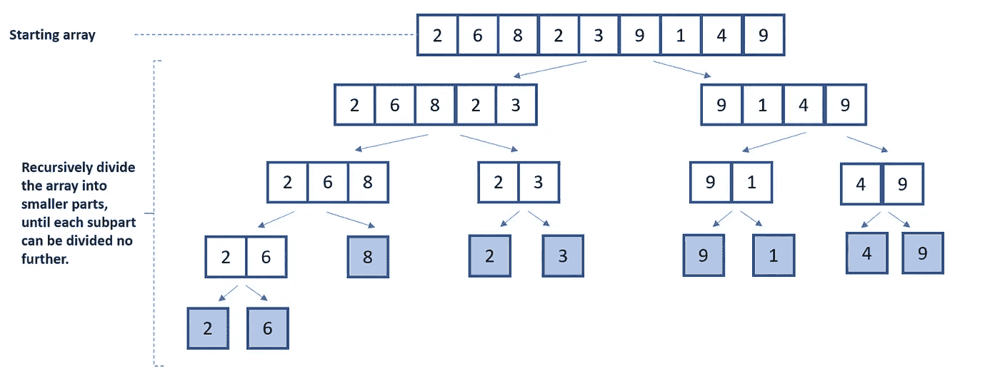
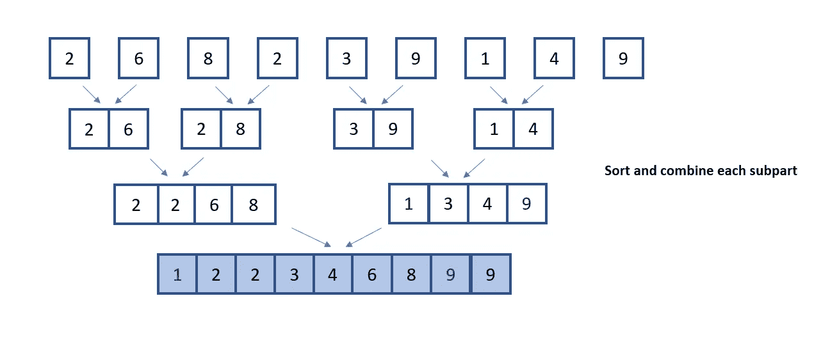

# 如何在 Python 中实现归并排序算法

> 原文：<https://towardsdatascience.com/how-to-implement-merge-sort-algorithm-in-python-4662a89ae48c?source=collection_archive---------5----------------------->

## 数据科学

## 理解合并排序算法的操作以及它是如何在 Python 中实现的


约书亚·阿拉贡在 [Unsplash](https://unsplash.com/s/photos/code?utm_source=unsplash&utm_medium=referral&utm_content=creditCopyText) 上拍摄的照片

L 盈利算法有时会很乏味。

算法主题领域是计算机科学的一个分支，它对巨大的复杂性有着臭名昭著的理解。但是算法有不同的形状、大小和复杂程度。

假设你渴望达到能够处理复杂算法并用它们解决问题的水平。在这种情况下，您必须积累理解和实现不太复杂的算法的经验。

这些不太复杂的算法之一是合并排序。

## 下面是这篇文章的内容:

*   **简介**以分而治之的方法解决问题
*   **合并排序算法中涉及的操作和直觉的解释**
*   合并排序算法的 Python **实现**

# 什么是分治算法？

算法设计中使用的**分而治之**范式结合了**递归**来解决最初由较大问题衍生而来的小问题。

> 计算机科学领域中的递归被定义为函数在其主体内调用自身的过程。

分治算法是递归的；这意味着初始问题被分成相关联的子问题，其中解决方案可以递归地应用于每个子问题。更大问题的最终解决方案是子问题解决方案的组合。

算法设计的分治法有三个主要组成部分:

1.  不断地把大问题分解成小部分。
2.  通过使用递归调用的函数来解决每一个小部分。
3.  **合并:m** 戈尔将所有较小部分的所有解合并成一个统一的解，成为起始问题的解。

# 什么是合并排序？

合并排序算法采用分治算法范例来高效地对列表中的元素进行排序。该算法是由约翰·冯·诺依曼在 1945 年发明的。

合并排序操作遵循这样的基础:将列表分成两半，然后将新的两半继续分成它们各自的组件。然后是单个组件之间的比较，这些组件被合并以形成最终的排序列表。

## Python 中合并排序的实现

实现合并排序算法的方法分为两部分。

第一部分将引导分治范式的划分组件。本节中的代码实现将初始列表分成更小的组件。最初的列表划分只有在每个分离的组件无法再被分解时才会停止。

下面是算法第一部分的图解。



合并排序算法的分割组件图-按作者分类的图像

```
def merge_sort(list):
    # 1\. Store the length of the list
    list_length = len(list)

    # 2\. List with length less than is already sorted
    if list_length == 1:
        return list

    # 3\. Identify the list midpoint and partition the list into a left_partition and a right_partition
    mid_point = list_length // 2

    # 4\. To ensure all partitions are broken down into their individual components,
    # the merge_sort function is called and a partitioned portion of the list is passed as a parameter
    left_partition = merge_sort(list[:mid_point])
    right_partition = merge_sort(list[mid_point:])

    # 5\. The merge_sort function returns a list composed of a sorted left and right partition.
    return merge(left_partition, right_partition)
```

1.  将初始列表的长度存储到变量 *list_length 中。*
2.  *merge_sort* 函数返回一个排序后的列表。对长度为 1 的列表进行技术排序；因此，列表被返回。
3.  对于任何长度大于 1 的列表，下一步是将列表划分为一个*左 _ 分区*和一个*右 _ 分区*。这是通过将初始列表的*中点*传递给 *merge_sort* 函数来实现的。
4.  回想一下，分治算法是递归的。在合并排序算法实现中，递归发生在列表的分解中。为了确保所有分区都被分解成各自的组件，调用了 *merge_sort* 函数，并且列表的一个分区部分作为参数传递。
5.  merge_sort 函数返回一个由排序后的左、右分区组成的列表。

合并排序算法的第二部分涉及到列表中元素按照指定顺序的实际排序。对于这个用例，原始列表中元素的排序顺序是升序。



征服和组合组件—作者的图像

```
# 6\. takes in two lists and returns a sorted list made up of the content within the two lists
def merge(left, right):
    # 7\. Initialize an empty list output that will be populated with sorted elements.
    # Initialize two variables i and j which are used pointers when iterating through the lists.
    output = []
    i = j = 0

    # 8\. Executes the while loop if both pointers i and j are less than the length of the left and right lists
    while i < len(left) and j < len(right):
        # 9\. Compare the elements at every position of both lists during each iteration
        if left[i] < right[j]:
            # output is populated with the lesser value
            output.append(left[i])
            # 10\. Move pointer to the right
            i += 1
        else:
            output.append(right[j])
            j += 1
    # 11\. The remnant elements are picked from the current pointer value to the end of the respective list
    output.extend(left[i:])
    output.extend(right[j:])

    return output
```

6. *merge* 函数接收两个列表，并返回一个排序列表，该列表由作为参数传递给 *merge* 函数的两个列表中的元素组成。

7.名为*输出*的空列表被初始化。该列表由已排序的元素填充。同样，初始化两个变量， *i* 和 *j，*，它们在遍历列表时用作指针。

8.我们用 while 循环遍历这两个列表，当指针 *i* 和 *j* 分别小于左右列表的长度时，该循环执行其主体。

9.在 while 循环体中，比较每次迭代中两个列表中每个位置的元素。*输出*列表在相应指针所在列表的当前索引处填充较小的值。

10.在*输出*列表被填充后，适当的指针将被递增。本质上，我们将指针向右移动，或者移动到列表中的下一个值。

11.在 while 循环完成后，或者如果整个循环条件不满足，则用每个列表的剩余内容填充*输出*列表。剩余元素从当前指针值拾取到相应列表的末尾。

```
def run_merge_sort():
    unsorted_list = [2, 4, 1, 5, 7, 2, 6, 1, 1, 6, 4, 10, 33, 5, 7, 23]
    print(unsorted_list)
    sorted_list = merge_sort(unsorted_list)
    print(sorted_list)

run_merge_sort()
```

最后，我们创建一个函数来初始化一个无序列表。变量 *sorted_list* 保存 *merge_sort* 函数的结果。

下面是完整的代码。

[归并排序算法要点](https://gist.github.com/RichmondAlake/36548222f2ba4ffb9b0cf9db1cb11850)

# 为什么归并排序快？

在最坏的性能情况下，执行**合并排序算法所需的计算时间量的时间复杂度为 *O(n * log(n))*** *，*，其中 n 是列表中要排序的元素的数量。

使用合并排序算法排序的初始列表的每个分解的子部分花费线性时间与另一个子部分合并。这篇来自 Khanacademy 的文章深入解释了合并排序算法的时间复杂度和分析。

与其他排序算法相比，合并排序对于较大的数据集通常更快。这是因为合并排序减少了对列表进行排序的步骤。大多数其他排序算法，如[插入排序](/algorithms-for-data-scientists-insertion-sort-6caa69f906b3) *(O(n ))* 和[冒泡排序](https://www.geeksforgeeks.org/bubble-sort/)都需要很多步骤来对列表进行排序。例如，使用插入排序算法对包含 40 个元素的列表进行排序将需要 1600 步(40*40)，但是使用合并排序，对列表进行排序大约需要 64 步。

# 结论

一开始，处理算法可能会令人望而生畏，尤其是对初学者而言。我的做法是理解插入排序、归并排序等简单算法；之后，处理更复杂的算法。

对于机器学习从业者来说，开始扩展他们对算法及其实现的领域理解的旅程将会实现大量的好处。首先，您开始考虑您在日常工作中编写的程序的执行时间和性能，这通常有助于在与您开发的产品交互时获得积极的最终用户体验。

**要联系我或找到更多类似本文的内容，请执行以下操作:**

1.  关注我的[T3 推特 T5](https://twitter.com/richmondalake)
2.  订阅我的 [**邮件列表**](https://richmond-alake.ck.page/c8e63294ee) 获取每周简讯
3.  跟着我上 [**中**](https://richmondalake.medium.com/)
4.  通过 [**LinkedIn**](https://www.linkedin.com/in/richmondalake/) 联系我

</algorithms-for-data-scientists-insertion-sort-6caa69f906b3> 