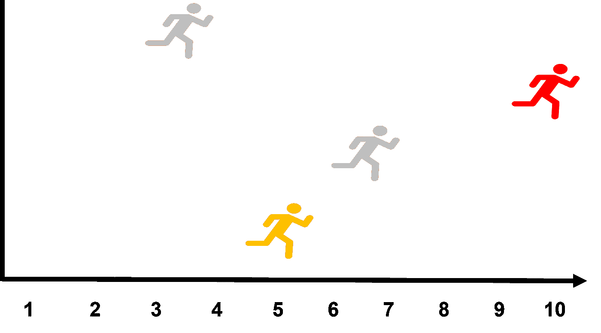
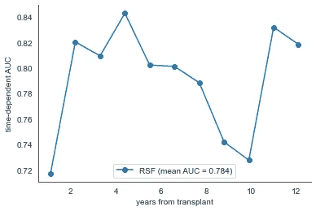
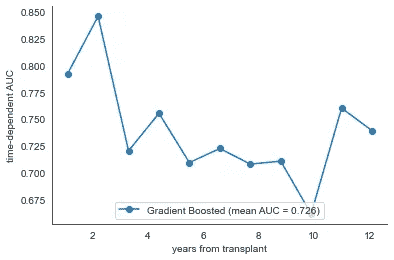
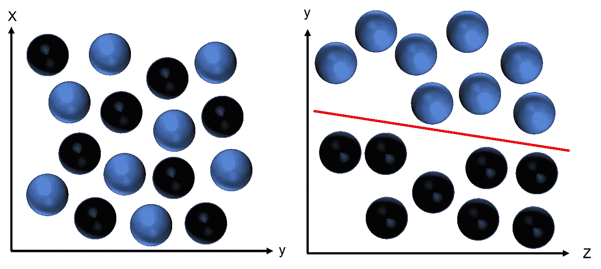

# 如何实现用于事件时间分析的随机森林、SVM 和梯度增强模型

> 原文：<https://towardsdatascience.com/how-to-implement-random-forest-svm-and-gradient-boosted-models-for-time-to-event-analyses-5d79d8153bcd?source=collection_archive---------8----------------------->

## 带示例的循序渐进教程

乔纳森·彼得森在 [Unsplash](https://unsplash.com/?utm_source=unsplash&utm_medium=referral&utm_content=creditCopyText) 上拍摄的照片

在这篇文章中，我们将比较几种先进的方法来进行时间-事件分析(又名生存分析)。具体来说，我们将涵盖随机森林，梯度推进和 SVM 生存模型。

时间-事件分析是帮助我们分析问题的重要方法，其中我们的研究问题有时间成分。顾名思义，当我们对理解时间和某个事件之间的关系感兴趣时，就会用到这些。

虽然我们通常在生物研究(即临床、制药)中发现这些研究，但它同样适用于其他领域(即工程、商业、营销)。一些例子包括:

*   疾病复发的时间
*   死亡时间
*   下次购买的时间
*   取消会员资格的时间

事件时间分析是一种修改的回归任务，但它是独特的，因为一部分数据是不完整的(经过审查的)。要理解这意味着什么，请看下图。

图 1 —事件发生时间(存活)分析。灰色数字代表一个事件。红色数字完成研究，无事件。黄色图没有完成研究，但也没有事件。(*图片作者)*

假设这是一项临床试验，观察某种药物对肿瘤复发时间的疗效。两个灰色数字代表观察到的事件(新肿瘤)，一个在 3 年后，另一个在 6.5 年左右。红色数字完成了这项研究，历时 10 年，没有观察到任何事件。最后，黄色的数字没有完成研究。他们在 5 年时从研究中丢失，但没有观察到任何事件。

在本例中，灰色数字代表*未经审查的*数据，而红色和黄色数字代表*经审查的*数据。删失数据指的是仅部分已知的数据。具体来说，红色数字完成了 10 年的研究。虽然没有观察到肿瘤复发，但这并不意味着两周后没有新的肿瘤形成(希望没有)。

黄色数字在 5 年时从研究中移除，在他们参与研究期间没有观察到新的肿瘤。它们为什么被移除？也许有不可接受的副作用。也许目标死于其他原因。另一种看待受审查参与者的方式是，他们在最后一次随访前没有发生任何事件。

## 数据

对于今天的例子，我们将使用 NKI 乳腺癌数据集。你可以在这里找到数据集[。完整的数据集包括 272 名乳腺癌患者(行)和 1570 列。出于时间的考虑，我选择将列数减少到 11 个预测变量和 2 个结果变量(事件和存活时间)。下面，你可以预览我们的数据集。](https://data.world/deviramanan2016/nki-breast-cancer-data)

图 2 —我们分析中使用的 NKI 乳腺癌数据集的选择。

有关数据集中变量的快速描述，请参考下图。

图 3——数据集中变量的描述

在我们开始之前，分割数据与大多数机器学习模型略有不同，因为我们有 2 个目标变量。这可以使用下面的代码来完成。

很重要的一点是，y 变量的格式应该使事件指示器为布尔型，时间变量为浮点型。点击查看更多[细节。](https://scikit-survival.readthedocs.io/en/latest/api/generated/sksurv.datasets.get_x_y.html)

图 4 —为事件时间分析创建数据集

现在我们可以建立我们的时间到事件模型，看看哪一个表现最好！

## 1.随机森林生存模型

如果你有兴趣了解更多关于随机森林模型是如何工作的，我建议你看看 scikit-survival [文档](https://scikit-survival.readthedocs.io/en/stable/user_guide/random-survival-forest.html)。也有很多关于这个主题的帖子，其中一个你可以在这里找到[。](/understanding-random-forest-58381e0602d2)

正如您在下面看到的，运行算法非常简单。在导入您决定评估的模型和指标之后(块 1)，您可以创建您的模型(块 2)。

将模型与数据拟合后，您可以发现它在测试集上的效果如何。事件时间分析最常用的指标是 c 指数(和谐指数)。这是预测风险值与观察时间之间的等级相关分数。你可以在这里找到更多关于这个[的信息。](https://scikit-survival.readthedocs.io/en/stable/api/generated/sksurv.metrics.concordance_index_censored.html)

我们的结果提供了 0.77 的 c 指数，这可以解释为一个很好的模型。仅仅作为一个引子，c 指数得分为:

*   在预测结果方面，0.5 并不比随机概率更好
*   > 0.7 表示模型良好
*   > 0.8 表示强模型

图 5 —实现随机森林生存模型

尽管 c-index 为我们提供了整个模型的信息，但考察模型在不同时间点的表现也很有趣。为此，我们可以使用 *cumulative_dynamic_auc* 指标，并使用下面的代码将其可视化。

图 6——如何计算和绘制依赖于时间的 AUC

在下图中，我们看到，尽管该模型在整个研究中表现良好(最小 auc = 0.72)，但在第 2-4 年和第 11-12 年出现峰值，auc 值> 0.80。如果我们试图解释这一点，我们将不得不更多地查阅科学文献，以帮助我们理解哪些因素可能影响不同时间点的存活率。

图 7-随机森林生存模型的时间相关 AUC 分数。(*图片作者)*

现在我们已经有了模型，是时候找出不同的特性是如何影响我们的模型的了。有几个包可供选择，我从中选择了 [ELI5](https://eli5.readthedocs.io/en/latest/overview.html) 。下面，您将找到为您的模型实现这一点的必要代码。

图 8 —使用 eli5 的特性重要性

结果表明，雌激素受体表达(esr1)、严重性(等级)和大小(直径)、脉管系统结构的侵袭和年龄是我们模型中的前五个区别特征。有趣的是，在这项研究中，化疗或激素疗法并不能很好地区分那些活着或死去的人。

图 9-随机森林生存模型的特征重要性

## 2.梯度增强模型

梯度增强模型与随机森林模型有一些相似之处，因为它们都是集合方法。他们将多个模型的预测结合起来，以改进整体模型。区别在于它们是如何组合的。

虽然随机森林独立地适合许多不同的树并平均它们的预测，但是梯度增强模型是相加的。在后者中，来自一个模型的加权特征以连续的方式被输入到下一个模型中。更多信息，请查看 scikit survival [文档](https://scikit-survival.readthedocs.io/en/stable/user_guide/boosting.html)。你也可以看看这篇[文章](/ensemble-methods-bagging-boosting-and-stacking-c9214a10a205)，它详细解释了增压和装袋。

与随机森林生存模型相似，它从导入模型开始(参见下面的代码)。有三种损失函数可用，在这里有更详细的描述[。我选择了考克斯比例风险模型(coxpf)，这是默认的损失函数，但你可以尝试所有这些方法，看看你的结果有什么不同。](https://scikit-survival.readthedocs.io/en/stable/user_guide/boosting.html#Losses)

图 10 —实施梯度提升生存模型

整个模型的 c 指数得分为 0.703，低于使用随机森林模型获得的得分。在下图中，我们可以看到，随着时间的推移，区分存活率变得越来越差，到最后略有改善。

图 11-梯度增强生存模型的时间依赖性 AUC 评分。(*图片作者)*

尽管我们的模型在整体和时间相关拟合方面存在差异，但对于前 5 个特征，特征重要性(见下文)具有几乎相同的轮廓，尽管顺序不同。

图 12 —梯度增强存活率模型的特征重要性

## 3.生存支持向量机

作为标准支持向量机(SVM)的扩展，生存 SVM 基于我们的特征和生存之间的线性(或非线性)关系来分离类别。如果你想了解更多，你可以参考 scikit survival [文档](https://scikit-survival.readthedocs.io/en/stable/user_guide/survival-svm.html)，或者查看这个[深入探究本质。在这一节中，我们将探索线性 SVM 和核 SVM 生存模型，看看哪一个对我们的数据集表现最好。](https://jakevdp.github.io/PythonDataScienceHandbook/05.07-support-vector-machines.html)

## 线性生存 SVM

在下面的代码中，我导入了必要的模型和指标。接下来，定义线性生存 SVM，然后拟合我们的数据。该模型产生了 0.716 的 c 指数，这比我们的梯度增强模型有更好的性能，但不是随机森林模型。

生存 SVM 的局限性之一是我们无法将这些模型与随机森林或 SVM 生存模型进行比较。这是因为它们缺乏时间-事件分析的“标准”指标，如生存函数和累积风险函数。这限制了我们与 c 指数得分的比较。

图 13 —实现线性生存 SVM

前 5 个区别特征再次与其他模型相似。尽管顺序不同，唯一的区别是化疗取代了前 5 名中的肿瘤大小。

图 14-线性生存 SVM 的特征重要性

## 内核生存 SVM

因为不能总是使用简单的线性方法来实现分类，所以可以使用核 SVM 来考虑我们的特征和生存之间更复杂的关系。下面的代码是我们如何实现内核生存 SVM 的，它导致了 0.766 的 c-index 分数。这与我们的随机森林生存模型(0.768)表现一样好(精确到小数点后两位)。

图 15 —实现内核存活 SVM

你可能在上面的代码中注意到内核是“线性”的。这是默认的内核，但是你可能会问这和线性 SVM 有什么不同？我鼓励你阅读我上面链接的文章来了解更多细节，但是作为一个快速的解释，请考虑下图。

如果我问你我们如何线性分割左边图像中的蓝色和黑色球，你会怎么说？不可能吧？如果我们处理的是二维空间，那就是真的。

如果我们增加另一个维度会发生什么？在右图中，您可以看到球在三维空间中旋转，我们现在可以看到 y 轴在垂直方向，z 轴在水平方向。我们可以在这里想象 x 轴，就好像我们在你的屏幕上插了一根棒(请不要这样做)。

当我们这样做的时候，很明显，至少对于这组球，我们可以用一个沿着 x 和 z 轴的平面来线性分离它们。这被称为超平面。然而，我们可以想象一张纸，而不是一条线。

使用核 SVM，可以将我们的特征映射到可以被(n 维-1)超平面分开的 n 维空间中。这就是 SVM 核中的线性核与线性 SVM 的不同之处。

图 16——通过将特征从 2 维空间(左)映射到 n 维空间(右，3d ),并找到最大程度分隔类别的超平面(n 维-1 ),核存活 SVM 可以找到一种对患者存活进行分类的方法。(图片由作者提供)

查看特征重要性权重(见下文)，我们得到了与其他模型相同的前 5 个特征。尽管在比较我们的模型时 c 指数得分不同，但这些结果让我们在试图从我们的数据中看到更大的画面时更有信心。

如果我试图总结我们从这些分析中学到的东西，那就是患者的生存更多地取决于肿瘤的发展、esr1 受体的表达、年龄和血管浸润，而不是任何种类的治疗(化疗、激素治疗或乳腺切除)。简而言之，我认为早期诊断是我们数据集中患者生存的最佳指标。

图 17 —内核存活 SVM 的特征重要性

## 4.使用 GridSearch 优化您的模型

到目前为止，我们已经比较了随机森林、SVM 和梯度增强事件时间模型来预测我们数据集中乳腺癌患者的生存率。我认为这将是有益的，通过一个例子，我们可以尝试优化我们的一个模型的结果。如果您想了解如何优化我们今天介绍的其他模型，请查看我们的[笔记本](https://github.com/ryancburke/NKI_breast_cancer)。

让我们看看是否可以改进我们的内核 SVM。您可以手动完成这项工作，也可以实现网格搜索，在网格搜索中，您可以一次运行多个模型。你可以在这里找到更多关于这项技术的信息。

重要的是要记住，这是一个计算量很大的过程，所以要确保在这个过程中你有事可做。在下面的代码中，你会看到我们从 sklearn 导入了 *GridSearchCV* 和 *ShuffleSplit* 。

在第一个模块中，我们定义了指标，因此我们可以在以后将它添加到模型参数中。下一行定义了我们的基本模型，它与我们上面运行的模型相同。

带有*shuffles split*的行表示我们想要100 个随机分裂，其中我们训练 80%的数据，并验证 20%的数据。

*param_grid* 是每次运行模型时将进行的调整，每次调整的结果将进行比较，以查看哪一个执行得最好。值得注意的是，我选择只调查修改 *alpha* 超参数的影响，这是对损失函数的惩罚，类似于岭或套索回归的工作方式。选择的范围 I 是从 2e-12 到 2e+12，步长为 2(即 2e-12、2e-10、2e-8……)。

最后，定义模型并使其适合您的数据。请记住，当您这样做时，您是在整个数据集(X，y)上运行它，因为您已经使用*shuffles split*定义了分割。

结果实际上给了我们一个更差的模型，c 指数得分为 0.713。这是你在使用网格搜索时可能已经注意到的。据我所知，这主要是由于数据集分割的随机性造成的。我们还获得了一些关于最佳 *alpha* 分数的信息，该分数为 0.0625。这不同于默认值 1.0。

当我将 alpha 值插回到我们的原始模型中时，我最终得到了完全相同的分数(0.766)，表明我们的原始结果得到了优化。当然，如果我们改变内核等其他超参数，情况可能会有所不同。如果你感兴趣的话，我把这些放在我的笔记本里，上面有链接。但是，为了不让你担心，结果并没有从 0.766 提高。

图 18——使用 GridSearch 尝试并优化我们的内核生存 SVM

## 摘要

在今天的帖子中，我们介绍了 3 种不同的模型，用于研究乳腺癌存活率的数据集的时间-事件分析。具体来说，我们发现随机森林和核 SVM 生存模型优于梯度增强生存模型。

我们还研究了如何通过在超参数 *alpha* 上运行网格搜索来优化我们的内核 SVM 模型。我鼓励您尝试在网格搜索中添加额外的超参数。事实上，这是确保我们的模型得到优化的唯一方法。然而，如果你这样做了，也许可以通宵运行，这样你就不用等待结果了。这有点像观察草的生长。

我希望你喜欢今天的帖子。玩你的数据玩得开心！