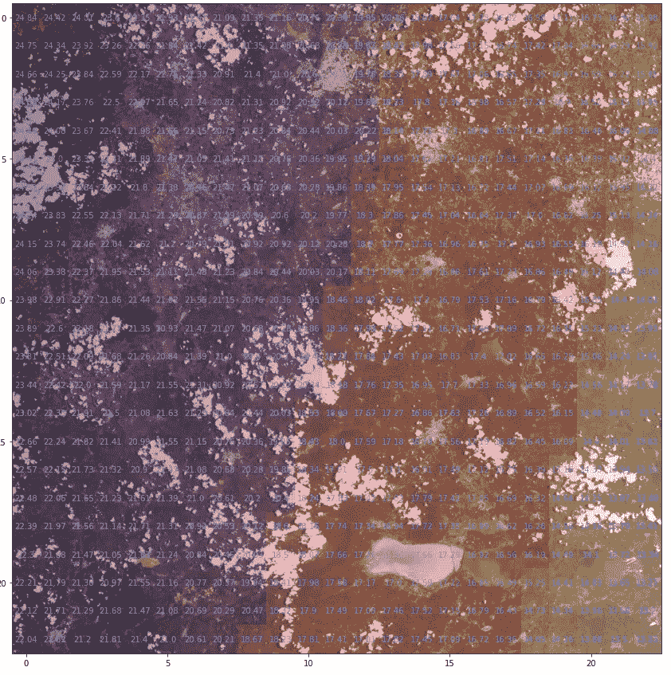

# 如何使用元数据信息在 Python 中实现 Sentinel 2 图像的日光闪烁检测

> 原文：<https://towardsdatascience.com/how-to-implement-sunglint-detection-for-sentinel-2-images-in-python-using-metadata-info-155e683d50?source=collection_archive---------16----------------------->


由 [Unsplash](https://unsplash.com?utm_source=medium&utm_medium=referral) 上的 [Savvas Kalimeris](https://unsplash.com/@savvas_kalimeris?utm_source=medium&utm_medium=referral) 拍摄的照片

# 介绍

光学遥感分析依赖于理解地面物体对太阳辐射的吸收和散射过程。如果我们测量太阳入射辐射和表面的辐照度，我们将能够估计表面的反射率。不同波长的反射率是理解我们观察的目标的关键，因为每种材料都会根据所考虑的波长不同地反射和吸收能量。图 1 显示了水、土壤、植被和岩石等不同材料的平均反射光谱。


图 1:一些地表物质的广义反射光谱。来源:[https://www . usna . edu/Users/oceano/pguth/MD _ help/html/ref _ spectra . htm](https://www.usna.edu/Users/oceano/pguth/md_help/html/ref_spectra.htm)

然而，一些不希望的效应会干扰观察到的反射率。这些效应特别存在于空间传感器中，因为它们位于地球大气层之外，并且存在云、水蒸气等。不断吸收和散射电磁能量。另一个影响反射率的重要因素是日照。

太阳辉光是由卫星或其他传感器以相同角度观察的一些表面上入射辐射的镜面反射(或类似镜子)引起的。在这些情况下，传感器将不会测量被观察目标的特征，而是与发射源的光谱的混合物。这可能会给许多遥感应用带来问题。

在火灾探测中，例如，Giglio 等人。艾尔。(2003)[1]表明，阳光对一些目标如水体、湿土、卷云甚至裸土的影响会导致错误的火警。在水资源中，这种影响尤其重要，因为水面受太阳光线的影响最大(图 2)。


图 Agean 海中的太阳闪烁示例。来源:美国宇航局地球天文台([https://Earth Observatory . Nasa . gov/images/84333/the-science-of-sunglint](https://earthobservatory.nasa.gov/images/84333/the-science-of-sunglint))

因此，对于大多数遥感应用来说，闪烁校正或至少闪烁识别是一项重要的任务。

# 方法学

因为我们的目标不是深入挖掘电磁辐射理论，而是展示如何使用 Python 和 Sentinel 2 元数据信息来估计场景中出现的太阳辉光。为了在水生系统中完全消除闪烁，我推荐来自 [Harmel](https://www.researchgate.net/profile/Tristan-Harmel?_sg%5B0%5D=BDJB-R8Z1pWwnjJ30NhT22-zzNhZVw7IaHeP_p1Jb_WlwNelUsB7Tn2ifUXW9aH9r_wUtw8.7ox-bJoS_j_oUqkD-A89gVRp2JTjpZ8apPU3FHOHEkYtkidWCXMa-onugW4g6t4jyBqby60HLjSIn8Ksl3Pfvw&_sg%5B1%5D=jTwcRDh3Svc4qmNS0BQiIzX5Pd0IAqTCJunhYzNrD_7sTGO8G5DmnIxB5jpT-QCx0nVrxjw.rfl-JTZ-2GhiZflcYbG2LQOFoGOqW-hxLpq3BkVSz9UfvXHdLpDrtmsCW8sTQyMAzYC8k08Ai2Q0s5pcHGsMMQ) et 的论文。艾尔。(2018)[2].相反，我们将展示如何使用 Giglio 等人提出的方法来预测太阳辉光的存在。艾尔。(2003).在这种方法中，我们必须根据下面的等式，检查获取图像时太阳和视角(天顶和方位角)之间的关系:


在这个等式中，下标 v、s 和 g 代表观察角、太阳角和闪烁角，θ指天顶角，φ是太阳和传感器之间的方位角差异，如图 3 所示。


图 3:用于计算日照的太阳和视角的表示。图片作者。

最终的**闪烁**角度值将由`Arccos(θg)`获得。根据作者的说法，由此产生的**闪烁**角是太阳辉光出现的预测因子。**闪烁**角度值越小，传感器和太阳越“对齐”,出现日光闪烁的可能性就越大。

# 输入数据

我们计算所需的所有信息都包含在 Sentinel 的 2 元数据文件`MTD_TL.xml`中。该文件位于颗粒子目录中。那么，我们来看看吧。如果我们第一次打开这个文件，它可能会让人不知所措，但是如果我们寻找`Sun_Angles_Grid`标签，我们可以找到我们需要的关于太阳位置的所有信息:


图 4:哨兵 2 元数据中呈现的太阳角度。

请注意，它是以 5000 米(23x23 网格)的步长呈现的，因此这并不完全是“像素级”信息，但我们可以在之后对其进行插值以匹配像素分辨率。我们将从通过`**lxml**` 包从元数据中读取太阳角度开始。最后，我们将使用一个 pandas 数据框架来实现可视化。

代码输出:

```
(         0        1        2        3        4
 0  19.5389  19.4952  19.4514  19.4076  19.3638
 1  19.5431  19.4994  19.4556  19.4119  19.3681
 2  19.5474  19.5037  19.4600  19.4162  19.3725
 3  19.5518  19.5081  19.4644  19.4207  19.3769
 4  19.5564  19.5126  19.4689  19.4252  19.3815,
          0        1        2        3        4
 0  80.1116  80.1092  80.1067  80.1041  80.1014
 1  79.9860  79.9833  79.9804  79.9775  79.9745
 2  79.8605  79.8574  79.8543  79.8510  79.8477
 3  79.7350  79.7316  79.7281  79.7246  79.7209
 4  79.6095  79.6058  79.6021  79.5982  79.5942)
```

如果我们与 XML 文件中的角度进行比较，我们可以看到我们的数据被正确加载。我们可以对传感器做同样的事情，但如果你仔细观察，你会发现我们有许多不同的传感器，它们有不同的角度。因为我们想要对我们的场景进行平均闪烁预测，我们将使用每个传感器的平均角度。为此，我们将创建一个通用函数，该函数读取给定节点名称的数组并返回其平均值，以检索传感器的平均天顶和方位角。最后，我们将使用 matplotlib 绘制角度。

代码输出:


> 注意:我们可能会看到，在探测器转换时，观察方位角有一些问题。关于这个问题的讨论线索可以在这里找到([https://forum . step . esa . int/t/sentinel-2-viewing-angles-interpolation-on-per-pixel-basis/2776/4](https://forum.step.esa.int/t/sentinel-2-viewing-angles-interpolation-on-per-pixel-basis/2776/4)

# 计算闪烁角

现在我们已经有了所有需要的角度，是时候计算闪烁角了。首先我们应该把它们都转换成弧度(numpy 三角函数使用的单位)。然后，最后的计算非常简单。为了可视化结果，我们将创建一个带注释的热图及其值。

代码输出:


# 叠加闪烁角和 RGB 图像

要可视化图像中更容易出现日光反射的部分，最好的方法就是将闪烁角网格与图像的 rgb 表示叠加。为了获得卫星图像的 rgb 表示，我们将使用`**rasterio**`包来读取红色、绿色和蓝色波段，正如 Python for Geosciences:Satellite Image Analysis 系列中所解释的那样([此处为](https://medium.com/analytics-vidhya/python-for-geosciences-satellite-image-analysis-step-by-step-6d49b1ad567))。

代码输出:


现在，我们可以使用`matplotlib` 中的`imshow` 函数叠加两个网格，并正确调整范围参数和 alpha 来应用透明度。

```
ax.imshow(rgb*4, alpha=0.6, extent=(-0.5, 22.5, 22.5, -0.5))
fig
```



# 结论

在这个故事中，我们讨论了如何根据 Giglio (2003)提出的 en Sentinel 2 元数据中可用的太阳和视角来估计太阳辉光事件。有了这一信息，就有可能调整受太阳辉光存在影响的任何遥感应用。例如，这个简单的太阳辉光预测目前正在`**waterdetect**` python 包([此处为](/water-detection-in-high-resolution-satellite-images-using-the-waterdetect-python-package-7c5a031e3d16) )[3]中实现，作为一种在预计有太阳辉光时调整最大阈值水平的方法。它还可以用于云探测器，以避免水被识别为云，或者用于火灾探测，以防止误报。

如果你对我们关于这个主题的评论有任何疑问，请不要犹豫，写在评论里。如果你想收到更多这样的故事，别忘了关注我。所以敬请期待，下篇故事再见。

# 保持联系

*更多这样的故事:*[https://cordmaur.medium.com/](https://cordmaur.medium.com/)

*如果你喜欢这篇文章，并想继续无限制地阅读/学习这些和其他故事，考虑成为* [*中等会员*](https://cordmaur.medium.com/membership) *。你也可以在 https://cordmaur.carrd.co/*查看我的作品集。

<http://cordmaur.medium.com/membership>  

# 参考

[1]吉廖，l；Descloitres，j；司法总监；一种用于 MODIS 的增强型上下文火灾探测算法。*环境遥感* **2003** ， *87* (2)，273–282。[https://doi . org/10.1016/s 0034-4257(03)00184-6](https://doi.org/10.1016/S0034-4257(03)00184-6)。

[2]t .哈梅尔；横山雅美，m。t .托尔莫斯；雷诺，新泽西州；来自 SWIR 波段的多光谱仪器(MSI)-SENTINEL-2 图像在内陆和海洋水域上空的 Sunglint 校正。*环境遥感* **2018** ， *204* ，308–321。[https://doi.org/10.1016/j.rse.2017.10.022](https://doi.org/10.1016/j.rse.2017.10.022)。

[3]科尔代罗；马丁内斯，j .-m；Sentinel-2 图像多维层次聚类的自动水检测以及与水平 2A 处理器的比较。*环境遥感***2021***253*，112209。[https://doi.org/10.1016/j.rse.2020.112209](https://doi.org/10.1016/j.rse.2020.112209)。