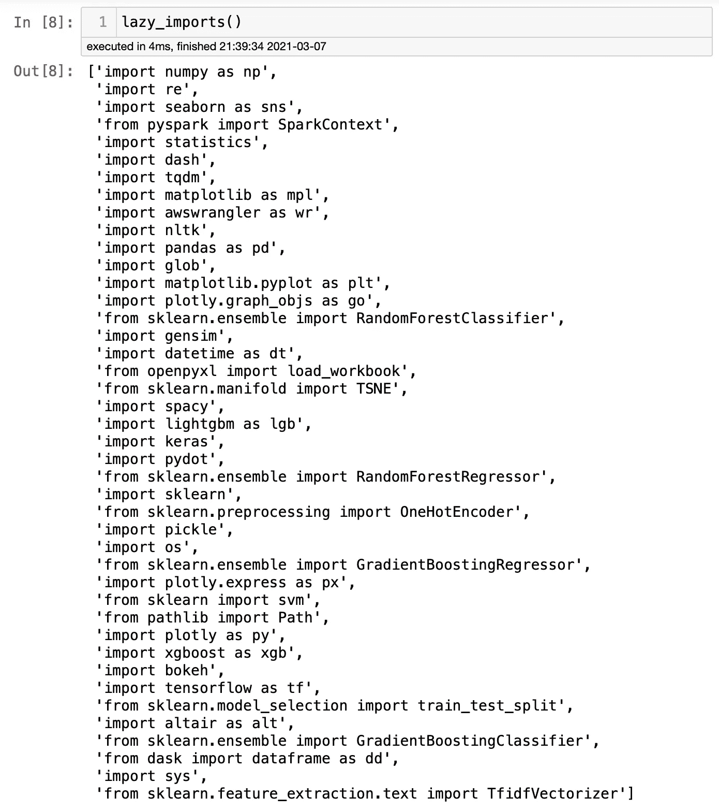
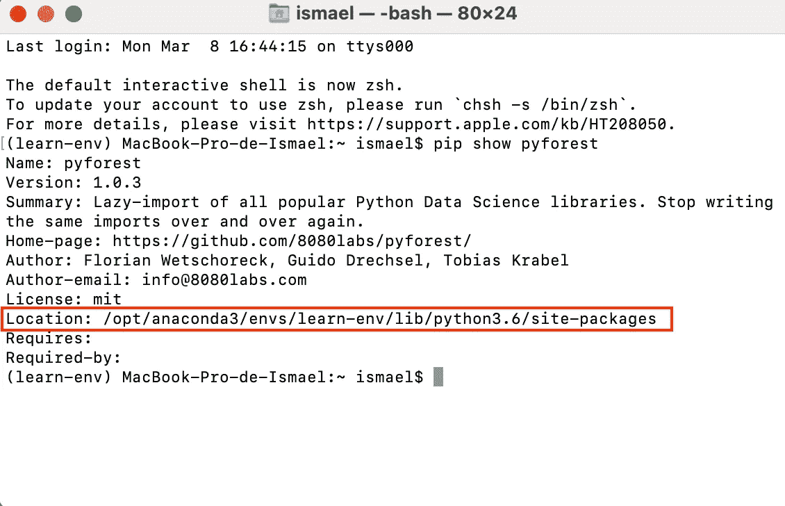

# 如何用一行代码导入所有 Python 库

> 原文：<https://towardsdatascience.com/how-to-import-all-python-libraries-with-one-line-of-code-2b9e66a5879f?source=collection_archive---------23----------------------->

## 计算机编程语言

## 了解如何使用 PyForest 导入 40 个最重要的库


图片来源: [Unsplash](https://unsplash.com/photos/CJAVJ5SF6gA)

如果你是一名数据科学家，或者正在学习如何成为一名数据科学家，你应该知道启动一个新的 Jupyter 笔记本项目的流程。您导入库，使用其中一些库，然后开始工作。由于忘记导入另一个库，您可能会在某个时候收到一条错误消息。您可以停止正在进行的工作，导入特定的库，然后重新开始工作。根据项目的大小，这种情况可能会发生几次。你也很有可能在 Google 上查过如何导入 matplotlib.plot。

是的，您可以使您的生活变得更简单，从另一个项目中复制并粘贴您将需要的所有包，但是如果我告诉您，您可以用一行代码导入您所有的基本包并专注于重要的东西，那会怎么样呢？这个解决方案叫做 PyForest。PyForest 是懒惰的舶来品。顾名思义，它为 Python 导入了最流行的数据科学库。PyForest 开发者的目标是导入 99%最常用的库。

听起来很棒，对吧？然而，如果你不使用所有的库呢？你为什么要全部进口？好消息是，PyForest 只会在您使用它们时导入这些库。出于这个原因，没有理由担心你的电脑变慢。因为除非您使用它们的函数或方法，否则不会导入这些库，所以这是一个比从其他项目中复制和粘贴代码更好的解决方案。

**安装**

现在，如何使用这个神奇的解决方案？越简单越好。Pyforest 可以从 Pypl 安装。您可以在终端上键入以下命令:

```
pip install pyforest
```

如果你在 Jupyter 笔记本上，你可以输入:

```
!pip install pyforest 
```

要导入，您可以使用

```
import pyforest
```

或者

```
from pyforest import *
```

这些选项应该以同样的方式工作，但是你知道，Python 有时会很棘手。如果一种方法行不通，你可以尝试另一种方法。瞧，你有一些最重要的图书馆，你可以专注于你的项目。

但是实际上导入的是什么呢？

好消息是，这个列表很长，举几个例子，它包括 Pandas、NumPy、Matplotlib、Seaborn、Sklearn、Keras、NLTK，这个列表还在继续。最酷的部分，在我看来？他们使用的别名是数据科学家的标准约定，比如导入 Pandas 作为 pd，导入 NumPy 作为 np。生活可以毫不费力！

键入 **lazy_imports()** 可以找到完整的库列表，您将能够看到完整的列表。



作者图片

**向 PyForest 添加更多库**

正如我们所看到的，有大量不同的库，这应该涵盖了您的大部分项目。但是，缺少一些基本的库。我们可以通过手动添加您最喜欢的库来快速解决这个问题。您可以尝试以下步骤来添加 PyForest 最初没有提供的库。

首先，到您的终端键入:

```
pip show pyforest
```

您将看到终端将返回 PyForest 目录的位置。如果使用的是 macOS，可以键入 *Command+Space* 粘贴目录地址。找到名为 *_imports.py* 的文件，添加您需要的所有库。



作者图片

搞定了。现在，您将拥有所有的收藏夹库，并担心什么对您的项目至关重要。我创建了一个微型项目——[，你可以在这里找到它](https://github.com/ismael-araujo/testing-pyforest)——在这里我展示了我如何使用 PyForest 而没有从其他库导入任何东西。请记住，如果您想要运行 Jupyter 笔记本，您必须在您的环境中安装 PyForest。