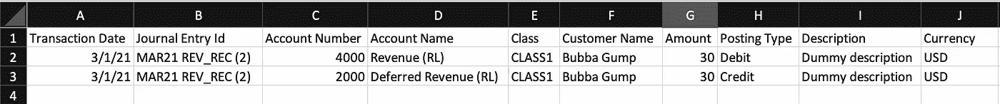
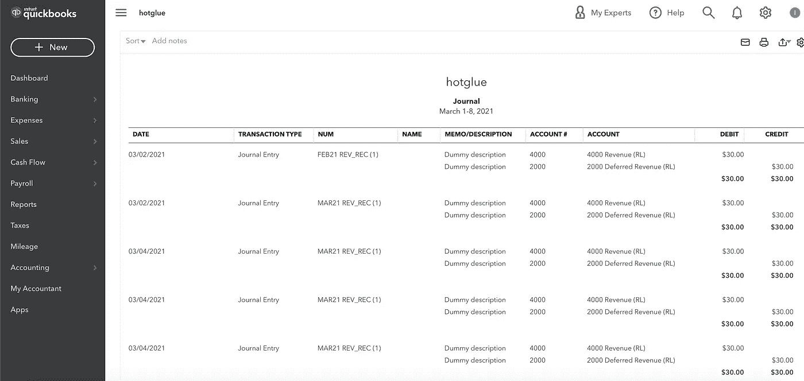

# 如何使用 Python 将 CSV 数据导入 Quickbooks

> 原文：<https://towardsdatascience.com/how-to-import-csv-data-into-quickbooks-using-python-b37c989149f7?source=collection_archive---------34----------------------->

## 免费使用 Python 将日记条目电子表格导入 Quickbooks Online

如果您处理过将数据导入 Quickbooks Online 的问题，您就会知道这是一个繁琐的过程。事实上，这是一个非常麻烦的问题，像 SaasAnt 这样的公司已经开发了专门用于自动化这一过程的产品。

在本文中，我将向您展示如何利用 [hotglue](https://hotglue.xyz) 的[目标——quickbooks](https://github.com/hotgluexyz/target-quickbooks)将 CSV 数据导入 Quickbooks。


来源: [unDraw](https://undraw.co/)

# 第一步:格式化你的电子表格

首先，我们必须把我们的日志条目电子表格放在一个 [target-quickbooks](https://github.com/hotgluexyz/target-quickbooks) 包能够理解的格式中。将文件命名为`JournalEntries.csv` 列应该是:

```
Transaction Date - The day the transaction occurredJournal Entry Id - The ID of the Journal Entry (becomes the DocNumber in QBO)Account NumberAccount Name - If you aren't using Account Numbers, it will use this column to find the AccountClassCustomer NameAmount - Must be a POSITIVE numberPosting Type - Either "Debit" or "Credit"Description - Description for the entryCurrency - Optional. Allows you to specify a different currency code
```

您的最终文件应该如下所示:



示例 JournalEntries.csv 文件

# 步骤 2:设置我们的环境

## 创造虚拟

为了避免依赖地狱，我强烈建议在虚拟环境中运行这个例子。

```
# Create the virtual env
$ python3 -m venv ~/env/target-quickbooks# Activate the virtual env
$ source ~/env/target-quickbooks/bin/activate# Install the dependencies
$ pip install git+[https://github.com/hotgluexyz/ta](https://github.com/hotgluexyz/target-csv.git)rget-quickbooks.git# Create a workspace for this
$ mkdir quickbooks-import# Enter the directory
$ cd quickbooks-import
```

这些命令可能因您的操作系统和 Python 版本而异。

# 步骤 3:配置目标

## 获取 OAuth 凭证

首先，你需要 Quickbooks OAuth 证书。Quickbooks 已经很好地记录了这个过程，所以我假设你可以遵循这个指南。如果您不熟悉如何完成 OAuth 授权流程，您可以遵循 [hotglue 文档](https://docs.hotglue.xyz/targets/quickbooks)。

## 创建目标配置

现在我们必须创建一个目标配置。这将指定我们的 OAuth 凭证，它应该在哪里寻找我们的 CSV 文件，以及一些 QBO 特定的设置。下面是一个配置示例:

```
{
  "client_id": "secret_client_id",
  "client_secret": "secret_client_secret",
  "refresh_token": "secret_refresh_token",
  "sandbox": true,
  "realmId": "123456789",
  "input_path": "tests"
}
```

填写您的凭证，并将其保存到本地目录中名为`config.json`的文件中。如果你没有使用沙盒 QBO 帐户，请确保将`sandbox`设置为`false`。

## 保存格式化的电子表格

将您的`JournalEntries.csv`文件保存到您在`input_path`中为我指定的文件夹，即`tests`

**注意:**目标希望文件被命名为*确切地说是* `JournalEntries.csv`

# 步骤 4:将数据发送到 Quickbooks Online

现在我们可以运行目标，并将我们的数据发送到 QBO！

```
target-quickbooks --config config.json
```

如果在发送日志条目时出现任何错误，您将直接在控制台中看到这些错误。成功的导入应该如下所示:

```
target-quickbooks - INFO - Converting MAR21 REV_REC (2)...
target-quickbooks - INFO - Loaded 1 journal entries to post
target-quickbooks - INFO - Posting process has completed!
```

瞧啊。我们在 Quickbooks 中看到新的日志条目:



在 Quickbooks Online 中导入日记条目

# 结论

## 后续步骤

如果你想部署这个管道，或者想在你自己的产品中提供这个功能，请查看 [hotglue](https://hotglue.xyz) 。

希望这能节省你一些时间。目前，该目标仅支持日志条目，但对发票等的支持将很快推出。感谢阅读！