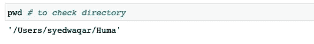
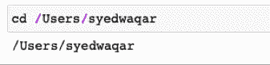
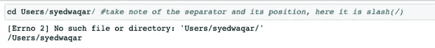
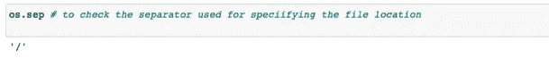
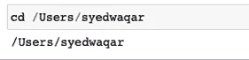
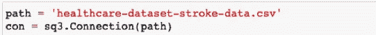
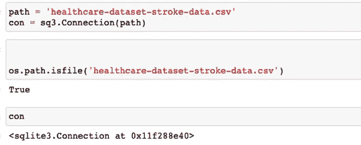
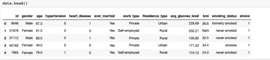

# 使用 Pandas DataFrame 无错导入 CSV 文件

> 原文：<https://towardsdatascience.com/how-to-import-csv-files-using-pandas-dataframe-error-free-62da3c31393c?source=collection_archive---------5----------------------->

## *EmptyDataError。*听着耳熟？然后继续关注我的一些提示，以避免在使用 Pandas DataFrame 加载 CSV 文件时出现任何形式的错误。


[小植物](https://unsplash.com/@little_plant?utm_source=medium&utm_medium=referral)在 [Unsplash](https://unsplash.com?utm_source=medium&utm_medium=referral) 上拍摄

ata 处于机器学习管道的中心。为了充分利用算法的全部能力，必须首先对数据进行适当的清理和处理。

数据清理/争论的第一步是加载文件，然后通过文件的路径建立连接。有不同类型的分隔文件，如制表符分隔文件，逗号分隔文件，多字符分隔文件等。定界符指示数据如何在列内被分开，是通过逗号、制表符还是分号等。最常用的文件是制表符分隔和逗号分隔的文件。

在整个 ML 管道中，数据争论和清理占据了数据分析专业人员大约 50%到 70%的时间。第一步是将文件导入熊猫数据框架。然而，这一步是遇到最多的错误。人们经常在这个特定的步骤中陷入困境，并遇到类似这样的错误

*empty data 错误:文件*中没有要解析的列

**常见错误的出现，主要是由于:**

***提到了错误的文件分隔符。***

***文件路径格式不正确。***

***错误的语法或分隔符用于指定文件路径。***

***提到了错误的文件目录。***

***文件连接未形成。***

数据分析专业人员无法承受在已经非常耗时的步骤中耗费更多时间。在加载文件时，必须遵循某些重要的步骤，这些步骤将节省时间，并减少在大量信息中寻找特定问题的解决方案的麻烦。因此，我列出了一些步骤，以避免在使用 pandas DataFrame 导入和加载数据文件时出现任何错误。

读取和导入 CSV 文件并不像人们想象的那么简单。一旦你开始加载你的文件来建立你的机器学习模型，这里有一些必须记住的提示。

**1。** **在设置中检查您的分色类型:**

**用于 Windows**

*   转到控制面板
*   点击区域和语言选项
*   点击区域选项选项卡
*   点击自定义/附加设置
*   在“列表分隔符”框中键入逗号(，)
*   单击“确定”两次以确认更改

注意:这只适用于“十进制符号”也不是逗号的情况。

**用于 MacOS**

*   前往系统偏好设置
*   点击语言和地区，然后进入高级选项
*   将“小数分隔符”更改为以下情况之一

对于 MacOS，如果小数点分隔符是句点(。)那么 CSV 分隔符将是逗号。
如果小数点分隔符是逗号(，)，那么 CSV 分隔符将是分号。

**2。** **查看文件的预览:**

还可以检查文件的预览，可以看到数据是如何被分隔的，是通过制表符分隔还是逗号分隔。人们可以在 Jupyter notebook 或 Microsoft Excel 中检查预览。

**3。** **正确指定所有参数:**

看了预览并检查了为您的计算机指定的分色后。我们现在必须填充正确的参数，这些参数需要在“pd.read_csv”函数中根据文件类型作为分隔符(制表符分隔等)、空白标题(在这种情况下 header= none)等。

Pandas.read.csv 有许多参数，需要考虑这些参数才能正确读取该文件。

*pandas . read _ CSV(file path _ or _ buffer，sep= < object object >，delimiter=None，header='infer '，names=None，index_col=None，usecols=None，squeeze=False，prefix=None，mangle_dupe_cols=True，dtype=None，engine=None，converters=None，true_values=None，false_values=None，skipinitialspace=False，skipfooter=0，nrows=None，na，lineterminator=None，quotechar= ' " '，quoting=0，doublequote=True，escapechar=None，comment=None，encoding=None，dialect=None，error_bad_lines=True，warn_bad_lines=True，delim_whitespace=False，low_memory=True，memory_map=False，float_precision=None，storage_options=None)*

这是所有论点的清单，但我们最关心的是以下几点:

sep:这指定了数据值之间的分隔类型。默认值为“，”。在检查了预览和系统设置之后，我们知道了文件的类型。最常见的分隔符/分隔符类型是逗号、制表符和冒号。因此，它将被指定为 sep= '，'，sep= ' '，sep = '；'这告诉 pandas DataFrame 如何将数据分布到列中

如果问题仍然存在，请检查需要输入的任何必需参数。那么问题可能出在文件路径上。

**4。** **检查文件路径:**

此参数用于描述特定数据文件的路径对象或类似文件的对象，基本上是其位置。输入是一个字符串。也可以输入 URL，有效的方案有 HTTP、FTP、s3、gs 和 file。

文件位置应被正确提及。大多数情况下，人们不知道工作目录，结果提到了错误的文件路径。在这种情况下，我们必须检查工作目录，以确保正确描述了指定的文件路径。编写如下所示的代码来检查工作目录。



作者图片

这将打印工作目录。然后，我们必须只指定你的工作目录后的位置。

我们也可以使用下面一行代码来改变工作目录。指定新目录后，我们必须指定路径。



作者图片

**5。** **检查用于指定文件位置的分隔符:**

通常在改变工作目录时也会出错。这是因为没有按照正确的语法编写分隔符。



作者图片

首先。使用以下命令检查分隔符。



作者图片

然后，仅在目录位置的开头使用分隔符，而不要在结尾使用。请注意，这种分隔符(/)语法规范适用于 MacOS，但可能不适用于 Windows。



作者图片

现在，在正确指定位置后，我们已经对其进行了更改。

现在我们必须指定路径。因为我们熟悉工作目录。我们只需指定工作目录之后的位置。

如果你的文件在工作目录中，那么只需要如下所示的文件名。



作者图片

但是，如果您的文件存在于某个其他文件夹中，那么您可以在工作目录后指定后续文件夹，例如，您的工作目录是“/Users/username”，而您的文件位于“documents”中名为“huma”的文件夹中，那么您可以编写以下代码:

```
*path = ‘Documents/huma/filename.csv’*
```

**6。** **检查文件是否在路径:**

现在使用下面的代码检查您的文件是否存在于描述的路径中。我们得到的答案要么是“对”，要么是“错”。



作者图片

**7。** **打印要钩稽的文件数据:**

现在，我们可以使用下面的代码检查我们的数据文件是否已经正确加载。



作者图片

有了这些提示，你可能不会在使用 Pandas DataFrame 加载 CSV 文件时遇到任何问题。