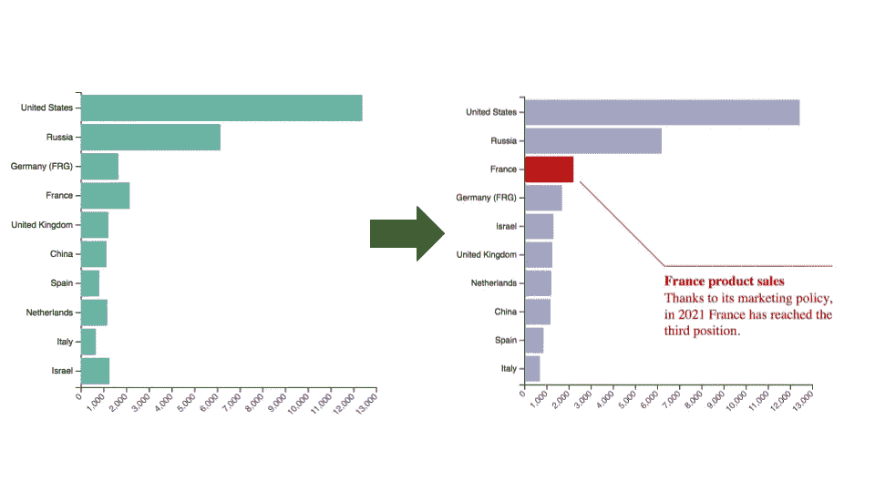
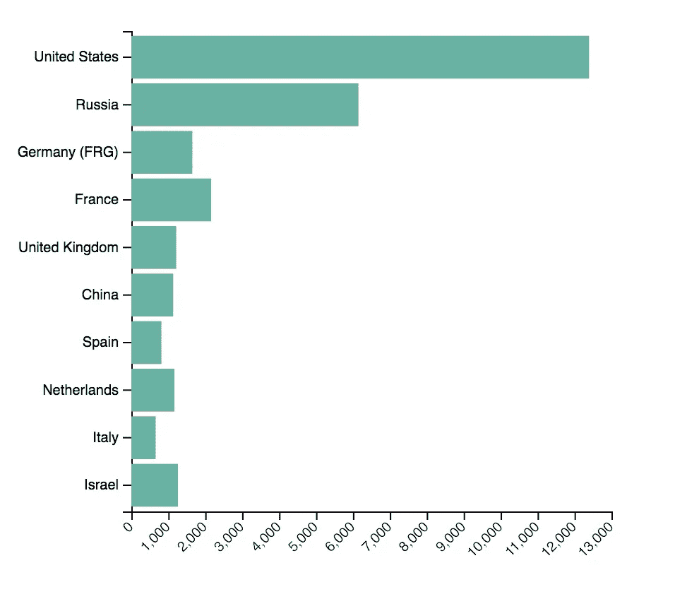
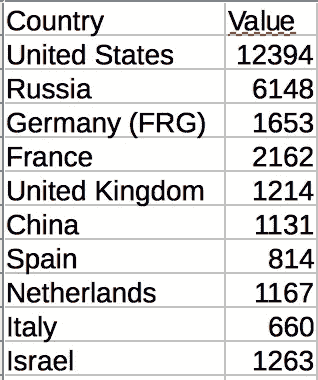
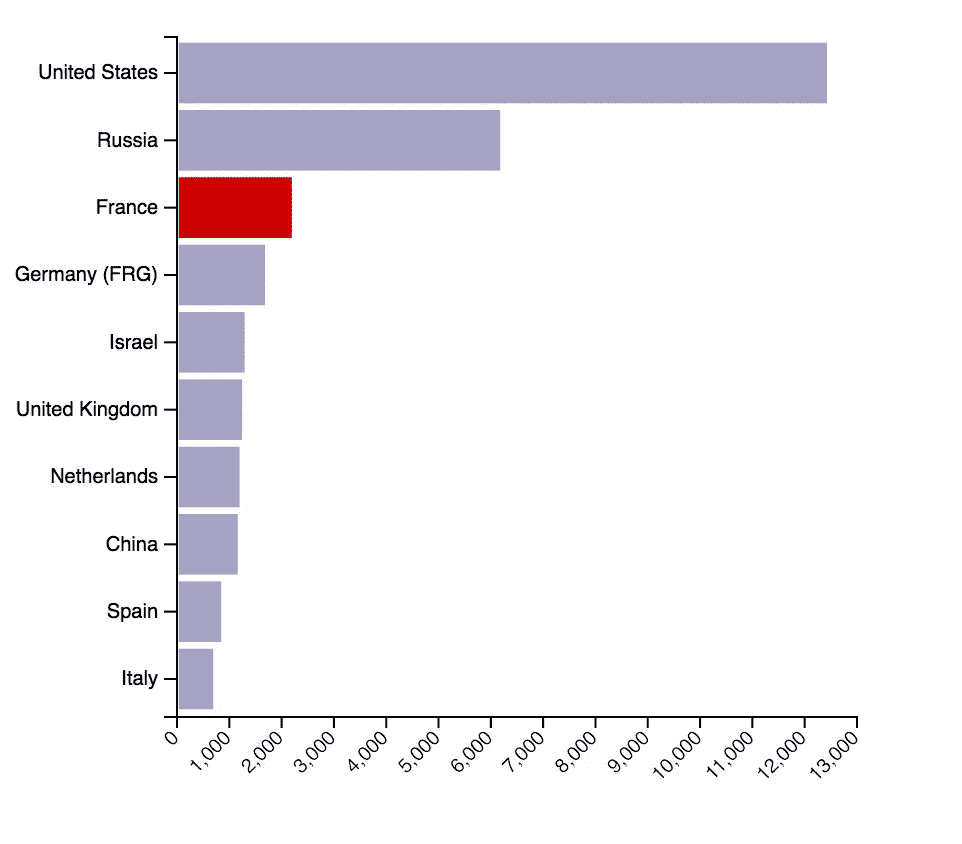
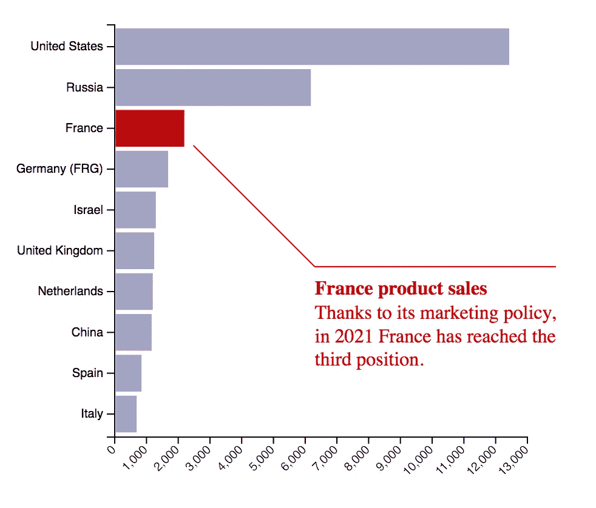
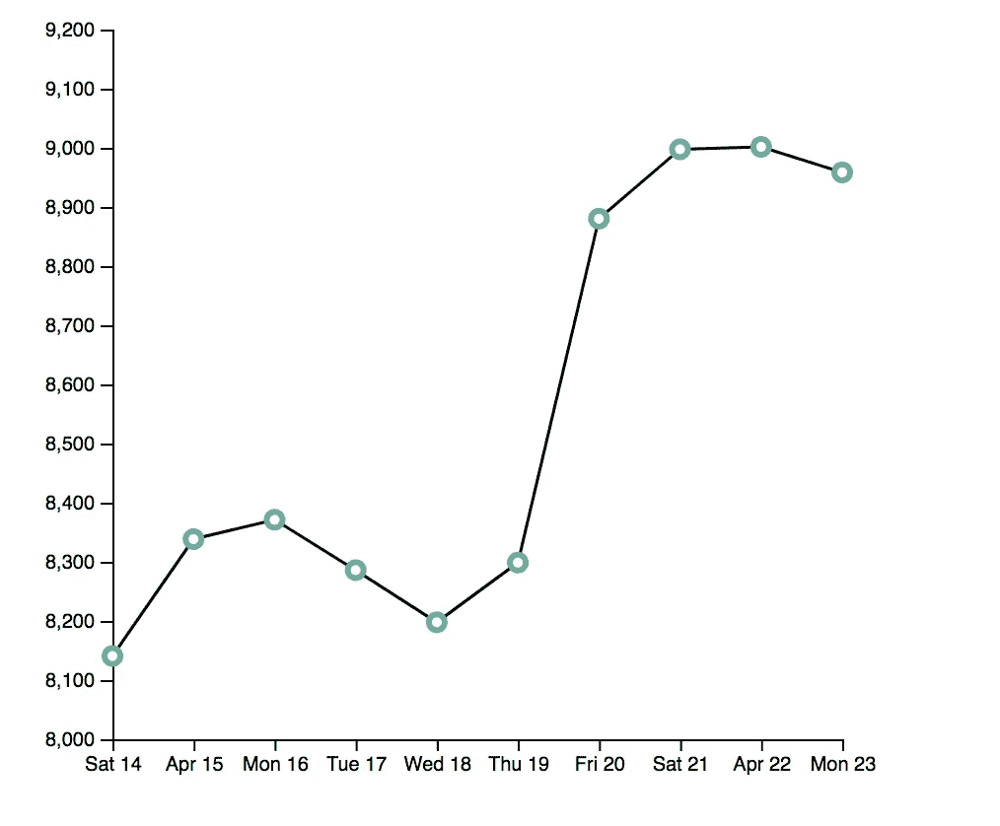
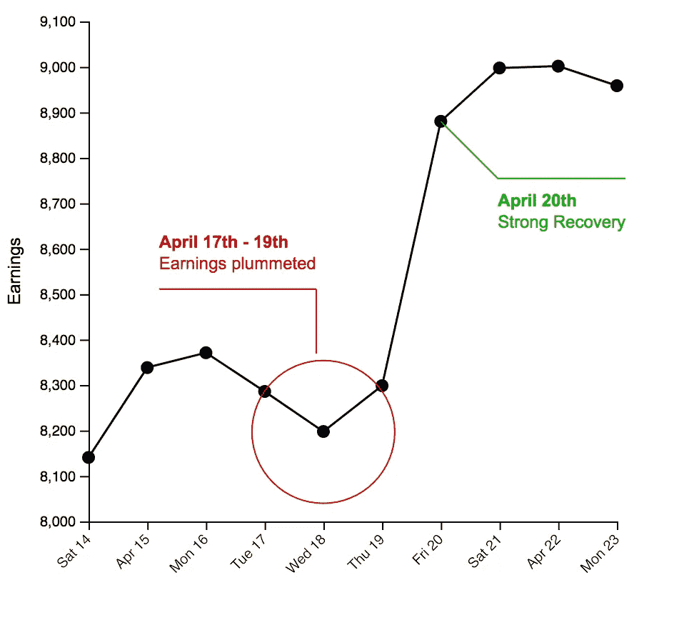

# 如何改进带注释的 D3.js 图形

> 原文：<https://towardsdatascience.com/how-to-improve-d3-js-graphs-with-annotations-252fbb9c5bb5?source=collection_archive---------27----------------------->

## 数据可视化

## 一个简短的教程，将简单的 D3.js 图形转换成带有上下文的精彩图形



作者图片

数据驱动库(D3)是用来构建图表和绘画的最著名的 Javascript 库之一。关于图形，有许多网站提供现成的代码，如 [D3 图库](https://www.d3-graph-gallery.com/)和[从数据到视觉](https://www.data-to-viz.com/)。然而，这些网站只提供基本代码，没有提示或细节来突出数据背景或见解。

在本教程中，我利用了 [d3-annotation](https://d3-annotation.susielu.com/) 库来扩展由 D3 Graph Gallery 提供的两个简单的图形，以使它们对普通读者更具可读性:

*   简单的条形图
*   简单的折线图

> 从来没有人因为一个数字而做出决定。他们需要一个故事。(丹·卡尼曼)

所有代码都在我的 [GitHub 库](https://github.com/alod83/data-science/tree/master/DataVisualization/D3Graphs)中。

# 条形图

第一个例子是由 D3 图形库提供的[简单条形图](https://www.d3-graph-gallery.com/graph/barplot_horizontal.html)，如下图所示:



作者图片

该图尝试绘制以下数据集:



作者图片

从数据上下文的角度来看，该图至少提出了两个问题:

*   栏中的国家没有排序，因此很难理解哪个国家比其他国家表现得更好。
*   图表上没有焦点，因此读者应该想象图表想要表达什么。

为了改进图表，我将这两个问题分开处理。

关于条形图的顺序，可以通过根据值字段将所有结果按降序排列来改进图表。在 D3 中，这可以通过`sort`功能实现:

```
data.sort(function(x, y){return d3.descending(x.Value, y.Value);})
```

该函数需要一个函数作为输入参数，该函数指定用于对每对字段进行排序的规则。

关于图形没有焦点的事实，我可以将焦点放在单个国家，例如法国，并用不同于其他国家的颜色来表示它。此外，我可以将其他国家的颜色改为灰色，以减少其他国家产生的噪音。这可以通过为每个国家生成的矩形指定特定颜色来实现:

```
svg.selectAll("myRect")
    // other code
    .attr("fill", function(d){ if (d.Country == 'France') return "#cc0000" ; else return "#a3a3c2"})
```

所描述的效果提供了下图:



作者图片

现在，我可以想象描述为什么法国在排名中达到了第三的位置。也许这是由于它去年强有力的营销政策。因此，我可以向图表添加注释，解释上下文。

首先，我通过指定文本(在`note`字段中)、颜色和位置(通过`x, y, dx`和`dy`键)来构建注释:

```
const annotations = [
    {
    note: {
      label: "Thanks to its marketing policy, in 2021 France has reached the third position.",
      title: "France product sales",
      wrap: 200,  // try something smaller to see text split in several lines
      padding: 10   // More = text lower

    },
    color: ["#cc0000"],
    x: x(2500),
    y: 100,
    dy: 100,
    dx: 100
  }
```

然后我将注释附加到 SVG 图中:

```
const makeAnnotations = d3.annotation()
  .annotations(annotations)svg.append("g")
  .call(makeAnnotations)
```

下图显示了最终结果:



作者图片

# 折线图

第一个例子是由 D3 图形库提供的[简单折线图](https://www.d3-graph-gallery.com/graph/connectedscatter_tooltip.html)，如下图所示:



作者图片

这条线主要存在两个问题:

*   y 轴没有标签，因此很难理解测量单位。
*   与上图类似，没有上下文。

关于 y 轴标签，添加起来很简单。我在 SVG 图像中添加了一些文本(例如*收入*),我将它旋转了 90 度，放在 y 轴附近:

```
svg.append("text")
      .attr("transform", "rotate(-90)")
      .attr("y", 0 - margin.left)
      .attr("x",0 - (height / 2))
      .attr("dy", "1em")
      .style("text-anchor", "middle")
      .text("Earnings");
```

关于语境，要看数据。我可以想象，这些数据指的是法国在特定时期的收入。我注意到在 18 日星期三有一次失败，而从 20 日星期五开始数据再次上升。因此，我可以用两点来强调这两个方面。

第一个注释应该突出显示所有的*翻转*周期，因此我可以使用一个`d3.annotationCalloutCircle`，而第二个注释只能突出显示一个点，对应于星期五 20 日，因此我可以使用一个`d3.annotationCalloutElbow`。

下面是构建注释的代码:

```
var parseDate = function(d){ return d3.timeParse("%Y-%m-%d")(d)}
      const annotations = [
       // first annotation
        {
      note: {
        label: "Earnings plummeted",
        title: "April 17th - 19th",
        wrap: 150,  // try something smaller to see text split in several lines
        padding: 10   // More = text lower

     },
     color: ["#cc0000"],
     x: x(parseDate('2018-04-18')),
     y: y(8197),
     dy: -100,
     dx: -5,
     subject: {
      radius: 50,
      radiusPadding: 5
    },
    type: d3.annotationCalloutCircle,
    },
    // second annotation
        {
      note: {
        label: "Strong Recovery",
        title: "April 20th",
        wrap: 150,  // try something smaller to see text split in several lines
        padding: 10   // More = text lower

     },
     color: [" #00b300"],
     x: x(parseDate('2018-04-20')),
     y: y(8880.23),
     dy: 40,
     dx: 40,
    type: d3.annotationCalloutElbow,
    },

      ]

      window.makeAnnotations = d3.annotation()
        .annotations(annotations)

        svg.append("g")
    .call(makeAnnotations)
```

我定义了一个变量`parseDate`，它解析一个字符串并返回一个日期。

下图显示了最终的图形:



作者图片

# 摘要

在这个简短的教程中，我举例说明了如何改进条形图和折线图，以便提供一些背景信息。我已经开发了`d3-annotation`库，这是 d3 注释的第三方库。

在接下来的几天里，我将写一篇关于改进地理地图的教程…敬请期待；)

如果你想了解我的研究和其他活动的最新情况，你可以在 [Twitter](https://twitter.com/alod83) 、 [Youtube](https://www.youtube.com/channel/UC4O8-FtQqGIsgDW_ytXIWOg?view_as=subscriber) 和 [Github](https://github.com/alod83) 上关注我。

# 相关文章

</how-to-build-a-basic-line-in-d3-js-38f67055043f>  <https://medium.datadriveninvestor.com/getting-started-with-d3-js-maps-e721ba6d8560>  </how-to-build-a-dynamic-bar-chart-in-observablehq-through-sqlite3-f8f8b6509ac8>  

# 上下文分析能帮助提取有意义的见解吗？

**上下文分析**包括围绕数据集的所有*世界的分析。数据集周围的世界可能包括不同的方面。例如，如果您正在测量一段时间内海面的温度，环境可能包括天气条件、一些船只的存在等等。*

定义上下文分析有三个要素:

*   事件
*   环境
*   时间

在这里阅读更多。