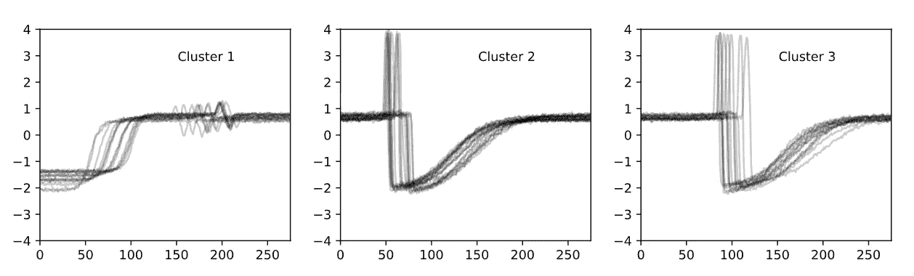
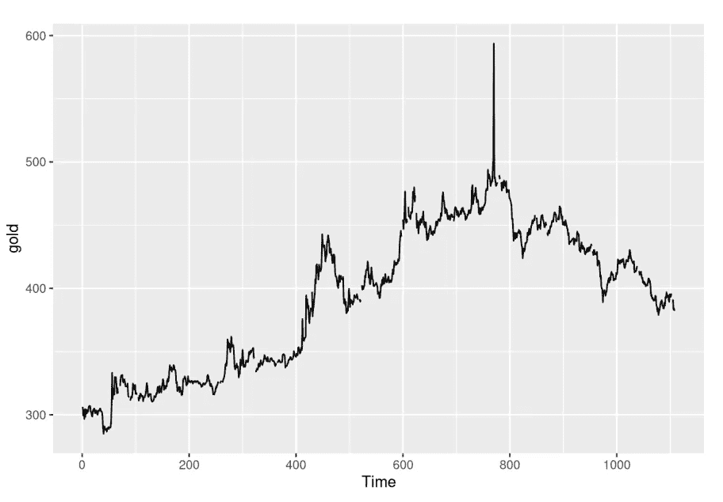
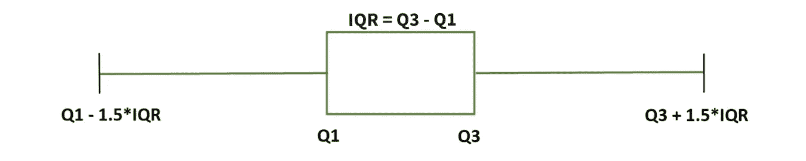
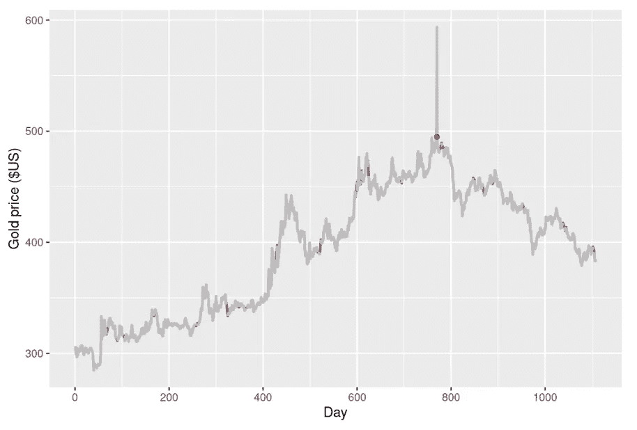
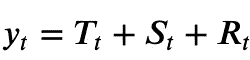
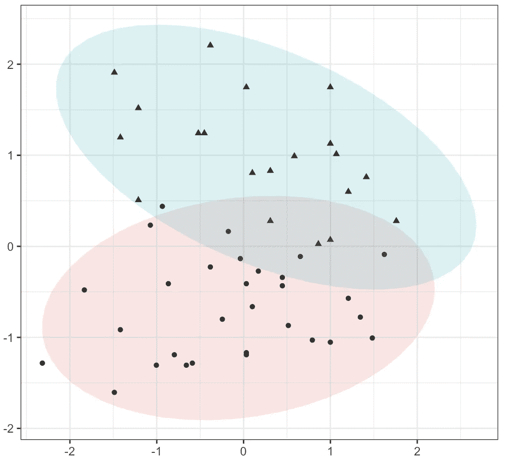
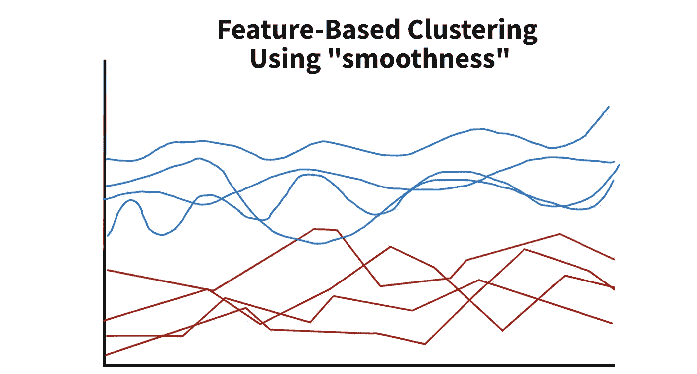
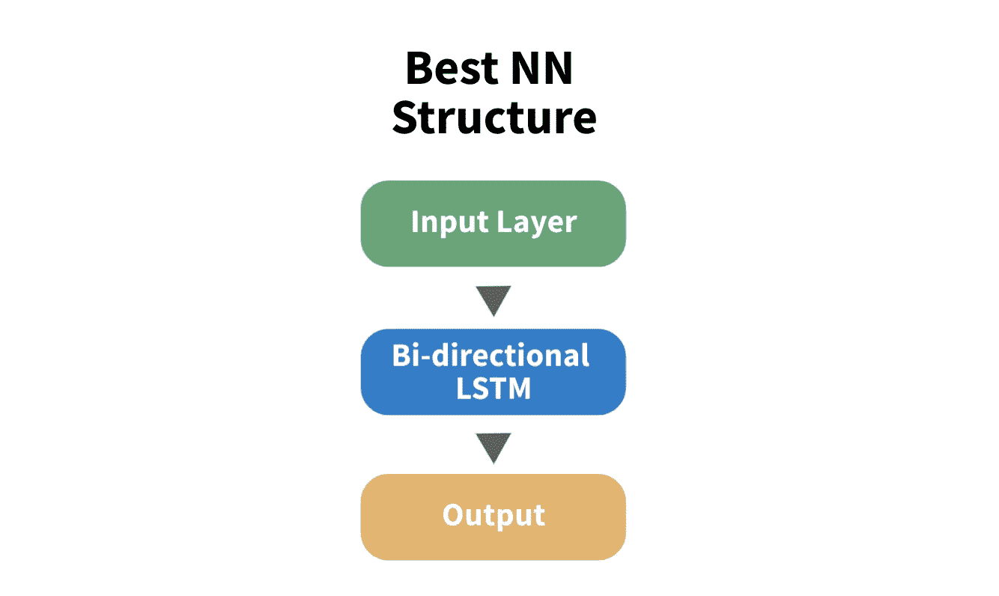

# 如何改进时间序列的深度学习预测—第 1 部分

> 原文：<https://towardsdatascience.com/how-to-improve-deep-learning-forecasts-for-time-series-1799e3975d7c?source=collection_archive---------8----------------------->

## 集群背后的理论及其好处。

在拟合之前对时间序列数据进行聚类可以提高约 33%的精度— [src](https://arxiv.org/pdf/2001.09547.pdf) 。

图 1:时间序列聚类示例。图片作者。

2021 年，加州大学洛杉矶分校的研究人员开发了[一种方法](https://arxiv.org/pdf/2001.09547.pdf)，可以提高许多不同时间序列的模型拟合度。通过聚集相似结构的数据并为每一组拟合一个模型，我们的模型可以专门化。

虽然实现起来相当简单，但与任何其他复杂的深度学习方法一样，我们经常受到大型数据集的计算限制。然而，所有列出的方法都支持 R 和 python，所以在较小的数据集上开发应该非常“简单”

在本帖中，我们将从一个技术概述开始，然后进入为什么聚类提高时间序列预测拟合的本质。[这是第二部分](https://michaelberk.medium.com/how-to-improve-deep-learning-forecasts-for-time-series-part-2-c11efc8dfee2)。

让我们开始吧…

# 1 —技术 TLDR

有效的预处理和聚类可以提高神经网络对序列数据的预测精度。该文件有助于以下每个领域:

1.  利用黄土和 r 中的 [tsclean](https://www.rdocumentation.org/packages/forecast/versions/8.15/topics/tsclean) 包移除异常值。
2.  使用 k 近邻输入缺失数据。
3.  使用基于距离和基于特征的方法进行聚类。
4.  概述利用聚类数据的神经网络架构。

# 2 —但是实际上发生了什么呢？

我们的主要目标是提高[深度学习对许多相关时间序列](/deep-learning-for-time-series-data-ed410da30798) (TS)预测的准确性。然而，与任何预测模型一样，它们的好坏取决于它们的数据，因此在本文中，我们将主要关注数据争论。

出于解释的目的，让我们假设我们有一个理论数据集，其中我们观察世界各地不同市场的黄金价格。这些市场中的每一个都试图接近全球价格进行交易，但是由于其所在地的供需波动，价格可能会发生变化。

在下面的图 2 中，我们看到了其中一个市场的时间序列。

图 2:黄金价格随时间的时间序列— [src](https://www.r-bloggers.com/2021/08/detecting-time-series-outliers/) 。图片作者。

现在一些市场有相似之处。那些靠近金矿的地区受运输成本的影响较小，因此它们的供应波动性较低。相反，富有买家的地区需求波动较小。

我们的方法将把相似的时间序列组合在一起，这样我们的模型就能适应特定的情况，从而表现出更高的准确性。

## 2.1—数据预处理

数据预处理是一个手动过程，有助于从潜在的噪声和稀疏数据中提取信号。常见的第一步是去除异常值。

图 3: IQR 方法，其中 Q1 是第一个四分位数，Q3 是第三个四分位数。超出左/右界限的值是异常值。图片作者。

存在大量的非时间异常值检测方法，例如经典的 IQR 方法(图 3 ),其中我们排除了距离分布中心足够远的数据。但是，对于时间序列数据，我们必须采取特殊的预防措施。

例如，**如果随着时间的推移，我们的数据出现了强烈的趋势、方差变化或其他一些系统性变化，传统的异常值检测方法就会失效。**

为了应对数据的时间变化，我们建议使用一个名为 [tsclean](https://www.r-bloggers.com/2021/08/detecting-time-series-outliers/) 的 R 包。幸运的是，它还支持缺失数据插补，所以如果你的时间序列有空值，你可以很容易地插入它们。在这一步之后，我们将得到一个去除了异常值的不间断的时间序列，如图 4 所示。

图 4:缺失估算(红色)和异常值调整(蓝色)数据— [src](https://www.r-bloggers.com/2021/08/detecting-time-series-outliers/) 。图片作者。

如果你好奇这个方法是如何工作的，简而言之， ***tsclean* 将我们的时间序列分解成趋势、季节和“其余”部分**，如下所示。

图 5: tsclean 分解其中 T 是趋势，S 是季节性，R 是其余部分。图片作者。

从这里开始，我们在 *R_t* 上使用 IQR 异常值检测方法。通过在我们的时间序列的静态(去趋势)部分寻找异常值，我们更有可能找到实际的异常值，而不是依赖于时间的变化。

最后，如前所述， *tsclean* 软件包支持数据插补的线性插值。线性插值只是用缺失值旁边的非空点的平均值替换缺失值。尽管有这个功能，作者建议使用一种不同的方法，叫做[kNNImpute](https://machinelearningmastery.com/knn-imputation-for-missing-values-in-machine-learning/)—[R package](https://www.rdocumentation.org/packages/impute/versions/1.46.0/topics/impute.knn)。不幸的是，kNNImpute 超出了本文的范围，但是上面的链接提供了一个健壮的演练。

## 2.2 —聚类

现在我们有了一个干净的时间序列，我们将把我们的时间序列值聚类到相似的集合中。

聚类的目的是提高我们模型的准确性。**通过处理多组相似的数据点，我们更有可能精确地拟合数据。**

图 6:基于距离的聚类示例— [src](https://rpubs.com/cyobero/k-means) 。图片作者。

有两大类集群。第一种类型称为基于距离的聚类。这种方法只是为了最小化聚类中数据点之间的距离。作者建议使用动态时间弯曲(DTW ),这是一种非常健壮和常用的序列数据距离度量方法。与 kNNImpute 一样，这种方法超出了本文的范围，但简而言之，它增加了距离最小化目标的约束，以允许在连续序列之间进行更健壮的比较。

图 7:基于特征聚类成两组(红色和蓝色)的理论示例。图片作者。

第二种方法称为基于特征的聚类。正如您所料，它使用特性将数据点分组到不同的簇中。这很难想象，所以我们在图 7 中创建了一个示例图表。

在本文中，我们测试了两组特性。第一个包括特定于时间序列的特征，如自相关、部分自相关和霍尔特参数。第二组借鉴了信号处理的思想，包括能量、快速傅立叶变换(FFT)系数和方差。通过利用关于数据的信息，我们有望看到组内一致的模式。在此基础上，我们可以为每一组建立一个模型。

当在模拟数据上运行时，**基于特征的聚类优于基于距离的聚类。并且，在两个特征集中，基于信号的特征优于时间序列特征。**

## 2.3—神经网络架构

现在，我们已经清理了原始数据并开发了聚类，我们准备开发我们的神经网络架构并进行训练。

本文概述了 7 种体系结构，其中一些结合了动态和静态特性。在我们的黄金市场示例中，动态特征可以是天气，静态特征可以是市场的位置。

图 8:显示集群数据最佳性能的模型结构。作者图片

在本文测试的合成数据上，简单的双向 LSTM 表现最佳。令人惊讶的是，合成数据中的静态特征并没有提高准确性，然而这种观察非常依赖于数据。对于您的用例，您可能想要探索包含静态特性的其他架构。

现在你知道了！

# 3 —摘要

在这篇文章中，我们介绍了如何预处理和聚类时间序列数据。单独的聚类被引用来提高大约 33%的分类准确度。然而，需要注意的是，这些测试是在合成数据上运行的——您的数据可以看到不同程度的改进。

概括地说，我们首先通过使用季节分解和 IQR 方法去除异常值来预处理数据。然后，我们使用 K 近邻估算缺失数据。

有了干净的数据集，我们对时间序列数据集进行了聚类。最可靠的方法是使用信号处理功能。

由此可见，双向 LSTM 是观察到的训练数据的最有效方法。静态特征没有提高准确性。

本文中讨论了许多备选方案，如果您需要提高模型的准确性，可能值得探索这些方案。

*感谢阅读！我会再写 31 篇文章，把学术研究带到 DS 行业。查看我的评论，链接到这篇文章的主要来源和一些有用的资源。*