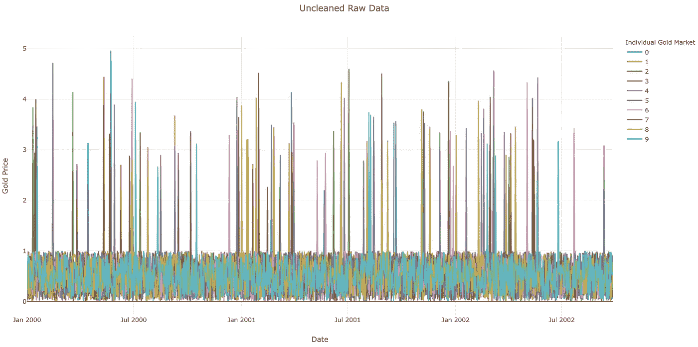
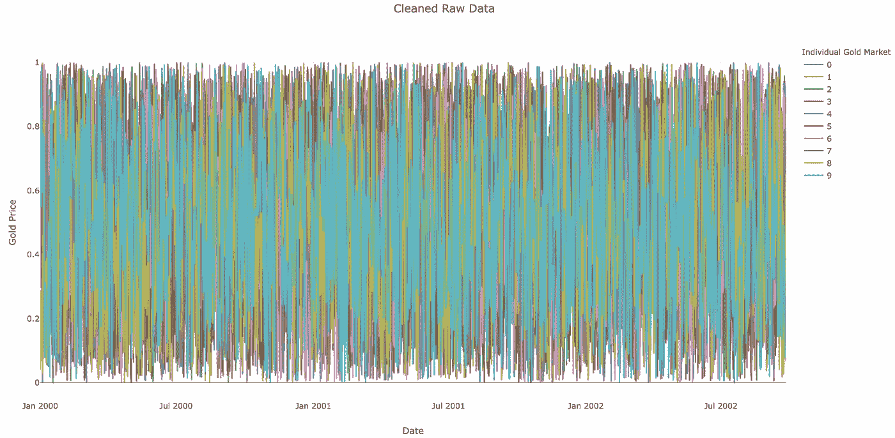
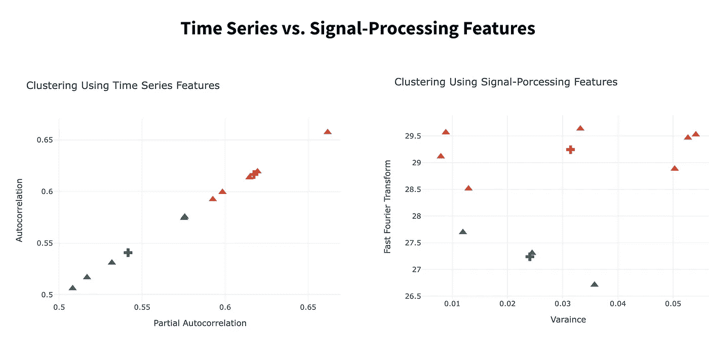
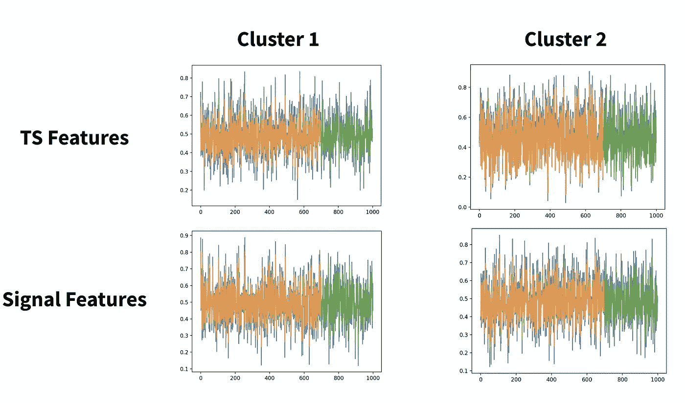
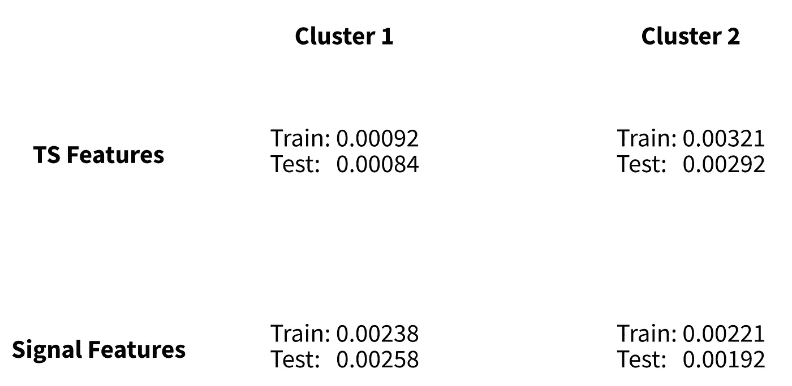

# 如何改进时间序列的深度学习预测—第 2 部分

> 原文：<https://towardsdatascience.com/how-to-improve-deep-learning-forecasts-for-time-series-part-2-c11efc8dfee2?source=collection_archive---------24----------------------->

## 时序数据聚类背后的代码。

在[之前的文章](/how-to-improve-deep-learning-forecasts-for-time-series-1799e3975d7c)中，我们解释了时间序列数据的聚类是如何工作的。在本帖中，我们将深入探究代码本身。

所有的东西都会用 python 写，但是大多数库都有 R 版本。我们将努力保持相对较高的水平，但如果你想了解更多，代码会有一些有用的资源。

事不宜迟，我们开始吧。

# 0 —数据创建

为了有助于解释，让我们利用一个理论上的例子:**我们试图通过使用来自世界各地本地市场的信息来预测黄金价格。**

首先，我们开发一个 1000 x 10 的数据帧。每行对应一个独特的时间点，在我们的例子中是一天，每列对应一个不同的黄金市场。我们数据框中的所有值都是价格。

```
# create data
rng = pd.date_range('2000-01-01', freq='d', periods=n_rows)
df = pd.DataFrame(np.random.rand(n_rows, n_cols), index=rng)
```

上面的代码极大地简化了我们的例子。一个概念性的问题是，价格总是取 0 到 1 之间的值，然而代码的教训仍然适用。

创建了一个合成数据框，让我们把它变脏。

```
# "unclean" data
df = df.apply(lambda x: make_outliers_on_col(x), axis='index')
df = df.apply(lambda x: make_nan_on_col(x), axis='index')
```

上面的函数在我们的数据框中随机输入了 10 个异常值和 10 个空值。我们生成的数据框看起来像这样…



图 1:合成数据会丢失值和异常值。作者图片

## 1 —数据清理

有两个主要的数据清理步骤:缺失数据插补和异常值剔除。幸运的是，熊猫有一些简单的内置方法可以帮助我们。

```
# interpolate missing values
df = df.interpolate(method='spline', order=1, limit=10, limit_direction='both')# interpolate outliers
df = df.apply(lambda x: nullify_outliers(x), axis='index')
df = df.interpolate(method='spline', order=1, limit=10, limit_direction='both')
```

我们的策略很简单。我们首先使用样条插值法估算所有缺失的数据。然后，我们用空值替换所有异常值，并再次使用样条插值。

论文提出了多种缺失值插补方法，其中一些包括[插值](https://en.wikipedia.org/wiki/Linear_interpolation)(如上所示)[奇异值分解(SVD)插补](https://arxiv.org/abs/1804.11087)和 [K 近邻(KNN)插补](https://machinelearningmastery.com/knn-imputation-for-missing-values-in-machine-learning/)。

**如果你在乎速度，SVD 或者插值是你最好的选择。KNN 可能会提供更好的结果，但它的计算量更大。**

在这一步结束时，我们将得到如图 2 所示的数据框:



图 2:合成清理数据将缺失值和离群值进行估算。作者图片

## 2 —聚类

有了清晰的数据集，我们现在将寻找具有相似特征的黄金市场。我们的假设是，相似的市场将更容易被模型拟合，从而导致更准确的预测。

论文中引用的最有效的分类类型包括利用每个时间序列的特征。我们会看两种类型:**时间序列和信号处理特征**。

```
# TS-specific features
autocorrelation = df.apply(lambda x: acf(x, nlags=3), axis='index')
partial_autocorrelation = df.apply(lambda x: pacf(x, nlags=3), axis='index')# Signal-processing-specific features
fast_fourier_transform = df.apply(lambda x: np.fft.fft(x), axis='index')
variance = df.apply(lambda x: np.var(x), axis='index')
```

从这里，我们可以对每对特征集执行 k-means 聚类。为了简单起见，我们只限于两个特性，但是本文列举了两个组的四个潜在特性。

```
import numpy as np
from scipy.cluster.vq import kmeans2# setup ts and signal features for clustering
features = [np.array([autocorrelation, partial_autocorrelation]),
            np.array([fast_fourier_transform, variance])]for f in features:
    # cluster
    out = kmeans2(f, 2)
    cluster_centers, labels = out # ...
```

上面的代码将我们的 10 个黄金市场分成两个不同的组，如图 3 所示。



图 3:我们的时间序列数据的聚类。左图使用时间序列特征，右图使用信号处理特征。图片作者。

既然我们已经将数据分组到“相似的”时间序列中，我们就可以为每个组建模了。

## 3 —预测模型

该论文认为双向 LSTM 具有最好的精确度。尽管名字很吓人，双向 LSTM 只是两个 LSTM。第一种是用常规输入进行前向后向训练。第二种是用反向输入向量从后向前训练的。

**通过在一个时期内创建两个学习结构，模型通常会更快地收敛，并更完整地学习数据中的结构。**

然而，为了简单起见，我们将使用基本的 LSTM，但是这些概念可以很容易地应用于更复杂的模型结构。

在这样做之前，重要的是要注意我们在每个聚类中对时间序列值进行了平均。有些模型，如 [DeepAR](/deep-learning-for-time-series-data-ed410da30798) ，适合多个时间序列，并输出单一预测。然而，普通 LSTMs 需要单变量数据。

```
from keras.models import Sequential
from keras.layers import Dense
from keras.layers import LSTM# fit basic LSTM
model = Sequential()
model.add(LSTM(4, input_shape=(1, look_back)))
model.add(Dense(1))
model.compile(loss='mean_squared_error', optimizer='adam')
model.fit(trainX, trainY, epochs=n_epoch, batch_size=1, verbose=2)
```

上面的代码在所有 4 个数据集上迭代运行，它们的精度如图 4 所示。



图 4:我们每个集群的时间序列预测。蓝色是原始数据，橙色是训练 preds，绿色是我们的预测。图片作者。

仅通过视觉判断，我们的预测似乎没有太大差异，所以让我们看看每个模型的均方根误差(RMSE)。



图 5:我们四个模型的 RMSE。图片作者。

图 5 为我们的评估增加了更多的粒度。我们可以看到，TS 功能在群集 1 上的表现优于信号功能，但在群集 2 上表现较差。总的来说，每组的聚类 1 和聚类 2 之间的平均 RMSE 是相似的。

现在你可能想知道为什么不同组的表现如此相似。如果你还记得，我们的数据生成机制对所有时间序列都是一样的。

**聚类的目的是提取时间序列模型中的系统差异。然后我们可以为每一个开发一个专门的模型。**

如果数据具有相同的底层数据生成机制，聚类将无助于预测性能。

## 4 —后续步骤

以上演练的完整代码可以在[这里](https://github.com/mberk06/DS_academic_papers/blob/master/22_time_series_cleaning_and_clustering.py)看到。然而，对于具有真实世界数据的建模项目，建议进行更多的尝试。

例如，利用主题知识来了解时间序列应该如何分组也是非常有益的。黄金数据的一个例子是在相似的地理位置对时间序列进行聚类。如果你没有主题知识，这里有更多的想法:

*   聚集更多功能
*   同时在 TS 和基于信号的功能上集群
*   使用更复杂的深度学习结构
*   介绍静态特性([文章](https://arxiv.org/pdf/2001.09547.pdf)讨论了这方面的架构)

*感谢阅读！我会再写 30 篇文章，把学术研究带到 DS 行业。查看我的评论，链接到这篇文章的主要来源和一些有用的资源。*