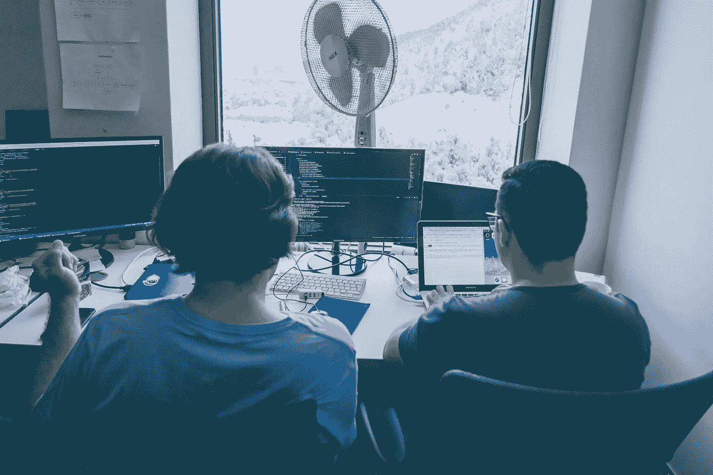

# 提高你的编程技能

> 原文：<https://towardsdatascience.com/how-to-improve-programming-skills-for-data-scientists-and-machine-learning-practitioners-d865d8aadab1?source=collection_archive---------26----------------------->

## 编程；编排

## 从机器学习从业者的角度来看，提高编程技能的五种方法。

罗曼·辛克维奇在 [Unsplash](https://unsplash.com/s/photos/code?utm_source=unsplash&utm_medium=referral&utm_content=creditCopyText) 上拍摄的照片

**我讨厌编程！**

这是七年前我实习时对我的同学们说的话。这是真的。我避免像公共交通工具上的无面具人一样编写项目。

快进到今天，我已经获得了编码相关学科的两个高级学位，在五家不同的公司担任 web 开发人员，现在我是一名计算机视觉工程师。

**我爱编程！**

如果有人问我为什么对技术如此热情，我会这么说。我对编程的热爱源于这样一种认识，即用代码实现一个应用程序实际上在一个技术驱动的社会中打开了机会。

这篇文章介绍了我用来确保我的编程技能不断提高的方法。对你来说，这篇文章将介绍五个策略，你可以采用它们来**提高你的编程技能**。

# 1.练习算法

算法往往会吓跑很多 ML 从业者，包括我。机器学习领域作为一种消除实现启发式算法来检测模式的需要的方法而出现，我们将特征检测留给神经网络。

尽管如此，算法在软件和计算领域仍有一席之地，当然在机器学习领域也有一席之地。

[Pankaj Patel](https://unsplash.com/@pankajpatel?utm_source=unsplash&utm_medium=referral&utm_content=creditCopyText) 在 [Unsplash](https://unsplash.com/s/photos/code?utm_source=unsplash&utm_medium=referral&utm_content=creditCopyText) 上拍摄的照片

练习算法的实现是提高编程技能的推荐方法之一。

除了**在实现内存高效代码上建立直觉的明显好处**之外，处理算法还有另一个好处，那就是**发展解决问题的思维**。

实现算法包括在您选择的编程语言中探索各种数据结构和数据修改方法。理解如何在编程语言中利用数据对象、方法和其他有用的功能**可以提高编程效率**。

数据科学家经常实现数据挖掘和 web 抓取算法。对算法和数据结构有很好的理解可以帮助实现**高效的代码，在生产中执行得更快**。这具有减少总项目交付时间的连锁效应。

算法有不同的复杂程度，但这里有一个简单算法对[的解释，可以让你热身。](/algorithms-for-data-scientists-insertion-sort-6caa69f906b3)

## 亲身经历

作为一名移动计算机视觉工程师，我利用许多深度学习模型来完成常见的 CV 任务，如姿势估计、对象检测等。

尽管 PyTorch、TensorFlow 和 Keras 等平台抽象了模型实现的复杂性，但我发现需要为特定用例实现定制算法。

例如，创建具有[余弦相似度](/understanding-cosine-similarity-and-its-application-fd42f585296a)的姿态匹配算法，或者有效地遍历作为机器学习模型的输出而获得的数据结构。

为了确保我对各种算法有足够的了解，以至于*危险，*我购买了[圣杯](https://mitpress.mit.edu/books/introduction-algorithms-third-edition)。

《算法导论》教科书可能不是一个完全对初学者友好的算法世界介绍，在这种情况下，像 [HackerRank](https://www.hackerrank.com/) 和 [CodeWars](https://www.codewars.com/) 这样的平台是有益的。

# 2.技术书籍

从书本中学习确实让我感觉像回到了学校——没有被拘留，但是没有什么能比得上从写得很好的健壮的技术书籍中获得的知识。

在我职业生涯的早期，我一直认为我最终会停止观看 YouTube 教程和购买编码书籍，主要是因为我将获得*‘忍者级’*编码技能。

几年过去了，我已经意识到，无论你消费多少，关于编程语言，你总能学到更多。尽管我很喜欢通过 YouTube 编码教程学习，但是没有什么可以取代优秀的技术编码书籍中丰富而简明的知识。

以 Python 为例，它是数据科学家的标准编程语言。Python 是一种容易掌握的语言。经过几周对语法、数据结构和常用函数的学习，实现和运行定制 python 脚本变得很容易。你或许可以通过[视频](https://www.youtube.com/watch?v=_uQrJ0TkZlc)将 Python 学习到中级技能。

但是，Python 编程语言还有很多东西需要探索，可以提高您的编程技能。我发现更多关于 Python 语言的一种方式是通过技术书籍，更具体地说是 [**流利的 Python**](https://www.oreilly.com/library/view/fluent-python/9781491946237/) **。这本书对初学者来说并不友好，但它的目标读者是希望提高 Python 语言熟练程度的中级到专家程序员。**

总之，技术书籍通过提供对编程语言的简单介绍，提高了数据科学家的编程技能。此外，通过对编程语言的深入探索，提升数据科学家的现有编程技能。

# 3.阅读其他开发人员的代码

照片由[海拉戈斯蒂奇](https://unsplash.com/@heylagostechie?utm_source=unsplash&utm_medium=referral&utm_content=creditCopyText)在 [Unsplash](https://unsplash.com/s/photos/code-review?utm_source=unsplash&utm_medium=referral&utm_content=creditCopyText) 上拍摄

最近我尝试实现了 Inception Network，这是一个深度学习卷积神经网络。

虽然我有自己的方法来使用 Python 和 TensorFlow 库实现网络，但我很好奇其他 ML 从业者是如何实现网络的。

我的探索将我带到了几个 GitHub 库。我研究了其他开发人员的代码，不用说，我学习了改进我的实现方法的方法，并在我现有的编程技能基础上进行更广泛的开发。

有大量的公共 GitHub repos 可供探索和学习。你不必在谷歌或脸书这样的科技公司工作，也可以向他们的开发者学习。简单地探索由他们的工程师开发的项目的公共存储库。对于数据科学家来说，这可能意味着探索 repos，例如最近发布的 [Detectron2](https://github.com/facebookresearch/detectron2) 或其他开源机器学习工具。

在您的工作场所，在您的内部开发团队中进行代码评审是一种合适的学习方法。通过理解其他开发人员实现方法背后的推理和直觉，您间接地扩展了您的视野和编程知识。

# 4.学习其他编程语言

致力于编程语言的多样性是提高编程技能的可靠途径。程序员实现代码来解决问题，多种编程语言的知识扩展了解决问题的工具。

仅仅了解 Python 就可以帮助你学习数据科学的核心实践方面。也就是说，在专业/实践环境中，软件开发包含不同的平台，每个平台都有特定的语言用于访问和实现功能。

一个专业的 ML 从业者角色可能在下面显示的方法中利用不同的编程语言:

*   **JavaScript** 从互联网上抓取数据
*   **SQL** 修改和查询数据库
*   **Python** 实现算法和 ML 模型
*   **Swift/Kotlin/Java** 开发集成了 ML 模型的移动设备应用
*   还有很多。

一旦你已经精通了一门编程语言，学习一门新的编程语言就更容易了。如果你理解传统的软件开发范例，比如面向对象编程、函数式编程等等，那就更容易了。软件开发范例知识适用于各种编程语言。

# 5.遵守软件开发原则

阿尔瓦罗·雷耶斯在 [Unsplash](https://unsplash.com/s/photos/code?utm_source=unsplash&utm_medium=referral&utm_content=creditCopyText) 上拍摄的照片

拥抱简单，避免重复，提高可读性。

这些是我在多年的编码工作中积累的经验。它们可能听起来很简单，但是这些原则是大多数开发人员所缺乏的，我有时会忘记坚持这些实践。

因此，在软件工程领域中，教授并实施了一些原则，以确保开发人员实践干净高效的软件开发。下面我列举了几个。

## 吻

在开发软件时，eep**I**t**S**imple**S**tupid 加强了简单的概念。一个问题的解决方案不需要很复杂，在软件开发的设计和实现阶段采用简单性可以确保编写的代码容易理解和维护。

是的，炫耀可能很诱人，但为了可读性，保持简单— *你是* *而不是机器人先生*

## 固体

Solid 包含一组原则，旨在确保面向对象的开发人员构建可重用、可伸缩、可维护和高效的程序。要了解 SOLID 中所涵盖的原理的更多用法和实用性，请查看 Katerina Trajchevska 的视频。

*   单一责任原则
*   **O** 关笔原理
*   **L** 伊斯科夫替代原理
*   **I** 界面偏析原理
*   **D** 依赖反转原理

## 干燥的

D**D**t**R**e**Y**我们自己动手。这个原则非常自我描述。在实现程序时，编写执行现有功能的代码是对开发时间的低效利用。避免重复的一个好方法是利用项目文件夹中的实用程序文件。实用程序文件包含经常在源代码中执行的常见任务。

# 值得注意的提及

## 个人项目

承担一个个人项目向一些 ML 从业者介绍新的领域、库、平台、框架和编程语言。

使用个人项目来提高你的编程技能的主要好处在于可以接触到开发软件产品时遇到的不同问题。通过编程解决的每个问题都会增加您的总体技术经验。

## 教学

教育他人如何用你有经验的语言编写程序是一种行之有效的方法，可以提高你的编程技能，展示你的专业知识。

你可以用各种方式教学，或者通过 YouTube 视频，在线课程，或者我最喜欢的媒体文章。

# 结论

提升你的编程技能是一段没有目的地的旅程。编程总有你可以学习或改进的地方。

> 学会享受学习的过程。

有时事情确实变得棘手，StackOverflow 可能没有所有的答案，但请记住，每一次努力和每一分钟磨练你的手艺都会走向精通。

*感谢阅读*

# 要联系我或找到更多类似本文的内容，请执行以下操作:

1.  订阅我的 [**邮箱列表**](https://richmond-alake.ck.page/c8e63294ee) 获取每周简讯
2.  跟我上 [**中**](https://richmondalake.medium.com/)
3.  在[**LinkedIn**](https://www.linkedin.com/in/richmondalake/)**和** [**Twitter**](https://twitter.com/richmondalake) 上连接并联系我