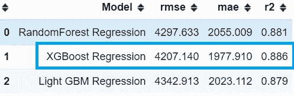

# 如何提高回归模型的准确性

> 原文：<https://towardsdatascience.com/how-to-improve-the-accuracy-of-a-regression-model-3517accf8604?source=collection_archive---------0----------------------->

## 提高模型精度的提示和技巧


马克 A 在 [Unsplash](https://unsplash.com/@grvault?utm_source=unsplash&utm_medium=referral&utm_content=creditCopyText) 上的照片

在这篇文章中，我们将看到如何处理回归问题，以及如何通过使用特征转换、特征工程、聚类、boosting 算法等概念来提高机器学习模型的准确性。

数据科学是一个迭代的过程，只有经过反复实验，我们才能获得满足我们需求的最佳模型/解决方案。


数据科学流程图-作者图片

让我们通过一个例子来关注上面的每个阶段。我有一个健康保险[数据集](https://github.com/sacharya225/data-expts/blob/master/Health%20Insurance%20Cost%20Prediction/insurance.csv) (CSV 文件)，里面有保险费用、年龄、性别、身体质量指数等客户信息。我们必须根据数据集中的这些参数来预测保险费用。这是一个回归问题，因为我们的目标变量——费用/保险成本——是数字。

让我们从加载数据集和探索属性(EDA 探索性数据分析)开始

```
#Load csv into a dataframe
df=pd.read_csv('insurance_data.csv')
df.head(3)#Get the number of rows and columns
print(f'Dataset size: {df.shape}')
**(1338,7)**
```


健康保险数据框架—作者图片

数据集有 1338 条记录和 6 个特征。吸烟者、性别和地区是分类变量，而年龄、身体质量指数和儿童是数字变量。

**处理空值/缺失值**

让我们检查数据集中缺失值的比例:

```
df.isnull().sum().sort_values(ascending=False)/df.shape[0]
```


列中空值的百分比-按作者排序的图像

年龄和身体质量指数有一些空值——尽管很少。我们将处理这些丢失的数据，然后开始我们的数据分析。Sklearn 的[simple imputr](https://scikit-learn.org/stable/modules/generated/sklearn.impute.SimpleImputer.html)允许您根据相应列中的平均值/中值/最频繁值替换缺失值。在这个例子中，我使用中间值来填充空值。

```
#Instantiate SimpleImputer 
si=SimpleImputer(missing_values = np.nan, strategy="median")
si.fit(df[[’age’, 'bmi’]])

#Filling missing data with median
df[[’age’, 'bmi’]] = si.transform(df[[’age’, 'bmi’]])
```

**数据可视化**

既然我们的数据是干净的，我们将通过可视化和地图来分析数据。一个简单的 seaborn [pairplot](https://seaborn.pydata.org/generated/seaborn.pairplot.html) 可以给我们很多见解！

```
sns.pairplot(data=df, diag_kind='kde')
```


Seaborn Pairplot —作者图片

我们看到了什么..？

1.  收费和孩子是倾斜的。
2.  年龄与电荷呈正相关。
3.  身体质量指数服从正态分布！😎

Seaborn 的[箱线图](https://seaborn.pydata.org/generated/seaborn.boxplot.html)和计数图可用于显示分类变量对电荷的影响。


分类变量的 seaborn 计数图—作者图片


作者图片

基于上述图的观察结果:

1.  男性和女性在数量上**几乎相等**，平均而言，男性和女性的平均收费也相同，但**男性的收费范围更大。**
2.  吸烟者的保险费相对较高。
3.  有两到三个孩子的人收费最高
4.  客户几乎**平均分布**在四个地区，所有的都有几乎**相同的费用**。
5.  女性吸烟者的百分比低于男性吸烟者的百分比。

因此，我们可以得出结论，“吸烟者”对保险费有相当大的影响，而性别的影响最小。

让我们创建一个热图来了解费用和数字特征(年龄、身体质量指数和儿童)之间的关联强度。

```
sns.heatmap(df[['age', 'bmi', 'children', 'charges']].corr(), cmap='Blues', annot=True)
plt.show()
```


相关图-作者提供的图片

我们看到年龄和身体质量指数与电荷有平均+ve 的相关性。

现在，我们将逐一介绍模型准备和模型开发的步骤。

1.  **特征编码**

在这一步中，我们将分类变量——吸烟者、性别和地区——转换为数字格式(0、1、2、3 等)。)因为大多数算法不能处理非数值数据。这个过程称为编码，有许多方法可以做到这一点:

1.  LabelEncoding 将分类值表示为数字(例如，值为意大利、印度、美国、英国的区域可以表示为 1、2、3、4)
2.  OrdinalEncoding 用于将基于等级的分类数据值表示为数字。(例如用 1，2，3 表示高、中、低)
3.  一键编码-将分类数据表示为二进制值-仅限 0 和 1。如果分类特征中没有很多唯一值，我更喜欢使用一次性编码而不是标签编码。在这里，我在 Region 上使用了 pandas 的一个热编码函数( [get_dummies](https://pandas.pydata.org/docs/reference/api/pandas.get_dummies.html) )，并将它分成 4 列——location _ NE、location_SE、location_NW 和 location_SW。你也可以为这个专栏使用[标签编码](https://scikit-learn.org/stable/modules/generated/sklearn.preprocessing.LabelEncoder.html)，然而，一个热门编码给了我一个更好的结果。

```
#One hot encoding
region=pd.get_dummies(df.region, prefix='location')
df = pd.concat([df,region],axis=1)
df.drop(columns='region', inplace=True)df.sex.replace(to_replace=['male','female'],value=[1,0], inplace=True)
df.smoker.replace(to_replace=['yes', 'no'], value=[1,0], inplace=True)
```

**2。特征选择和缩放**

接下来，我们将选择对“费用”影响最大的功能。我选择了除性别之外的所有特征，因为它对“电荷”的影响很小(从上面的 viz 图表得出的结论)。这些特征将形成我们的“X”变量，而电荷将成为我们的“y”变量。如果有许多功能，我建议您使用 scikit-learn 的 [SelectKBest](https://scikit-learn.org/stable/modules/generated/sklearn.feature_selection.SelectKBest.html) 进行功能选择，以获得顶级功能。

```
#Feature Selection 
y=df.charges.values
X=df[['age', 'bmi', 'smoker', 'children', 'location_northeast', 'location_northwest', 'location_southeast', 'location_southwest']]#Split data into test and train
X_train, X_test, y_train, y_test=train_test_split(X,y, test_size=0.2, random_state=42)
```

一旦我们选择了我们的特征，我们需要“标准化”的数字——年龄，身体质量指数，儿童。标准化过程将数据转换为 0 到 1 范围内的较小值，以便所有数据都位于相同的范围内，并且一个不会超过另一个。我这里用的是[标准定标器](http://scikit-learn.org/stable/modules/generated/sklearn.preprocessing.StandardScaler.html)。

```
#Scaling numeric features using sklearn StandardScalar
numeric=['age', 'bmi', 'children']
sc=StandardScalar()
X_train[numeric]=sc.fit_transform(X_train[numeric])
X_test[numeric]=sc.transform(X_test[numeric])
```

现在，我们已经准备好创建我们的第一个基本模型😀 .我们将尝试线性回归和[决策树](https://scikit-learn.org/stable/modules/generated/sklearn.tree.DecisionTreeClassifier.html)来预测保险费用


模型分数-按作者分类的图片

平均绝对误差( [MAE](/what-are-rmse-and-mae-e405ce230383) )和均方根误差( [RMSE](/what-are-rmse-and-mae-e405ce230383) )是用于评估回归模型的指标。你可以在这里阅读更多关于它的[。我们的基准模型给出了超过 76%的分数。在两者之间，决策树给出了更好的 MAE 2780。不错..！](/what-are-rmse-and-mae-e405ce230383)

让我们看看如何使我们的模型更好。

**3A。特征工程**

我们可以通过操纵数据集中的一些特征来提高我们的模型得分。经过几次尝试后，我发现以下项目可以提高准确性:

1.  使用 KMeans 将相似的客户分组。
2.  在区域列中，将东北和西北区域分为“北”，将东南和西南区域分为“南”。
3.  将“children”转换为名为“more_than_one_child”的分类特征，如果孩子的数量大于 1，则为“Yes”

```
from sklearn.cluster import KMeans
features=['age', 'bmi', 'smoker', 'children', 'location_northeast', 'location_northwest', 'location_southeast', 'location_southwest']
kmeans = KMeans(n_clusters=2)
kmeans.fit(df[features])df['cust_type'] = kmeans.predict(df[features])df['location_north']=df.apply(lambda x: get_north(x['location_northeast'], x['location_northwest']), axis=1)df['location_south']=df.apply(lambda x: get_south(x['location_southwest'], x['location_southeast']), axis=1)df['more_than_1_child']=df.children.apply(lambda x:1 if x>1 else 0)
```


所有功能-按作者分类的图像

**3B。特征转换**

从我们的 EDA 中，我们知道“电荷”(Y)的分布是高度偏斜的，因此我们将应用 scikit-learn 的目标转换器— [QuantileTransformer](https://scikit-learn.org/stable/modules/generated/sklearn.preprocessing.QuantileTransformer.html) 来使这种行为正常化。

```
X=df[['age', 'bmi', 'smoker', 'more_than_1_child', 'cust_type', 'location_north', 'location_south']]#Split test and train data
X_train, X_test, y_train, y_test=train_test_split(X,y, test_size=0.2, random_state=42)model = DecisionTreeRegressor()
regr_trans = TransformedTargetRegressor(regressor=model, transformer=QuantileTransformer(output_distribution='normal'))
regr_trans.fit(X_train, y_train)
yhat = regr_trans.predict(X_test)
round(r2_score(y_test, yhat), 3), round(mean_absolute_error(y_test, yhat), 2), round(np.sqrt(mean_squared_error(y_test, yhat)),2)**>>0.843, 2189.28, 4931.96**
```

哇…高达 84%…而 MAE 已经减少到 2189 了！

**4。使用集成和增强算法**

现在我们将在基于系综的 RandomForest、GradientBoosting、LightGBM 和 XGBoost 上使用这些特性。如果你是一个初学者，不知道助推和装袋方法，你可以在这里阅读更多关于它们的内容。

```
X=df[['age', 'bmi', 'smoker', 'more_than_1_child', 'cust_type', 'location_north', 'location_south']]model = RandomForestRegressor()
#transforming target variable through quantile transformer
ttr = TransformedTargetRegressor(regressor=model, transformer=QuantileTransformer(output_distribution='normal'))
ttr.fit(X_train, y_train)
yhat = ttr.predict(X_test)r2_score(y_test, yhat), mean_absolute_error(y_test, yhat), np.sqrt(mean_squared_error(y_test, yhat))**>>0.8802, 2078, 4312**
```

是啊！我们的随机森林模型确实表现不错——2078 年的[梅](/what-are-rmse-and-mae-e405ce230383)👍。现在，我们将尝试一些增强算法，如梯度增强、LightGBM 和 XGBoost。


模型分数-按作者分类的图像

好像都表现不错:)

**5。超参数调谐**

让我们调整一些算法参数，如树深度、估计器、学习率等，并检查模型的准确性。手动尝试不同的参数值组合非常耗时。Scikit-learn 的 [GridSearchCV](https://scikit-learn.org/stable/modules/generated/sklearn.model_selection.GridSearchCV.html) 自动完成这一过程，并计算这些参数的优化值。我已经将 GridSearch 应用到上述 3 个算法中。下面是 XGBoost 的例子:


GridSearchCV 中参数的最佳值—按作者排序的图像

一旦我们有了参数的最佳值，我们将用这些值再次运行所有 3 个模型。



模型分数-按作者分类的图像

这样看起来好多了！我们已经能够提高我们的准确性——XGBoost 给出了 88.6%的分数，错误相对较少👏👏


1.费用预测值和实际值的分布图；2.剩余情节—作者提供的图像

[分布图和残差图](/what-are-rmse-and-mae-e405ce230383)证实预测费用和实际费用之间有很好的重叠。然而，有一些预测值远远超出了 x 轴，这使得我们的 [RMSE](/what-are-rmse-and-mae-e405ce230383) 更高。这可以通过增加我们的数据点来减少，即收集更多的数据。

我们现在准备将该模型部署到生产中，并在未知数据上进行测试。干得好的👍

简而言之，提高我的模型准确性的几点

1.  创建简单的新功能
2.  转换目标变量
3.  聚类公共数据点
4.  升压算法的使用
5.  超参数调谐

你可以访问我的笔记本[这里](https://github.com/sacharya225/data-expts/tree/master/Health%20Insurance%20Cost%20Prediction)。并不是所有的方法都适用于你的模型。挑选最适合您的场景的方案:)