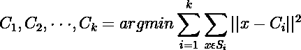
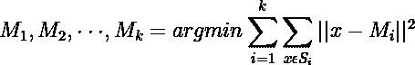
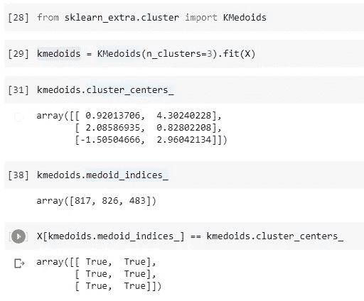
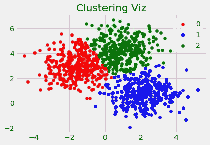

# 如何提高 k-Means 聚类算法的解释性

> 原文：<https://towardsdatascience.com/how-to-improve-the-interpretability-of-k-means-clustering-algorithm-3cf0fd0943ba?source=collection_archive---------48----------------------->

## k-Means 和 k-Medoids 聚类的深度分析

Andri Klopfenstein 在 [Unsplash](https://unsplash.com?utm_source=medium&utm_medium=referral) 上拍摄的照片

C 聚类是一种无监督的机器学习技术，它将数据点分离或划分为几个聚类或组，使得同一聚类中的点彼此相似，而不同聚类中的点彼此不同。有各种聚类算法，例如:

*   k 均值聚类
*   基于密度的噪声应用空间聚类
*   等级聚类(聚集和分裂)
*   光学
*   模糊聚类

还有很多。k-Means 聚类是一种流行的无监督聚类算法。在本文中，您可以了解 k-Means 算法的数学背景，以及如何使用 k-Medoids 算法提高其可解释性。

# k 均值聚类:

**k 均值聚类**是一种基于质心的聚类算法。它将数据点分组成 **k 个簇**，使得**相同簇中的点彼此相似**而**不同簇中的点不同** t。形成的每个簇具有相等的数据点分布。每个聚类由其质心表示。

## k 均值算法概述:

k-Means 聚类算法将整个数据集聚类成 **k** 个独立的聚类。k 均值算法的成本函数为:

> K-Means 算法的思想是找到 K 个质心点(C1，C1，.。。C_k)通过最小化每个聚类上该点与其质心之间距离的平方和。

这个代价是 NP 难的，并且具有指数级的时间复杂度。所以我们采用劳埃德算法的近似思想，步骤如下:

**1。k 个簇形心的初始化:**

k 个聚类点被随机初始化。

**2。分配:**

对于每个数据点，计算这些点和每个聚类质心之间的欧几里德距离。这些点将被分配给质心最近的聚类。

**3。质心更新:**

通过取分配给该聚类的所有点的平均值来更新每个质心的值。

**4。重复步骤 2 和 3，直到收敛:**

收敛是指质心的值等于或几乎等于前一次迭代的质心点的值的情况。

k-均值聚类的一个问题是质心点的可解释性。最初，k 个质心中的每一个实际上是来自数据集的点，随着劳埃德算法的迭代，每个质心点的值被更新。质心点的这种更新导致可解释性的损失。

这里，k-Means 的一个更新算法来拯救，被称为 k-Medoids 算法。

# k-Medoids 聚类:

k-均值聚类的问题是质心点的可解释性的损失。换句话说，质心点不是数据集中的实际点。k-Medoids 聚类的思想是使每个质心点成为数据集中的一个实际点。这将导致质心点可解释。

k-Medoids 算法的算法与 Lloyd 算法的算法几乎相同，只是在最后一步略有变化。k-Medoids 的算法称为 PAM(围绕 Medoids 划分)。

k-Medoids PAM 算法的步骤:

1.  k 个聚类质心的初始化。
2.  **分作业。**
3.  **更新质心:**

在 Llyod 算法的情况下，通过计算该聚类中所有点的平均值来更新质心点。

对于 PAM 算法，质心点被更新为，如果在一个聚类中有 m 个点，则用来自该聚类的所有其他(m-1)个点交换先前的质心，并将该点最终确定为具有最小损失的新质心。PAM 算法的损失函数:

**4。重复步骤 2 和 3，直到收敛。**

(图片由作者提供)，数据集中的 k-Medoids 可解释聚类中心

(图片由作者提供)，聚类结果散点图

# 结论:

本文讨论了 k-Means 算法和 k-Medoids 算法的逐步工作算法。此外，如何通过使质心点成为实际数据点来增加 k-Means 算法的可解释性。

PAM 算法使用贪婪方法，可能无法找到全局最优解。与质心相比，Medoids 对异常值更加稳健，但是对于高维数据，它们需要更多的计算。

> 感谢您的阅读