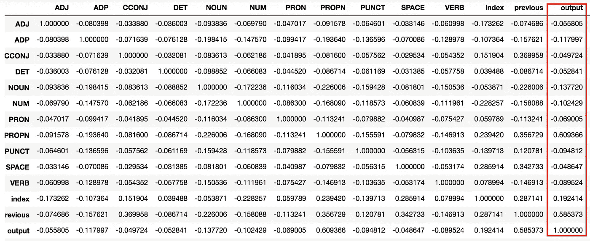

# 如何提高(监督)机器学习算法的性能

> 原文：<https://towardsdatascience.com/how-to-improve-the-performance-of-a-supervised-machine-learning-algorithm-c9f9f2705a5c?source=collection_archive---------43----------------------->

## 性能改进

提高机器学习模型性能的不同技术探讨

图片由来自 [Pixabay](https://pixabay.com/?utm_source=link-attribution&utm_medium=referral&utm_campaign=image&utm_content=1716824) 的 [Jess Foami](https://pixabay.com/users/cuncon-3452518/?utm_source=link-attribution&utm_medium=referral&utm_campaign=image&utm_content=1716824) 提供

如今，每个数据科学家都能够编写代码来训练机器学习算法:加载一个数据集，将其分成训练集和测试集，建立模型并使用训练集训练它就足够了。最后，算法的性能可以在测试集上进行评估。

好吧。一切都显得很简单。但是，当您在实际情况中利用经过训练的模型时，可能会发生它无法正确预测输出的情况。

在本文中，我描述了如何通过以下技巧来提高监督机器学习算法的性能:

*   数据集的大小
*   特征选择
*   平衡数据集
*   模型的选择

# 数据集的大小

第一个技巧是增加数据集的大小。可能您的数据集太小，因此模型无法正确学习输出。在监督算法的情况下，您需要手动注释数据集。手工标注可能需要很多时间，所以你可以依赖一些外部平台，比如[亚马逊机械土耳其人](https://www.mturk.com/)，相对便宜。

# 特征选择

构建模型时最重要的一个方面是特征选择，即哪些元素会影响输出。您可能有许多特征，但可能没有一个影响输出，因此您的算法性能很差。为了确定哪些特性会影响输出，您可以使用相关性特性选择方法，该方法计算每个特性与输出之间的相关性，并仅选择相关性大于某个阈值的特性。

下表显示了候选特征和输出(最后一列)之间的相关性示例。影响输出的唯一特征是 *PROPN* 和 *previous* ，阈值大于 0.5。因此，我们只能选择 *PROPN* 和 *previous* 作为输入特征。

作者图片

如果你想深化话题，可以阅读[Vishal R](/feature-selection-correlation-and-p-value-da8921bfb3cf)的这篇有趣的文章。

选择输入特征的其他方法包括信息增益(IG)、卡方(CS)、最佳优先搜索(BFS)、线性向前选择(LFS)和贪婪逐步搜索。如果你想了解这些方法，请继续关注

# 平衡数据集

平衡数据集意味着所有输出类对应相同数量的输入记录。因此，如果我有 10.000 条输入记录和 2 个输出类，那么一个好的数据集应该有每个输出类 5.000 条输入记录。如果数据集不平衡，您需要平衡它。可以遵循两种可能的策略:

*   使用例如随机欠采样算法欠采样过估计的类输出；
*   对低估类输出进行过采样，生成例如合成数据(例如合成少数过采样技术算法)。

# 模型的选择

这听起来可能很明显，但有时改变模型可以极大地提高性能:)因此，您可以谷歌搜索哪个模型最适合您的目的。

# 摘要

在这篇文章中，我简要地说明了一些技巧，以提高监督机器学习模型的性能。如果你知道更多的方法和技巧，请给我留言或留言:)

分析技巧包括增加数据集的大小、特征选择、平衡数据集，以及最终选择模型。

在我的下一篇文章中，我将写一些关于如何用 Python 实现每个技巧的教程。敬请期待:)

如果你想了解我的研究和其他活动的最新情况，你可以在 [Twitter](https://twitter.com/alod83) 、 [Youtube](https://www.youtube.com/channel/UC4O8-FtQqGIsgDW_ytXIWOg?view_as=subscriber) 和 [Github](https://github.com/alod83) 上关注我。