# 如何用基函数和正则化改进线性回归

> 原文：<https://towardsdatascience.com/how-to-improve-your-linear-regression-with-basis-functions-and-regularization-8a6fcebdc11c?source=collection_archive---------9----------------------->

## 基础函数和正则化介绍，理论和 Python 实现

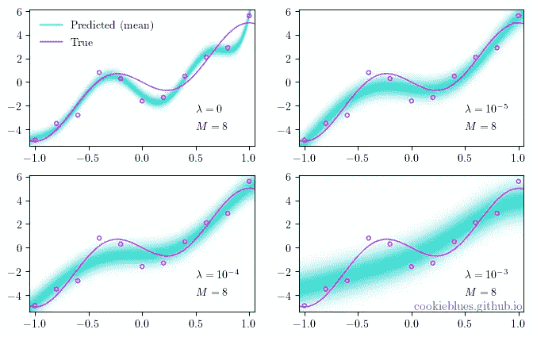

对过度拟合的模型增加正则化的说明。图片作者。

# 内容

这篇文章是我将要发表的一系列文章的一部分。你可以通过点击[这里](https://cookieblues.github.io/guides/2021/03/22/bsmalea-notes-2/)在我的个人博客上阅读这篇文章的更详细版本。下面你可以看到该系列的概述。

## 1.机器学习导论

*   [(一)什么是机器学习？](/what-is-machine-learning-91040db474f9)
*   [(b)机器学习中的模型选择](/model-selection-in-machine-learning-813fe2e63ec6)
*   [(c)维度的诅咒](/the-curse-of-dimensionality-5673118fe6d2)
*   [(d)什么是贝叶斯推理？](/what-is-bayesian-inference-4eda9f9e20a6)

## **2。回归**

*   [(a)线性回归的实际工作原理](/how-linear-regression-actually-works-theory-and-implementation-8d8dcae3222c)
*   **(b)如何使用基函数和正则化改进您的线性回归**

## 3.分类

*   [(a)分类器概述](/overview-of-classifiers-d0a0d3eecfd1)
*   [(b)二次判别分析(QDA)](/quadratic-discriminant-analysis-ae55d8a8148a#204a-71584f33e137)
*   [(c)线性判别分析](/linear-discriminant-analysis-1894bbf04359)
*   [(d)(高斯)朴素贝叶斯](/gaussian-naive-bayes-4d2895d139a)

# 基本函数

在[之前的帖子](/how-linear-regression-actually-works-theory-and-implementation-8d8dcae3222c)中我们讨论了线性回归模型

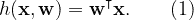

我们说**一个模型是线性的，如果它在参数中是线性的，而不是在输入变量**中。然而， **(1)在参数和输入变量**中都是线性的，这限制了它适应非线性关系。我们可以通过用输入变量的非线性基函数代替输入变量来扩充模型

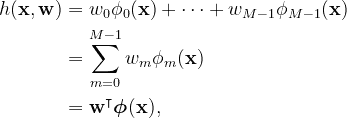

在哪里

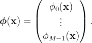

通过使用非线性基函数， *h* 有可能适应 **x** 的非线性关系，我们将很快看到——**我们称这些模型为线性基函数模型**。

我们已经在系列文章的[第一篇文章中看到了基函数的一个例子，其中我们用 *x* 的幂的基函数扩充了简单的线性回归模型，即，](/what-is-machine-learning-91040db474f9)

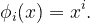

另一种常见的基函数是高斯函数

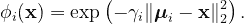

遵循与[上一篇文章](/how-linear-regression-actually-works-theory-and-implementation-8d8dcae3222c)中相同的推导，我们发现 **w** 和 *α* 的最大似然解为

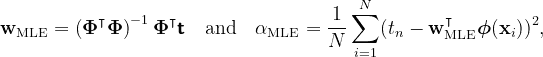

在哪里

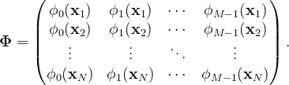

下图显示了具有 *M* -1 个高斯基函数的线性基函数模型。我们可以看到**增加基函数的数量会产生更好的模型，直到我们开始过度拟合**。

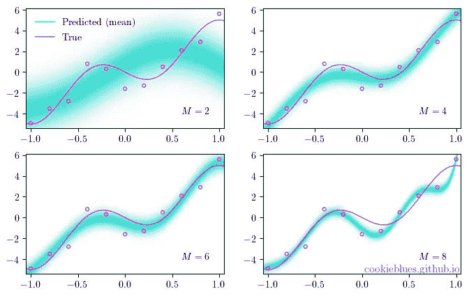

使用 m1 高斯基函数(加上截距)的效果图。图片作者。

## 履行

使用与前几篇文章相同的数据集，我们得到了下面的实现。

# 正规化

在关于贝叶斯推理的[文章中，我们简要地讨论了正则化的概念，我们将其描述为一种防止过度拟合的技术。如果我们回头看看我们在](/what-is-bayesian-inference-4eda9f9e20a6)[上一篇文章](/how-linear-regression-actually-works-theory-and-implementation-8d8dcae3222c)中定义的目标函数(用基函数扩充)，我们可以引入一个正则项

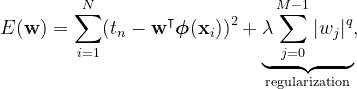

其中 *q* > 0 表示正则化的类型， *λ* 控制正则化的程度。

*q* 最常见的值是 1 和 2，分别称为 L1 正则化和 L2 正则化。当我们使用 L1 正则化时，我们称之为**套索回归，当我们使用 L2 正则化时，我们称之为岭回归**。

岭回归的目标函数

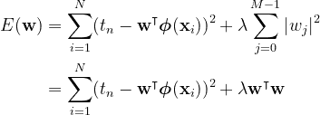

特别方便，因为它是 w 的二次函数，因此具有唯一的全局最小值。其解决方案是

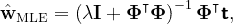

其中 *α* 保持不变，因为正则项对其没有影响。

当我们引入正则化时，**模型选择的过程从找到合适数量的基函数到找到正则化参数*λ*的合适值。**

下图显示了一个线性基函数模型，其中 *λ* 的值不同，而基函数的数量保持不变 *M* =8。我们可以看到**即使我们开始时过度拟合，我们也可以调整正则化参数 *λ* 来防止它**——事实上，当正则化过度时，我们开始欠拟合。另一件有趣的事情是，我们的不确定性随着正则化而增加。

对过度拟合的模型增加正则化的说明。图片作者。

## 履行

# 摘要

*   使模型**线性**的是它在参数而不是输入**中是线性的。**
*   我们可以用**基函数**增加线性回归，产生**线性基函数模型**。
*   **多项式回归**是线性基函数模型。
*   **规则化**是一种**防止过拟合**的技术。
*   在线性回归中有不同种类的正则化，如 L1 和 L2 正则化。