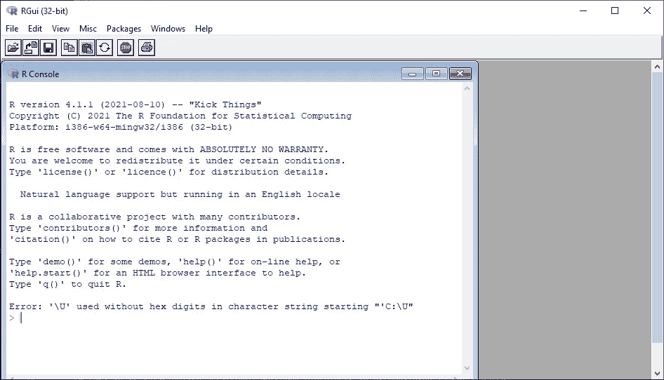
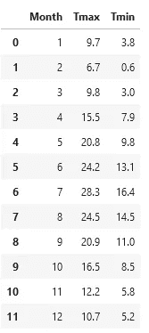
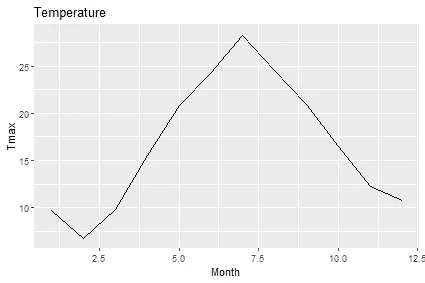
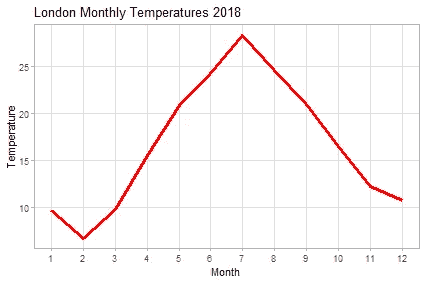
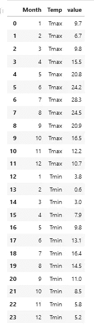
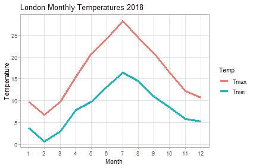
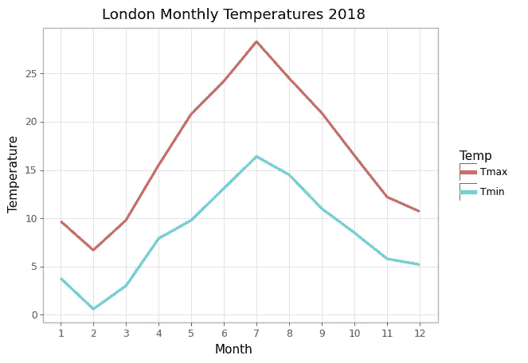
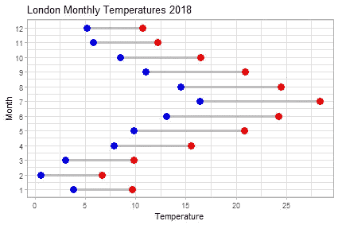

# 如何在 Python 笔记本中包含 R 和 ggplot

> 原文：<https://towardsdatascience.com/how-to-include-r-and-ggplot-in-a-python-notebook-f2b76091353d?source=collection_archive---------25----------------------->

## 您可以在同一个 Jupyter 笔记本中混合使用匹配的 Python 和 R——方法如下


Python 笔记本中 R 的 ggplot2 中的图片-作者图片

你要么是 R 人，要么是 Python 人，对吧？当然，除非你喜欢 Python 的某些方面和 r 的其他方面。

那么为什么不混搭呢？例如，R 的 *ggplot2* 是一个很棒的可视化包，那么能够在 Python 程序中使用它不是很好吗？

我们将看看如何实现这一点——这很容易——然后你可以决定是否值得努力。

我将从 Python 用户的角度来处理这个问题，所以我假设您的计算机上已经安装了 Python 和 Jupyter。这意味着你还需要两样东西:R 和一个名为 *rpy2* 的 Python 包。需要安装 R，因为我们将运行 R 脚本(尽管是在 Python 上下文中),而 *rpy2* 是两种语言之间的桥梁。

所以，你可以去 R 网站[下载你的操作系统版本，然后按照说明安装 R。](https://cran.r-project.org/)

完成了吗？好了，接下来我们将打开 R 控制台，看起来像这样:



r 控制台—作者图片

我们将使用 *ggplot2* 可视化软件包，因此需要安装该软件包。在控制台中键入以下内容:

```
packages.install("tidyverse")
```

*小包装*包括 *ggplot2* 。(如果你想遵循这里的所有代码，你还需要安装软件包 *ggalt* 。)现在可以关闭 R 控制台了。

接下来，我们用 pip 安装 *rpy2* 包:

```
pip install rpy2
```

我们现在准备编写一个 Python Jupyter 笔记本，它可以运行用 r 编写的单元格。

```
%load_ext rpy2.ipython
```

这将加载 *rpy2* 包并启用 *rmagic* 命令(我们很快就会看到)。但是首先让我们导入熊猫并创建一个数据框架。

```
import pandas as pd
```

这是一个数据帧，代表了 2018 年伦敦记录的月气温。

```
w = {
  "Month":[1,2,3,4,5,6,7,8,9,10,11,12],
  "Tmax":[9.7,6.7,9.8,15.5,20.8,24.2,28.3,24.5,20.9,16.5,12.2,10.7],
  "Tmin":[3.8,0.6,3.0,7.9,9.8,13.1,16.4,14.5,11.0,8.5,5.8,5.2]
  }weather=pd.DataFrame(w)
```

这给了我们一个这样的数据框架:



天气数据框—图片由作者提供

现在我们将使用 r 中的 *ggplot2* 绘制一个图形。因此我们打开一个新的单元格，我们需要输入的第一行是这样的:

```
%%R -i weather -w 15 -h 10 --units cm
```

`%%R`将单元标识为 R 代码，随后是一些决定单元如何工作的参数。`-i weather`将之前创建的 Python 变量导入到 R 单元格、`-w 15`、`-h 10`、`— units cm`中，使创建的任意图形宽 15 厘米，高 10 厘米。

这是一个完整的单元格，包含了`%%R`魔法，导入了 *ggplot2* 库，然后从`weather`数据帧绘制了一个线图。

```
%%R -i weather -w 15 -h 10 --units cm 
# import df from Python and set figure size 15 by 10cmlibrary("ggplot2")ggplot(weather,aes(Month, Tmax)) + 
    geom_line() +
    ggtitle("Temperature")
```



简单线形图—作者提供的图片

默认图并不理想，因为 x 刻度实际上应该是从 1 到 12，它可以更漂亮一点。让我们解决这个问题。

```
%%R -i weather -w 15 -h 10 --units cm 
# import df from Python and set figure size 15 by 10cmlibrary("ggplot2")ggplot(weather) + 
    geom_line(aes(Month, Tmax),color="Red",size=1.25) +
    scale_x_continuous(breaks=seq(1, 12, 1))+
    scale_y_continuous(breaks=seq(-10, 40, 5))+
    labs(y="Temperature", x="Month", 
         title="London Monthly Temperatures 2018") +
    theme_light() +
    theme(panel.grid.minor=element_blank())
```



更好的线图—作者图片

在 R 的 *ggplot2* 中，我们可以看到一种简洁的方式，一层一层地构建图表。

但是如果我们想在同一个图表上绘制`Tmax`和`Tmin`呢？我们需要转换数据，以便两个值在同一列中。在 Python 中，我们可以通过打开一个新的单元格并输入以下 Python 代码来做到这一点。

```
weather2=pd.melt(weather, id_vars=['Month'], 
                 value_vars=['Tmax', 'Tmin'],var_name="Temp")
```

这创建了一个新的数据帧`weather2`,如下所示。



Weather2 数据框架—作者图片

我确信你也可以这样做，但是这里的想法是展示这两种语言是如何混合的。

现在我们可以用 ggplot2 绘制一个图表，通过创建一个像这样的新 R 单元格来绘制这两个值。

```
%%R -i weather2 -w 15 -h 10 --units cm 
# import df from Python and set figure size 15 by 10cmlibrary("ggplot2")ggplot(weather2,aes(Month, value)) + 
    geom_line(aes(color=Temp),size=1.25)+
    scale_x_continuous(breaks=seq(1, 12, 1))+
    scale_y_continuous(breaks=seq(-10, 40, 5))+
    labs(y="Temperature", x="Month", 
         title="London Monthly Temperatures 2018") +
    theme_light() +
    theme(panel.grid.minor=element_blank())
```

这给了我们下面的图表:



带有两个图的折线图—作者提供的图片

现在，在这一点上，你可能认为这一切都很好，但我可以用 Plotnine 做到这一点，而不会用一种新的语言搞乱我的 Python 笔记本。

```
from plotnine import *(ggplot(weather2,aes("Month", "value")) + 
    geom_line(aes(color="Temp"),size=1.25)+
    scale_x_continuous(breaks=range(1,13,1))+
    scale_y_continuous(breaks=range(-10, 40, 5))+
    labs(y="Temperature", x="Month", 
         title="London Monthly Temperatures 2018") +
    theme_light() +
    theme(panel_grid_minor=element_blank())
)
```



Plotnine plot —作者图片

当然，这是真的，你可以从上面的代码中看到。Plotnine 是一个很好的包，正如我在这里描述的一样，但它不是 *ggplot* 的完全克隆，因为它在它所基于的 Matplotlib 所能实现的方面受到限制。

例如，如果我想创建一个像这样的月温度的 dumbell 图会怎么样。



一个 dumbell 情节-作者的形象

这个简洁的图表显示了每个月的温度范围，当然，通过一点努力和独创性，我们可以在 Plotnine(或者，实际上，在 Matplotlib)中创建它。但也许这样更简单:

```
%%R -i weather -w 15 -h 10 --units cm 
# import df from Python and set figure size 15 by 10cmlibrary(ggplot2)
library(ggalt)ggplot(weather, aes(y=Month, x=Tmin, xend=Tmax)) +
  geom_dumbbell(size=1.25, color="Gray",
                colour_x = "Blue", 
                colour_xend = "Red",
                size_x=4,
                size_xend=4) +
  labs(x="Temperature", y="Month", 
       title="London Monthly Temperatures 2018") +
  scale_y_continuous(breaks=seq(1, 12, 1))+
  scale_x_continuous(breaks=seq(-10, 40, 5))+
  theme_light()
```

库 *ggalt* 用额外的绘图类型扩展了 *ggplot2* ，这使得绘制 dumbell 图表非常简单。

除了`%%R`之外，还有一个神奇的命令`%R`，可以让你在一个 Python 单元格中使用单独的 R 代码行，但是，坦率地说，我认为混合不同语言的单元格会让笔记本变得很乱，所以我就讲到这里。

所以，R 和 Python 在同一个笔记本里——好主意？嗯，也许吧。我喜欢我可以直接使用 *ggplot2* ，但是我也喜欢 Plotnine，它允许我专门使用 Python。

关于 rpy2 的内容比我在这里介绍的还要多。更多详情请看他们的[网站](https://rpy2.github.io/)。

一如既往，感谢阅读。如果你想知道我什么时候发表新文章，请考虑在这里注册一个电子邮件提醒[。](https://alan-jones.medium.com/subscribe)

如果你不是一个媒体订阅者，那就注册吧，这样你就可以每月花 5 美元阅读尽可能多的文章。在这里注册,我会赚一点佣金。