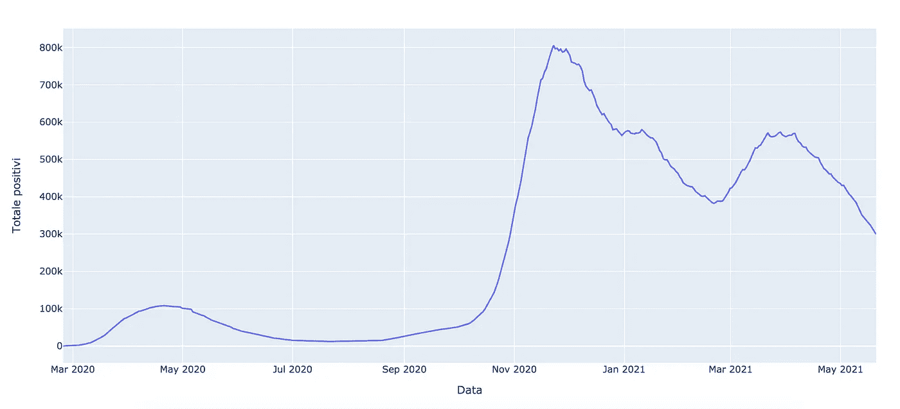

# 如何将 Python 图形插入 HTML 网站

> 原文：<https://towardsdatascience.com/how-to-insert-a-python-graph-into-an-html-web-site-688754f67e1c?source=collection_archive---------1----------------------->

## 数据可视化

## 将 Altair 或 Plot.ly 中构建的图形与 HTML 网站集成的简短教程


图片来自 [Pixabay](https://pixabay.com/?utm_source=link-attribution&utm_medium=referral&utm_campaign=image&utm_content=1076536)

正如许多人所知，Python 是一种非常强大的数据操作语言，包括数据收集、[数据分析](/a-complete-data-analysis-workflow-in-python-and-scikit-learn-9a77f7c283d3)和数据可视化。关于这最后一个方面，存在许多强大的库和框架，如 [Plot.ly](https://plotly.com/graphing-libraries/) 图形库和 [Altair](https://altair-viz.github.io/) 。

Plot.ly 图形库是一个非常强大的库，它允许用 Python、R 和 Javascript 构建图形和地图。Altair 是 Python 的另一个声明性统计可视化库，基于 [Vega](https://vega.github.io/vega/) 和 [Vega-lite](http://vega.github.io/vega-lite) 。

在本教程中，我假设您已经知道如何使用 Plot.ly 或 Altair 构建图形。我将只说明如何将一个现有的图形与一个 HTML 网站集成。

将 Python 图形集成到 HTML 网站需要三个步骤:

*   在 Plot.ly 或 Altair 中生成图形
*   将图表保存为 HTML 页面
*   操作生成的 HTML

# Plot.ly

首先，我在 Plot.ly 中构建了一个通用图。在这个具体的例子中，我将关于意大利新冠肺炎阳性病例数的时间序列作为输入数据。我利用以下 Python 代码绘制了一条线:

```
import plotly
import plotly.graph_objs as go
import pandas as pddf = pd.read_csv('[https://raw.githubusercontent.com/pcm-dpc/COVID-19/master/dati-andamento-nazionale/dpc-covid19-ita-andamento-nazionale.csv'](https://raw.githubusercontent.com/pcm-dpc/COVID-19/master/dati-andamento-nazionale/dpc-covid19-ita-andamento-nazionale.csv'))# Create a trace
data = [go.Scatter(
    x = df['data'],
    y = df['totale_positivi'],
)]layout = go.Layout(
        xaxis=dict(
            title='Data',    
        ),
        yaxis=dict(
            title='Totale positivi',  
        )
    )
fig = go.Figure(data=data, layout=layout)
```

下图显示了生成的输出:



作者图片

现在，我可以将该图保存为 HTML 文件。我利用了`plotly.offline.plot()`函数。作为一个配置参数，我指定在绘图中不显示模式栏(`config={‘displayModeBar’: False}`)。这是为了避免让用户操纵 HTML 页面中的图像。

```
plotly.offline.plot(fig,filename='positives.html',config={'displayModeBar': False})
```

现在我可以打开文件`positives.html`并操作它。该文件类似于下面这段代码:

```
<html>
  <head><meta charset="utf-8" /></head>
  <body>
    <div>
        <script type="text/javascript">window.PlotlyConfig =  
             {MathJaxConfig: 'local'};
        </script> <script type="text/javascript">
          ...
        </script> <div id="9eec8ee0-8ebf-4199-8f61-7f86aab4cc81" class="plotly-graph-div" style="height:100%; width:100%;"></div> <script type="text/javascript"> 
          ... 
        </script> </div>
  </body>
</html>
```

该文件由 4 个主要部分组成。第二部分很长。第二部分和第四部分可以复制到两个不同的 javascript 文件中，没有开始和结束标记(`<script type=”text/javascript”>`和`</script>`)，命名为`chart-part1.js`和`chart-part2.js`。现在，我可以用包含的两个 javascript 文件替换 HTML 文件的第二和第四部分:

```
<html>
<head><meta charset="utf-8" /></head>
<body>
    <div>
        <script type="text/javascript">window.PlotlyConfig = {MathJaxConfig: 'local'};</script>
        <script src="js/chart-part1.js"></script>

        <div id="9eec8ee0-8ebf-4199-8f61-7f86aab4cc81" class="plotly-graph-div" style="height:100%; width:100%;"></div>
        <script src="js/chart-part2.js"></script>   
    </div>
</body>
</html>
```

注意，我已经将`chart-part1.js`和`chart-part2.js`文件保存到了`js`文件夹中。现在，我可以将包含在`div`中的所有代码复制到我的 HTML Web 站点中的任何地方，只要我提醒也将`js`文件夹复制到我的 Web 站点文件夹中:

```
<div>
    <script type="text/javascript">window.PlotlyConfig = {MathJaxConfig: 'local'};</script>
    <script src="js/chart-part1.js"></script>

    <div id="9eec8ee0-8ebf-4199-8f61-7f86aab4cc81" class="plotly-graph-div" style="height:100%; width:100%;"></div>
    <script src="js/chart-part2.js"></script>   
</div>
```

# 阿尔泰尔

在这个例子中，我使用默认的 vega 数据集构建了一个简单的散点图，包含在`vega_datasets`库中。

```
import altair as alt
from vega_datasets import datachart = alt.Chart(data.cars.url).mark_point().encode(
    x='Horsepower:Q',
    y='Miles_per_Gallon:Q',
    color='Origin:N'
)
```

现在我可以通过`save()`功能保存图表:

```
chart.save('chart.html', embed_options={'actions': False})
```

在`embed_options`中，我指定我不想打印动作按钮。或者，正如@ [阿兰·琼斯](https://medium.com/@alan-jones?source=post_info_responses---------1-----------------------)所建议的，我可以在我的 Plotly 配置中设置`staticPlot = True`而不是隐藏工具栏(这实际上并不会停止交互)。静态图不是交互式的，也没有工具栏。

生成的 HTML 文件如下所示:

```
<!DOCTYPE html>
<html>
<head>
  <style>
    .error {
        color: red;
    }
  </style>
  <script type="text/javascript" src="[https://cdn.jsdelivr.net/npm//vega@5](https://cdn.jsdelivr.net/npm//vega@5)"></script>
  <script type="text/javascript" src="[https://cdn.jsdelivr.net/npm//vega-lite@4.8.1](https://cdn.jsdelivr.net/npm//vega-lite@4.8.1)"></script>
  <script type="text/javascript" src="[https://cdn.jsdelivr.net/npm//vega-embed@6](https://cdn.jsdelivr.net/npm//vega-embed@6)"></script>
</head>
<body>
  <div id="vis"></div>
  <script>
    (function(vegaEmbed) {
      var spec = {"config": {"view": {"continuousWidth": 400, "continuousHeight": 300}}, "data": {"url": "[https://cdn.jsdelivr.net/npm/vega-datasets@v1.29.0/data/cars.json](https://cdn.jsdelivr.net/npm/vega-datasets@v1.29.0/data/cars.json)"}, "mark": "point", "encoding": {"color": {"type": "nominal", "field": "Origin"}, "x": {"type": "quantitative", "field": "Horsepower"}, "y": {"type": "quantitative", "field": "Miles_per_Gallon"}}, "$schema": "[https://vega.github.io/schema/vega-lite/v4.8.1.json](https://vega.github.io/schema/vega-lite/v4.8.1.json)"};
      var embedOpt = {"actions": false, "mode": "vega-lite"};function showError(el, error){
          el.innerHTML = ('<div class="error" style="color:red;">'
                          + '<p>JavaScript Error: ' + error.message + '</p>'
                          + "<p>This usually means there's a typo in your chart specification. "
                          + "See the javascript console for the full traceback.</p>"
                          + '</div>');
          throw error;
      }
      const el = document.getElementById('vis');
      vegaEmbed("#vis", spec, embedOpt)
        .catch(error => showError(el, error));
    })(vegaEmbed);</script>
</body>
</html>
```

我将包含在`<script>`标签中的代码复制到一个名为`chart.js`的 javascript 文件中。如果我想将图表包含到 HTML 网页中，我必须将以下部分放在我的 HTML 网页中的任意位置:

```
<div id="vis"></div>
  <script src="js/chart.js"></script>
```

我还应该提醒在我的 HTML 页面的头部包含`vega`、`vega-lite`和`vega-embed` javascript 文件。最终结果如下所示:

```
<!DOCTYPE html>
<html>
<head>
  <style>
    .error {
        color: red;
    }
  </style>
  <script type="text/javascript" src="[https://cdn.jsdelivr.net/npm//vega@5](https://cdn.jsdelivr.net/npm//vega@5)"></script>
  <script type="text/javascript" src="[https://cdn.jsdelivr.net/npm//vega-lite@4.8.1](https://cdn.jsdelivr.net/npm//vega-lite@4.8.1)"></script>
  <script type="text/javascript" src="[https://cdn.jsdelivr.net/npm//vega-embed@6](https://cdn.jsdelivr.net/npm//vega-embed@6)"></script>
</head>
<body>
  <div id="vis"></div>
  <script src="js/chart.js"></script>
</body>
</html>
```

# 摘要

在这篇简短的教程中，我演示了如何将 Plot.ly 或 Altair Python graph 包含到 HTML 网站中。

需要三个步骤:生成图形，将其保存为 HTML，并处理输出，使代码易于包含在另一个 HTML 页面上。

如果你想了解我的研究和其他活动的最新情况，你可以在 [Twitter](https://twitter.com/alod83) 、 [Youtube](https://www.youtube.com/channel/UC4O8-FtQqGIsgDW_ytXIWOg?view_as=subscriber) 和 [Github](https://github.com/alod83) 上关注我。

# 相关文章

[](/how-to-insert-an-observablehq-graph-into-a-html-page-57a9f4546ecf) [## 如何将 Observablehq 图形插入 HTML 页面

### 一个快速的教程，用你的观察制作精彩的 HTML 页面。

towardsdatascience.com](/how-to-insert-an-observablehq-graph-into-a-html-page-57a9f4546ecf) [](https://codeburst.io/quick-start-with-html-through-bootstrap-bbe6f2f1793) [## 通过 Bootstrap 快速使用 HTML

### 在本教程中，我将向你展示如何用 Bootstrap 构建一个简单的 HTML 页面。Bootstrap 是一个工具包，它允许…

codeburst.io](https://codeburst.io/quick-start-with-html-through-bootstrap-bbe6f2f1793) [](/how-to-improve-d3-js-graphs-with-annotations-252fbb9c5bb5) [## 如何改进带注释的 D3.js 图形

towardsdatascience.com](/how-to-improve-d3-js-graphs-with-annotations-252fbb9c5bb5)