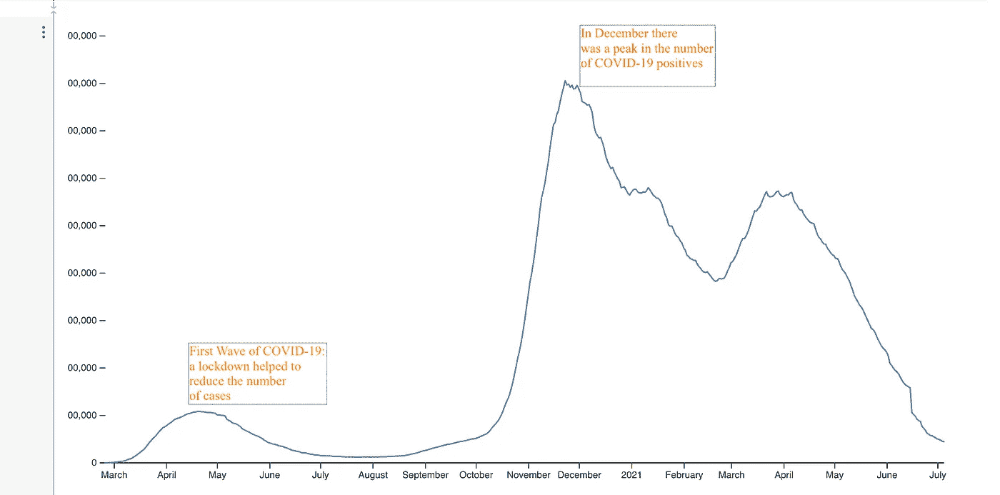
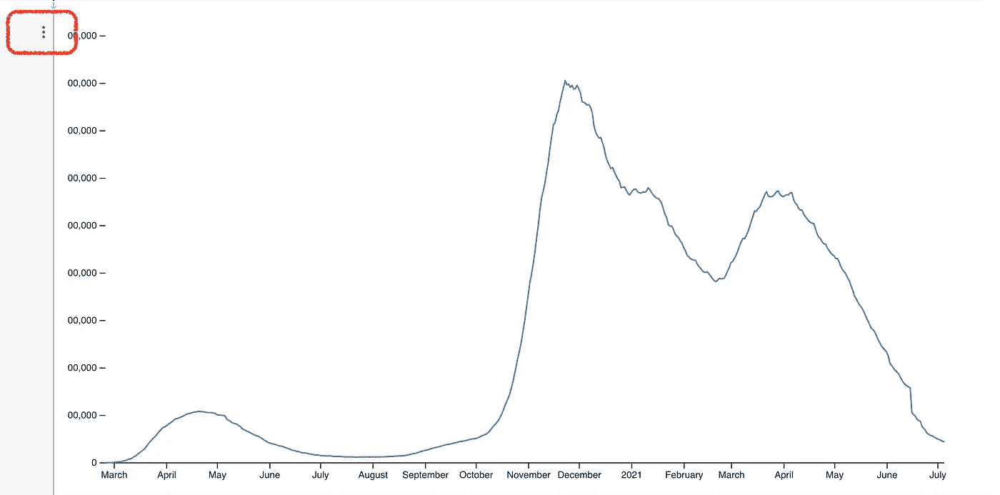
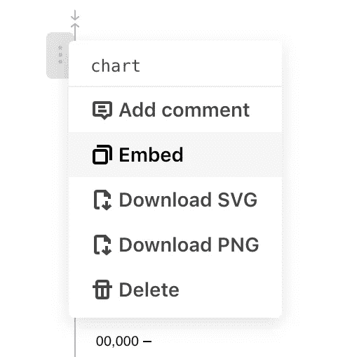
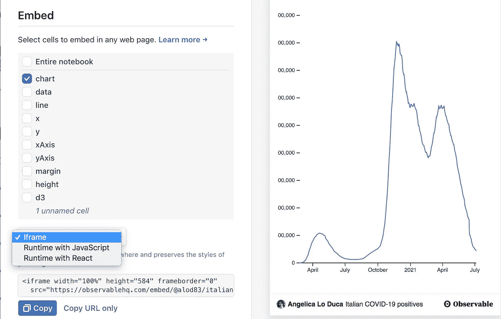
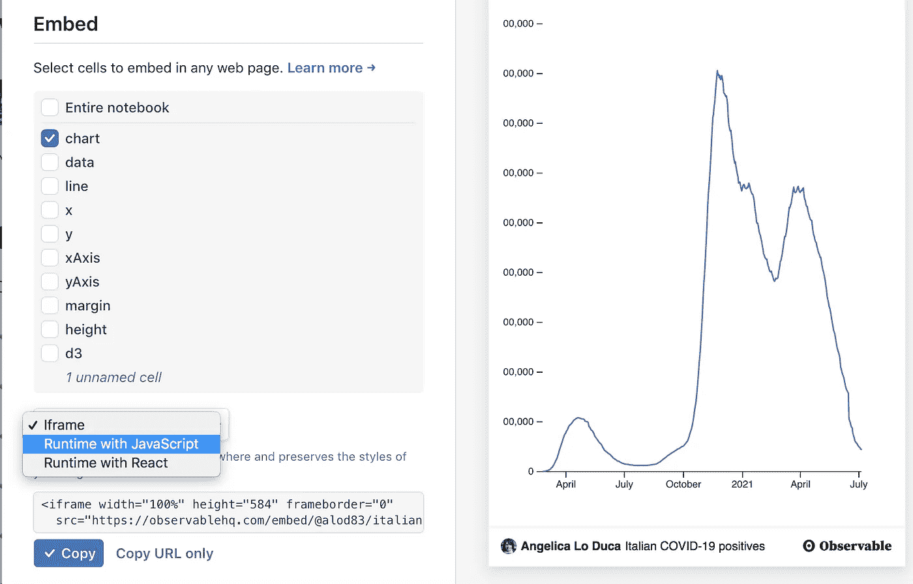

# 如何将 Observablehq 图形插入 HTML 页面

> 原文：<https://towardsdatascience.com/how-to-insert-an-observablehq-graph-into-a-html-page-57a9f4546ecf?source=collection_archive---------23----------------------->

## 数据可视化

## 一个快速的教程，用你的可观察图形制作精彩的 HTML 页面。



作者图片

Observablehq 是一个非常流行的利用 D3.js 库编写代码的笔记本。由于网上有很多例子和教程，你可以根据自己的需要定制已经制作好的笔记本。

**然而，一旦构建了一个图表，就不容易立即嵌入到另一个网站中。**

在本教程中，我提出了两种在网站中嵌入图形的策略:

*   通过 iframe
*   生成图表的 Javascript。

在这两种情况下，首先，您必须通过点击**发布**按钮来发布您的笔记本。

此外，在这两种情况下，您都应该遵循以下步骤:

*   从 Observable 下载嵌入代码
*   将代码插入 HTML 页面。

在本教程中，我使用了[链接](https://observablehq.com/@alod83/italian-covid-19-positives)中的示例图。

# 内联框架

第一个解决方案非常简单，也适用于其他网站。它基于 iframes 的使用。实际上，iframe 是一个嵌入在另一个 HTML 文档中的 HTML 文档。

## 下载嵌入代码

为了下载嵌入代码，您必须在 Observable notebook 中查看您的图表，并单击图表左侧的三个垂直点，如下图所示:



作者图片

将打开一个菜单，如下所示:



作者图片

您可以选择嵌入，然后从下拉菜单中选择 iframe:



图像

然后你可以点击复制按钮。现在代码被复制到你的剪贴板中。复制的代码如下所示:

```
<iframe width="100%" height="584" frameborder="0"
  src="[https://observablehq.com/embed/@alod83/italian-covid-19-positives?cells=chart](https://observablehq.com/embed/@alod83/italian-covid-19-positives?cells=chart)"></iframe>
```

## 将您的代码插入 HTML 页面

现在，您可以将复制的代码插入到您的 HTML 页面中，准确地插入到您希望图形显示的位置。

例如，您可以在段落后插入:

```
<html>
  <head>...</head>
  <body>
      <p>Before my graph</p>
      <iframe width="100%" height="584" frameborder="0"
  src="[https://observablehq.com/embed/@alod83/italian-covid-19-positives?cells=chart](https://observablehq.com/embed/@alod83/italian-covid-19-positives?cells=chart)"></iframe>
  </body>
</html>
```

## 利弊

使用这种技术的主要优点是非常**快**和**快**。

但是，iframe 不继承父文档属性，如字体。此外，通常 iframe 没有响应性，因为它不能适应小型设备屏幕，如智能手机和平板电脑。

# 下载 Javascript

将可观察图形嵌入 HTML 页面的另一个策略是下载生成它的完整 javascript。

## 下载嵌入代码

这一步与下载 iframe 代码的步骤非常相似:

*   单击图表左侧的三个垂直点
*   选择嵌入

唯一的区别是，当您必须从下拉菜单中选择代码类型时，您必须选择带有 Javascript 的运行时:



作者图片

然后你点击复制。您复制的代码可能很长，因此您应该传递到一个空文档中，并将其命名为`graph.js`。在我的例子中，生成的代码不是很长，如下所示:

```
<div id="observablehq-chart-0a7b99e8"></div>
<p>Credit: <a href="[https://observablehq.com/@alod83/italian-covid-19-positives](https://observablehq.com/@alod83/italian-covid-19-positives)">Italian COVID-19 positives by Angelica Lo Duca</a></p><script type="module">
import {Runtime, Inspector} from "[https://cdn.jsdelivr.net/npm/@observablehq/runtime@4/dist/runtime.js](https://cdn.jsdelivr.net/npm/@observablehq/runtime@4/dist/runtime.js)";
import define from "[https://api.observablehq.com/@alod83/italian-covid-19-positives.js?v=3](https://api.observablehq.com/@alod83/italian-covid-19-positives.js?v=3)";
new Runtime().module(define, name => {
  if (name === "chart") return new Inspector(document.querySelector("#observablehq-chart-0a7b99e8"));
});
</script>
```

你可以看到在代码的开头有一个`div`，然后是一个有演职员表的段落，最后是以`<script>`开头的 javascript。这最后一部分可能会很长。

## 将您的代码插入 HTML 页面

`div`将包含您的图表，因此您可以将它准确地复制到您希望它出现在 html 中的位置。`div`应该如下图所示:

```
<div id="observablehq-chart-0a7b99e8"></div>
```

例如，您可以在一个段落后复制:

```
<html>
  <head>...</head>
  <body>
      <p>Before my graph</p>
      <div id="observablehq-chart-0a7b99e8"></div>
  </body>
</html>
```

现在您可以清理文档`chart.js`，以便只包含 javascript 代码。您可以删除演职员表和`script`标签。

最终的`chart.js`应该如下所示:

```
import {Runtime, Inspector} from "[https://cdn.jsdelivr.net/npm/@observablehq/runtime@4/dist/runtime.js](https://cdn.jsdelivr.net/npm/@observablehq/runtime@4/dist/runtime.js)";
import define from "[https://api.observablehq.com/@alod83/italian-covid-19-positives.js?v=3](https://api.observablehq.com/@alod83/italian-covid-19-positives.js?v=3)";
new Runtime().module(define, name => {
  if (name === "chart") return new Inspector(document.querySelector("#observablehq-chart-0a7b99e8"));
});
```

最后一步是将生成的 javascript 文件包含到原始 HTML 页面中，紧跟在包含图表的`div`之后:

```
<html>
  <head>...</head>
  <body>
      <p>Before my graph</p>
      <div id="observablehq-chart-0a7b99e8"></div>
      **<script src='chart.js'></script>**
  </body>
</html>
```

您可以保存 HTML 页面，现在图表已经嵌入到您的 HTML 页面中了！

## 利弊

这个解决方案应该具有响应性，并继承父文档的所有布局。但是，它的实现比前一个更复杂。

# 摘要

在本文中，我描述了两种将 Observable 生成的图形插入 HTML 页面的策略:

*   内联框架
*   java 描述语言

事实上，Observable 还提供了另一种策略， **Runtime with React，**我在本文中没有涉及到。

如果你想了解我的研究和其他活动的最新情况，你可以在 [Twitter](https://twitter.com/alod83) 、 [Youtube](https://www.youtube.com/channel/UC4O8-FtQqGIsgDW_ytXIWOg?view_as=subscriber) 和 [Github](https://github.com/alod83) 上关注我。

# 相关文章

[](/how-to-improve-d3-js-graphs-with-annotations-252fbb9c5bb5) [## 如何改进带注释的 D3.js 图形

towardsdatascience.com](/how-to-improve-d3-js-graphs-with-annotations-252fbb9c5bb5) [](/how-to-build-high-impact-graphs-for-data-science-55ce19d1ab32) [## 如何为数据科学构建高影响力的图表

### 提高数据可视化技能的一些技巧

towardsdatascience.com](/how-to-build-high-impact-graphs-for-data-science-55ce19d1ab32) [](/how-to-build-a-basic-line-in-d3-js-38f67055043f) [## 如何在 D3.js 中构建基本行

### 在处理数据时，最重要的一个方面是数据的表示。因此，不同的工具和…

towardsdatascience.com](/how-to-build-a-basic-line-in-d3-js-38f67055043f)