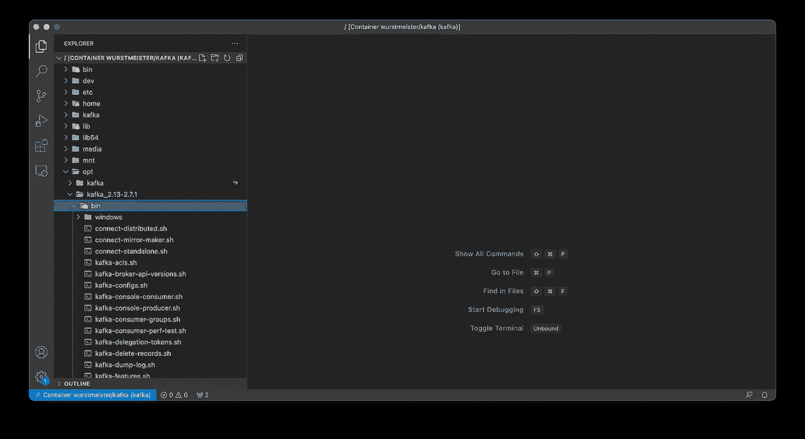

# 如何使用 Docker 安装 Apache Kafka 简单的方法

> 原文：<https://towardsdatascience.com/how-to-install-apache-kafka-using-docker-the-easy-way-4ceb00817d8b?source=collection_archive---------0----------------------->

## 以及如何创建你的第一个卡夫卡主题。提供视频指南。


在 [Unsplash](https://unsplash.com/s/photos/computing?utm_source=unsplash&utm_medium=referral&utm_content=creditCopyText) 上拍摄的 [ThisisEngineering RAEng](https://unsplash.com/@thisisengineering?utm_source=unsplash&utm_medium=referral&utm_content=creditCopyText)

在大数据的世界里，可靠的流媒体平台是必不可少的。这就是卡夫卡出现的地方。今天，你将学习如何在你的机器上安装它，并创建你的第一个 Kafka 主题。

想袖手旁观吗？我掩护你:

今天的文章涵盖以下主题:

*   安装卡夫卡的方法
*   术语纲要—您需要知道的一切
*   使用 Docker 安装 Kafka
*   连接到 Kafka shell
*   创建你的第一个卡夫卡主题
*   将 Visual Studio 代码连接到 Kafka 容器
*   总结和后续步骤

# 安装卡夫卡的方法

您可以在任何操作系统上安装 Kafka，如 Windows、Mac 或 Linux，但每个操作系统的安装过程都有所不同。因此，我的目标不是涵盖所有的内容，而是在虚拟机中安装 Kafka，并使用 Linux Ubuntu 作为发行版。

但是，由于我用的是装有 M1 芯片的 MacBook，管理虚拟机并不那么容易。将 ISO 映像附加到 VirtualBox 会失败。如果有人知道解决方法，请在下面的评论区告诉我。

因此，您将使用 Docker。我认为这是一个更好的选择，因为你不必手动安装工具。相反，您将编写一个简单的 Docker compose 文件，它将处理所有的事情。最棒的是，它可以在任何操作系统上运行。因此，如果您在 Windows 或 Linux 上阅读本文，一切都将正常工作。你只需要安装 Docker 和 Docker compose。

如果您需要安装 Docker 的说明，请参考视频。

# 术语纲要—您需要知道的一切

这篇文章绝不是多克尔或卡夫卡的详尽指南。见鬼，这甚至不应该是你关于这些话题的第一篇文章。本节的其余部分将只给出高层次的定义和概述。关于这些概念的更多内容已经超出了本文的范围。

**卡夫卡**——基本上是一个事件流平台。它使用户能够收集、存储和处理数据，以构建实时事件驱动的应用程序。它是用 Java 和 Scala 编写的，但你不必知道这些来与 Kafka 一起工作。还有一个 Python API。

**Kafka broker** —单个 Kafka 集群由经纪人组成。它们处理生产者和消费者，并在集群中保持数据复制。

**卡夫卡专题** —记录发布的类别。假设你有一个大型新闻网站——每个新闻类别都可以是一个卡夫卡主题。

**Kafka producer** —你写的一个应用程序(一段代码)来获取数据给 Kafka。

**Kafka consumer**——你写的一个从 Kafka 获取数据的程序。有时，消费者也是生产者，因为它将数据放在卡夫卡的其他地方。

**Zookeeper** —用于管理 Kafka 集群，跟踪节点状态，维护主题和消息列表。Kafka 版本 2.8.0 引入了对没有 Zookeeper 的 Kafka 版本的早期访问，但它还没有为生产环境做好准备。

**Docker** —一个用于构建、部署和管理容器的开源平台。它允许您将应用程序打包到容器中，这简化了应用程序的分发。这样，您知道如果应用程序在您的机器上工作，它将在您部署它的任何机器上工作。

你现在对卡夫卡、动物园管理员和 Docker 中的概念有了一些基本的高层次理解。下一步是使用 Docker 安装 Zookeeper 和 Kafka。

# 使用 Docker 安装 Kafka

您将需要两个 Docker 映像来运行 Kafka:

*   [wurstmeister/动物园管理员](https://hub.docker.com/r/wurstmeister/zookeeper/)
*   [伍斯特梅斯特/卡夫卡](https://hub.docker.com/r/wurstmeister/kafka/)

你不必手动下载它们，因为`docker-compose.yml`会为你做的。下面是代码，所以你可以把它复制到你的机器上:

```
version: '3'

services:
  zookeeper:
    image: wurstmeister/zookeeper
    container_name: zookeeper
    ports:
      - "2181:2181"
  kafka:
    image: wurstmeister/kafka
    container_name: kafka
    ports:
      - "9092:9092"
    environment:
      KAFKA_ADVERTISED_HOST_NAME: localhost
      KAFKA_ZOOKEEPER_CONNECT: zookeeper:2181
```

如果 2181 或 9092 在您的机器上不可用，请确保编辑端口。现在，您可以打开终端并导航到保存`docker-compose.yml`文件的文件夹。执行以下命令来提取图像并创建容器:

```
docker-compose -f docker-compose.yml up -d
```

`-d`意味着 Zookeeper 和 Kafka 都将在后台运行，所以它们启动后你就可以访问终端了。

现在，您应该看到下载和配置过程打印到了终端上。我的看起来是这样的，但是请记住，我已经配置了这两个:


图 1——Docker 为动物园管理员和卡夫卡创作(图片由作者提供)

就是这样！您可以使用`docker ps`命令来验证两者都在运行:


图 2 — Docker PS 命令(图片由作者提供)

但是你现在能用这两个容器做什么呢？让我们接下来讨论这个问题，打开一个卡夫卡终端，创建你的第一个卡夫卡主题。

# 连接到 Kafka shell

Zookeeper 和 Kafka 容器运行后，您可以执行以下终端命令来启动 Kafka shell:

```
docker exec -it kafka /bin/sh
```

如果你已经决定在`docker-compose.yml`文件中用不同的名字命名它，只需用`container_name`的值替换`kafka`。

以下是您应该看到的内容:


图 3 —连接到 Kafka shell(图片由作者提供)

现在你已经拥有了创建你的第一个卡夫卡主题所需要的一切！

# 创建你的第一个卡夫卡主题

所有 Kafka shell 脚本都位于`/opt/kafka_<version>/bin`:


图 4 —所有 Kafka shell 脚本(图片由作者提供)

下面是创建 Kafka 主题必须发出的命令:

```
kafka-topics.sh --create --zookeeper zookeeper:2181 --replication-factor 1 --partitions 1 --topic first_kafka_topic
```

其中`first_kafka_topic`是您的主题名称。因为这是一个虚拟环境，你可以保持`replication-factor`和`partitions`为 1。

下面是您应该看到的输出:


图 5——创造一个卡夫卡主题(作者图片)

就是这样！大约一秒钟后，主题将被创建。您可以使用以下命令列出所有 Kafka 主题:

```
kafka-topics.sh --list --zookeeper zookeeper:2181
```

这是它在我的机器上打印的内容:


图 6 —列出卡夫卡主题(作者图片)

这就是你如何创造一个卡夫卡式的话题。你今天不会用它做任何事。下一篇文章将介绍如何用 Python 编写生产者和消费者，但是今天还有其他内容要介绍。

# 将 Visual Studio 代码连接到 Kafka 容器

不，你今天不会写生产者和消费者，但是你会在下面的文章中写。手动将 Python 文件从您的机器传输到 Docker 容器是非常繁琐的。可以用 Visual Studio 代码直接在 Kafka 容器上写代码。

你需要一个微软官方的 Docker 扩展，所以如果你还没有的话就安装它:


图 7 —安装 VSCode Docker 扩展(图片由作者提供)

安装完成后，点击左侧工具条中的 Docker 图标。您会看到所有正在运行的容器都列在顶部:


图 8-列出 Docker 容器(作者图片)

您可以通过右键单击该容器并选择*附加 Visual Studio 代码*选项，将 Visual Studio 代码附加到该容器中。它将打开一个新窗口，并询问您打开哪个文件夹。

转到*根目录* (/)，您应该会看到几分钟前您在 shell 中看到的所有文件夹:



图 9 —通过 VSCode 探索 Kafka 容器(图片由作者提供)

*简单，对吧？嗯，的确如此，而且在编写消费者和生产者代码时，这会节省你很多时间。*

# 总结和后续步骤

今天到此为止。您从安装 Docker、Kafka 和 Zookeeper 到创建您的第一个 Kafka 主题并通过 Shell 和 Visual Studio 代码连接到 Docker 容器。

如果您需要通过 Visual Studio 代码安装 Docker 和附加 Kafka shell 的详细说明，请参考视频。

下一篇文章将涉及 Python 中的消费者和生产者，如果你想了解更多关于卡夫卡的知识，请继续关注。

喜欢这篇文章吗？成为 [*中等会员*](https://medium.com/@radecicdario/membership) *继续无限制学习。如果你使用下面的链接，我会收到你的一部分会员费，不需要你额外付费。*

<https://medium.com/@radecicdario/membership>  

# 保持联系

*   在[媒体](https://medium.com/@radecicdario)上关注我，了解更多类似的故事
*   注册我的[简讯](https://mailchi.mp/46a3d2989d9b/bdssubscribe)
*   在 [LinkedIn](https://www.linkedin.com/in/darioradecic/) 上连接

*原载于 2021 年 9 月 23 日 https://betterdatascience.com*<https://betterdatascience.com/how-to-install-apache-kafka-using-docker-the-easy-way/>**。**