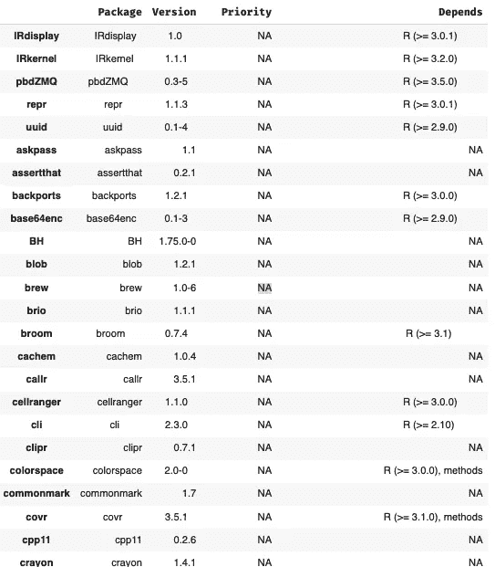
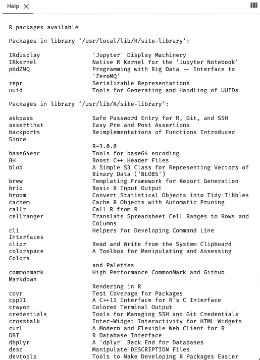

# 如何在 R Google Colab 中安装包

> 原文：<https://towardsdatascience.com/how-to-install-packages-in-r-google-colab-423e8928cd2e?source=collection_archive---------8----------------------->

## GOOGLE COLAB | RSTATS |笔记本

## 一些限制以及如何克服其中一些限制


照片由[埃弗顿维拉](https://unsplash.com/@evertonvila?utm_source=medium&utm_medium=referral)在 [Unsplash](https://unsplash.com?utm_source=medium&utm_medium=referral) 上拍摄

在我之前的文章中，我已经尝试解释过如何在 Google Colab 中运行 R。简而言之，有两种方式，第一种是使用`rpy2`在同一个运行时同时使用 R 和 Python，第二种是原生运行 R。

[](/how-to-use-r-in-google-colab-b6e02d736497) [## 如何在 Google Colab 中使用 R

### 并使用来自您的驱动器和 BigQuery 的数据

towardsdatascience.com](/how-to-use-r-in-google-colab-b6e02d736497) 

但是，运行 R notebook 时有几个限制。

*第一个限制*与运行时使用的 R 版本有关。要检查 R 在运行时运行的是什么版本，可以键入:`version`。这里我指的限制是我们不能选择运行哪个版本的 R。在这篇文章发表之前，Colab notebook 使用的 R 版本是:

```
platform       x86_64-pc-linux-gnu         
arch           x86_64                      
os             linux-gnu                   
system         x86_64, linux-gnu           
status                                     
major          4                           
minor          0.4                         
year           2021                        
month          02                          
day            15                          
svn rev        80002                       
language       R                           
version.string R version 4.0.4 (2021-02-15)
nickname       Lost Library Book
```

这不同于 Python 运行时。你可以选择使用 Python 2 或 Python 3，尽管 Google 目前正试图在 Colab 上停止对 Python 2 的支持。Python 2 的弃用声明可以在 [Google Colab FAQ 页面](https://research.google.com/colaboratory/faq.html#python-2-deprecation)上获得。下面是它的内容:

```
**Does Colab support Python 2?**The Python development team has declared that Python 2 will no longer be supported after [January 1st, 2020](https://www.python.org/dev/peps/pep-0373/#maintenance-releases).  Colab has stopped updating Python 2 runtimes, and is gradually phasing  out support for Python 2 notebooks. We suggest migrating important  notebooks to Python 3.
```

但是，我们仍然可以通过此链接[https://colab.to/py2.](https://colab.to/py2.)访问它

原生运行 R 的*第二个限制*与 Google Drive 有关。如果我们在 Colab 中本地使用 R，则不直接支持从 Google Drive 装载和获取数据并将其转换为 dataframe。在我的上一篇文章中，我还提供了一种从 Google Drive 或 BigQuery 检索数据的方法。

现在，假设您已经在 Colab 上成功地运行了 R。那那里有什么库或者包？如何安装一个我们需要的，但是默认不可用的包？有哪些选择？

在这篇文章中，我将尝试打破这一点。

## Google Colab R 默认安装了哪些包？

要获得已安装库的列表，可以运行以下代码:

```
str(allPackage <- installed.packages())
allPackage [, c(1,3:5)]
```

上面的代码将生成如下表格:



结果表。图片作者。

或者，您也可以运行来显示一个帮助窗口，其中包含有关在 R 运行时安装了哪些软件包的信息:

```
library()
```



library():帮助结果。图片作者。

从这里我们知道有一些常用的软件包，比如说，`dplyr`、`broom`、`surival`都是默认安装的。

## 如何在 R Google Colab 中安装包？

要安装默认情况下不可用的包，我们可以像往常一样使用`install.packages()`函数。

但是有些时候我们会发现 CRAN 中没有的包，所以我们可能需要通过 Github 来安装。或者当 CRAN 中还没有更新版本的包时。在这种情况下，我们可以使用`devtools::install_github (“DeveloperName/PackageName”)`功能。

例如，让我们尝试安装“rsvg”包，它是将 svg 图像渲染为 PDF、PNG、PostScript 或位图数组所必需的。

我们将在运行时运行`install.packages(“rsvg”)`代码。稍等片刻，将出现一条错误消息:

```
Installing package into ‘/usr/local/lib/R/site-library’
(as ‘lib’ is unspecified)

Warning message in install.packages("rsvg"):
“installation of package ‘rsvg’ had non-zero exit status”
```

我认为这是在 Google Colab 中使用 R 的第三个限制。

显示的消息(错误或警告)不如我们使用 RStudio 时完整。

`non-zero exit status`表示这个包没有成功安装在我们的系统或运行时上，它没有说明原因。

这种不完整在某些方面对我们来说有点麻烦，因为信息不清晰。我们必须在搜索引擎中找到它的原因。

在示例中使用的`rsvg`包的情况下，问题在于存在一个系统依赖项，这个系统依赖项是需要的，但在我们使用的系统中并不存在。R 包通常依赖于系统库或 R 外部的其他软件。

## **如何在** R **Google Colab 中安装系统库？**

在 R 运行时与操作系统(Ubuntu 终端)的交互可以通过使用`system()`函数来完成。

继续上面关于`rsvg`包的例子，结果是这个包需要在我们的系统上安装`librsvg2-dev`。要安装它，我们需要运行如下代码:

```
system('sudo apt-get install -y librsvg2-dev', intern=TRUE)
```

或者，我们可以使用`cat()`来获得相对更漂亮的结果:

```
cat(system('sudo apt-get install -y librsvg2-dev', intern=TRUE), sep = "\n")
```

其他一些 R 包可能有不同的依赖关系。你可以用和上面一样的方法安装它。您可能需要的其他一些库是`libcurl4-openssl-dev, libgsl0ldbl, gsl-bin, libgsl0-dev, g++, gcc, gfortran-8`。

## 结束语

可以在 Google Colab 上运行 R 是一件值得庆祝的事情，尽管有一些限制。Google Colab 提供的软件包可能足以完成我们处理数据的部分工作。这篇文章，以及上一篇文章，仅仅是如何绕过 R Google Colab 中存在的限制的例子。最后，希望这篇文章对有需要的人有用。