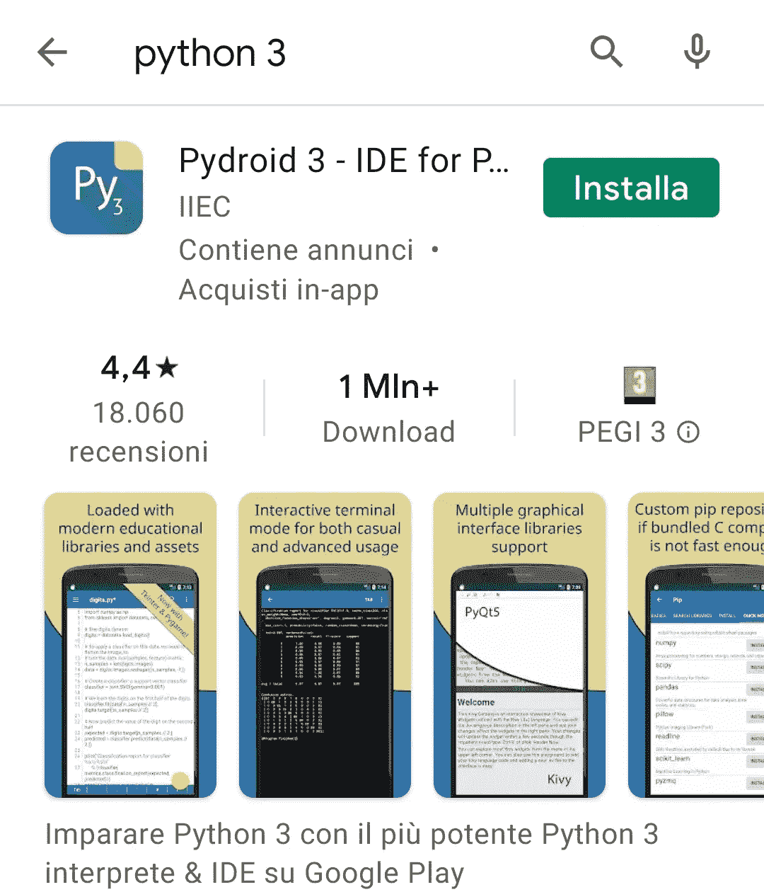
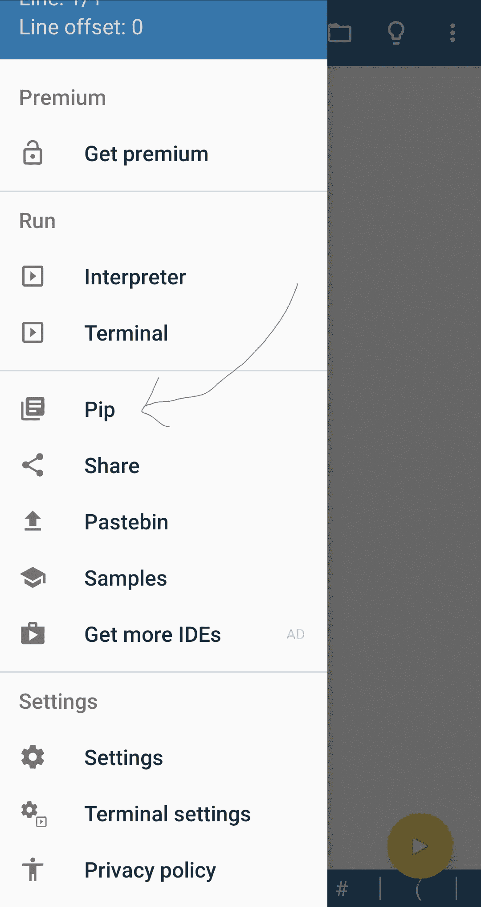
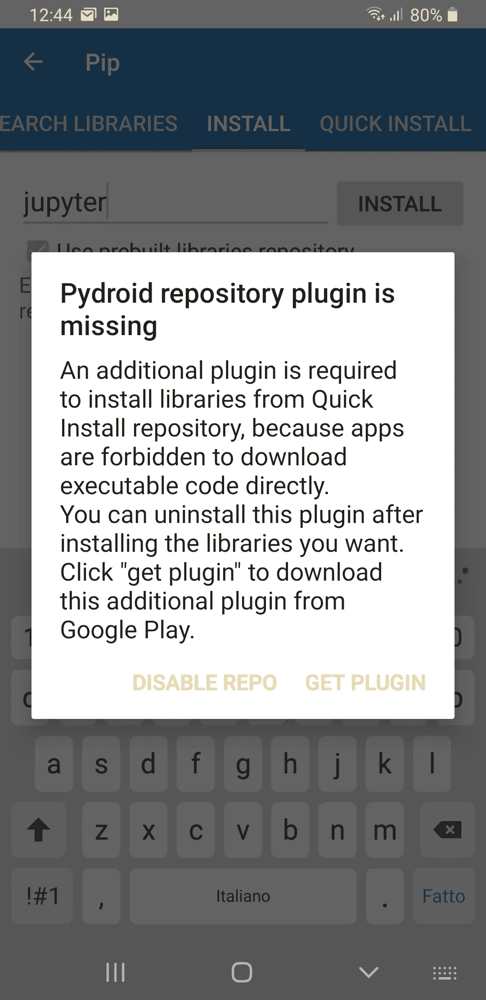
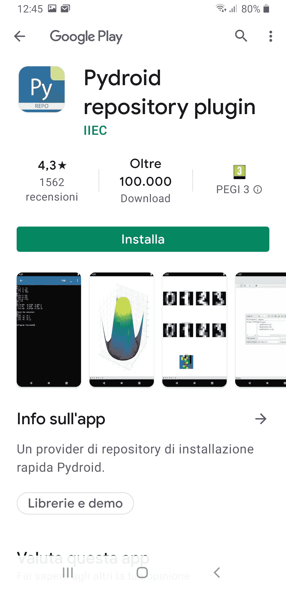
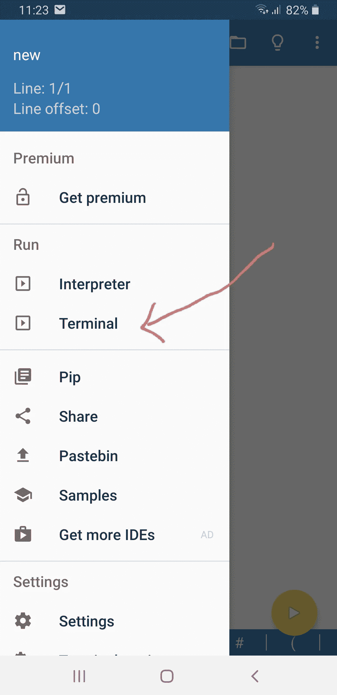

# 如何在 Android 设备上安装 Python 和 Jupyter Notebook

> 原文：<https://towardsdatascience.com/how-to-install-python-and-jupyter-notebook-onto-an-android-device-900009df743f?source=collection_archive---------1----------------------->

## 环境设置

## 当您排队等候或在旅途中时，提高您的工作效率。


图片来自 [Pixabay](https://pixabay.com/?utm_source=link-attribution&utm_medium=referral&utm_campaign=image&utm_content=1839876) 的[像素](https://pixabay.com/users/pexels-2286921/?utm_source=link-attribution&utm_medium=referral&utm_campaign=image&utm_content=1839876)

由于移动技术的普及，我们几乎一天中的所有时间都在网上:开车或坐火车旅行时，准备晚餐时，甚至外出散步时。

对于像我一样，总是活跃和一心多用的人来说，可能会发生这样的情况，当她坐在电脑前时，她必须放下手头的工作去做别的事情。这意味着 PC 上的前一个任务被延迟。

> 我已经找到了这个问题的部分解决方案:为什么不继续在手机(或平板电脑)上完成任务，同时做其他事情呢？

由于我的主要工作是通过 Jupyter 笔记本处理 Python 中的**编码，在这篇文章中，我将解释如何在 Android 上安装这两个组件。这个任务非常简单，因为 Android 是一个基于 unix 的操作系统。**

# 1.获得 Python 3

首先，手机/平板上必须安装 Python。Google Play 上有很多应用。我建议为 Python 3 安装 [Pydroid 3 — IDE。](https://play.google.com/store/apps/details?id=ru.iiec.pydroid3&hl=en&gl=US)



作者图片

安装过程非常简单:访问 **Google Play** ，搜索应用，点击安装按钮即可。

# 2.运行 Pydroid 3

现在应用程序已经安装好了，我们可以运行它了。第一次启动应用程序时，会下载并安装 Python。之后，我们可以选择左上角的按钮打开一个菜单，选择 **Pip** ，如下图所示:



作者图片

一旦点击 **Pip** 按钮，搜索框就会打开。我们可以键入 jupyter 并检查设置:*使用预构建的库储存库*。我们点击**安装**，出现以下警告:



我们可以点击**获取插件**。Google Play 应用程序打开，要求安装 **Pydroid 存储库插件**。



作者图片

我们点击**安装**，然后等待完成。现在我们回到 Pydroid 应用程序和 jupyter 的 Pip 安装。

一旦安装完成，我们就可以运行 jupyter 笔记本了。

# 3.运行 Jupyter 笔记本

我们回到 Pydroid 主页，从主菜单中选择**终端**。



作者图片

终端打开，我们可以编写命令`jupyter notebook`。最终笔记本启动，应用程序询问我们是要在浏览器中还是在 Pydroid 应用程序中打开它。

# 4.将笔记本保存在共享驱动器上

最后一步是储存。为了让我们的笔记本在不同设备之间保持同步，我们应该在它们之间安装一个共享驱动器。一个可能的解决方案是使用 [Dropbox](https://www.dropbox.com/) 或 [Google Drive](https://www.google.com/intl/en_en/drive/download/) 。在这篇文章中，我们描述了如何配置 Dropbox，它在免费版本中提供 2 GB 的空间。首先，我从[这个链接](https://www.dropbox.com/install)下载桌面 Dropbox 应用程序，然后我们把它安装在电脑上。然后我们从 Google Play 下载智能手机上的[相同应用](https://play.google.com/store/apps/details?id=com.dropbox.android&hl=en&gl=US)。

一旦安装到两台设备上，我们就可以同步它们。例如，我们可以从终端访问电脑上的 dropbox 文件夹，然后运行 Jupyter 笔记本。我们可以创建以下 hello world 笔记本，并将其命名为 **Test.ipynb** 。

```
print('Hello world!)
```

然后我们必须从智能手机访问 **Test.ipynb** 。我们从智能手机上运行 Dropbox，等待同步。然后，我们按住 Test.ipynb，访问右上角的菜单，单击“Save”。我们选择文件系统上的位置。

现在，我们可以通过 Pydroid 从智能手机运行 Jupyter 笔记本，并从 Jupyter 文件管理器访问包含 Test.ipynb 的文件夹。瞧啊。我们可以从智能手机继续我们的笔记本！请注意，我们的编辑不会在 dropbox 上自动同步。因此，一旦完成代码，我们需要从智能手机文件系统访问上一个文件夹，并与 dropbox 共享它。

# 摘要

在本文中，我展示了如何在基于 Android 的手机上安装和配置 Python 和 Jupyter。然后，我举例说明了如何同步计算机和智能手机，以便处理同一段代码。

所提出的机制的替代解决方案可以是完全在线执行 Python。例如，这可以通过 Google Colab 来实现。不过这个留作以后的帖子:)

如果你想了解我的研究和其他活动的最新情况，你可以在 [Twitter](https://twitter.com/alod83) 、 [Youtube](https://www.youtube.com/channel/UC4O8-FtQqGIsgDW_ytXIWOg?view_as=subscriber) 和 [Github](https://github.com/alod83) 上关注我。

# 我最新的文章

</getting-started-with-d3-js-maps-593d4e68338c> 