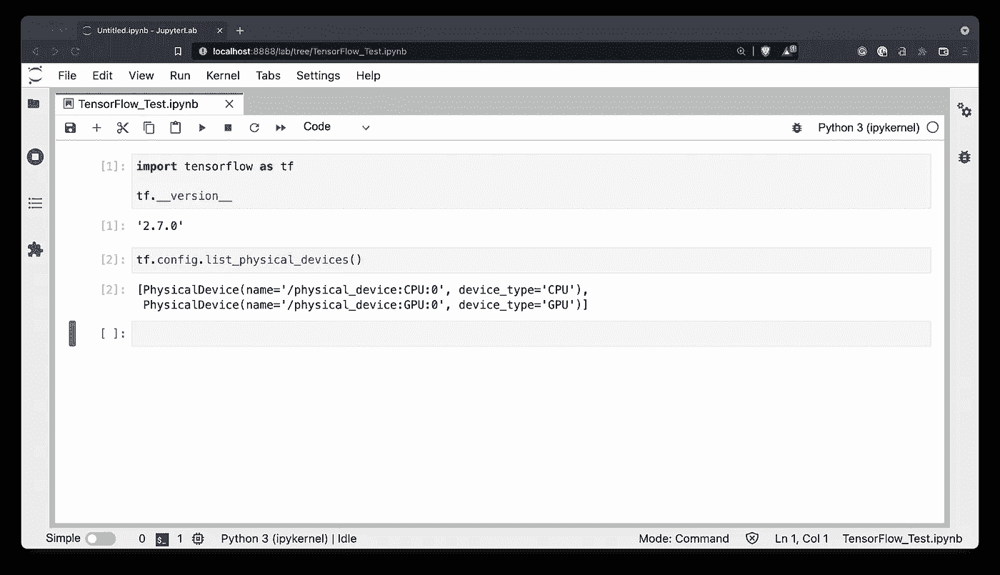
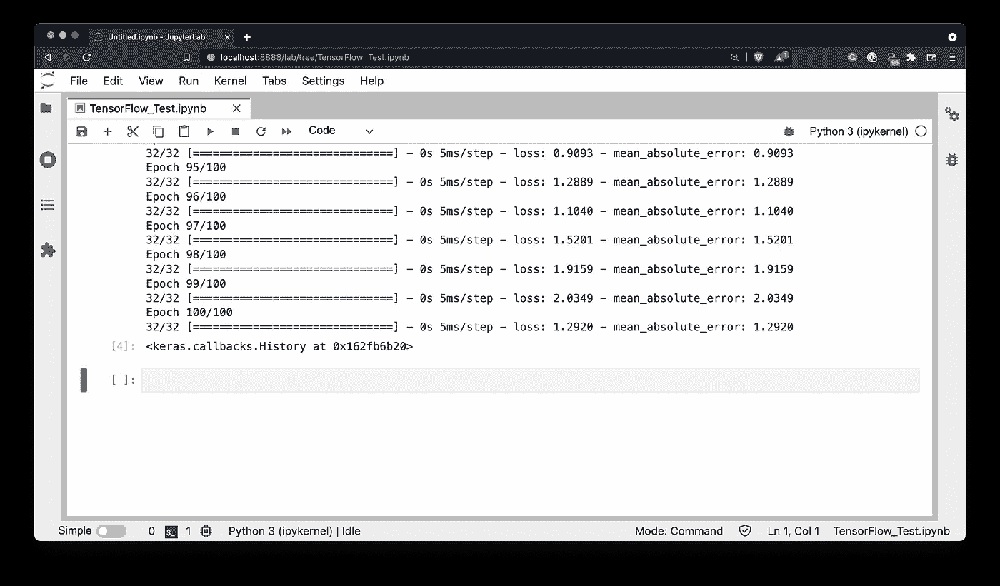

# 如何在 MacBook Pro M1 Pro 上轻松安装 TensorFlow 2.7

> 原文：<https://towardsdatascience.com/how-to-install-tensorflow-2-7-on-macbook-pro-m1-pro-with-ease-744bfa978fe8?source=collection_archive---------10----------------------->

## **在苹果新推出的 M1 Pro 和 M1 Max 芯片上安装并测试 tensor flow 2.7**


由 [Anthony Choren](https://unsplash.com/@tony_cm__?utm_source=medium&utm_medium=referral) 在 [Unsplash](https://unsplash.com?utm_source=medium&utm_medium=referral) 上拍摄的照片

早在 2020 年，苹果的 M1 芯片就彻底改变了这个行业。新的 M1 Pro 和 M1 Max 是专业用户一直在等待的。苹果向内容创作者推销这些，但请放心，作为一名数据科学家，你可以压榨的性能值得一谈。

我起初有点怀疑，决定不买新的笔记本电脑，但在商店里看到 16 英寸后，我忍不住了。照相机确实增加了 10 磅。新 M1 Pro 和 M1 Max macbook 在现实生活中看起来并不笨重。

总之，我选择了“基础”型号 16“M1 Pro Macbook Pro，配有 10 核 CPU、16 核 GPU 和 16 GB 内存。它用我去年的 M1 Macbook Pro 擦地板，在一些测试中接近我用 RTX 3060Ti 定制的配置。敬请关注博客，了解即将到来的数据科学基准测试和比较。

今天我将向大家展示如何在 MacBook Pro M1 Pro 上安装 TensorFlow 2.7。你将看到的一切都可以在普通的 M1 和 M1 Max 芯片上工作，只要是苹果硅芯片。我们还将通过训练一个简单的神经网络来验证 TensorFlow 是否已安装。

不想看书？请观看我的视频:

# 在 MacBook Pro M1 Pro 上安装 TensorFlow 必备软件

在你能想到 TensorFlow 之前，你需要安装一些东西——*家酿*、 *XCode 工具*和 *Anaconda* 。您可以使用以下命令通过 Mac 的终端安装前两个:

```
/bin/bash -c "$(curl -fsSL https://raw.githubusercontent.com/Homebrew/install/HEAD/install.sh)"

xcode-select --install
```

如果您不能立即安装 XCode 工具，请重新启动终端窗口，然后再试一次。

最后，你需要一条蟒蛇。截至目前， [Miniforge](https://github.com/conda-forge/miniforge) 原生运行在所有 M1 芯片上(M1、M1 Pro、M1 Max)，所以我们会坚持下去。下载 Mac 版 ARM64 下图中标记的版本:


图 1-Miniforge 下载页面(图片由作者提供)

它将下载一个 SH 文件。您必须更改它的权限，并通过终端运行它:

```
cd <path_to_the_downloaded_file>

chmod -x Miniforge3-MacOSX-arm64.sh
./Miniforge3-MacOSX-arm64.sh
```


图 2 —从终端安装 Miniforge(图片由作者提供)

按照说明建议—按下*进入*继续。坚持使用默认选项，一分钟左右你就应该安装好 Miniforge 了！

现在基于 Python 3.9 创建一个新的虚拟环境。我给我的取名为`env_tf`:

```
conda create --name env_tf python=3.9
```

几秒钟后将创建新环境:


图 3 —创建新的虚拟环境(图片由作者提供)

从这里，激活环境:

```
conda activate env_tf
```


图 4 —激活新的虚拟环境(图片由作者提供)

这就是我们在 M1 Pro 芯片上安装 TensorFlow 所需的全部内容——接下来让我们开始吧。

# 如何在 M1 Pro 芯片上安装 TensorFlow 和 TensorFlow Metal

在过去的几个月里，安装有 GPU 支持的 TensorFlow 的过程变得更加顺畅。自从 macOS Monterey 发布以来，如果有人遵循这些说明遇到任何麻烦，我会感到惊讶。

我们将从安装来自 Apple 的 TensorFlow 依赖项开始:

```
conda install -c apple tensorflow-deps -y
```


图 5 —安装苹果的 TensorFlow 依赖项(图片由作者提供)

安装完成后，使用以下命令在 M1 专业版 Macbook 上安装 TensorFlow:

```
python -m pip install tensorflow-macos
```


图 6 —在 M1 Pro Macbook 上安装 TensorFlow(图片由作者提供)

安装将需要几分钟，因为 Miniforge 必须拉一吨相当大的包。最后一步是用 Metal 插件在 M1 Pro macbook 上安装对 TensorFlow 的 GPU 支持:

```
pip install tensorflow-metal
```


图 7 —在 M1 Pro Macbook 上安装 TensorFlow Metal(图片由作者提供)

至此，您已经安装了 TensorFlow 及其所有依赖项。我还将安装 JupyterLab，这样我们就可以轻松地构建和训练一个简单的神经网络:

```
conda install -c conda-forge jupyter jupyterlab -y
```


图 8 —安装 JupyterLab(图片由作者提供)

安装后，启动新的 Jupyter 会话:

```
jupyter lab
```

下一节我们再见，我们将在 M1 Pro 芯片上用 TensorFlow 训练一个简单的神经网络。

# 如何在 MacBook Pro M1 Pro 上用 TensorFlow 训练一个神经网络

在继续之前，您应该启动一个 JupyterLab 会话，或者打开任何其他代码编辑器。使用以下代码片段导入 TensorFlow 并验证它是否已安装:

```
import tensorflow as tf tf.__version__
```

此外，打印可用训练设备的列表-只是为了验证 M1 Pro Macbook 上的 TensorFlow 可以看到 GPU:

```
tf.config.list_physical_devices()
```

以下是两者的输出:



图 9 — TensorFlow 版本和可用设备(图片由作者提供)

现在，M1 Pro 芯片上的 TensorFlow 安装成功，它还将 CPU 和 GPU 视为可用的训练设备！

接下来，让我们为模型训练创建一个虚拟数据集。唯一的输入特征是范围从 1 到 100 的 1000 个数字的数组，步长为 0.1。目标变量是输入要素+ 10。两者都被转换为浮点张量对象:

```
import numpy as np

X = np.arange(1, 101, step=0.1)
y = [x + 10 for x in X]

X = tf.cast(tf.constant(X), dtype=tf.float32)
y = tf.cast(tf.constant(y), dtype=tf.float32)
```

从这里，我们将声明一个神经网络模型。体系结构随机设置，网络分为两层，每层 64 个节点。该模型是使用平均绝对误差(T2)来跟踪损失，亚当(T4)作为优化器。最后，该模型被训练 100 个时期:

```
model = tf.keras.Sequential([
    tf.keras.layers.Dense(64, input_shape=(1,), activation='relu'),
    tf.keras.layers.Dense(64, activation='relu'),
    tf.keras.layers.Dense(1)
])

model.compile(
    loss=tf.keras.losses.mean_absolute_error,
    optimizer=tf.keras.optimizers.Adam(learning_rate=0.1),
    metrics=['mean_absolute_error']
)

model.fit(X, y, epochs=100)
```

培训结束后，您将看到以下内容:



图 10 —在 M1 Pro 芯片上用 TensorFlow 训练神经网络模型(图片由作者提供)

一切看起来都很好，所以让我们使用`predict()`函数对新数据进行预测:

```
model.predict([10, 20, 30])
```


图 11 —根据新数据进行预测(图片由作者提供)

实际值应该是 20、30 和 40。我们的简单模型不会太离谱。

# 结论

今天，您已经在 M1 Pro MacBook 上成功安装了支持 GPU 的 TensorFlow。上述循序渐进的指导应该适用于任何苹果芯片设备，从 Mac Mini 到 M1 Max。

**但是 M1 Pro 对于数据科学和机器学习有多好呢？**请继续关注，因为我做了大量真实世界的对比测试，我计划在未来几周内分享。

同时，参考以下资源，从头开始学习 TensorFlow:

*   [TensorFlow 文章系列](https://betterdatascience.com/tag/tensorflow/)
*   [TensorFlow 视频系列](https://www.youtube.com/watch?v=oZjau-aUk0U&list=PLQ5j-FTc2VhCaI_8Aiu-KgO4nMfW3HRYe)
*   [TensorFlow for computer vison 视频系列](https://www.youtube.com/watch?v=O7EV2BjOXus&list=PLQ5j-FTc2VhDTrX24ifL-qyAcHUJtZQZ3)

*喜欢这篇文章吗？成为* [*中等会员*](https://medium.com/@radecicdario/membership) *继续无限制学习。如果你使用下面的链接，我会收到你的一部分会员费，不需要你额外付费。*

<https://medium.com/@radecicdario/membership>  

# 保持联系

*   注册我的[简讯](https://mailchi.mp/46a3d2989d9b/bdssubscribe)
*   订阅 [YouTube](https://www.youtube.com/c/BetterDataScience)
*   在 [LinkedIn](https://www.linkedin.com/in/darioradecic/) 上连接

*最初发表于 2021 年 12 月 30 日*[*https://betterdatascience.com*](https://betterdatascience.com/install-tensorflow-2-7-on-macbook-pro-m1-pro/)*。*