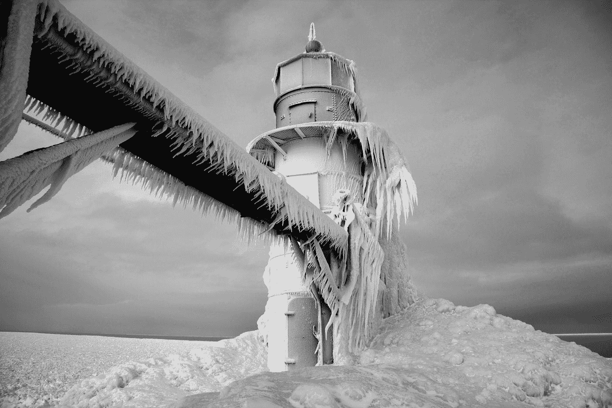
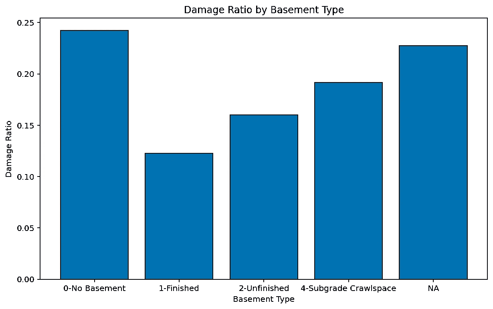
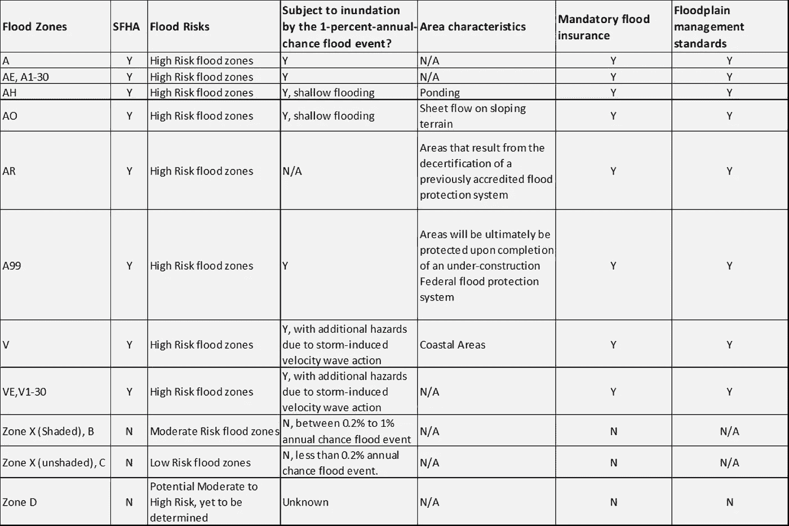
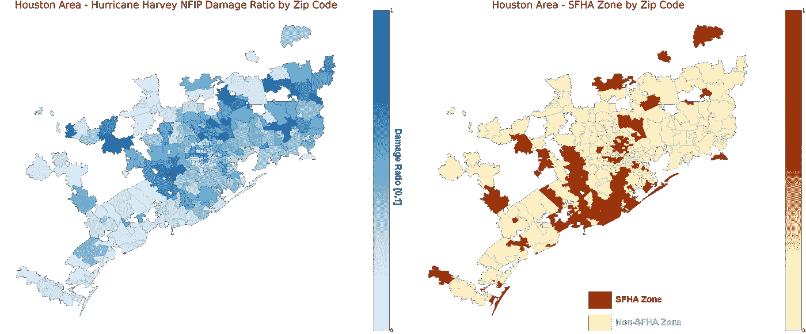
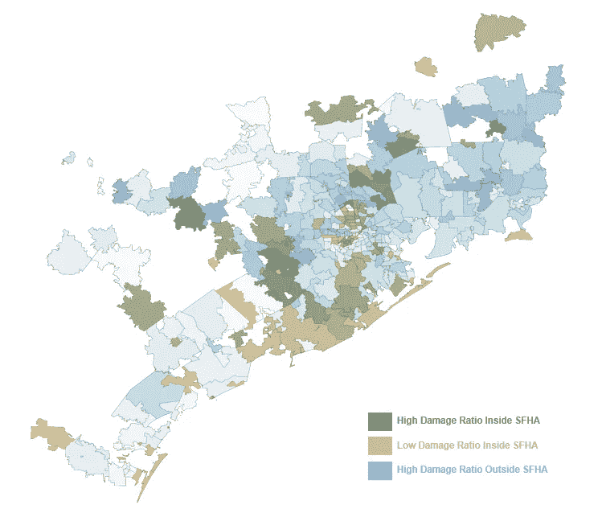

# 如何将气候风险纳入信用风险评估

> 原文：<https://towardsdatascience.com/how-to-integrate-climate-risk-into-credit-risk-assessments-f7eac5c01850?source=collection_archive---------25----------------------->

## [行业笔记](https://towardsdatascience.com/tagged/notes-from-industry)

## 使用 NFIP 保险数据重新评估抵押贷款组合风险

由 [NOAA](https://unsplash.com/@noaa?utm_source=medium&utm_medium=referral) 在 [Unsplash](https://unsplash.com?utm_source=medium&utm_medium=referral) 上拍摄的照片

十年前，气候风险仅被视为对公司道德和声誉的潜在威胁。今天，越来越多的公司开始将它视为一种可能影响其战略和业务规划的财务风险。正如气候相关财务披露工作组(TCFD)建议中所述，有两大类气候风险会对公司造成财务影响:物理风险和过渡风险。

**物理风险** : *由极端天气事件(即急性风险)的频率或严重性(如旋风、飓风或洪水)导致的财产价值减少或运营成本增加(如保险费增加)；或长期气候模式转变(即慢性风险)，如降水、气温上升和海平面上升。*

**转型风险** : *与向低碳经济转型相关的政策、技术、消费者行为和市场供应的变化，包括由于减排政策的突然变化而导致的化石燃料储备或管道(即搁浅资产)的注销或提前报废。*

根据 TCFD 2020 年的最新状况报告，有超过 1700 家公司签署了通过其主要财务报告披露气候相关风险和机遇的协议。更重要的是，大量与气候相关的风险数据预计将在很大程度上由数据提供商和非政府组织补充，如 [CDP](https://www.cdp.net/en) 、 [2Degree Investing](https://2degrees-investing.org/) 和 [Carbon4 Finance](http://www.carbon4finance.com/) 等..预计为了将气候风险完全纳入(信贷)投资/业务决策，将会有**越来越多的需求来探索非常规建模技术，以将气候情景、减排途径或碳管理 ESG 指标“转化”为财务影响**。

在本文中，我们将讨论如何利用国家洪水保险计划(NFIP)索赔数据来洞察洪水风险对财产价值的影响，从而揭示住宅抵押贷款风险中尚未捕捉到的隐藏风险(即在财产价值和抵押贷款组合的预期损失之间建立联系)。让我们开始吧。

# 什么是 NFIP 计划？

标准的房主和房客保险政策不包括洪水损害。然而，洪水保险是作为一项独立于 NFIP 的政策提供的，这是一项由国会在 1968 年创建的联邦计划，由联邦紧急事务管理局(FEMA)管理。NFIP 计划有两个主要目标:

*   保护参与社区的财产所有者免受洪水损失；
*   通过社区和州采用洪泛区管理条例来减少未来的洪水损失。

由于这两个主要目的，位于参与的 NFIP 社区和特殊洪水危险区(SFHA，又名 100 年一遇洪水危险区，因为这些地区每年有 1%的概率被洪水袭击)的建筑必须投保洪水保险，而一些抵押贷款人可能要求 SFHA 以外的房产投保洪水保险，作为其审批流程的一部分。此外，NFIP 计划的参与是以社区为基础的，而不是以个人为基础的，因为该保险仅在那些洪水易发地区提供，在这些地区，在其社区监督下采用了适当的设计和施工标准。

NFIP 提供两种保险保障，即建筑和内容保障，分别在两种计划下，即常规计划和紧急计划。以单户住宅为例，NFIP 保险公司在常规项目下可提供高达 25 万美元的建筑保险，在紧急项目下可提供 3.5 万美元的建筑保险；额外内容分别高达 100，000 美元和 10，000 美元。**从历史上看，最高的 NFIP 支出属于 2005 年的卡特里娜飓风，为 163 亿美元，其次是 2017 年的哈维飓风，为 89 亿美元**。

# 洪水事件会如何影响你的抵押贷款行为？

在被洪水事件破坏或摧毁的地区，人们可能会看到拖欠率瞬间飙升。这是因为一些房主在支付短期住房租金的同时，可能不得不修复重大损坏，甚至重建他们的房产，因为他们尚未获得延期偿付计划或修改。下图显示了 2017 年 8 月飓风哈维过后，德克萨斯州的犯罪率急剧上升。

作者图片—德克萨斯州房地美拖欠状况(2014 年至 2019 年)

同样如上图所示，在向借款人提供金融援助计划(即延期、还款计划和/或贷款修改)后，大量拖欠贷款将在陷入严重拖欠或违约状态之前得到解决。**贷款严重拖欠或违约的可能性主要取决于洪水损害的严重程度(或剩余房屋净值规模)和借款人的收入状况**。根据基于房利美数据的[飓风哈维](https://www.tandfonline.com/doi/full/10.1080/10527001.2020.1840131)的案例研究，与未受损害的财产相比，中度至重度损害(即超过财产价值 10%的损害)会使洪水后五个月内贷款逾期 90 天的几率增加三倍。

**洪水过后，提前还款行为也会激增，尤其是在需要洪水保险的地区。这是因为这些房主可以用保险索赔来偿还未偿还的贷款。此外，一些受影响的房主可能希望搬到洪水易发区以外，这并不奇怪，其中这些受保的借款人更愿意以折扣价向投资者出售房屋，因为他们的损失已经得到补偿。哈维袭击一年后，房屋销售活动增长了 37.2%，这支持了这一点。**

很明显，为了描述后洪水时期损失和提前还款行为的增加，传统信用风险分析中缺失的环节是使用保险单/索赔数据来回答以下关键问题:

1.  如何预测洪水事件造成的财产损失？
2.  如何预测贷款账簿中的保险范围随时间的变化？

我们在下面分析中的重点将放在第一个问题上。

# 数据下载

联邦应急管理局提供公共访问数据集，包括应急管理，减灾和 NIFP 等。，通过 [OpenFEMA](https://www.fema.gov/about/reports-and-data/openfema) ，一个通过直接下载(csv 格式)或 API 端点交付数据的一站式商店。本分析中使用的数据集来源于 [FIMA NFIP 修订索赔— v1](https://www.fema.gov/openfema-data-page/fima-nfip-redacted-claims-v1) ，该数据集代表了自 20 世纪 70 年代以来超过 2，000，000 起索赔交易，涵盖所有州和地区。在这个分析中，我们使用保险索赔与承保范围的比率作为损失的衡量标准，我们的重点将放在独栋房屋上。

# 深度-损伤关系

由于洪水深度是估计财产损失的最佳代理，几十年来，估计洪水事件造成的经济损失的传统方法是基于深度损失函数。深度损伤函数的形状在很大程度上取决于以下性质特征:

> 楼层数

似乎楼层越高(此处联排别墅代表三层或三层以上的联排别墅)，遭受洪水损害的风险就越低。最高的风险属于基础上的活动房屋或旅行拖车。

按作者分类的图片—基于 NFIP 索赔数据的按楼层数分类的损坏率(TX 和 FL)

> 地下室类型

与有地下室结构的房子相比，没有地下室(包括地下室类型——未知)的独户房子往往显示出更高的损坏风险。正如所料，当地下室更完整，更类似于楼上的生活区，财产往往显示较低的洪水损害风险。

按作者分类的图像—根据 NFIP 索赔数据按基底类型分类的损坏率(德克萨斯州和佛罗里达州)

> 洪水区(洪水保险评级图—公司)

联邦应急管理局指定并维护洪水区评级，以帮助抵押贷款机构确定保险要求，并帮助社区制定降低风险的策略。洪水区是根据洪水风险驱动因素定义的，如洪水袭击概率、区域特征(如海岸、积水等)。)、建设标准等..有关详细信息，请参考下表。

图片由作者提供；原文出处:[https://floodpartners.com/flood-zones/](https://floodpartners.com/flood-zones/)

据观察，损坏率对洪水区相当敏感，但是最高的损坏率不一定总是与高风险洪水区相关联。在某些情况下，低到中等风险区(如 C 区和 X 区)也显示出较高的损坏率，情况正好相反。这可能是因为 FEMA 自 20 世纪 70 年代以来引入的静态洪水区评级不再能够提供该地区内在洪水风险的准确测量。事实上，今年早些时候，联邦应急管理局已经宣布在 2021 年 10 月推出**风险评级 2.0** 。新的风险评级方法预计将纳入更多的洪水风险变量，包括洪水频率、多种洪水类型——河流溢流、风暴潮、海岸侵蚀和暴雨——以及与水源的距离以及财产特征，如海拔和重建成本。

作者图片-基于 NFIP 索赔数据的洪灾区(德克萨斯州和佛罗里达州)损失比率

从下面的数字中可以得出类似的结论，这些数字显示了飓风哈维造成的损失比率的另一种观点，并与同一地区的 SFHA 区进行了比较。

按作者分类的影像-哈维 NFIP 飓风的破坏率和 SFHA 区域比较(使用 Python 中的底图创建)

将上面两个图放在一起，从下图中可以看出，许多遭受严重损坏的区域(蓝色阴影)实际上位于 SFHA 区之外。

按作者分类的影像-哈维·NFIP 飓风损害率和 SFHA 区域重叠(使用 Python 中的底图创建)

# 下一步是什么？

上述实证分析试图证明在气候相关信用风险分析中使用保险数据的直观性和重要性。如本文开头所述，作为下一步，人们可能希望探索深度损害函数，以生成各种气候情景下的财产级年损失曲线。FEMA 的 [**Hazus 洪水评估结构工具(FAST)工具**](https://github.com/nhrap-hazus/FAST) ，一个开源的解决方案，可以成为你一个很好的起点。尽管多年来许多水文学家对危险数据稀疏性限制提出了担忧，并对将 Hazus 模型应用于所有地区和洪水事件提出了批评，但在预测危险损失时，它仍然是各种气候分析供应商解决方案最受欢迎的基础。

另一个需要考虑的步骤是在长期气候情景分析中预测保险范围的演变。除了历史趋势之外，保险范围的建模应该考虑 1)被低估的洪水风险的暴露；以及 2)增加保险价格对低收入社区的不利影响。

# 结论

希望这篇文章能帮助你思考如何将保险数据纳入你的信用风险分析，并量化气候风险的影响。喜欢就在下面留下你的评论吧。以上分析的完整代码(包括底图邮编等级图)可以在 [**这里**](https://gist.github.com/domisoxz/be99af5b3863e041b7cb793097db2e12) 找到。

使用底图绘制飓风哈维(德克萨斯州休斯顿)的邮政编码级别损害率和洪水区等级

**脚注**

[1]SFHA:在 30 年的抵押贷款期间，SFHA 地区至少有四分之一的几率会被洪水淹没。如果有人想知道他或她的房产是否在 SFHA 区，您可以使用您在 https://msc.fema.gov/portal/search[的地址或坐标找到该信息。如果您想进一步了解如何通过 FEMA 的 NFHL(国家洪水灾害层)API 提取 SFHA 洪水区信息，请在下面留下您的评论。](https://msc.fema.gov/portal/search)