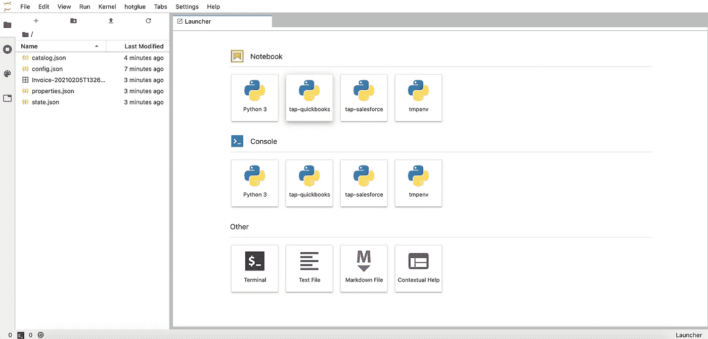
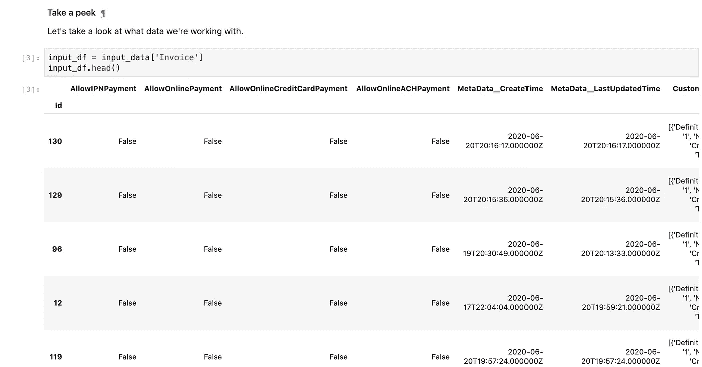
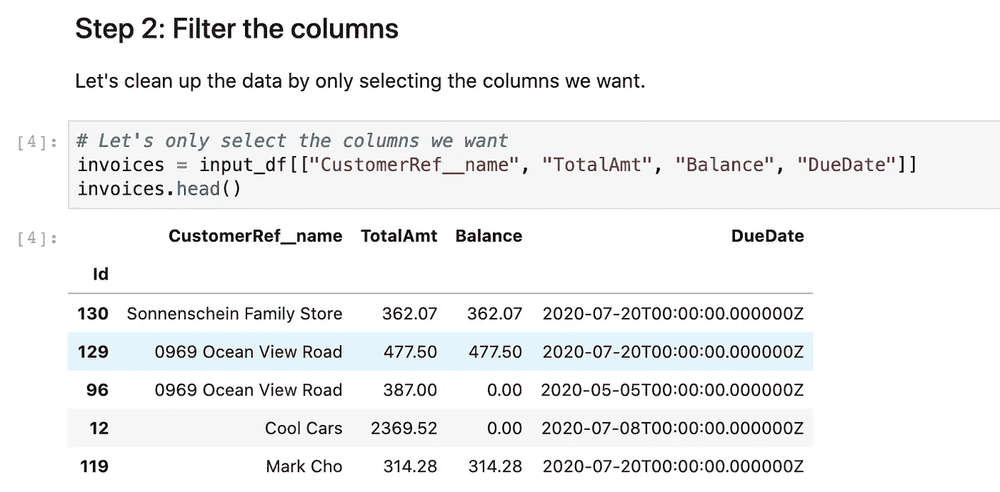

# 如何将 Quickbooks 与 Python 集成

> 原文：<https://towardsdatascience.com/how-to-integrate-quickbooks-with-python-8be2d69f96cb?source=collection_archive---------16----------------------->

## 使用 Python 构建轻量级 Quickbooks 数据集成管道

如果您是一名 B2B 开发人员，正在开发一个产品，最早的产品开发阶段之一就是创建一个数据集成管道来导入客户数据。

在本文中，我将向您展示如何利用 [Singer 的](https://www.singer.io/) [tap-quickbooks](https://github.com/singer-io/tap-quickbooks) 从 quickbooks 中提取数据。在这里，我将带您了解如何使用 [target-csv](https://github.com/singer-io/target-csv) 解析来自 Singer 的 JSON 输出数据，并使用一个简单的 Python 脚本将其标准化。


来源: [unDraw](https://undraw.co/)

# 笔记

这些例子的代码可以在 GitHub [这里](https://github.com/hotgluexyz/recipes)上公开获得，还有我将带你浏览的信息的描述。

这些示例依赖于几个开源 Python 包:

*   **点击 quickbooks:** 歌手点击 quickbooks 来提取数据。更多关于 [GitHub](https://github.com/singer-io/tap-quickbooks) 的信息。我们将使用 [hotglue fork](https://github.com/hotgluexyz/tap-quickbooks) ，因为它与 target-csv 版本兼容。
*   **target-csv:** 一个 Singer 目标，将输入的 JSON 数据转换成 csv 文件。更多关于 [GitHub](https://github.com/singer-io/target-csv) 的信息。我们将使用[热熔胶叉](https://github.com/hotgluexyz/target-csv)，它使用更新的依赖关系。
*   singer-discover :一个从歌手目录中选择流的开源工具。更多关于 [GitHub](https://github.com/chrisgoddard/singer-discover) 的信息。
*   **pandas:** 一个广泛使用的开源数据分析和操纵工具。关于他们的[站点](https://pandas.pydata.org/)和 [PyPi](https://pypi.org/project/pandas/) 的更多信息。
*   **gluestick:** 一个小型开源 Python 包，包含由 [hotglue](https://hotglue.xyz/) 团队维护的用于 ETL 的 util 函数。更多关于 [PyPi](https://pypi.org/project/gluestick/) 和 [GitHub](https://github.com/hotgluexyz/gluestick) 的信息。

事不宜迟，我们开始吧！

# 步骤 1:设置我们的环境

## 创造虚拟

Singer taps 之间往往会有很多依赖冲突——为了避免依赖地狱，我强烈建议在虚拟环境中运行这个示例。

```
# Install JupyterLab if you don't have it already
$ pip3 install jupyterlab# Create the virtual env
$ python3 -m venv ~/env/tap-quickbooks# Activate the virtual env
$ source ~/env/tap-quickbooks/bin/activate# Install the dependencies
$ pip install git+[https://github.com/hotgluexyz/tap-quickbooks.git](https://github.com/hotgluexyz/target-csv.git) git+[https://github.com/hotgluexyz/target-csv.git](https://github.com/hotgluexyz/target-csv.git) gluestick pandas ipykernel singer-python==5.3.1 requests==2.20.0 xmltodict==0.11.0 jsonpath-ng==1.4.3 pytz==2018.4 attrs==20.2.0[#](https://github.com/chrisgoddard/singer-discover/archive/master.zip#) Make our venv available to JupyterLab
$ python -m ipykernel install --user --name=tap-quickbooks# Create a workspace for this
$ mkdir quickbooks-integration# Enter the directory
$ cd quickbooks-integration
```

这些命令可能因您的操作系统和 Python 版本而异。欲了解更多关于 Jupyter venvs 的信息，请查看[这篇关于数据科学的文章](/create-virtual-environment-using-virtualenv-and-add-it-to-jupyter-notebook-6e1bf4e03415)。

# 步骤 2:配置歌手抽头

## 获取 OAuth 凭证

首先，你需要 Quickbooks OAuth 证书。Quickbooks 已经[很好地记录了这个过程，所以我假设你可以遵循这个指南。](https://developer.intuit.com/app/developer/qbo/docs/develop/authentication-and-authorization)

## 创建歌手点击配置

现在我们必须创建一个歌手配置。这将指定我们的 OAuth 凭证和一些特定于 Singer 的设置。他们的示例配置具有以下格式:

```
{
  "client_id": "secret_client_id",
  "client_secret": "secret_client_secret",
  "refresh_token": "abc123",
  "start_date": "2017-11-02T00:00:00Z",
  "api_type": "BULK",
  "select_fields_by_default": true,
  "sandbox": true,
  "realmId": "123456789"
}
```

填写您的凭证，并将其保存到本地目录中名为`config.json`的文件中。

## 跑步歌手发现

从 Quickbooks 获取数据的第一步是找出哪些数据是实际可用的。Singer taps 提供了一个 discover 命令，它打印一个描述所有这些内容的 JSON 对象。让我们现在运行它:

```
# Do the Singer discover and save to catalog.json
$ tap-quickbooks --config config.json --discover > catalog.json
```

如果成功，您的 catalog.json 应该如下所示:

```
# Check discover output
$ less catalog.json
{
    "streams": [
        {
            "stream": "Invoice",
            "tap_stream_id": "Invoice",
            "schema": {
                "type": "object",
                "additionalProperties": false,
                "properties": {
                    "AllowIPNPayment": {
                        "type": [
                            "boolean",
                            "null"
                        ]
                    },
...
```

## 告诉辛格我们想要什么

在这里，我们想要选择我们实际想要同步的对象。为此，我们将使用之前下载的 singer-discover 实用程序。

```
# Switch singer-python version to meet singer-discover dep
$ pip install [https://github.com/chrisgoddard/singer-discover/archive/master.zip](https://github.com/chrisgoddard/singer-discover/archive/master.zip#) singer-python==5.4.1 prompt_toolkit==1.0.14# Build our selected catalog
$ singer-discover --input catalog.json --output properties.json
```

这将启动一个交互式实用程序，从 Quickbooks 中选择您想要的*流*(对象)。我将选择发票(空格)并按回车键。这将提示您选择特定字段的选项。我将接受默认值并按 enter 键。


发票流的选定字段

这将为您提供以下输出

```
INFO Catalog configuration starting...
? Select Streams  [Invoice]
? Select fields from stream: `Invoice`  done (18 selections)
INFO Catalog configuration saved.
```

## 运行歌手同步

现在，我们终于可以使用我们生成的文件从 Quickbooks 中获取数据了，使用以下命令:

```
# Switch singer-python version to meet tap-quickbooks dep
$ pip install singer-python==5.3.1# Get Invoice data from Quickbooks and save as a CSV
$ tap-quickbooks --config config.json --properties properties.json | target-csv  > state.json
```

这将输出两个文件:

*   包含 Quickbooks 数据的 CSV 文件(类似于`Invoice-20210128T125258.csv`)
*   一个 JSON 文件`state.json`告诉`tap-quickbooks`它最后同步了什么。这可以在未来反馈到 tap-quickbooks，以避免再次同步相同的数据。

终于！我们已经从 Quickbooks 中提取了数据！不算太坏，对吧？如果你想在生产中使用它，你必须自动化创建`properties.json`的过程，并且很可能将所有这些都粘贴到 Docker 容器中(非常类似于 [hotglue](https://hotglue.xyz/) 和 [Airbyte](https://airbyte.io/) 的工作方式)。

# 步骤 3:标准化数据

您可以在 Jupyter 笔记本中直接阅读这一部分(随意复制并尝试您自己的转换)。

<https://github.com/hotgluexyz/recipes/blob/master/src/quickbooks.ipynb>  

## 看数据

先来看看`tap-quickbooks`给了我们什么。


Quickbooks 的 CSV 发票

不算太坏，对吧？让我们将数据加载到 Jupyter 笔记本中，并稍微整理一下数据。对于这篇文章，我将保持它非常简单，但是如果你想了解其他 ETL 操作，请查看我的[关于数据科学的文章](/how-to-write-etl-operations-in-python-baffbceeadf4)。

## 发射 Jupyter

让我们发射 Jupyter

```
# You may have some issues in Jupyter if you don't do this
$ pip install prompt-toolkit==3.0.14# Deactivate the virtualenv
$ deactivate# Start Jupyter Lab
$ jupyter lab
```

这应该会在当前目录下启动 Jupyter 并打开浏览器。



JupyterLab 开始了

如果所有的设置命令都有效，您应该在笔记本部分看到 tap-quickbooks。让我们用 tap-quickbooks 内核创建一个新的笔记本。我将把我的名字命名为`quickbooks.ipynb`

## 加载数据

让我们使用 gluestick 和 pandas 库来加载数据并查看一下。我们这里的目标是能够容易地操作 tap-quickbooks 的输出。



熊猫数据框架中的数据预览

## 清理数据

现在我们有了熊猫的数据框架中的数据，你可以随意转换它。当然，你并不局限于使用 Pandas——你可以使用 Spark，或者任何你喜欢的基于 Python 的数据转换工具。



示例最终数据

# 结论

## 后续步骤

这实际上只是数据集成管道的起点。如果你想更进一步(在云上编排，将它连接到你的产品上),那就值得看一看专注于开发人员的工具，比如 [hotglue](https://hotglue.xyz/) 和 [Meltano](https://meltano.com/) ，它们都旨在让开发人员更容易进行数据集成。

## 考虑

我最近在 TowardsDataScience 上发表了一篇关于打造 Singer 的利与弊的文章。我建议在决定建立你的歌手管道之前，先看看 [Airbyte](https://airbyte.io/) 。

未来，你可以随意查看开源的[热熔胶配方](https://github.com/hotgluexyz/recipes)以获取更多样本。感谢阅读！我很乐意回答下面的任何评论或问题。