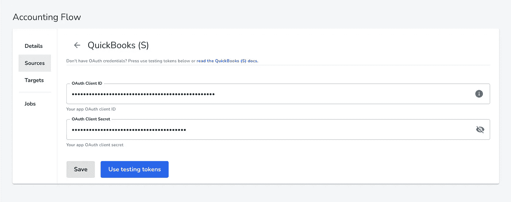
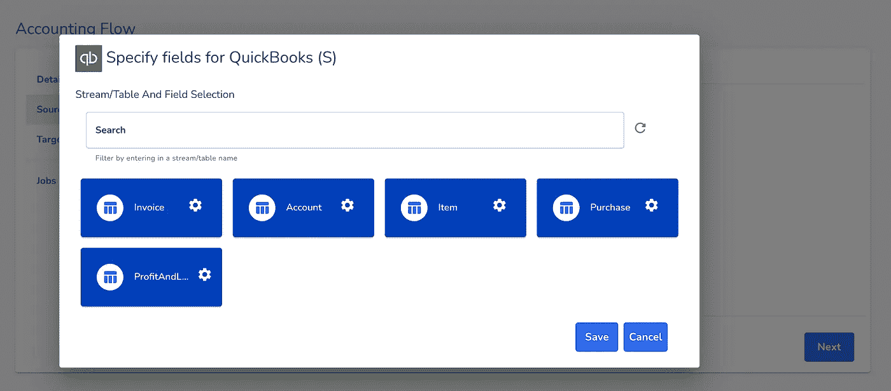
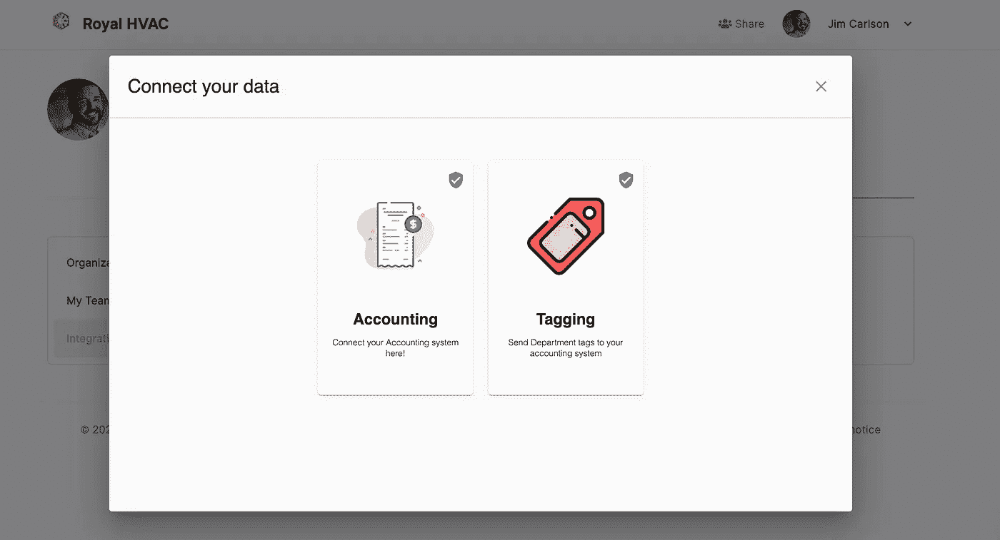
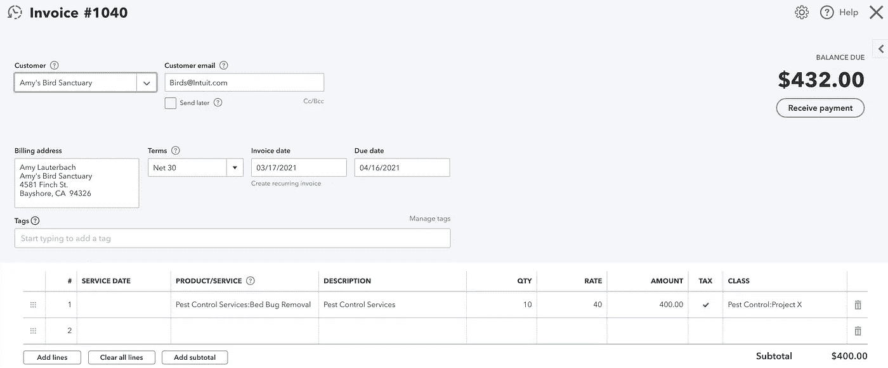
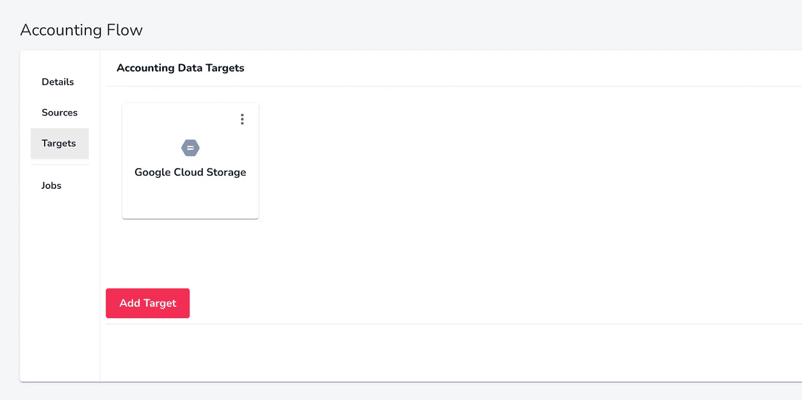
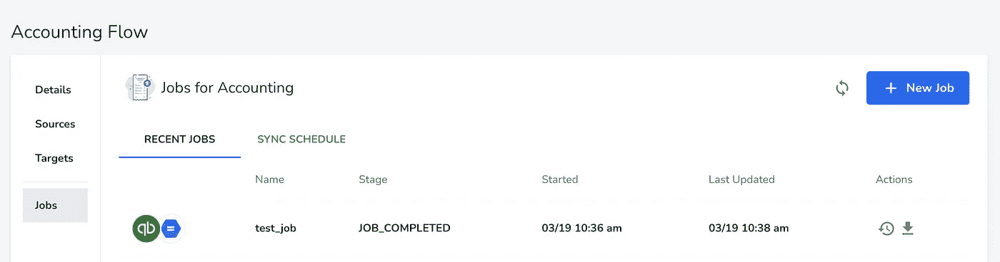
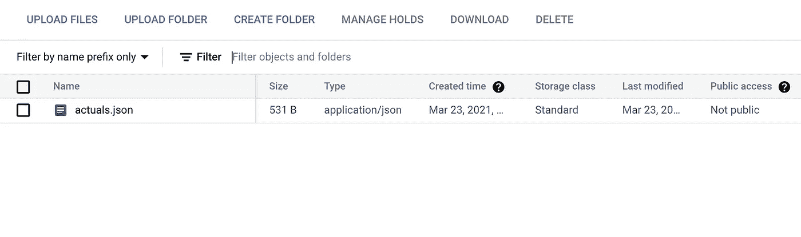

# 如何将 Quickbooks 与您的 SaaS 平台集成

> 原文：<https://towardsdatascience.com/how-to-integrate-quickbooks-with-your-saas-platform-50e79d997fa7?source=collection_archive---------38----------------------->

## 我如何使用 Python 构建 QBO 集成来监控部门收入和成本

最近，我的任务是构建一个 [Quickbooks Online](https://quickbooks.intuit.com/) (QBO)集成来处理损益(P & L)报告，并确定收入、销货成本(COGS)和部门费用——下面是我如何做的。


来源: [unDraw](https://undraw.co/)

本文**不是**关于构建 OAuth 流或使用 cron 作业从 Quickbooks API 提取数据。这个过程相对来说是样板，已经被[工具](https://medium.com/agileinsider/how-to-build-a-data-integration-pipeline-without-the-massive-tech-debt-e76d0be74ae0)解决了，比如我将要使用的这个。如果您对自己构建感兴趣，请查看我的文章[中关于使用 Singer 实现这一点的文章](/how-to-integrate-quickbooks-with-python-8be2d69f96cb)。

相反，本文将带您完成更难的部分——如何理解数据。

# 获取数据

正如我上面提到的，在这篇文章中，我将使用 [hotglue](https://hotglue.xyz/) 来处理为 SaaS 平台构建 QBO 集成的所有样板文件。这包括:

*   创建 OAuth 授权流
*   允许用户在您的 UI 中连接 Quickbooks 并监控连接
*   从 Quickbooks API 中提取必要的数据

## 创建授权流

在 [hotglue](https://hotglue.xyz/) 中，我将[创建一个新的流](https://docs.hotglue.xyz/quickstart/create-a-flow)并添加 Quickbooks sandbox 作为源。为此，我只需提供我的 OAuth 凭证并登录到我的 [Quickbooks 沙盒帐户。](https://developer.intuit.com/app/developer/qbo/docs/develop/sandboxes)如果您还没有 OAuth 凭证，您可以选择“使用测试令牌”



创建 Quickbooks OAuth 流

## 选择我们需要的数据

现在我们可以从 Quickbooks 中选择我们需要的数据。我们将选择帐户(会计科目表)、项目(产品和服务)、采购(费用)、发票和损益报告。

这将为我们提供准确分类交易所需的参考数据。



Quickbooks 选定的数据

## 将集成添加到您的 UI 中

通过一些基本的 JavaScript，我能够嵌入 [hotglue widget](https://docs.hotglue.xyz/quickstart/embed) ，它使用户能够连接他们的 Quickbooks 帐户，刷新同步的数据，并监视它上次刷新的时间。



嵌入式集成

## 标记交易

Quickbooks 本身不支持在特定部门或项目下标记事务。为此，我使用 Quickbooks 类字段来标记部门/项目下的事务。例如，下面的发票被标记为`Pest Control:Project X`,意思是害虫控制部门，项目 x。



使用类别标记 Quickbooks 发票

# 处理数据

现在是有趣的部分。我们将使用 Python 脚本，使用 [pandas](https://pandas.pydata.org/) 和 [gluestick](https://github.com/hotgluexyz/gluestick) 将 Quickbooks 中的数据转换成 JSON 文件，如下所示。

## 我们想要生产的东西

正如您在下面看到的，JSON 文件获取了我们 P&L 报告中的每一笔交易，并将其归类到`Pest Control`部门的`Project X`下。此外，它将每笔交易分类为`revenue`、`cogs`(销售成本)、`labor`和`costs`(费用)。

```
{
  "Pest Control": {
    "Project X": {
      "revenues": {
        "2021-11": {
          "Pest Control Services": {
            "Pest Control Services": {
              "Bed Bug Removal": {
                "total": 350,
                "qty": "10",
                "rate": 35
              }
            }
          }
        }
      },
      "cogs": {
        "2021-11": {
          "Supplies & Materials - COGS": {
            "Pest Control Services": {
              "Bed Bug Removal": {
                "total": 100,
                "qty": 1,
                "rate": 100
              }
            }
          }
        }
      },
      "labor": {
        "2021-11": {
          "Employee": {
            "Inspector": {
              "Employee Benefits": 10.8,
              "Payroll Tax": 61.2,
              "Payroll Wage Expenses": 800
            }
          }
        }
      },
      "costs": {
        "2021-11": {
          "Project Expenses": {
            "Automobile": {
              "Fuel": 100
            }
          }
        }
      }
    }
  }
}
```

## 写剧本

hotglue 具有内置功能，可以在每次从 Quickbooks API 同步新数据时运行 Python 脚本，并避免再次同步旧数据(增量同步)。

您可以浏览下面脚本的每个步骤。

如果您正在使用 hotglue 创建您的集成，您可以学习如何在[文档](https://docs.hotglue.xyz/transformations-1/basic)中编写和部署脚本。

# 一起运行

## 选择数据应该放在哪里

如果你正在使用 hotglue，你需要指定一个最终数据交付的地方(一个[目标](https://docs.hotglue.xyz/quickstart/add-a-target))。默认情况下，hotglue 会使用 Mailgun 将新数据通过电子邮件发送给您。我使用谷歌云存储来整合我们的 Quickbooks。



配置 Google 云存储目标

## 运行作业

现在，我们可以运行同步作业了。这将连接到 Quickbooks API，查询任何新数据，将其保存为 CSV，运行我们的转换脚本，并将结果数据上传到我们的目标(Google 云存储)。



Quickbooks 作业已完成

现在我们可以在谷歌云存储中看到最终的`actuals.json`文件了！



Google 云存储桶中的结果数据

# 结论

在本文中，我们创建了一个 Quickbooks 集成，并将生成的 CSV 数据处理成可供 SaaS 应用程序使用的 JSON 有效负载。

希望这有助于您考虑如何构建自己的 SaaS 集成。我强烈推荐使用像 [hotglue](https://hotglue.xyz/) 这样的工具来处理样板集成步骤，这样您就可以专注于提取您需要的数据，而不是授权和编排问题。

感谢阅读！