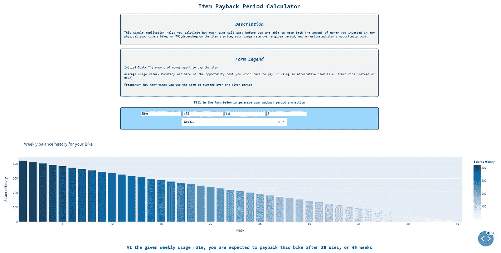

# 如何将 Python 类集成到 Plotly Dash 仪表板中

> 原文：<https://towardsdatascience.com/how-to-integrate-your-python-class-into-plotly-dash-dashboards-11a796a601b4?source=collection_archive---------16----------------------->

## Dash 中面向对象编程的简要教程

乔尔·菲利普在 [Unsplash](https://unsplash.com?utm_source=medium&utm_medium=referral) 上的照片

# 介绍

在开发 Python 应用程序时，使用类和通用面向对象编程(OOP)概念可让您定制和加工代码，从而实现最大的灵活性和可用性。

尽管您可以很好地使用 Python，并且从不担心声明自己的对象，但是这样做可以使您的代码和应用程序更上一层楼，并且总体上使您成为一个更有意识和更全面的开发人员。

如果您以前从未使用过 Python 中的类，并且希望了解更多，请在下面找到我以前的一篇文章，在这篇文章中，我给出了一个项目的概述，您可以从这些项目开始，以发展关于类如何工作的基础知识。

 [## 学习 Python 类的 3 个有用项目

### 开发直觉来构建您自己的定制对象

towardsdatascience.com](/3-useful-projects-to-learn-python-classes-cf0076c36297) 

在本文中，我将提供一个将灵活的类对象嵌入到一个简单的 Plotly-Dash python 应用程序中的例子。 [Plotly-Dash](https://plotly.com/dash/) 是一套面向用户界面的库和框架，用于各种数据可视化用例。

# 应用概览:项目回收跟踪

**描述**

下面提供的用于本教程的示例应用程序是一个简单的 Dash 应用程序，名为**项目回收跟踪器**；该应用程序的目的是提供一个估计时间的图形概览，以摊销为任何特定项目支付的货币价值。

> 在这个例子中，我很想知道**我需要多长时间才能收回对一辆全新自行车**的 425 美元投资，假设定期两周使用一次，平均[机会成本](https://www.investopedia.com/terms/o/opportunitycost.asp)为 4.8 美元(相当于我没有使用/拥有我的自行车时一次典型乘坐的公共汽车/地铁票的成本)。

该应用程序将初始成本、使用价值和使用频率作为输入，并以图形方式呈现摊销图/时间线，同时提供估计收回投资所需时间的文本结果。

**在这种情况下，我需要在将近一年(45 周)后，或者 89 次骑行后归还我的自行车！**

现在，您对这个应用程序的上下文更加熟悉了，让我们看看如何在 Python 后端潜在地利用 Python 类来定义并使用我们的跟踪器功能。

我们的物品回收追踪应用程序(来源:作者)

# 代码概述

我们的简单应用程序使用了两个 Python 脚本:

1.  **Payback_Calculator.py:** 您可以在其中定义我们自己的回报跟踪器类对象及其功能的脚本
2.  **Payback_Application.py:** 运行和渲染 Plotly Dash 应用程序的脚本

现在让我们从类实例化到应用程序呈现，一步一步地检查这两个脚本。

# 1)定义我们的定制类:回报跟踪器

**类实例化和属性**

Python 中的类用 *class* 关键字初始化，后跟类名。下面的代码创建并命名了一个 *Payback_Tracker* 类。

在实例化时，Python 类使用内置的 *__init__()* 函数来赋予类属性。属性是可以附加到给定类实例的类对象属性，这取决于它的定义和您计划对类及其对象的使用。

这个 Python Tracker 类在实例化时接受 5 个显式给定的属性( *name、initial_cost、usage_benefit、frequency、period* )加上 3 个其他属性，如下所述:

**名称**:类对象实例的名称(即“bike”)

**initial_cost** :表示所需前期投资的项目成本

**usage_benefit** :使用该物品所提取的机会成本的货币价值

**频率**:该物品在一段时间内的使用频率

**未偿余额:**剩余的待摊销货币价值。在实例化时，即初始投资时，它等于 initial_cost

**周期**:使用周期参考(即“每日”、“每周”、“每月”或“每年”使用)

Tracker 实例还初始化了三个附加属性，当项目被所有者“使用”和分期偿还时，它将利用这三个属性来跟踪相关的对象信息:

**balance _ history:***outstanding _ balance*值的集合，跟踪器使用这些值来跟踪项目的回报历史。初始化为一个列表，第一个 outstanding_balance 值作为初始值。

**pay back _ counter _ period:**自使用开始后经过的周期数。初始投资时初始化为 0。

**usage_total:** 记录在任何给定时间项目使用的总货币等值。(*即，在购买该物品并使用 2 次后，使用收益为 4 美元，一段时间后的使用总价值为 2*4 美元=8 美元*)

**类方法**

使用类方法，您可以通过自定义功能来丰富我们的跟踪器，并通过该类的典型函数(方法)来定义其行为，从而很好地利用您的类属性。

我们的 *Payback_Tracker* 类有三个方法:

***get_result():*** 给定对象的 *initial_cost* ， *usage_benefit，frequency* 和 *period* ，返回估计的使用次数，或 period 属性中定义的 period。

来源:作者

**generate _ balance _ history():**以降序(从项目的初始投资价值开始)返回一个摊销值列表，它表示有待偿还的初始项目的价值。随着使用量线性减少。

来源:作者

**get_balance_history():** 返回按照*generate _ balance _ history()*方法生成的摊余值列表

来源:作者

**get_balance_data():** 返回项目的 balance_history 的数据帧格式版本

这个 *Payback_Tracker* 类现在有了自己的属性和方法，给定它的输入，它可以计算一个项目的分期偿还历史和时间表。

现在让我们通过将对象嵌入到我们的 Plotly-Dash 应用程序中来实现这一切！

# 2)将回报跟踪器类嵌入到应用程序的功能中

回收跟踪器应用程序位于 **Payback_Application.py 中。**该脚本有三个主要部分，如下所述。

1.  **包导入和 Dash app 创建**

首先，让我们导入必要的包来运行我们的 plotly-dash 应用程序(第 1-11 行)；然后，我们的应用程序的实例可以用相关的破折号和初始化。服务器方法(第 13–15 行)。

注意这个脚本是如何从**payroll _ calculator . py**中导入我们的 Tracker 类的，这样就可以访问 payroll _ Tracker 类实例及其方法的定义(第 11 行)。

**2。应用程序的 HTML 布局(带有一些内置的 CSS 格式)**

接下来，我们的 HTML 组件可以作为一个列表定义到 *app.layout* 变量中。也可以参考上面这张 app 前端的图片，以供参考。

主要组件(嵌入到主容器 *< div >* 元素集合的开头)有:

*   一个 *H1* 表头，设置 app 的**标题**(“项目回收期计算器”)
*   一个 *< div >* 元素，包含 app 的**描述**，带有标题和副标题
*   一个附加的 *< div >* ，带有一个标题(**表单图例**)和三个段落 *< p >* 标签，提供用户输入字段周围的图例信息。
*   另一个 *< div >* 包含**输入字段**，供用户填写变量 *Payback_Tracker* 类将使用该变量来计算投资回报所需的估计时间:项目名称、初始成本、使用收益和频率，以及相关周期。这些元素被编码为 dash 应用程序中的**输入**元素，以便后端能够引用用户的输入，并将这些值存储为我们的类将在下一步中使用的变量。
*   布局以包含我们的数据输出图的 *< div >* 标记(id=' **output_graph** ')和一个 *< div >* 标记(id=' **output_tex** t ')结束，该标记将通过调用用户输入变量上的 ***get_result()*** 类方法来呈现输出

已经用一些额外但重要的内嵌 CSS 设计了我们的页面元素，现在你可以进入应用程序的主要功能部分了。

**3。调用我们的 Payback_Tracker 类来启用应用程序的功能**

我们的应用在 Dash 中的功能是由一个且只有一个函数实现的，这个函数叫做 **generate_graph()** 。该应用程序使用一个**[**Python decorato**](https://wiki.python.org/moin/PythonDecorators)**r**来定义该函数将使用的输入和输出组件。**

**我们的 **5 个输入组件**来自输入元素，这些元素在前面的部分中被定义为布局的一部分，并由它们在 HTML 中的 ID 字段引用。它们在 *generate_graph()* 函数中作为参数传递，并对应于 *Payback_Tracker* 类的 5 个关键属性( *name、initial_cost、usage_benefit、frequency、period* )。**

**还定义了 **2 个输出元素**，分别是**‘Output _ graph’**和**‘Output _ text’**HTML 元素，它们将用于返回和呈现函数的输出。**

**然后定义函数体。在用户用他/她的 5 个输入元素填写表单后，这些元素作为输入参数被传递给 *generate_graph()* 。然后，该函数使用这 5 个属性(第 11 行)创建一个名为 **object_** 的 *Payback_Tracker* 类实例，并对这些输入连续调用*generate _ balance _ history()*和 *get_balance_data()* 方法，将后者的结果存储在一个 **data** 变量中(第 13 行)。**

**使用这些数据，然后通过 *plotly.express* (px)库(第 15-18 行)创建一个条形图(存储在 **fig** 变量中)。**

**该函数返回两个 **fig** 变量，将其嵌入到两个输出元素( **output_graph'** )的第一个中，然后还将调用 **get_result()** 方法的结果嵌入到 **'output_text'** 元素中。**

**因此，每当用户填写表单时，5 个输入字段都被类用来:**

*   **创建该类的一个实例**
*   **在其属性上调用其方法**
*   **使用 **generate_graph()** 函数捕获输入，处理方法并将结果(图**条形图**条形图*加上 *get_resul* t())呈现到 Dash HTML 布局中，每次用户修改表单中的输入字段时重复此工作流。***

**通过这种方式，您已经能够与 Dash 元素交互并通过您的自定义类处理它们，然后通过 *generate_graph()* 函数将可视化输出呈现给用户！**

**我们简单的应用程序的功能现在已经完成。**

# **摘要、代码库、有用资源和后续步骤**

**我希望这个简单的例子可以作为一个有用的例子，说明如何潜在地利用您自己的类对象来用 Dash 创建数据可视化元素！**

**感谢阅读！**

****代码回购**:[https://github.com/edoard0/Item-Payback-Calculator](https://github.com/edoard0/Item-Payback-Calculator)**

****参考文献:****

*   **[仪表板文档](https://dash.plotly.com/)**

****访问我的免费数据科学资源清单** [**这里**](https://landing.mailerlite.com/webforms/landing/k1n3r2)**

** [## 通过我的推荐链接加入 Medium-Edoardo Romani

### 作为一个媒体会员，你的会员费的一部分会给你阅读的作家，你可以完全接触到每一个故事…

edo-romani1.medium.com](https://edo-romani1.medium.com/membership)**