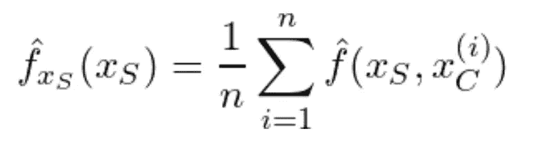
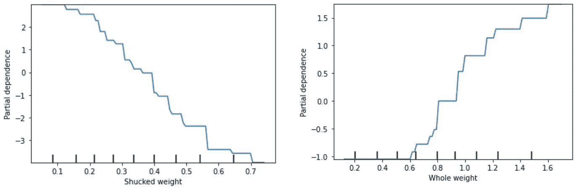
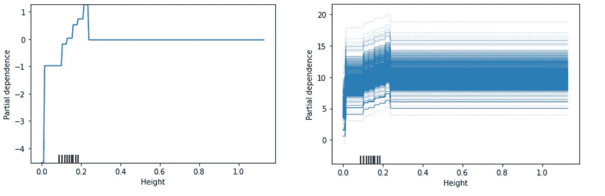
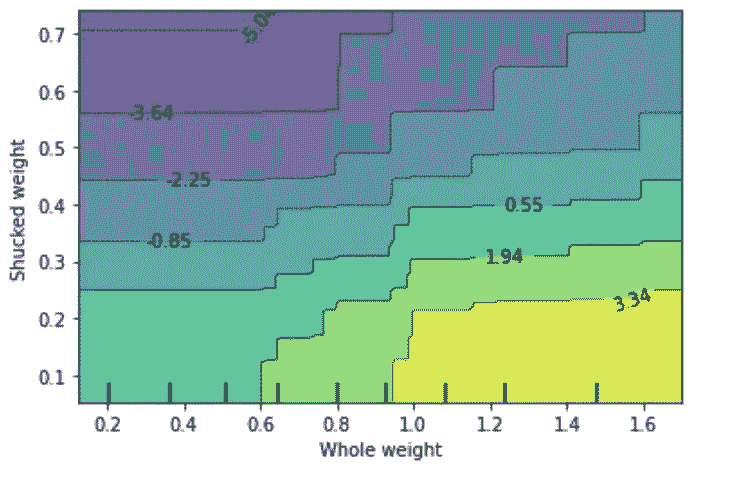

# 如何解读模型:PDP 和 ICE

> 原文：<https://towardsdatascience.com/how-to-interpret-models-pdp-and-ice-eabed0062e2c?source=collection_archive---------6----------------------->

## 确定每个特征对模型输出的贡献。


[粘土银行](https://unsplash.com/@claybanks?utm_source=medium&utm_medium=referral)在 [Unsplash](https://unsplash.com?utm_source=medium&utm_medium=referral) 拍摄的照片

M 模型的可解释性变得越来越有价值。然而，当处理具有复杂关系的大型模型时，解释并不总是一件容易的事情。

部分相关图(PDP)显示了不同特性对输出的边际贡献。它们用于显示单个特征或两个特征的贡献。

部分相关图也与个体条件期望(ICE)图高度相关。ICE 图显示了每个数据实例的预测变化。

这些图是模型不可知的，这意味着不管基础模型如何，它们都可以显示改变一个或两个特征如何影响模型的输出。

对于价格预测等任务，了解每个要素的 PDP 趋势对于理解模型如何使用新数据进行预测至关重要。理想情况下，这些 PDP 图应该可以解释和理解，以推动决策制定。

# **PDP 和 ICE**

两个图使用相同的机制来模拟预测变化。但是，如果 PDP 观察到一个或两个特征的总体趋势，ICE 图会显示更细粒度级别的变化。

这些图可以并行使用，以了解预测的整体趋势，并检查有问题的个案。因为 PDP 显示了总体水平上的输出变化，所以丢失了特定实例的较小变化。因此，最好是看两种变化。

当预测任务是回归模型时，输出中显示的变化直接是预测中的变化。然而，在分类期间，输出变化是类别的预测概率的变化。

对于 PDP，为了估计部分函数，使用蒙特卡罗方法用训练数据计算平均值:



部分相关函数(作者图片)

# **例子**

为了展示每一种方法，并浏览对图的解释，我使用了“鲍鱼”数据集。

这个数据集是在开放数据共享公共领域奉献和许可(PDDL)下许可的。

[](https://datahub.io/machine-learning/abalone#readme) [## 鲍鱼

### 这个数据集的资源可以在 https://www.openml.org/d/183 找到作者:来源:未知-请引用…

数据中心. io](https://datahub.io/machine-learning/abalone#readme) 

该数据集的目标是确定鲍鱼的年龄。通常，这是通过切开球果，给球果染色，然后用显微镜计数球果的数目来完成的。不幸的是，用这种方法测量年龄非常耗时、有创且费力。

相反，使用八个特征，可以有效地预测年龄。这些特征是性别、长度、直径、高度、总重量、去壳重量、内脏重量和壳重量。该数据有 4177 条记录和八个特征。

PDP 和 ICE 图都可以从 sklearn 中的同一个包中生成。

```
from sklearn.inspection import plot_partial_dependence# PD Plots
plot_partial_dependence(model, X, [feature_name])
```



部分相关图(图片由作者提供)

相关图基于梯度推进树回归模型。

在图中，显示了“无壳重量”和“整体重量”的模型行为。鲍鱼的年龄预测值随着去壳重量的增加而降低。而对于“整体重量”，此特征的增加会增加预测年龄，但对于低值，预测不会改变。

此外，特征值的百分位数显示在每个图的底部。每个显著的黑色标记代表该特征的百分位数，增量为 10。

```
# ICE Plots
plot_partial_dependence(model, X, [feature_name], kind='individual')
```



部分相关和个体条件期望图(图片由作者提供)

接下来是高度的 PD 图和 ICE 图。在 PD 图中，随着数值的增加，趋势不再是线性的。一旦身高超过 0.3，身高就不再对整体年龄预测有贡献(用 0 的部分相关性指定)。

在 ICE 图中，这种模式在所有实例中都是一致的。身高越低，预测年龄越小。然而，当高度增加时，预测增加，直到高度超过阈值。

高度的分布导致了这种奇怪的行为。作为参考，最大值为 1.13，但在第 75 百分位，该值仅为 0.165。

这些图试图在每个特征的值的范围内建模。但是当大多数特征值集中到值的子集时，模型不能很好地学习这个范围。

因此，当新实例的高度值在此范围内时，我们无法确定。

```
from sklearn.inspection import plot_partial_dependence# PD Plots, 2-dimensional
plot_partial_dependence(model, X, [(feature_1, feature_2)], kind='both')
```



部分相关图(图片由作者提供)

最终部分相关性图观察到两个特征对最终输出的相互作用。这里显示了“整体重量”和“去皮重量”。

最终输出值的变化用轮廓的颜色显示，每个特征的先前行为仍然存在。

“整体体重”的增加一旦超过先前定义的阈值，预测的年龄就会增加。对于“去皮重量”，预测值随着值的增加而降低。所以对于这两个特性，并没有太多的交互。

# 结论

部分相关图和个别条件期望图是开始理解你的模型的好方法。此外，它们易于实现并适用于每种模型。

两个图都允许用户更好地理解他们的模型和暴露不一致的趋势以及不规则的模型行为。

这些图取决于监督学习任务中使用的基础模型。然而，它们揭示了整体和单个实例级别的模型行为。因此，它们允许你有效地解释你的模型。

如果你有兴趣阅读关于新颖的数据科学工具和理解机器学习算法的文章，可以考虑在 Medium 上关注我。

*如果你对我的写作感兴趣，想直接支持我，请通过以下链接订阅。这个链接确保我会收到你的会员费的一部分。*

[](https://zjwarnes.medium.com/membership) [## 通过我的推荐链接加入 Medium-Zachary Warnes

### 阅读扎卡里·沃恩斯(以及媒体上成千上万的其他作家)的每一个故事。您的会员费直接支持…

zjwarnes.medium.com](https://zjwarnes.medium.com/membership)