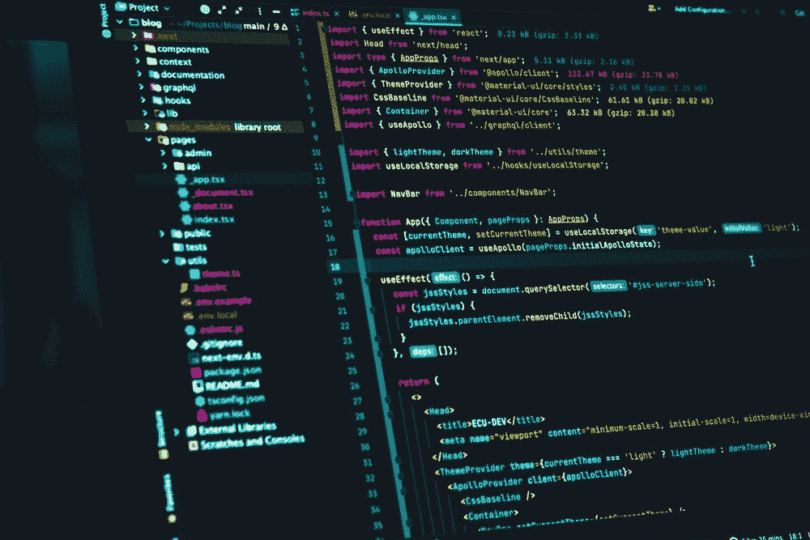
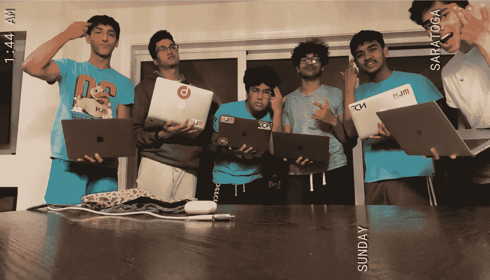
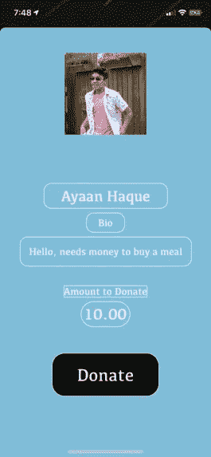
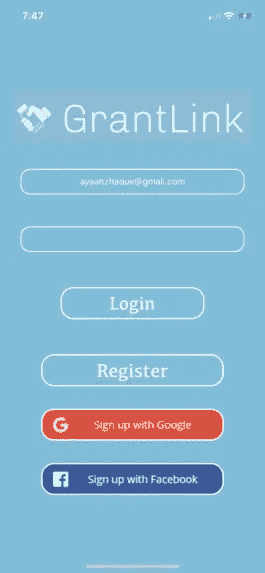
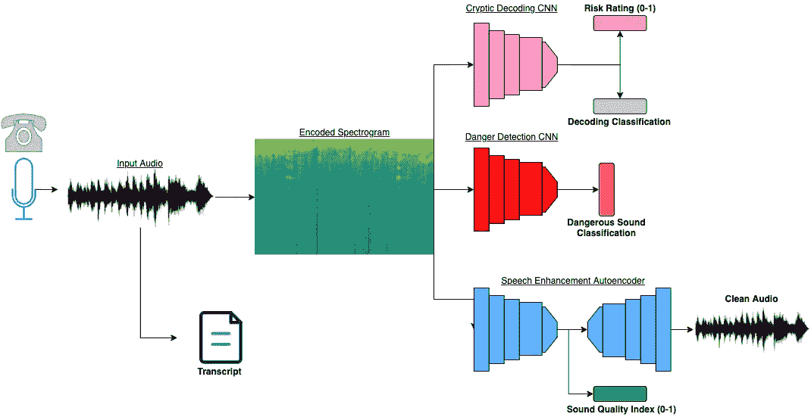
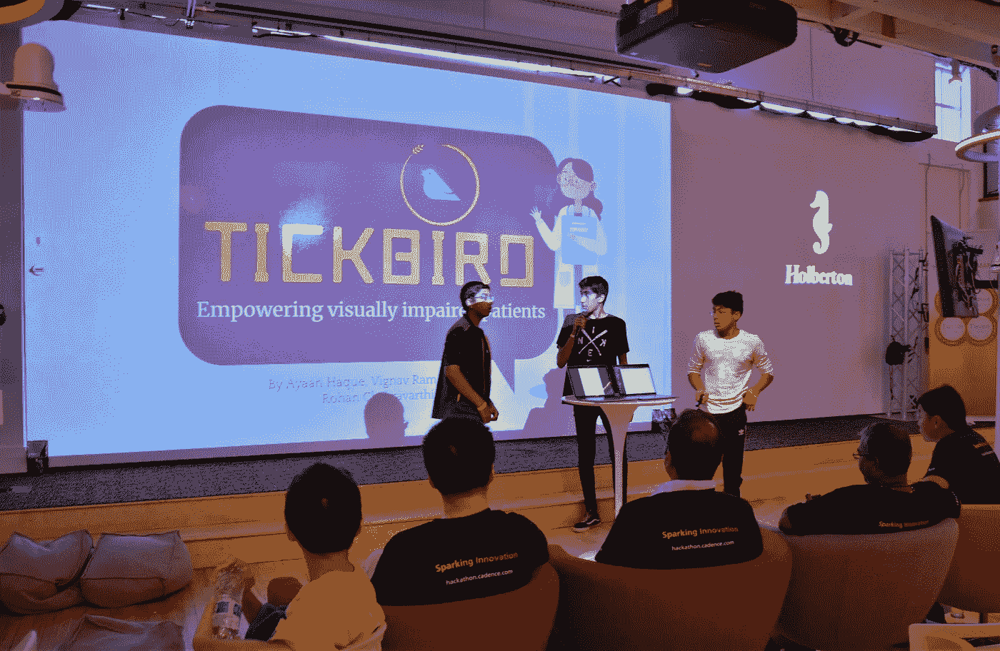
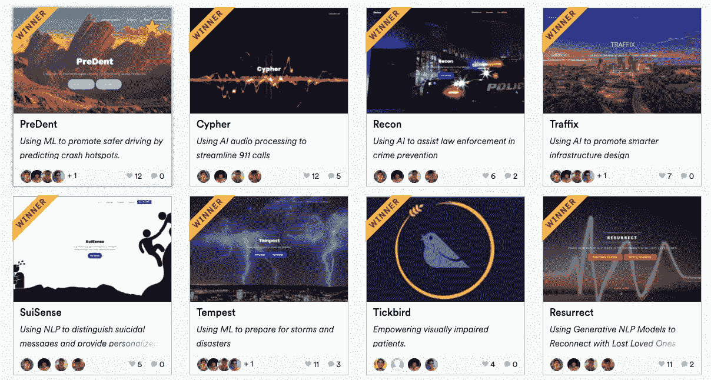

# 如何用人工智能加入并赢得黑客马拉松

> 原文：<https://towardsdatascience.com/how-to-join-and-win-hackathons-with-ai-ec055e2b5482?source=collection_archive---------10----------------------->

## *我参加黑客马拉松的故事以及我如何学会以高比率获胜*

图片来自 [Unsplash](https://unsplash.com/photos/mZnx9429i94)

黑客马拉松是我去年的生活。每个周末熬夜到凌晨 4 点，在时间紧迫的情况下构建高级项目会产生无与伦比的肾上腺素激增。虽然无论结果如何，黑客马拉松都是令人愉快的，但没有胜利就不一样了。奖品和奖品有助于证明周末的辛苦工作和睡眠不足。然而，获胜并不容易，学习如何做到这一点需要很长时间。结果很多新黑客就泄气了，不继续了。对我来说幸运的是，情况并非如此，因为我能够很快制定出帮助我成功的策略。

黑客马拉松对于任何有抱负的 AI/ML/DS 学生和工程师来说都是很棒的。它们是练习技能和学习新领域和框架的好方法，比如 PyTorch 和 TensorFlow。有一种误解，认为黑客马拉松主要是关于应用开发，而不是关于人工智能，然而，正如我在本文后面讨论的那样，事实远非如此。因此，如果你有兴趣以一种高效的方式提高你的人工智能技能，那就试试吧。事实上，我从一次黑客马拉松中学到了大部分人工智能技能，我在那里开发了一个皮肤癌诊断应用程序。因此，即使你没有人工智能经验，黑客马拉松也是一个很好的入门方式。

我的努力最近被大联盟黑客突出了，因为我被选为前 50 名黑客之一(你可以在这里找到我的简介)。鉴于最近的新闻，在这篇文章中，我想谈谈我参加黑客马拉松的经历，希望你能了解到任何背景的人都可以参加黑客马拉松。在文章的后半部分，我将给出 5 个技巧和窍门来帮助你赢得黑客马拉松。希望这些对您有所帮助，如果您有任何想法或其他建议，请告诉我。

# 我是如何加入黑客马拉松的

我最初加入黑客马拉松社区是在 2019 年初，当时我是高中一年级学生。一月份，我和一个朋友发短信聊到她在一个会议中心参加的一个编程活动。它被称为“黑客马拉松”，你有 24 小时的时间来构建一个完整的应用程序，解决社会中的一个问题。当时我知道基本的 Java 和 Python，但从未开发过应用程序。她花了一整天的时间描述她的黑客马拉松经历和她的应用程序，在我知道之前，已经是凌晨 3 点了。与编码伙伴一起通宵达旦地开发一个应用程序的想法很吸引人。

在接下来的几周里，我在谷歌上快速搜索了一下，想弄清楚内置的是什么语言的应用程序，结果发现 IOS 应用程序是用 Swift 构建的。于是在没有任何其他知识和研究的情况下，我开始学习 Swift 两个半月，为一次黑客马拉松做准备。我试图说服几个朋友参加黑客马拉松，但只有一个人接受了。幸运的是，一个有很多 CS 背景的同学联系了我们。我和他一点都不熟，但是因为我太想参加黑客马拉松了，所以我们组队了。

五月中旬，我们报名参加了两次黑客马拉松，我很高兴能够测试我的新技能。不幸的是，这些黑客马拉松最终都被取消了，所以严格来说，我在 4 个月后的 9 月份加入了黑客马拉松。我们去了一个名为 [Omnihacks](http://omnihacks.tech/) 的黑客马拉松，它是在旧金山市中心的一所贸易学校举办的。

我们被大肆宣传；我们打包了睡袋，还带了零食以防万一，然后在 12 月 15 日的早上，我们坐火车去参加黑客马拉松。一旦我们发现主题是医疗保健，我们决定创建一个 IOS 应用程序，允许盲人患者用 OCR 阅读处方。我们决定将这个应用程序命名为 [Tickbird](https://tickbird.netlify.app/) ，因为 Tickbird 是帮助犀牛穿越世界的鸟类。整个经历是一个爆炸，因为我们一天的大部分时间都在闲逛，参加了一些关于 ML 的研讨会，并为自己囤积了零食和食物。作为周末的圆满结束，我们获得了十佳奖和第二个最佳移动应用，从那以后，我就迷上了它。这款应用对我们的第一次破解来说也出奇的好，经过一些结构上的改动后，我们甚至可以在[应用商店](https://apps.apple.com/us/app/tickbird-co/id1508006830?ls=1)买到它。那个周末是我的黑客马拉松生涯的开始，现在一年半过去了，我是一个经验丰富的老手，我很高兴我决定参加那个黑客马拉松，甚至不知道它是什么。

如果你对参加黑客马拉松有任何担心或恐惧，我的经历希望对你有所启发。当我开始时，我没有任何应用程序开发或人工智能经验，但出于纯粹的好奇心，我尝试了一下，并能够很快变得非常成功。相信我，这是一个伟大的时刻，所以如果你还在高中或大学，我建议你参加黑客马拉松。尤其是如果你是一名人工智能开发人员，你不需要太多的应用开发经验，因为我几乎没有。第一次尝试一下，然后从那里开始。在最坏的情况下，你会有一个免费食物和商品的有趣周末。

# 取胜的 5 个技巧和建议

## 1.找到一个值得信赖和忠诚的团队

这是最重要的提示。在所有其他提示中，这是第一位的。拥有一个值得信赖并致力于团队发展的团队是你获得长期成功的基本素质。

一年前，我遇到一个来自西雅图的黑客，他每个周末都会和随机的队友一起参加黑客马拉松。我对他最大的建议是在每次黑客马拉松中找到可靠的朋友，而不是新的队友。用一个新的团队来重置每一次黑客马拉松都是一个巨大的挫折。你必须学会如何与他们合作，以及他们擅长什么，这意味着没有长期改善的机会。即使你不认识熟悉 CS 或者开发的人，你也可以随时教他们。在当今这个资源如此丰富的世界，任何努力工作的人都可以很快成为黑客马拉松团队中的重要角色。尤其是对于人工智能，有大量的视频和文章教授如何编写基本的人工智能模型，这意味着你基本上可以与任何感兴趣的人组成一个团队。

如果你想在黑客马拉松上长期成功，能够在没有任何争议或冲突的情况下分割工作是关键。当你和那些只想提升自己的人一起工作时，会有关于谁扮演什么角色的问题。这造成了一种有害的环境，没有人希望团队中的其他人成功。团队合作是巨大的，不仅在黑客马拉松中如此，在许多其他领域也是如此，比如体育或研究。

在几次黑客马拉松后，我找到了一个新团队，因为我的第一个团队永远不会在同一页面上。我和学校里最好的朋友一起合作，虽然他们没有太多的经验，但我们能够快速提升。我们都希望彼此进步，关心我们的集体成功。寻找一个团队可能是黑客活动中最具挑战性的部分之一，通常对新黑客来说是一个巨大的威慑。如果你记得这篇文章的任何建议，这应该是它。只要和你认识的忠诚的人一起工作。

我和我的团队在黑客攻击时玩得很开心，提高了我们应用程序的效率和质量(图片由作者提供)

## 2.网络应用而非移动应用

我的前四个黑客马拉松项目中有两个是移动应用。前面说过，我学的第一门基于应用的语言是 Swift，而不是 HTML/JS/CSS。这是一个很大的错误，因为据我所知，在移动应用上构建用户界面比在网络应用上要困难得多。这是因为允许使用通过 Bootstrap 构建的 web 应用程序模板。然而，这些类型的模板并不存在于移动应用程序中，或者至少是免费的。UI 是你的 hackathon 项目的主要组成部分——它吸引了人们对项目的注意。一个 UI 糟糕的项目通常是一个糟糕的项目，因为它给人一种黑客没有太多经验的印象。

Web 应用程序也更加通用，可以包含其他组件，最著名的是人工智能。我在步骤 5 中深入探讨了为什么人工智能应用程序是必须的，但现在，你应该知道的是，使用人工智能甚至其他技术比使用 web 应用程序更容易。您可以使用其他后端框架来托管您的模型，比如 PythonAnywhere 或 Heroku。然而，对于移动应用程序，你必须学习如何使用 CoreML 将你的人工智能集成到移动应用程序中，这是一个麻烦，并且经常不能正确工作。

创建 web 应用程序最重要的原因是，它允许评委现场测试您的应用程序。只有一个视频演示，法官想知道该应用程序使用起来感觉如何。对于一个移动应用程序，法官没有办法测试它。幸运的是，有了 web 应用程序，它可以很容易地通过 Netlify、Heroku 或 Github Pages 等免费服务托管在互联网上。现场测试给评委带来了一种信心，让他们更加欣赏你的申请。从移动应用程序切换到 web 应用程序是我和我的团队所做的最重要的改变之一，因为它给我们带来了明显的成功。

移动用户界面看起来不漂亮——字体甚至不匹配(图片由作者提供)

## 3.关于实施的想法

我经常看到新团队犯的一个大错误是，他们太专注于让他们的应用程序功能化。作为初学者，他们认为他们必须开发全功能的应用程序，因此想出了一个简单的主意。然后，他们最终会花费黑客马拉松的大部分时间用 Firebase 构建一个认证系统，而不是拿出独特的功能。

这是一个巨大的错误，因为没有法官关心应用程序是否有认证系统。黑客马拉松的目标很容易被误解。因为它被称为 CS 活动，所以人们认为代码是最重要的。然而，黑客马拉松更多的是关于企业家精神和想法。有一个简单的原因:24 小时根本不足以构建一个功能性的应用程序。任何黑客马拉松裁判都知道这一点。真正令人印象深刻的不是这个应用是否有效，而是这个应用是否有潜力以独特的方式改变社会。只要应用程序不是完全伪造的，法官知道，如果团队愿意，他们可以花更长的时间让它发挥作用。那么这款应用将会在真实的市场中有价值。然而，一个在 24 小时内完全实现的低劣想法在任何市场上都不值钱。

这对人工智能开发者来说尤其重要，因为在如此短的时间内完全实现一个完整的模型是非常困难的。通常，光是训练一个模特就需要几个小时。人工智能开发人员也可能认为他们需要建立精确的模型，但这也是不正确的。大多数法官明白模型不会是准确的，但他们会被一个强有力的概念所打动，即使它并不完全像预期的那样工作。

我早期的一个项目有一个登录页面作为主要特征(图片由作者提供)

## 4.展示事项

每次黑客马拉松结束后，我都会浏览一下项目库，看看我要竞争的项目。既然有这么多项目，我就快速浏览一下他们的视频演示和文字介绍，看看项目好不好。如果报道很短，没有描述性，或者视频质量很差，没有脚本，我会跳过它。我还没有看到其中一个项目获胜。

现实是法官也是这样想的。要评判的项目那么多，也就是说不是所有的项目都能拿到满分的评审。因此，如果一个项目的描述写得很差，没有太多的技术细节，或者如果演示文稿有许多口吃，看起来像是一次完成的，他们为什么应该期待这个项目是好的呢？印象很重要，不仅是在黑客马拉松中，在日常生活中也是如此。作为一名人工智能开发人员，请确保将您的人工智能知识用于您的优势。你可能已经知道，能够向人们解释人工智能是非常令人印象深刻的。即使您无法在黑客马拉松期间完成模型的构建，您也可以绘制一个图表并解释实现的方式。这会让评委们惊叹不已，让你们看起来是最棒的团队。

虽然我们不能完全实现我们的模型，但是我们画了一个计划实现的图表(图片由作者提供)

确保在你的黑客马拉松期间，你分配了足够的时间来准备一个强有力的演示，详细说明你的项目的所有技术细节和你正在解决的问题。想到这么多伟大的、技术上复杂的项目仅仅因为演示糟糕而没有得到认可，这是令人难过的。然而，这是生活的一课，你展示自己和你的工作的方式就是一切。简而言之，这个项目看起来有多好就有多好。这是双向的，如果你的项目不是很好，你可以给它加油，让它看起来很棒。

我在第一次黑客马拉松上展示 Tickbird(图片由作者提供)

## 5.人工智能是新的元素

这是有原因的。2019 年底 2020 年初左右，几乎所有获奖项目都变成了 AI 项目。我在研究 2019 年获奖项目的时候，大部分获奖项目都没有使用 AI。但出于某种原因，就在我开始学习和使用人工智能的时候，其他人也开始学习和使用人工智能，到 2020 年夏天，任何想要获胜的项目都必须使用人工智能。这得益于 AI 教育和资源的广泛民主化。AI 是迄今为止黑客可以使用的最先进和技术最先进的框架或工具，所以如果你不使用它，你将无法竞争。

如果你不了解人工智能，我不认为这是真的，因为你正在研究数据科学，这不应该被阻止。这里有很多资源，包括所有关于 TDS 的文章，您可以将其作为学习的基础。花几个黑客马拉松做一些别人做过的基本的初级人工智能项目。虽然你可能不会赢，但你会获得重要的经验和学习机会，这将为你在不久的将来取得巨大的、持续的成功奠定基础。

我所有的项目(除了 Tickbird)都使用 AI(图片由作者提供)

# 最后的想法

对于任何参与 CS 或 AI 的人来说，黑客马拉松都是一项令人愉快的活动。周末和其他人一起创造惊人的项目，不仅可以获奖，还可以帮助你的职业追求，这是所有人工智能开发者都应该做的事情。即使你没有经验，也不要被吓倒，因为我完全不知道自己在做什么。虽然这个社区可能有些有毒和竞争，但如果你和你欣赏的人一起工作，你会很开心。所以，如果你不是黑客，试试看。如果你是一个初学黑客，看看我的技巧和故事，这样你也能成为一个赢家。感谢阅读。