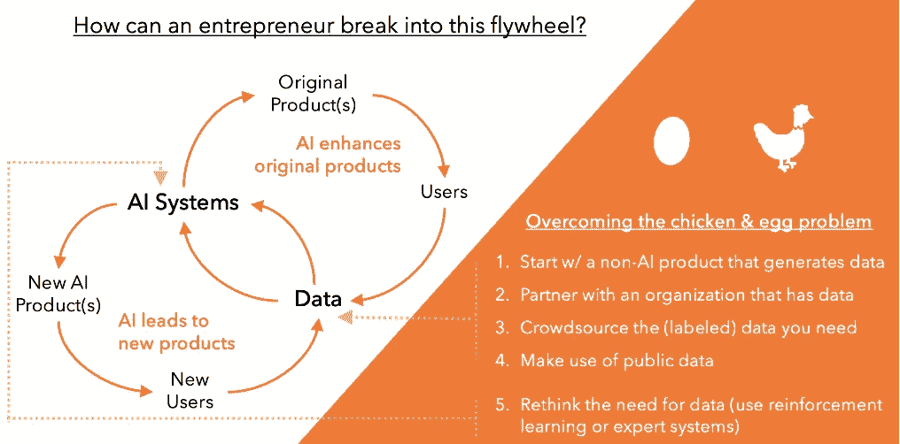

# 如何在没有专有数据的情况下启动人工智能项目

> 原文：<https://towardsdatascience.com/how-to-kickstart-an-ai-venture-without-proprietary-data-13d1502051f2?source=collection_archive---------11----------------------->

## **AI 创业公司有个鸡&蛋的问题。下面是解决的方法。**

几年前，我了解到银行每年因信用卡诈骗损失数十亿美元。更好地检测或预测欺诈将具有难以置信的价值。所以我考虑说服一家银行分享他们的交易数据的可能性，希望建立一个更好的欺诈检测算法。不足为奇的是，没有一家大银行愿意分享这样的数据。他们觉得最好雇佣一个数据科学家团队在内部解决这个问题。我的创业想法很快夭折了。

尽管围绕人工智能有着巨大的创新和创业机会，但对创业者来说，闯入人工智能可能是一项艰巨的任务，因为他们甚至在开始之前就面临着先有鸡还是先有蛋的问题，这是现有公司不太可能应对的问题。我相信具体的策略可以帮助企业家克服这一挑战，创造成功的人工智能驱动的企业。

## **AI 创业中的鸡和蛋的问题是什么？**

今天的人工智能系统需要在大数据集上进行训练，这对企业家来说是一个挑战。拥有相当大客户群的老牌公司已经拥有了一系列数据流，他们可以从中训练人工智能系统，开发新产品并增强现有产品，生成额外的数据，并冲洗和重复(例如，谷歌地图拥有超过 [1B 的每月活跃用户和超过 20 的数据](https://digital.hbs.edu/platform-digit/submission/google-maps-the-most-expansive-data-machine/)))。但对于创业者来说，对数据的需求带来了一个先有鸡还是先有蛋的问题——因为他们的公司还没有建成，他们没有数据，这意味着他们不能那么容易地创造一个 AI 产品。

此外，数据不仅是人工智能入门所必需的，它实际上是人工智能性能的关键。研究表明，虽然算法很重要，但数据更重要。在现代机器学习方法中，与具有更多或更少数据的相同算法之间的性能差异相比，各种算法之间的性能差异相对较小( [Banko 和 Brill 2001](https://www.microsoft.com/en-us/research/publication/scaling-to-very-very-large-corpora-for-natural-language-disambiguation/) )。

有几种策略可以帮助企业家解决这个先有鸡还是先有蛋的问题，并获取他们进入人工智能领域所需的数据。

> 研究表明，虽然算法很重要，但数据更重要。

## **克服先有鸡还是先有蛋问题的 5 种方法**

1.  **从提供一种没有人工智能也有价值的服务开始，这种服务产生数据**

虽然数据确实需要先于人工智能产品，但数据不需要先于所有产品。企业家可以从创建一项服务开始，这项服务不是基于人工智能的，而是解决客户问题并在此过程中生成数据。这些数据稍后可以用于训练一个人工智能系统，该系统可以增强现有服务或创建相关服务。

例如，脸书早期没有使用人工智能，但它仍然提供了一个客户希望加入的社交网络平台。在这个过程中，脸书生成了大量数据，这些数据反过来被用于训练人工智能系统，这些系统帮助个性化新闻订阅，并使运行极具针对性的广告成为可能。尽管一开始并不是人工智能驱动的服务，但脸书已经成为人工智能的大量用户。

类似地，[insur tech 初创公司 Lemonade 最初没有数据](https://www.lemonade.com/blog/the-sixth-sense/)来在第一天建立复杂的人工智能能力。然而，随着时间的推移，Lemonade 已经建立了人工智能工具来创建报价、处理索赔和检测欺诈。今天，他们的人工智能系统[处理 96%的索赔的“第一份损失通知”，并在三分之一的案件中管理完整的索赔解决方案，而没有任何人工参与](https://www.sec.gov/Archives/edgar/data/1691421/000104746920003846/a2241899zs-1a.htm)。这些人工智能能力是使用多年运营产生的数据构建的。

2.**与拥有专有数据集的非科技公司合作**

企业家可以与拥有专有数据集但缺乏内部人工智能专业知识的公司或组织合作。这种方法在很难创建一种产品来生成您的 AI 应用程序所需的数据(如关于患者测试和诊断的医疗数据)的情况下特别有用。在这种情况下，您可以与医院或保险公司合作，以获取匿名数据。

相关的一点是，你的 AI 产品的训练数据可以来自潜在客户。虽然这在医疗保健和金融等受监管行业更难做到，但制造业等其他行业的客户可能更愿意接受这一点。作为回报，你可能需要提供几个月的人工智能产品的独家使用权，或者提前获得未来产品的功能。

这种方法的一个缺陷是，潜在的合作伙伴可能更喜欢与老牌公司合作，而不是那些不太知名和不太受信任的小公司(尤其是在后 GDPR 和剑桥分析时代)。因此，业务发展将会很棘手，但这种策略仍然是可行的，尤其是当知名科技公司尚未追逐你想要的合作伙伴时。

家族企业中的企业家可能已经从他们现有的企业中获得了大量潜在的数据。这也是一个很好的选择。

3.**众包你需要的数据**

根据所需数据的种类，企业家可以通过众包获得数据。当数据可用但没有被很好地标记时(例如互联网上的图像)，众包可能是获得这种数据的特别合适的方法，因为标记是一项非常适合由众包平台上的大量个人快速完成的任务。亚马逊 Mechanical Turk 和 Scale.ai 等平台经常被用来帮助生成带标签的训练数据。

例如，考虑谷歌对验证码的使用。虽然它们服务于一个重要的安全目的，[谷歌同时使用它们](https://medium.com/swlh/ai-labeling-crowdsourcing-platforms-630adbc79c40)作为一个众包图像标签系统。每天“数百万用户是谷歌分析预处理团队的一部分，他们免费验证机器学习算法。”

一些产品的工作流允许客户在使用产品的过程中帮助标记新数据。事实上，主动学习的整个子领域都集中在如何交互式地查询用户以更好地标记新的数据点。例如，考虑一个生成风险警报的网络安全产品和一个工作流，在该工作流中，运营工程师解决这些警报，从而生成新的标记数据。类似地，像 Pandora 这样的产品推荐服务使用 upvotes 和 downvotes 来验证推荐的准确性。在这两种情况下，您可以从 MVP 开始，随着客户提供反馈，MVP 会随着时间的推移而不断改进。

4.**利用公共数据**

在你下结论说你需要的数据不可用之前，再仔细看看。公开可用的数据比你想象的要多。甚至出现了数据市场。虽然公开可用的数据(以及由此产生的产品)可能不太容易防御，但您可以通过其他服务/产品创新来建立防御，例如创建卓越的用户体验，或者像 Zillow 一样大规模结合离线和数字数据([该公司大规模使用离线公共市政数据](https://zillow.zendesk.com/hc/en-us/articles/213218507-Where-does-Zillow-get-information-about-my-property-)作为其创新的在线房地产应用的一部分)。人们还可以将公开可用的数据与一些专有数据结合起来，这些数据可以随着时间的推移生成，也可以通过合作、众包等方式获得。

加拿大蓝点公司使用各种数据来源，包括公开数据，以便在正式报告之前发现新出现疾病的爆发，并预测下一次爆发将蔓延到哪里。BlueDot 使用“官方公共卫生组织的声明、数字媒体、全球机票数据、牲畜健康报告和人口统计数据”，以及其他数据来源。这家[公司在 2019 年 12 月 30 日检测到新冠肺炎疫情](https://www.cnbc.com/2020/03/03/bluedot-used-artificial-intelligence-to-predict-coronavirus-spread.html))，比世卫组织的报告早了 9 天。

除了数据之外，还可以选择使用公开提供的预先训练的 ML 模型，这些模型可以根据您的迁移学习需求进行定制。迁移学习包括使用为一项任务开发的模型作为另一项任务的起点。例如，在数百万幅图像上训练的深度学习模型可以是更特定领域的图像识别模型(例如，识别花)的起点。这种方法通常用于图像识别和自然语言处理，可以显著减少对新数据的需求。

> 公开可用的数据比你想象的要多。甚至出现了数据市场。

5.**反思对数据的需求**

诚然，商业世界中大多数实用的 AI 都是基于机器学习的。并且该 ML 的大部分是监督 ML(这需要大的标记训练数据集)。但是，许多问题可以通过其他不依赖于数据的人工智能技术来解决，例如强化学习或专家系统。

强化学习是一种 ML 方法，其中算法通过测试各种动作或策略并观察这些动作的回报来学习。本质上，强化学习使用实验来弥补标记训练数据的缺乏。谷歌围棋对弈软件 Alpha Go 的最初迭代是在大型训练数据集上训练的，但下一个迭代 AlphaZero 是基于强化学习的，没有训练数据。然而，AlphaZero 击败了 alpha Go(alpha Go 本身击败了围棋世界冠军 Lee Sedol)。

强化学习广泛应用于在线个性化。在线公司经常测试和评估多个网站设计、产品描述、产品图片和定价。强化学习算法探索新的设计和营销选择，并根据用户的反应快速学习如何个性化用户体验。

另一种方法是使用专家系统，这是一种简单的基于规则的系统，通常将专家日常使用的规则整理成文。虽然专家系统很少能在复杂任务(如医疗诊断或图像识别)中击败训练有素的 ML 系统，但它们可以帮助打破鸡和蛋的问题，并帮助您开始。例如，虚拟医疗保健公司 [Curai 使用来自专家系统](https://medium.com/curai-tech/the-science-of-assisting-medical-diagnosis-from-expert-systems-to-machine-learned-models-cc2ef0b03098)的知识来创建临床简介，然后使用这些简介作为 ML 模型的训练数据(以及来自电子健康记录和其他来源的数据)。

需要明确的是，并不是每一个智力问题都可以被视为强化学习问题，或者通过专家系统的方法来解决。但是当训练数据的缺乏阻碍了有趣的 ML 产品的开发时，这些是值得考虑的。

企业家最有可能开发出一致的专有数据流，如果他们开始提供一种没有人工智能也有价值的服务，并产生数据，然后用这种数据来训练人工智能系统。然而，这种策略需要时间，并且不一定适合所有情况。根据初创公司的性质和所需数据的种类，与拥有专有数据集、众包(标签)数据或利用公共数据的非科技公司合作可能会更好。或者，企业家可以完全重新思考对数据的需求，并考虑采取强化学习或专家系统的方法。

[Kartik Hosanagar](http://www.hosanagar.com) 是沃顿商学院的教授，企业家( [Jumpcut Media](http://www.jumpcutmedia.com) 和 [Yodle](http://www.yodle.com) 的创始人)，著有[*A Human ' s Guide to Machine Intelligence*](https://www.amazon.com/Humans-Guide-Machine-Intelligence-Algorithms/dp/0525560882)，[Wharton ' s AI for Business Initiative](http://ai.wharton.upenn.edu)的负责人。推特:@khosanagar。

鸣谢:感谢沃顿商学院人工智能商业倡议研究助理莫尼莎·古拉巴尼(Monisha Gulabani)所做的大量研究、编辑以及构思和生成上述数字。感谢 Zetta Venture Partners 的 Jocelyn Goldfein 提供的许多有用的建议，以及沃顿商学院学生 Anirudh Viswanathan 的反馈。感谢 Quentin Demersay 建议将公开可用的 ML 模型(以及迁移学习)添加到策略列表中。所有的错误都是我自己的。