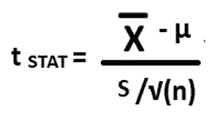
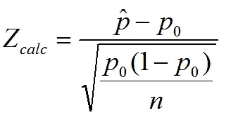
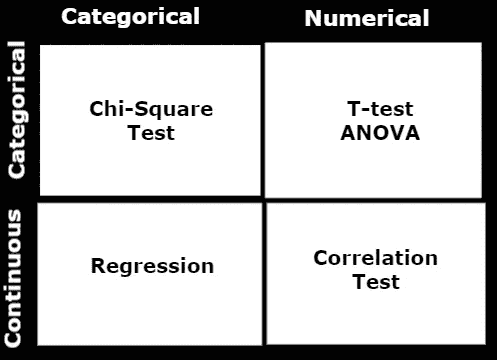

# 如何知道用哪种统计检验进行假设检验？

> 原文：<https://towardsdatascience.com/how-to-know-which-statistical-test-to-use-for-hypothesis-testing-744c91685a5d?source=collection_archive---------1----------------------->

## 何时使用哪种检验——T 检验、卡方检验、方差分析


图片由[穆罕默德·哈桑](https://pixabay.com/users/mohamed_hassan-5229782/?utm_source=link-attribution&amp;utm_medium=referral&amp;utm_campaign=image&amp;utm_content=4576720)来自 [Pixabay](https://pixabay.com/?utm_source=link-attribution&amp;utm_medium=referral&amp;utm_campaign=image&amp;utm_content=4576720)

统计学是数据科学和机器学习不可或缺的一部分。统计学是数学的一个分支，指的是以数学方程的形式将变量之间的关系形式化。它试图找到变量之间的关系来预测结果。统计学是关于，包括收集分析，解释，介绍和组织的研究。

有很多统计测试来衡量变量内部或变量之间的关系。在一个数据科学项目中，数据科学家的脑海中经常会出现一个问题，即对于什么样的数据或变量以及何时使用哪种统计技术。在本文中，您可以了解对几种类型的统计测试的基本理解，以及何时以及如何对您的数据集使用它们。

## 单样本测试与双样本测试:


图片来自 [stux](https://pixabay.com/users/stux-12364/?utm_source=link-attribution&utm_medium=referral&utm_campaign=image&utm_content=335026) 来自 [Pixabay](https://pixabay.com/?utm_source=link-attribution&amp;utm_medium=referral&amp;utm_campaign=image&amp;utm_content=335026)

一个样本测试是一个统计过程，考虑一个列或特征的分析。它可以是百分比分布分析(分类变量)或均值分析(连续变量)。

另一方面，双样本检验是比较或计算两个随机变量之间关系的统计过程。

# 单一样本测试:

如上所述，单样本检验涉及一个随机变量的假设检验。

*   **均值的单样本 T-检验:**对于一个数值或连续变量，您可以使用均值的单样本 T-检验来检验您的总体均值是否不同于一个常数值。例如，一家跨国公司有兴趣测试他们员工的平均年龄是 30 岁。他们可以使用单样本 t 检验来得到结果。



```
Here, t-stat follows a t-distribution having n-1 DOF
x̅: mean of the sample
µ: mean of the population
S: Sample standard deviation
n: number of observations
```

*   **比例的一次样本 T 检验:**一次样本比例检验用于估计总体的比例。对于分类变量，可以使用比例的单样本 t 检验来检验类别的分布。



```
p̂: Observed probability of one certain outcome occurring
*p0*: hypothesized probability
*n*: number of trials.
```

# 双样本测试:

在假设检验中，双样本检验是对两个随机变量的数据进行的，每个随机变量都来自一个独立的总体。该测试可用于测试两个样本之间的统计显著性差异。

一旦你弄清楚了随机变量的用途和数据类型，基本上有 3 大类数据类型组合:

*   两个连续变量
*   一个连续变量和另一个分类变量
*   两个分类变量

# 两个连续变量之间的统计检验:

当您的实验试图找出两个连续变量之间的关系时，您可以使用相关统计测试。

## **皮尔逊相关:**

皮尔逊相关是一种统计技术，用于测量两个线性相关变量之间的关系程度。其系数的取值范围在[1，-1]之间，是否 1 表示正相关，-1 表示负相关，0 表示不相关。

## 斯皮尔曼等级相关性；

两个随机变量之间的 Spearman 秩相关等于两个变量的秩值之间的 Pearson 相关。它可以用来度量两个连续随机变量之间的单调关系。其系数的取值范围在[1，-1]之间，是否 1 表示正相关，-1 表示负相关，0 表示不相关。

# 一个连续变量和另一个分类变量之间的统计检验:

## t 检验:

当您的实验试图进行比较或找出一个分类(有两个类别)和另一个连续变量之间的差异时，您需要进行双样本 T 检验，以找出两个变量之间的显著差异。

## 方差分析:

当您的实验试图进行比较或找出一个分类(两个以上的分类)和另一个连续变量之间的差异时，您可以使用 ANOVA(方差分析)测试。

# 两个分类变量之间的统计检验:

## 卡方检验:

当您的实验试图进行比较或找出两个分类随机变量之间的差异时，您可以使用卡方检验来测试统计差异。

# 结论:



(图片由作者提供)，何时使用何种统计技术

在本文中，我们讨论了统计技术，以及何时使用何种检验来推导随机变量之间或之内的关系或结论。使用上面讨论的统计技术，您可以评估一个变量对另一个变量的影响。

两个连续变量之间的相关性用来衡量它们之间的关系。所有其他统计检验都可以用来比较两个随机变量，p 值可以用来接受或拒绝零假设。

# 参考资料:

[1]统计解决方案:[https://www . Statistics Solutions . com/correlation-Pearson-Kendall-spearman/](https://www.statisticssolutions.com/correlation-pearson-kendall-spearman/)

*喜欢这篇文章吗？成为* [*中等会员*](https://satyam-kumar.medium.com/membership) *继续无限制学习。如果你使用下面的链接，我会收到你的一小部分会员费，不需要你额外付费。*

[](https://satyam-kumar.medium.com/membership) [## 加入我的推荐链接-萨蒂扬库马尔媒体

### 作为一个媒体会员，你的会员费的一部分会给你阅读的作家，你可以完全接触到每一个故事…

satyam-kumar.medium.com](https://satyam-kumar.medium.com/membership) 

> 感谢您的阅读