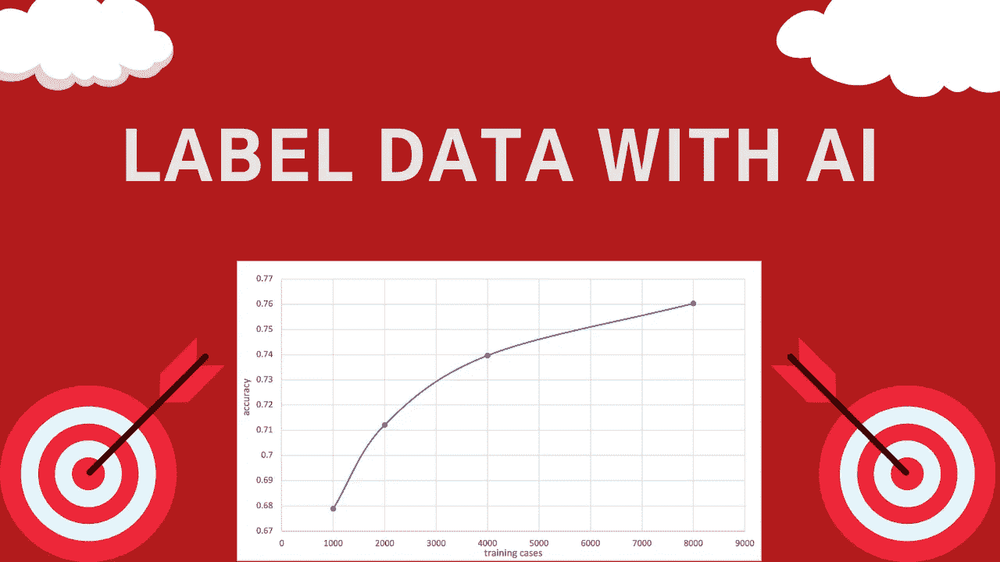
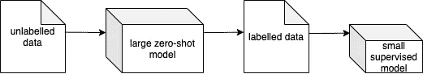
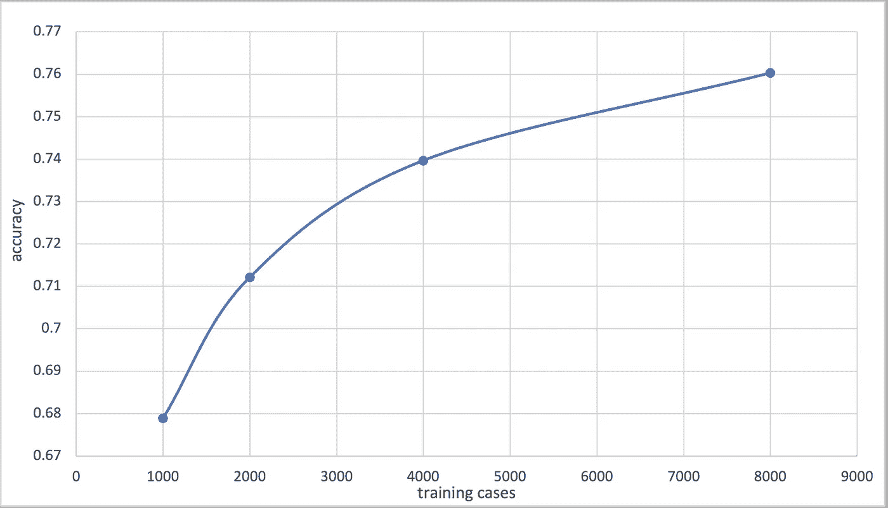

# 如何用人工智能标注文本分类训练数据

> 原文：<https://towardsdatascience.com/how-to-label-text-classification-training-data-with-ai-11ed11a5e893?source=collection_archive---------23----------------------->

## *用零射击变压器模型标注你的训练数据。然后，使用标记的数据微调一个小的监督模型*



作者图片

没错！使用我上个月提出的方法，在没有人工标注器的情况下标注文本分类训练数据是可能的。然后，您可以使用标记的数据来训练监督模型。那么，先有什么——“先有鸡还是先有蛋”，或者类似地，“带人工智能标签的训练数据还是监督模型”？但是这个谜题有一个解决方案——那就是零射击模型。

零镜头文本分类模型需要两个输入:文本和一组标签。然后，他们输出每个标签的分数。因此，他们可以将文本分类为任意类别，而无需任何微调。目前，在 Hugging Face 的模型分发网络上有[可用的](https://huggingface.co/models)大型零镜头文本分类转换器模型，只需几行代码就可以实现。

在本文中，我将首先从较高的层面简要概述该系统，以及我为展示其功能而进行的实验的结果。我已经发表了一篇完整的文章，更深入地涵盖了这两个方面，你可以在我的[网站](https://www.vennify.ai/generating-training-data-zero-shot/)上找到，或者发表在[走向数据科学](/generating-text-classification-training-data-with-zero-shot-transformer-models-e16d390eea3e)上。然后，我将继续讨论如何通过重现我上一篇文章中描述的主要实验来用 Python 代码实现这个系统。

# 过程

整个系统非常简单。系统的输入是未标记的文本数据和标签列表。然后，输出是一个小的监督模型，将文本分类到给定的标签中。该过程中的关键组件是一个大型零镜头文本分类模型。该模型从未标记的数据集中获取文本片段，并输出每个标记的分数。具有最高分数的标签被分配给该段。最后，新标记的案例用于微调小型监督模型。



作者图片

# 实验总结

我做的主要实验显示了有希望的结果。首先，我使用了一个名为[斯坦福情感树库 V2 (SST2*)](https://nlp.stanford.edu/sentiment/index.html) 的二进制文本分类数据集。然后，使用名为“ [facebook/bart-large-mnli](https://huggingface.co/facebook/bart-large-mnli) 的零镜头文本分类模型对各种数量的训练案例进行标注，对评测案例的准确率为 88.19%。接下来，新标记的训练案例用于微调朴素贝叶斯文本分类模型。下面是朴素贝叶斯模型在 SST2 评估数据集上的精度。经过 8000 个训练样本，取得了 76.03%的准确率。

【The SST2 数据集是 [*胶水*](https://huggingface.co/datasets/glue) *数据集的一部分，该数据集属于*[*cc-by-4.0*](https://creativecommons.org/licenses/by/4.0/)*许可证*



最终，朴素贝叶斯模型实现了与最流行的零镜头文本分类转换器模型大致相同的准确性，该模型可在 Hugging Face 的模型分发网络上获得，名为“[typeform/distilbert-base-un cased-mnli](https://huggingface.co/typeform/distilbert-base-uncased-mnli)”但是当然，与 Transformer 模型相比，朴素贝叶斯模型只需要运行所需资源的一小部分。

# 意义

实验表明，在没有标记数据的情况下，训练一个小的监督文本分类模型是可能的。因此，通过使用这种方法，可以在没有人工标注器的情况下对训练数据进行标注。然后，带标签的训练数据可以用来微调一个更小的模型，更容易在生产中使用。这为使用监督模型打开了大门，这些模型在过去由于缺乏标记的训练数据而无法训练。

# 履行

## 下载零射击模型

首先，我们将使用 Hugging Face 的 Transformers 库来加载一个零镜头文本分类 Transformer 模型。让我们开始安装吧。

```
pip install transformers
```

然后，我们将为我们想要的模型导入并创建一个管道对象。在这种情况下，我们将执行一个名为“零任务分类”的任务，我们将使用一个名为“facebook/bart-large-mnl”的模型我还包含了自动检测和使用可用 GPU 的代码。

```
from transformers import pipeline 
import torch 

# Check to see if a GPU is available 
device = -1
if torch.cuda.is_available():
    device = torch.cuda.current_device() task = "zero-shot-classification" 
zero_shot_model = "facebook/bart-large-mnli" 
zero_shot_classifier = pipeline(task, zero_shot_model, device=device)
```

## 做预测

我将简要讨论如何使用零炮模型进行预测。对于这些例子，我们将预测我自己创建的电影评论的情绪。首先，我们需要定义我们将使用什么标签。因此，我们将标签设置为“阳性”和“阴性”记住，在我们的模型开始预测之前，不需要微调。

```
labels = ["positive", "negative"] 
positive_text = "Wow I loved that movie so much!"
```

我们现在可以向分类器提供标签和文本来产生预测。

```
positive_prediction = zero_shot_classifier(positive_text, labels) print(positive_prediction)
```

结果:{'sequence ':'哇，我太喜欢那部电影了！'，'标签':['正'，'负']，'分数':[0.9640112519264221，0.03598877415060997]}

输出是一个有三个键的字典:序列、标签和分数。序列键包含输入的文本。标签键包含按分数顺序排列的标签。最后，scores 键包含从最高到最低的分数，其中所有分数的总和等于 1。

我们可以隔离顶部标签，如下所示。

```
positive_result = positive_prediction["labels"][0] print(positive_result)
```

*结果:阳性*

## 数据

让我们讨论如何收集数据，然后我们可以标记并用于训练一个小的监督模型。为了简单起见，我们将使用 ss T2——我在[过去的文章](https://www.vennify.ai/generating-training-data-zero-shot/)中描述的实验所用的相同数据集。该数据集可在 Hugging Face 的数据集分发网络上获得，包含被标记为“正面”或“负面”的电影评论。

我们将从安装拥抱脸的数据集库开始。

```
pip install datasets
```

现在，我们将导入一个名为“load_dataset”的函数顾名思义，它允许我们从拥抱脸的网络中获取数据集。它需要三个输入，数据集的名称、数据实例和分割。在这里，数据集是一个更大的数据集“glue”的子集因此，load_dataset 函数的第一个和第二个参数分别是“glue”和“sst2”。然后，对于 split 参数，我们将指明是否希望下载训练或验证数据以及实例的数量。

```
from datasets import load_dataset # Loading 8000 training cases 
train_data = load_dataset('glue', 'sst2', split="train[:8000]")

# Loading all 872 validation cases
eval_data = load_dataset('glue', 'sst2', split="validation[:]")
```

我们来探究一下数据。train_data 和 eval_data 对象都属于“Dataset”类型，这是一个可迭代的对象，其中每个事例都包含一个字典。字典包含三个关键字:句子、标签和 idx。句子关键字包含特定案例的文本。然后，标签键指示格是“正”还是“负”，其中整数“1”指示格是正的，而“0”指示格是负的。最后，在 idx 键下，每个都包含自己唯一的整数值。

```
for i in range(0, 2):
    print(eval_data[i]) 
    print(eval_data[i]["label"]) 
    print("-------------")
```

{ '句子':“这是一次迷人的、常常令人感动的旅程。"，' label': 1，' idx': 0}

1

— — — — — — -

{ '句子':'不屈不挠的凄凉和绝望'，'标签':0，' idx': 1}

0

— — — — — — -

# 标记和格式化数据

我们可以为训练数据生成自己的标签，而不需要使用零镜头模型的人工注释器。下面的代码迭代训练案例，对于每一个案例，它都使用零命中率模型来生成预测。结果保存在元组列表中，其中每个元组的第一个索引包含案例的文本数据，第二个索引包含字符串形式的标签。这种格式与我们即将训练的 TextBlob 朴素贝叶斯分类器所需的格式相匹配。

```
train_cases =[] 
labels = ["positive", "negative"] 
for case in train_data: 
    result = zero_shot_classifier(case['sentence'], labels) 
    label = result["labels"][0] 
    result = (case['sentence'], label) 
    train_cases.append(result)
```

我建议你用一个叫 tqdm 的 Python 包给循环添加一个进度条。只需对上面的代码做一些小的修改，就可以实现这一点。

```
# In terminal
pip install tqdm# Python code start
from tqdm import tqdmtrain_cases =[] 
labels = ["positive", "negative"] 
for case in tqdm(train_data): 
    result = zero_shot_classifier(case['sentence'], labels) 
    label = result["labels"][0] 
    result = (case['sentence'], label) 
    train_cases.append(result)
```

仅此而已，我们只是用了一个 AI 模型来标注我们的数据！我们使用的零炮模型对同一数据集的评估数据的准确率为 88.19%，因此尽管不完美，但该训练仍可用于训练监督模型。

让我们将评估数据转换成适当的格式。我们将使用实际的标签，因为这样可以更好地表明最终模型的准确性。

```
eval_cases = [] 
for case in tqdm(eval_data): 
    label = "positive" if case["label"] else "negative" 
    result = (case['sentence'], label) 
    eval_cases.append(result)
```

# 训练朴素贝叶斯分类器

现在让我们使用 TextBlob 创建一个朴素贝叶斯分类器。这种分类器使用“传统的”NLP 技术，并依靠概率进行预测。它比变压器模型等深度学习方法需要的资源少得多。我们可以使用名为 TextBlob 的 Python 包轻松创建一个朴素贝叶斯分类器。TextBlob 构建在著名的 Python 包 NLTK 之上，使其更易于使用，在 GitHub 上获得了 7000 多颗星的好评，下载量超过 1000 万次。

```
pip install textblob
```

我们现在可以从 textblob 包中导入一个名为 NaiveBayesClassifier 的类，如下所示。

```
from textblob.classifiers import NaiveBayesClassifier
```

但是，在我们开始训练分类器之前，我们需要从 NLTK 下载一个名为“punkt”的标记器。记住，TextBlob 是建立在 NLTK 之上的，所以有时候，我们在使用 TextBlob 的时候，必须从 NLTK 下载特定的资源。另外，当安装 TextBlob 时，NLTK 也会被安装，所以不需要 pip 安装 NLTK。让我们导入 NLTK，下载 punkt。

```
import nltk 
nltk.download('punkt')
```

从这里开始，我们可以用一行代码创建和训练一个分类器，如下所示。

```
classifier = NaiveBayesClassifier(training_cases)
```

就是这样！我们现在已经成功地训练了一个朴素贝叶斯分类器，而没有任何先前的标记数据！

## 评价

我们现在可以用如下所示的一行代码来评估模型，以确定它在评估集上的准确性。

```
accuracy = classifier.accuracy(eval_cases) 
print(accuracy)
```

*结果:0.7603211009174312*

就这样，我们的模型有 76%的准确率！

## 分类

让我们讨论如何使用朴素贝叶斯分类器进行预测。下面的代码检索任意文本的顶部标签。

```
prob_dist = classifier.prob_classify("I loved this movie") print(prob_dist.max())
```

*结果:阳性*

我们也可以得到任何标签的分数。分数介于 0 和 1 之间，其中 1 具有高确定性，0 具有低确定性。所有分数的总和为 1。

```
print(prob_dist.prob("positive"))
```

*结果:0.907443066804341*

# 结论

我希望你在将来的应用中继续使用这个建议的方法。通过使用这种建议的方法，您可以绕过使用人工注释器来标记数据——这将节省您的时间和潜在的金钱。

# 有用的链接

[上一篇文章](https://www.vennify.ai/generating-training-data-zero-shot/)更侧重于过程、实验和后续步骤。

[订阅](https://www.youtube.com/channel/UC7-EWrr8YdcQgPPk76OiUVw?sub_confirmation=1)我的 YouTube 频道，了解关于本文所述过程的最新内容。

[Colab:](https://colab.research.google.com/drive/1zJnd9iu8KlVplRj1utZs90K7OM5NhakY?usp=sharing) 包含了本文中使用的代码。

*原载于 2021 年 7 月 28 日*[*https://www . vennify . ai*](https://www.vennify.ai/label-training-data-with-ai/)*。*